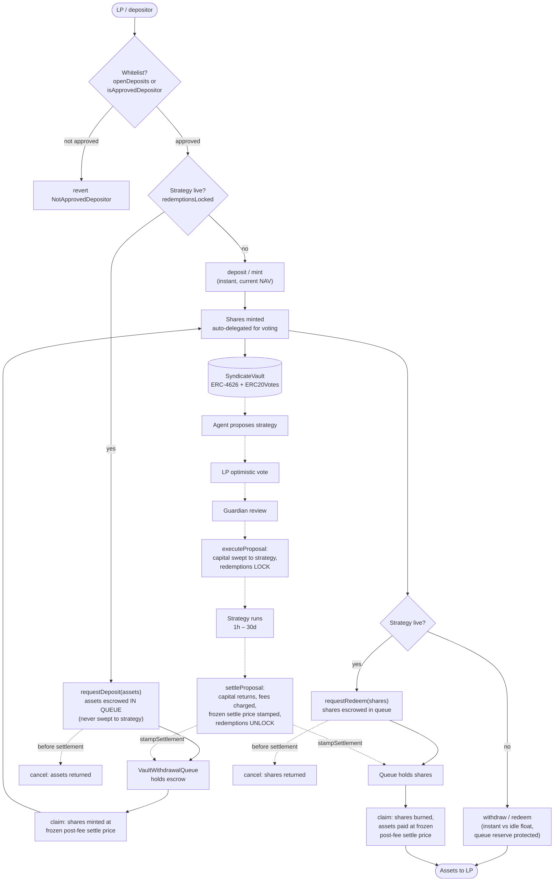

# Deposit → Withdraw Flow

The vault is a standard ERC-4626 with one twist: liquidity is **instant while no
strategy is live, async while one is**. The switch is `_activeProposal` — set at
`executeProposal`, cleared at settlement. Everything below follows from that.

## The full flow

## Instant path (no live strategy)

**Deposit** (`_deposit`, `src/SyndicateVault.sol:1334`):

- Gate 1 — whitelist: `receiver` must be approved unless the vault is in
  open-deposit mode (`_openDeposits`). Owner manages via `approveDepositor(s)` /
  `setOpenDeposits`.
- Gate 2 — `_depositsLocked()` must be false (no proposal past execution).
- Shares minted at current NAV; the fund's first deposit seeds the performance
  high-water mark; shares auto-delegate to the receiver so depositors get voting
  power without a separate transaction.

**Withdraw** (`_withdraw`, `src/SyndicateVault.sol:1356`):

- Instant against idle float only — `assets + reservedQueueAssets() ≤ float`
  (`QueueReserveBreached` otherwise). The float owed to already-settled,
  unclaimed queue redemptions is untouchable.
- `maxWithdraw`/`maxRedeem` report the true instant capacity (0 while locked), so
  ERC-4626 integrators never propose an impossible exit.

## Locked path (strategy live)

The moment `executeProposal` runs, `_activeProposal` is set:

- `deposit`/`mint` revert `DepositsLocked` (`src/SyndicateVault.sol:1340`).
- `maxWithdraw`/`maxRedeem` return 0; `withdraw`/`redeem` are closed.

Both directions run through the per-vault `VaultWithdrawalQueue`:

### Async deposit (`requestDeposit`, `src/SyndicateVault.sol:1462`)

1. Only callable while locked (`RedemptionsNotLocked` guard) and only for approved
   receivers. Zero assets rejected.
2. Assets transfer straight into the **queue** — off-vault custody. They never
   inflate `totalAssets`, never count toward the strategy's capital, and can never
   be swept by a batch.
3. The request is tagged with the active proposal id. Request id is always > 0.

### Async redeem (`requestRedeem`, `src/SyndicateVault.sol:1426`)

1. Shares transfer from the LP into the queue (escrow, not burn).
2. Request tagged with the active proposal id.

### Settlement stamps one price for everyone

At `settleProposal`, after both fees are charged and the high-water mark ratchets,
the governor calls `onProposalSettled` → `queue.stampSettlement(pid, num, den)`
(`src/SyndicateVault.sol:1527`). `num/den` carry the vault's ERC-4626 virtual
offsets, so the queue reproduces the vault's rounding exactly. Every request tagged
to that proposal claims at this **single frozen post-fee price** — no ordering
games, no price drift between claimants.

### Claim (permissionless per request)

- **Deposit claim:** queue pushes the escrowed assets into the vault, then the vault
  mints shares to the receiver at the frozen price (`settleDeposit`,
  `src/SyndicateVault.sol:1517`). Auto-delegates voting power.
- **Redeem claim:** vault burns the escrowed shares and pays assets to the owner at
  the frozen price (`settleRedeem`, `src/SyndicateVault.sol:1504`). The payout float
  is protected by `reservedQueueAssets()` — instant withdrawals, fee transfers, and
  strategy batches all subtract it first.

### Cancel (before settlement)

`cancel` on the queue returns the escrowed shares (redeem) or assets (deposit) to
the owner (`src/queue/VaultWithdrawalQueue.sol:258`). A queued deposit's cancel
shuts once its proposal settles — the claim then exists at the frozen price.

## Why this design

- **No mid-strategy NAV games.** Assets escrowed in the queue can't dilute the
  capital snapshot the strategy's P&L is measured against, and share escrow can't
  front-run a winning settlement — everyone entering or leaving during a proposal
  gets the same realized post-fee price.
- **Queue float is sacred.** Four separate guards (`QueueReserveBreached` in
  `_withdraw`, batch execution, `transferPerformanceFee`, and the buffer floor)
  ensure a settled queue claim is always honorable.
- **Owner rescues are frozen while a proposal is live** — ERC-20/ERC-721 rescue
  paths are blocked during active proposals so strategy position tokens can't be
  siphoned mid-flight.

## Timing summary for an LP

| Situation | Entry | Exit |
|---|---|---|
| No proposal open | instant `deposit` | instant `withdraw` up to idle float |
| Proposal in vote/review (not yet executed) | instant `deposit` | instant `withdraw` |
| Strategy live (executed, not settled) | `requestDeposit` → claim after settle | `requestRedeem` → claim after settle |
| Worst-case wait while live | — | `strategyDuration` remainder (≤ 30 d default cap), then permissionless settle |
