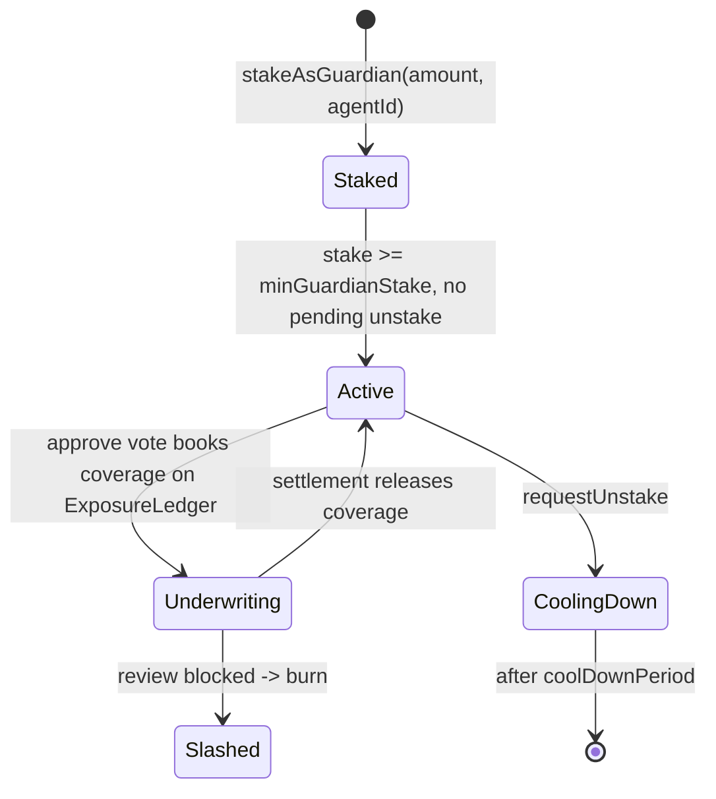
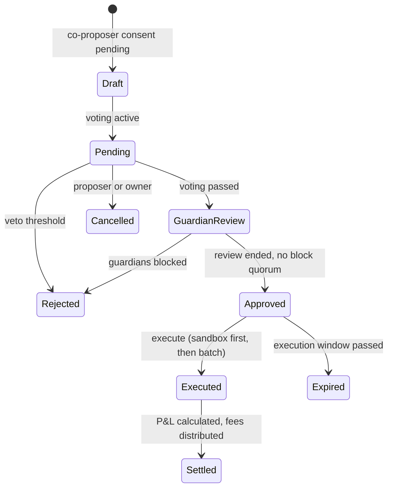
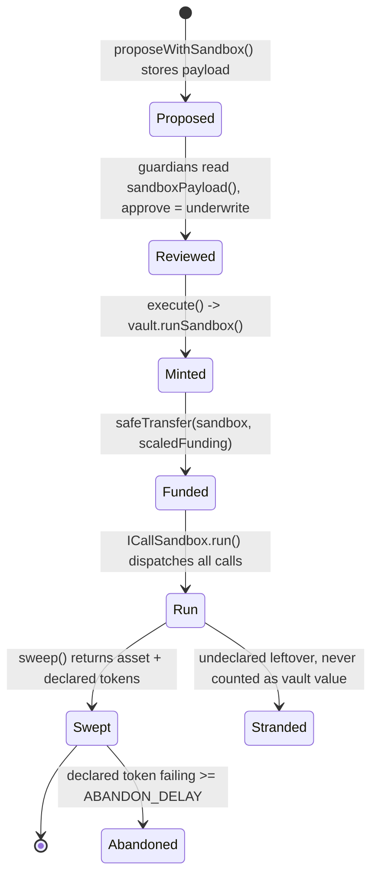
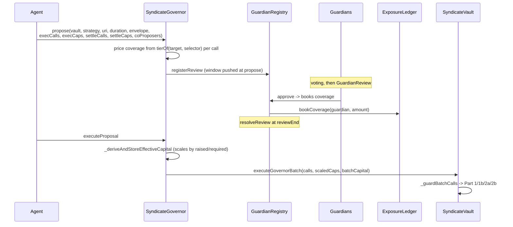
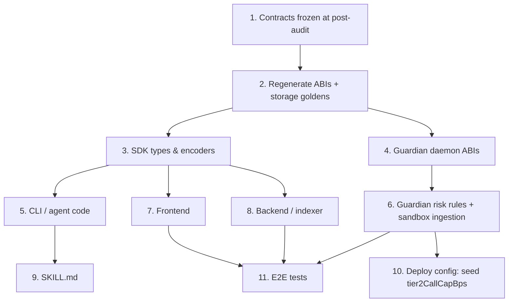

# Sherwood Guardian Network Migration Handbook

> **STATUS: COMPLETE — all 15 sections written.** Sections 6, 7, 8, 10 and 15 were produced by
> verified multi-agent passes; sections 1–5, 9, 9B and 11–14 were authored directly against the
> pinned trees. Claims that could not be settled from code are marked **Needs Verification** rather
> than guessed — Appendix A of your review should start with those.

## Evidence base

Every citation resolves against these exact refs. All four are open PR branches — re-verify before
acting if they have since merged or moved.

| Repo | Ref | Sha |
|---|---|---|
| sherwood-protocol | `origin/post-audit` | `6b477c6` |
| sherwood (monorepo) | `chore/robinhood-fork-redeploy` | `db2723bb` |
| sherwood-guardian | `feat/chain-agnostic-and-buildable` (PR #2) | `ca97dcd` |
| sherwood-app | `origin/main` | `8cf4a0a` |

**The protocol base is `post-audit`, NOT `main`.** `main` is five commits behind and *inverts* this
handbook's central conclusion. An earlier draft of this document was written against `main` and was
discarded wholesale for that reason (kept at `scratchpad/STALE-main-based-handbook.md`).

## The one thing to know

On `post-audit`, **tier-2 arbitrary calldata is reachable permissionlessly** via a per-proposal
`CallSandbox` clone — no TierRegistry entry, no owner ceremony. Verified in function bodies:

- `sherwood-protocol/src/SyndicateGovernor.sol:403` — `proposeWithSandbox(...)`, plain `external`, no owner gate.
- `sherwood-protocol/src/SyndicateVault.sol:873` — `runSandbox(...) external onlyGovernor`, clones via
  `Clones.cloneDeterministic(impl, bytes32(pid))` (`:897`), single-use enforced at `:881`.
- `sherwood-protocol/src/SyndicateVault.sol:846-854` — `runSandbox`'s natspec: "THE SECOND ASSET-MOVING PATH
  THAT DOES NOT PASS `_guardBatchCalls`, and it does not need to." The callee gate is bypassed by the
  sandbox path not being a batch, so no TierRegistry lookup happens for a sandbox target at all.
- `_guardBatchCalls` is **unmodified**: a non-allowlisted target named directly in a batch still reverts
  `DisallowedBatchCallee` (`:1224`, `:1263`). The batch guard is bypassed by not being used, not weakened.

**The consequence for guardians:** approving a sandbox proposal is the *only* gate on an arbitrary
target, and approval books coverage against the approver's own stake. Review is now underwriting
arbitrary calldata.

## Status legend

| Mark | Meaning |
|---|---|
| ✅ Already implemented | Confirmed present in the pinned tree |
| 🟠 Needs modification | Exists but wrong under the new model |
| ⛔ Missing implementation | Must be built |
| ❓ **Needs Verification** | Not confirmed from code — do not act on without checking |

## Known-good corrections folded in

- `openspec/specs/sandbox-execution/spec.md` **does not exist**. The change is unarchived; the spec is at
  `sherwood-protocol/openspec/changes/permissionless-tier2-sandbox/specs/sandbox-execution/spec.md`.
- `design.md` D1 claims `public immutable sandboxImplementation` set in the constructor. The shipped code
  has `address private _sandboxImplementation` (`SyndicateVault.sol:504`), written by the factory-only,
  one-shot `setSandboxImplementation` (`:722-727`). **The design doc is stale on this point.**
- Post-audit `StrategyProposal` has **30** fields, ending at `effectiveMaxCapital`
  (`ISyndicateGovernor.sol:164`). A count of 29 is the `main` number.
- Two different `SandboxRun` events exist — `ICallSandbox`'s `(vault, callCount, funded)` and the vault's
  `(pid, sandbox, funding)`. Easy place to get a signature wrong.

---

## 1. Executive Summary

The Guardian Network stopped being a review committee and became an **underwriting market**.

**Old model.** Guardians inspected a proposal's calldata and voted. Approving was signalling. Risk
was contained by an owner-curated allowlist: the TierRegistry owner decided which contracts a vault
could call, and anything uncertified was simply unreachable.

**New model.** Three things changed at once:

1. **Approving is underwriting.** An approve vote books coverage on the `ExposureLedger` against the
   guardian's own free stake, and a blocked review slashes every approver on a quadratic severity
   ramp. Slashed WOOD is burned — it pays nobody.
2. **Risk is priced, not listed.** Every `(target, selector)` pair carries a tier and an
   extractable-value bound. A proposal's required coverage is the sum of what its calls could
   extract, and execution is refused unless guardians have staked enough to cover it.
3. **Arbitrary calldata became reachable without an owner** (post-audit, commit `424b44a`). A
   proposal may fund a single-use `CallSandbox` clone and run any calldata from it. No TierRegistry
   entry, no owner ceremony. **Guardian review is the only gate.**

**Why it changed.** The old callee allowlist existed because a governor batch runs under
`delegatecall`, so every sub-call arrives carrying `msg.sender == vault` — which makes
authorization-shaped calldata (`approve`, `setApprovalForAll`, ERC-777 `authorizeOperator`)
unmeterable: it moves zero assets in the metered transaction and drains later. Four consecutive
audit rounds failed to enumerate those selectors. The sandbox removes the premise instead of the
gate: run one hop out, from a contract holding only what it was funded with, and the callee's
identity stops mattering.

**What it means per audience:**

| Audience | Consequence |
|---|---|
| **Guardians** | Your stake is at risk on every approve. You must now review *arbitrary* calldata competently — that is the job, not an exception. |
| **Agents** | You can route anywhere, with no listing. In exchange you declare funding, freeze your payload at propose, and carry residue liability. |
| **Users/LPs** | Loss on a sandbox proposal is bounded by its funding, not by a curator's judgment. Deposits can be locked by leftover residue. |
| **Developers** | `propose` changed arity, `StrategyProposal` grew to 30 fields, and an entire subsystem (`CallSandbox`) has no client support anywhere. |

**What needs migration:** everything downstream of the contracts. The SDK cannot propose (§5.1). The
guardian daemon blocks every sandbox proposal and would slash honest approvers (§4.3). No frontend,
indexer or agent instruction knows the sandbox exists.

---

## 2. New Guardian Network Architecture

### 2.1 Guardian lifecycle

**Old → New → Why it matters**

- **Old:** stake, vote, unstake. Voting weight proportional to stake.
- **New:** stake (`StakedWood.stakeAsGuardian`), vote with *age-weighted* power, and every approve
  books coverage that is released only at settlement. Unstaking is gated by a cooldown bound to be
  ≥ the review period.
- **Why:** a guardian can no longer approve and exit before the consequence lands.



> Parameters are **constructor-injected**, not contract constants (`StakedWood.sol:509-527`).
> Deploy-script values (`script/Deploy.s.sol:85-104`): `minGuardianStake` 10,000e18,
> `minOwnerStake` 10,000e18, `coolDownPeriod` 7 days, `reviewPeriod` 24 hours, `blockQuorumBps`
> 3000 (30%), `minSlashBps` 1000 (10%), `maxSlashBps` 10_000 (100%), `ageFloorBps` 2500 (25% weight
> at age 0), `maturationPeriod` 30 days. **A different deployment can set different values** — read
> the chain, do not hardcode these in a UI.

### 2.2 Voting, approval, blocking

- **Old:** approve/block as signalling; a small cohort could be waived out of deciding.
- **New:** approve books coverage. Votes lock in the final tenth of the window
  (`LATE_VOTE_LOCKOUT_BPS = 1000`, `GuardianRegistry.sol:46`). Block quorum is measured against a
  snapshot taken at propose time.
- **Why:** the vote is now a financial commitment with a deadline, not an opinion.

**⛔ REMOVED CONCEPT — the `cohortTooSmall` waiver.** Previously a cohort under a stake floor had its
review auto-cleared. That waiver is **gone** (`GuardianRegistry.sol:1562-1566`):

> A never-opened review has nothing to decide. A THIN one does: the `cohortTooSmall` waiver that used
> to sit here was removed, so the guardians who are actually staked decide, however few they are.

The zero-electorate guard at `:516` is now described as "LOAD-BEARING NOW, not defence in depth,"
because the waiver previously covered the zero case incidentally. **Any client still referencing
`MIN_COHORT_STAKE_AT_OPEN` or a `cohortTooSmall` outcome is describing the old model** — the
constant does not exist on post-audit.

### 2.3 Liability and slashing

- **Old:** reputational.
- **New:** a blocked review slashes every approver. Severity is deterministic, not voted — a ramp
  from `minSlashBps` to `maxSlashBps`, saturating at the `SUPERMAJORITY_BPS = 6_667` (66.67%) block
  threshold (`GuardianRegistry.sol:55`). Bounds are snapshotted at review open
  (`minSlashBpsAtOpen` / `maxSlashBpsAtOpen`, `:134-135`) stored **plus one**, so a live `0/0`
  envelope is distinguishable from an unset field (`:122-129`).
- **Why:** severity cannot be renegotiated after the fact, and a parameter change mid-review cannot
  retroactively move a guardian's exposure.

**Proceeds are burned.** `BURN_ADDRESS = 0x…dEaD` (`StakedWood.sol:469`). WOOD exposes no `burn()`,
so this is a transfer to an unspendable address (`:454`). **The slash pays nobody** — not the vault,
not the LPs, not the challenger. Any UI implying slashing compensates depositors is wrong.

Refunds are capped at `MAX_REFUND_PER_EPOCH_BPS = 2000` (20%) per `EPOCH_DURATION = 7 days`
(`GuardianRegistry.sol:40`, `:56`). Registry pause has a dead-man switch:
`DEADMAN_UNPAUSE_DELAY = 7 days` (`:57`).

### 2.4 Proposal lifecycle

**Unchanged.** `ProposalState` has the same nine members in the same order
(`ISyndicateGovernor.sol:42-52`):



> **The sandbox adds no new state.** A sandbox proposal traverses this identical machine. Do not
> add a status value for it.

### 2.5 Guardian selection

There is none — no assignment, no rotation, no committee. Registration is permissionless and any
active guardian may vote on any proposal.

> ❓ **Needs Verification** for UI purposes: whether any off-chain system assigns or suggests
> reviewers. Nothing in `src/` does.

---

## 3. Guardian Tiers

### 3.1 The correction, stated plainly

**There is no guardian tier system.** Tiers are a property of **calls**, not of guardians.

`grep -rn 'guardianTier|tierOfGuardian|GuardianTier' src/` returns **nothing** on post-audit.

The tier surface is `ITierRegistry.sol:5`:

```solidity
function tierOf(address target, bytes4 selector) external view returns (uint8 tier, uint16 boundBps);
```

Keyed on a `(target, selector)` pair. A guardian has stake, age-weighted voting power and free
coverage capacity — **no tier, no rank, no ladder.** Every guardian may review every proposal.

> 🟠 If a UI mockup, spec or ticket refers to "guardian tiers", "bronze/silver/gold guardians", or a
> tier-gated review permission, it is describing something that does not exist in the protocol.
> Resolve that before building it.

### 3.2 The three call tiers

| Tier | Constant | Bound | Meaning | Reachability |
|---|---|---|---|---|
| **0** | — | `0 < boundBps < 10_000` | Certified, tightest bound | Owner-certified `(target, selector)` |
| **1** | — | `0 < boundBps < 10_000` | Certified, looser bound | Owner-certified `(target, selector)` |
| **2** | `TIER_ARBITRARY = 2` | `FULL_NOTIONAL_BPS = 10_000` | Arbitrary calldata, full notional | **Default for anything uncertified** |

`TierRegistry.sol:97-98`. Certification refuses `tier >= TIER_ARBITRARY` and requires
`0 < extractableBoundBps < FULL_NOTIONAL_BPS` (`:495-496`, `:1245-1246`) — so **tier 2 cannot be
certified**, it is what you get by default.

Resolution order in `tierOf` (`:342-359`):

1. Exact `(target, selector)` certification whose `certifiedCodehash` still matches the live code
2. If the pair is **class-denied**, stop — return tier 2 ("the class must not undo what an owner or
   a challenge conviction just revoked", `:348-349`)
3. Class fallback — only if the target is a live ERC-1167 clone of a certified template with
   unchanged code (`:353-357`)
4. Otherwise **tier 2, full notional**

### 3.3 What changed at tier 2

**Old → New → Why it matters**

- **Old:** tier 2 priced arbitrary calldata at full notional, but `_guardBatchCalls` refused any
  uncertified callee outright. The price was decorative — the call was unreachable.
- **New:** tier 2 is reachable via the sandbox with **no owner action at all**. The price is now
  real, and it is charged against guardian stake.
- **Why:** the curator moved from the registry owner (at listing time) to the guardian cohort (at
  approval time). That is the redesign's central bet.

Batch callees are still gated. The sandbox bypasses the batch guard **by not being a batch**, not by
weakening it — a non-allowlisted target named directly in a batch still reverts
`DisallowedBatchCallee`.

### 3.4 Communicating tiers to users

Do not expose `tierOf` output raw. "Tier 2" reads like a quality grade; it means *"uncertified —
priced at 100% of notional."*

| Internal | User-facing |
|---|---|
| tier 0/1 + bound | "Reviewed venue · loss capped at N% of the amount" |
| tier 2 via batch | Unreachable — never shown |
| tier 2 via sandbox | "Uncertified target · full amount at risk · guardian-reviewed only" |
| `tier2CallCapBps` | "Protocol ceiling on uncertified spend" |

Never present the sandbox denylist as a safety guarantee — the code explicitly says it is not
(§9B.5).

---

## 4. Guardian Changes

Evidence base: `sherwood-guardian` @ `feat/chain-agnostic-and-buildable` `ca97dcd` (PR #2), read
against `sherwood-protocol` @ `origin/post-audit` `6b477c6`.

**Verdict up front: the daemon is well-built for the model it was written against, and that model no
longer matches the chain.** Two defects are P0 and one of them is actively dangerous to other
guardians, not just to the operator running it.

### 4.1 What is already correct — do not rewrite these

| Behavior | Location | Why it survives |
|---|---|---|
| Approve is deterministic-only; a model may only move a verdict *toward* safety | `sherwood-guardian/src/judge.ts:8-22`, `:71-134` | Correct under approve-as-underwriting. `ModelVerdict` is typed `"BLOCK" \| "ABSTAIN"` (`:27`) — no APPROVE path exists for a model |
| Coverage capacity read before approving | `src/ledger.ts:115-190` | Reads `getRequiredCoverage`, `exposureLedger`, then guardian bond/exposure/free; `COVERAGE_EXCEEDED` → ABSTAIN (`judge.ts:115-122`) |
| Late-vote lockout honored | `src/judge.ts:60-64`, `:97-104` | Matches `LATE_VOTE_LOCKOUT_BPS`, final tenth of the window |
| Chain time, never `Date.now()` | `src/judge.ts:43-49` | Correct — a fork advances in multi-day steps |
| Unreadable coverage abstains, never approves | `src/ledger.ts:161`, `judge.ts:107-113` | Fail-safe in the right direction |
| Per-proposal coverage ceiling | `src/env.ts:31-36`, `:72` | `MAX_COVERAGE_PER_PROPOSAL` bounds blast radius of any single rules gap |

The safety argument in `judge.ts:12-14` is already stated in new-model terms:

> Approve books coverage on the ExposureLedger and exposes the guardian's bond to a 10–100% slash
> that is BURNED. Block risks nothing of the agent's. The two sides of this decision are not
> symmetric.

That reasoning is sound. The problem is not the judge — it is what the judge is fed.

### 4.2 🔴 P0 — The bundled ABIs are stale, and the failure is silent

`sherwood-guardian/src/abis/SyndicateGovernor.json` declares `getProposal` returning a tuple of
**17 components**. Post-audit `StrategyProposal` has **30** fields, ending at `effectiveMaxCapital`
(`sherwood-protocol/src/interfaces/ISyndicateGovernor.sol:164`).

There is no `proposeWithSandbox` in the ABI. Grepping all three ABI files for `sandbox` returns
**zero matches** — `GuardianRegistry.json`, `SyndicateGovernor.json`, `SyndicateVault.json`.

> ❓ **Needs Verification:** whether viem throws or silently truncates when decoding a 30-field
> return against a 17-field ABI. Both are bad and the remedies differ: a throw takes the daemon's
> proposal fetch down entirely (loud, safe); a truncation feeds the judge a proposal whose later
> fields are absent or misaligned (silent, dangerous). **Determine this before anything else** — it
> decides whether the daemon is currently dead or currently wrong.

A weekly CI job refreshes these ABIs. Confirm what tree it generates from; if it tracks `main`, it
will keep re-introducing the 17-field shape after every manual fix.

### 4.3 🔴 P0 — The daemon BLOCKS every sandbox proposal, and that slashes honest guardians

This is the finding that matters most, and it is a chain of three facts:

1. `src/risk.ts:164-169` — any call target not in the known-address registry emits
   `UNKNOWN_TARGET` at **`level: "critical"`**.
2. `src/judge.ts:82-90` — a single critical risk short-circuits to `BLOCK`, with no model consulted.
3. Under the sandbox model, **an uncertified arbitrary target is the intended, normal case**, not an
   anomaly (`sherwood-protocol/src/CallSandbox.sol:26-35`).

So every legitimate sandbox proposal reads as critical-risk and gets blocked.

**Why that is worse than a liveness bug.** A blocked review slashes *every approver* on a quadratic
severity ramp. So a fleet of daemons running this unmodified rule set does not merely fail to
participate — if enough of them reach the block quorum, they **burn the stake of the guardians who
correctly approved a sound proposal**. The daemon's own asymmetry argument ("Block risks nothing of
the agent's") is true for the blocker and false for everyone else in the cohort.

> 🟠 This inverts the intended trust model. The sandbox moves review from the registry owner to the
> guardian cohort precisely so arbitrary targets can be judged on their merits. A cohort whose
> automation treats "arbitrary target" as automatically critical cannot perform that role.

**The fix is not to downgrade `UNKNOWN_TARGET` to a warning.** For a *batch* call an unknown target
is still critical — `_guardBatchCalls` would revert it anyway. The rule must become
path-aware: unknown target in a batch = critical; unknown target inside a sandbox payload = expected,
and the analysis must shift to what the calldata *does* with the funded amount.

### 4.4 ⛔ Missing — no sandbox awareness anywhere in the daemon

Nothing in `sherwood-guardian/src` reads or models the sandbox path. Concretely absent:

- No call to `sandboxPayload(proposalId)` (`sherwood-protocol/src/SyndicateGovernor.sol:506`)
- No handler for `SandboxPayloadStored` (`:502`) to detect that a proposal *is* a sandbox proposal
- No off-chain derivation of the sandbox address —
  `Clones.cloneDeterministic(impl, bytes32(pid))` (`SyndicateVault.sol:897`) is deterministic
  specifically so reviewers can compute it before execution (`:895-896`)
- `src/simulator.ts` simulates the governor batch; it has no notion of simulating a run *from the
  sandbox address*, which is the only simulation that reflects reality (`msg.sender` differs)
- No modelling of the funding scale-down at execute (`SyndicateGovernor.sol:875-876`) — a guardian
  approving at `funding` may see a smaller figure actually dispatched
- No check of the live tier-2 ceiling (`SyndicateVault.sol:890`)
- No alerting on declared-token lists that can lock vault deposits (§9B.6)

### 4.5 Data guardians must now consume

| Datum | Source | Status |
|---|---|---|
| `sandboxPayload(pid)` — calls, declaredTokens, funding | `SyndicateGovernor.sol:506` | ⛔ |
| Derived sandbox address | `cloneDeterministic(impl, bytes32(pid))` | ⛔ |
| Live `tier2CallCapBps()` ceiling | `SyndicateGovernor` / `SyndicateVault.sol:890` | ⛔ |
| Forced tier 2 + `coverage_ += sandboxFunding` | `SyndicateGovernor.sol:1778-1782` | ⛔ |
| `StrategyProposal` fields 18–30 | `ISyndicateGovernor.sol:164` | 🔴 truncated by stale ABI |
| Required coverage, free bond, open exposure | `src/ledger.ts:115-190` | ✅ |

### 4.6 Configuration — no changes required, but two additions wanted

Every variable the daemon reads today, all via `parseEnv` (`src/env.ts:48-74`):

`RPC_URL` (required, `:52`) · `GUARDIAN_KEY` (or `--key` argv, `:49-51`) · `CHAIN_ID` (default 8453,
`:57`) · `GOVERNOR_ADDRESS` · `REGISTRY_ADDRESS` · `POLL_INTERVAL_SECONDS` (default 60) ·
`START_BLOCK` (default `latest`) · `STATE_DIR` (default `/data`) · `LOG_FORMAT` · `CHAINS_DIR` ·
`GUARDIAN_MODE` (`observe` | `defend` | `autonomous`, defaults to signing nothing, `:65`) · `PORT`
(default 3100) · `HEALTH_STALE_SECONDS` · `MAX_COVERAGE_PER_PROPOSAL` (whole USD → USD-18, `:72`).

**None are dead.** Two should be added:

- A ceiling on sandbox funding a daemon will underwrite, separate from `MAX_COVERAGE_PER_PROPOSAL`.
- An explicit opt-in before any sandbox proposal can be approved at all — default off. Reviewing
  arbitrary calldata is a materially different competence from checking a certified batch.

> 🟠 `CHAIN_ID` defaults to **8453 (Base)** (`:57`). Per the standing decision, the guardian
> econ-security stack is Robinhood-only (4663); Base is legacy. A daemon started without `CHAIN_ID`
> points at the wrong network for this model. **Needs Verification** whether the vendored address
> books make this fail loudly.

### 4.7 Backwards compatibility

Not achievable, and should not be attempted. The daemon cannot straddle both models: a 17-field and
a 30-field `StrategyProposal` are different types, and `UNKNOWN_TARGET` cannot be both critical and
expected. Cut over with the contracts.

### Guardian Upgrade Checklist

1. **Determine the viem decode behavior** for a 30-field return against the 17-field ABI. This gates
   everything — you are either fixing a dead daemon or a lying one.
2. **Regenerate all three ABIs from `post-audit` `6b477c6`.** Repoint the weekly refresh job at the
   correct tree, or it will silently revert step 2 every week.
3. **Update `StrategyProposal` decoding to 30 fields**, ending at `effectiveMaxCapital`.
4. **Make `UNKNOWN_TARGET` path-aware** (`src/risk.ts:164-169`): critical for batch callees,
   expected for sandbox targets. Do not blanket-downgrade it.
5. **Add sandbox ingestion**: `SandboxPayloadStored` handler + `sandboxPayload(pid)` read + payload
   decode, surfaced to `judge.decide` as a distinct input.
6. **Derive the sandbox address and simulate from it**, not from the vault — `msg.sender` is the
   whole point of the mechanism.
7. **Add a sandbox-specific risk pass**: what can the funded amount reach? Declared-token
   deposit-lock exposure? Denylist evasion via a proposer-deployed forwarder (`CallSandbox.sol:228-236`
   says screening one hop cannot be made complete)?
8. **Gate sandbox approval behind an explicit opt-in**, default off.
9. **Model the execute-time funding scale-down** (`SyndicateGovernor.sol:875-876`) so the underwritten
   figure matches what dispatches.
10. **Re-check the `CHAIN_ID` default** against the Robinhood-only decision.
11. **Add a regression test** that a sandbox proposal with sound calldata reaches APPROVE, and one
    with hostile calldata reaches BLOCK. Today the first is impossible, and no test catches that.

---

## 5. Agent Changes

Evidence base: `sherwood` @ `chore/robinhood-fork-redeploy` `db2723bb`, read against
`sherwood-protocol` @ `origin/post-audit` `6b477c6`.

**Verdict: the SDK cannot propose against post-audit at all.** The break is in the arity of
`propose` itself, so it is not a degraded path — it is a hard stop before any of the new
capabilities matter.

### 5.1 🔴 P0 — `propose` takes 10 arguments; the SDK passes 7

Post-audit (`sherwood-protocol/src/SyndicateGovernor.sol:376-387`):

```solidity
function propose(
    address vault,
    address strategy,
    string calldata metadataURI,
    uint256 strategyDuration,
    RiskEnvelope calldata envelope,          // ← absent from SDK
    BatchExecutorLib.Call[] calldata executeCalls,
    uint256[] calldata executeCallCaps,      // ← absent from SDK
    BatchExecutorLib.Call[] calldata settlementCalls,
    uint256[] calldata settlementCallCaps,   // ← absent from SDK
    CoProposer[] calldata coProposers
) external returns (uint256 proposalId)
```

What the SDK sends (`sherwood/sdk/src/encoders/governor.ts:293-303`):

```ts
functionName: "propose",
args: [ vault, strategy, args.metadataURI, strategyDuration,
        executeCalls, settlementCalls, coProposers ]
```

**Before → After** for the encoder's argument list:

| # | SDK today | Post-audit contract |
|---|---|---|
| 5 | `executeCalls` | `envelope` (`RiskEnvelope`) |
| 6 | `settlementCalls` | `executeCalls` |
| 7 | `coProposers` | `executeCallCaps` |
| 8 | — | `settlementCalls` |
| 9 | — | `settlementCallCaps` |
| 10 | — | `coProposers` |

Every positional argument from index 5 onward is misaligned. `RiskEnvelope` is
`{ uint256 maxCapital; uint16 maxDrawdownBps; }` (`ISyndicateGovernor.sol:181-184`).

Grepping `sherwood/sdk/src/reads/governor.ts` and `sherwood/sdk/src/types.ts` for `envelope`,
`RiskEnvelope`, `maxCapital` or `callCaps` returns **nothing**. The risk envelope and per-call
capital declarations are absent from the SDK's model of a proposal entirely, not merely from the
encoder.

### 5.2 ✅ Still correct — the status enum

`sherwood/sdk/src/generated/proposal-state.ts` lists nine states:

`Draft, Pending, GuardianReview, Approved, Rejected, Expired, Executed, Settled, Cancelled`

Post-audit `ISyndicateGovernor.sol:42-52` declares the same nine, in the same order. **No migration
needed.** The file is codegen'd from the protocol repo and the generator is pointed correctly.

> This matters as a negative result: a reader assuming "everything is broken" would regenerate this
> file for no reason. There is no new proposal status. The sandbox does not add a state — a sandbox
> proposal moves through the identical state machine.

### 5.3 ⛔ Missing — no sandbox awareness anywhere in the monorepo

`grep -ri sandbox` across `sherwood/sdk/src`, `sherwood/cli/src`, `sherwood/app/src` and
`sherwood/skill` returns exactly two hits, **both false positives**:

- `sherwood/skill/SKILL.md:29` — "MCP server in a restricted sandbox" (a runtime, not this feature)
- `sherwood/cli/src/agent/token-selector.ts:134` — `SAND: 'the-sandbox'` (a CoinGecko token id)

So no agent, encoder, type or instruction knows `proposeWithSandbox` exists. Absent:

- `proposeWithSandbox` encoder (`SyndicateGovernor.sol:403`)
- `SandboxPayload` type — `{ uint256 funding; ICallSandbox.Call[] calls; address[] declaredTokens; }`
  (`ISyndicateGovernor.sol:201-205`)
- `ICallSandbox.Call` type — **`{ address target; bytes data; }`, no `value` field**, unlike
  `BatchExecutorLib.Call`. Do not alias the two.
- Client-side validation mirroring the ten propose-time refusals (`SyndicateGovernor.sol:420-473`)
- Any read of `sandboxPayload(pid)` (`:506`)

### 5.4 What the sandbox unlocks for an agent, and what it costs

**Unlocks:** an agent may now route to **any** target with no owner listing and no TierRegistry
entry. Previously an uncertified venue was unreachable — the callee gate refused it regardless of
tier. This is the single biggest expansion of agent capability in the redesign.

**Costs, all new obligations on the agent:**

1. **Declare funding up front.** `funding` is nonzero and never above `envelope.maxCapital`
   (`ISyndicateGovernor.sol:188-194`). It is the structural maximum the payload can lose.
2. **The payload is frozen at propose.** Stored verbatim, never mutable — "it is what guardians
   underwrite" (`:195-196`). No amend-after-review path exists.
3. **Write calldata a guardian can actually review.** Guardian approval is now the *only* gate on
   the target. Opaque calldata is not merely rude, it is a proposal that rational underwriters
   should refuse.
4. **Declare every token the payload may hold.** Under-declared leftovers are stranded in the
   sandbox and never counted as vault value — the agent's own loss
   (`sherwood-protocol/src/interfaces/ICallSandbox.sol:122-125`).
5. **Accept the deposit-lock liability.** A declared token left behind sets `hasUnvaluedResidue()`,
   which shuts the vault's mint side until swept — potentially `ABANDON_DELAY` (2 days) if the token
   will not transfer. See §9B.6.
6. **Expect the funding to shrink.** At execute the funding is scaled by the coverage ratio
   (`SyndicateGovernor.sol:875-876`); if it floors to zero, **nothing runs at all** (`:882`) — the
   proposal executes with no sandbox dispatch.
7. **Budget for full-notional coverage.** A sandbox proposal is forced to tier 2 and charged
   `coverage_ += sandboxFunding` (`:1778-1782`), so it needs materially more guardian coverage
   raised than an equivalent certified batch.

### 5.5 Changed assumption: when is a proposal safe to execute?

Two shifts an agent's execution logic must absorb:

- **Execution may silently do less than proposed.** Under-raised coverage scales
  `effectiveMaxCapital`, every per-call cap, *and* sandbox funding down pro-rata. A proposal can
  execute successfully having deployed a fraction of its intent, or — for the sandbox leg — nothing.
  An agent that assumes "executed ⇒ my calls ran at my sizes" is wrong.
- **Ordering is fixed and observable.** The sandbox dispatches *before* the execute batch
  (`SyndicateGovernor.sol:847-856`), and its funding is subtracted from the batch envelope (`:883`).
  An agent sizing a batch against the full envelope while also funding a sandbox will find the batch
  under-capitalized.

### 5.6 Stale agent-facing instructions

The line-by-line `SKILL.md` audit is §6 of this handbook (64 findings). Not repeated here. The
SDK-level staleness is §5.1 and §5.3 above.

> ❓ **Needs Verification:** `sherwood/cli/src/agent/*` (`executor.ts`, `judge.ts`,
> `entry-gates.ts`) and `sherwood/cli/src/simulation/phases/07-propose.ts` reference `propose` but
> were not read line-by-line in this pass. They call through the SDK encoder, so §5.1 breaks them
> transitively, but each may carry its own additional assumptions. **Audit before migrating.**

### Agent Migration Checklist

1. **Fix the `propose` encoder arity** (`sherwood/sdk/src/encoders/governor.ts:293-303`) — add
   `envelope`, `executeCallCaps`, `settlementCallCaps` in the correct positions. Nothing else in the
   agent path works until this lands.
2. **Add `RiskEnvelope` to the SDK types** and thread `maxCapital` / `maxDrawdownBps` through every
   propose call site.
3. **Add per-call cap arrays** to the proposal model; decide the agent's default policy (note that
   `cap_i == 0` makes `BatchExecutorLib` revert on *any* outflow — the tightest possible limit, not
   a no-op).
4. **Leave `proposal-state.ts` alone** — verified still correct.
5. **Add `proposeWithSandbox` encoder** + `SandboxPayload` and `ICallSandbox.Call` types (no `value`
   field).
6. **Mirror all ten propose-time refusals client-side** so an agent fails locally instead of
   burning gas.
7. **Bound `funding`** by both `envelope.maxCapital` and the live `tier2CallCapBps` ceiling.
8. **Handle the scaled-to-zero case** — detect that the sandbox leg did not dispatch and do not
   report success.
9. **Track declared tokens** and drive `sweep()` after settlement, or the agent's own proposal locks
   the vault's deposits.
10. **Regenerate SDK ABIs from `post-audit`** and re-check `StrategyProposal` (30 fields).
11. **Audit `cli/src/agent/*` and `simulation/phases/07-propose.ts`** against the new signature.

---

# SECTION 6 — `SKILL.md` Changes

**Audited tree:** `sherwood/skill` submodule @ `b264ab10a7f37353492caa0ea89db6484bc9ced0` (the pin carried by `sherwood` @ `db2723bb`).
**Evidence base for every protocol claim:** `sherwood-protocol` @ `origin/post-audit` `6b477c6`. Every `file:line` below was re-derived by opening the file at that ref; none were carried over from the brief.

**Method note.** Where the brief and the code disagreed, the code won. Two brief claims I could not reproduce and therefore did not use: (a) the agent-fee default is **not** 500 bps and the vault cap is **not** 1500 bps — see F-14; (b) `MoonwellSupplyStrategy`, `AerodromeLPStrategy`, `VeniceInferenceStrategy`, `WstETHMoonwellStrategy` and `MamoYieldStrategy` do not exist in `src/` at all — see F-06.

---

## 6.0 Scope and headline

Seven files were audited line by line. **63 line-level findings**, distributed:

| File | Findings | Verdict |
|---|---|---|
| `skill/SKILL.md` | 22 | Needs modification + large missing surface |
| `skill/skills/guardian/SKILL.md` | 21 | Needs modification; the file's *premise* is wrong |
| `skill/GOVERNANCE.md` | 8 | Needs modification |
| `skill/ERRORS.md` | 6 | Needs modification |
| `skill/ADDRESSES.md` | 4 | Needs modification |
| `skill/skills/strategies/*/SKILL.md` | 2 (whole-file) | Delete or quarantine |
| `skill/skills/levered-swap/SKILL.md` | 1 (whole-file) | Delete or quarantine |
| `skill/RESEARCH.md` | 0 | **Correct as written** (with one caveat, see 6.7) |
| `skill/CLAUDE.md` | 0 protocol findings | **Correct as written** |

> **Re-verification pass (adversarial).** Every protocol `file:line` below was
> re-resolved against the post-audit worktree. Corrections applied in place, and
> logged at the end of this file: the `StrategyProposal` member count (27 → 29,
> F-25/F-24/F-34), `IStrategy.positions()` and `PriceRouter` (F-61, F-01, F-27),
> the `ConcentratedLiquidityStrategy.name()` string, and line drift in four
> `skill/SKILL.md` cites (F-03, F-10, F-14, F-19) and one `guardian/SKILL.md`
> cite (F-27).

Three of these findings are, in my judgement, capable of causing loss of funds or a stuck vault if an agent follows the instruction literally: **F-02** (an agent is told the vault has no callee allowlist and will build a batch that reverts with the bond locked), **F-24** (a guardian agent is told it can veto an `Approved` proposal and will believe it has a backstop it does not have), and **F-30** (the recovery playbook broadcasts a function that does not exist on the deployed governor).

Two further findings publish selectors that do not exist and will fail as empty
returndata rather than as a legible error: **F-52** (`NotAllowedTarget` /
`sherwood vault add-target`) and **F-61** (`IStrategy.positions()` and the
retired `PriceRouter`). F-61 in particular was marked "correct — keep" in an
earlier draft of this section and its fabricated selector had been copied into
two replacement blocks; it is now a finding. See the note at the end of F-61.

---

## 6.1 `skill/SKILL.md` — 22 findings

### F-01 — `Available Templates` table lists five contracts that do not exist

**(a) Current, verbatim, `skill/SKILL.md:361-368`:**

```
| Template | CLI key | Description |
|----------|---------|-------------|
| **MoonwellSupplyStrategy** | `moonwell-supply` | Supply tokens to Moonwell lending market, earn yield |
| **AerodromeLPStrategy** | `aerodrome-lp` | Provide liquidity on Aerodrome DEX + optional Gauge staking |
| **VeniceInferenceStrategy** | `venice-inference` | Stake VVV for sVVV — Venice private AI inference (dual-path) |
| **WstETHMoonwellStrategy** | `wsteth-moonwell` | WETH → wstETH → Moonwell — stack Lido + lending yield |
| **MamoYieldStrategy** | `mamo-yield` | Deposit into Mamo for optimized yield across Moonwell + Morpho vaults |
| **PortfolioStrategy** | `portfolio` | Weighted basket of tokens (crypto or stock tokens) with rebalancing |
```

**(b) Why outdated.** `sherwood-protocol/src/strategies/` at `6b477c6` contains exactly four files: `BaseStrategy.sol`, `ConcentratedLiquidityStrategy.sol`, `MorphoSupplyStrategy.sol`, `PortfolioStrategy.sol`. The other five were deleted in-tree: `git log --diff-filter=D --name-only -- 'src/strategies/*'` shows `5c8d467 chore: remove VeniceInferenceStrategy (src + tests)` and `e9c3512 chore: remove Moonwell and the Base-chain strategies` removing `AerodromeLPStrategy.sol`, `MamoYieldStrategy.sol`, `MoonwellSupplyStrategy.sol`, `WstETHMoonwellStrategy.sol` (plus the Leveraged Aerodrome set). The only remaining references anywhere in the repo are in `sherwood-protocol/test/mocks/MockStrategy.sol` and `sherwood-protocol/test/audit-fixes/Strategy_init_frontrun.t.sol`. **Status: Missing implementation** — the skill advertises a product surface with no contract behind it.

**(c) New expected behavior.** Advertise the three live templates only, and describe them by the one question the vault actually asks a strategy (is any value still undelivered?) rather than by venue.

**(d) Replacement for `SKILL.md:359-370`:**

```markdown
#### Available Templates

| Template | Description |
|----------|-------------|
| **PortfolioStrategy** | Weighted basket of tokens with on-chain rebalancing |
| **MorphoSupplyStrategy** | Supply the vault asset to a Morpho Blue market |
| **ConcentratedLiquidityStrategy** | Concentrated-liquidity LP position with an escape hatch |

Source of truth: `sherwood-protocol/src/strategies/`. Templates are ERC-1167
clonable singletons. Each proposal clones a template, initializes it, then names
the clone in its batch calls.

The vault does NOT price a strategy's on-venue holdings. `totalAssets()` is the
vault's own asset balance less what it owes
(`sherwood-protocol/src/SyndicateVault.sol:2071-2077`), so anything a strategy
still holds is priced at zero. The one question the vault asks a SETTLED strategy
is `IStrategyDelivery.hasUndeliveredValue()`
(`sherwood-protocol/src/interfaces/IStrategyDelivery.sol:39`) plus the
vault-asset amount behind it, and that amount is added to the MINT price only,
via `depositNav() = totalAssets() + _residueTotal`
(`sherwood-protocol/src/SyndicateVault.sol:1589`). Redemptions still read
`totalAssets()`.

A strategy clone must additionally have batch-callee standing in the TierRegistry
— see "Tiers and call standing" below. There is no vault-level target allowlist
any more.
```

> **Do not write `IStrategy.positions()`.** That selector does not exist anywhere
> in `sherwood-protocol/src/` at `6b477c6` (`grep -rn "positions()" src/` → zero
> hits), and the `PriceRouter` it was paired with is retired
> (`sherwood-protocol/src/SyndicateFactory.sol:128`: "Deprecated. Formerly the
> protocol PriceRouter for Lane A live-NAV pricing, now retired (issue #54)").
> See F-61.

---

### F-02 — "The vault has no allowlist for strategy calls — it trusts the governor" (SEVERITY: high)

**(a) Verbatim, `skill/SKILL.md:370`:**

> Templates are ERC-1167 clonable singletons deployed once per chain. Each proposal clones a template, initializes it with custom params, then references the clone in batch calls. **The vault has no allowlist for strategy calls — it trusts the governor.**

**(b) Why outdated.** False on post-audit in both directions. The vault *does* screen batch callees: `SyndicateVault._guardBatchCalls` reverts `DisallowedBatchCallee(target)` at `sherwood-protocol/src/SyndicateVault.sol:1168` (error declared `sherwood-protocol/src/interfaces/ISyndicateVault.sol:95`). Standing is decided by the TierRegistry's `isCallableTarget` axis (`sherwood-protocol/src/TierRegistry.sol:947`), which is a separate axis from `isAdapterAllowed` (`:918`). Tier alone grants nothing — not even tier 0. An agent following this line builds a batch that reverts at execute after the proposer bond is locked and the review period is spent.

**(c) New expected behavior.** State the three axes explicitly and tell the agent to check `isCallableTarget` for every batch callee before proposing.

**(d) Replacement for the last sentence of `SKILL.md:370`:**

```markdown
The vault **does** screen batch callees. `SyndicateVault` reverts
`DisallowedBatchCallee(target)` for any batch call whose target lacks callee
standing in the TierRegistry. Standing is a separate axis from tier:

- `isCallableTarget(target)` — may be NAMED as a batch callee. Deliberately
  outlives a demotion, so a demoted strategy clone still holding vault capital
  can be reclaimed from.
- `isAdapterAllowed(adapter)` — may RECEIVE vault funds as spender/recipient.
  This is the strong grant and is cleared by a demotion.
- `isCounterpartyAllowed(addr)` — may be bound by a certified template.

Check `isCallableTarget` for every execute AND settlement callee before you
propose. A tier-0 certification does not imply callee standing.
```

---

### F-03 — `--performance-fee` flag in two live examples

**(a) Verbatim, `skill/SKILL.md:414` and `skill/SKILL.md:437`:**

> `  --performance-fee 1000 --duration 7d`

**(b) Why outdated.** `propose` takes no fee argument — `sherwood-protocol/src/interfaces/ISyndicateGovernor.sol:676-687` has ten parameters and none is a fee. The fee is a vault property (`SyndicateVault.setAgentFeeBps`, `sherwood-protocol/src/SyndicateVault.sol:1427`). The file already says so at `SKILL.md:669` and `SKILL.md:699` — these two examples contradict the file's own prose. **Status: Needs modification (internal contradiction).** (Corrected: the earlier draft cited `:51`/`:81`, which are an unrelated `curl` example and the Agent Lifecycle map.)

**(c)/(d)** Delete the flag from both examples. Line 414 becomes:

```
  --name "ETH Supercycle Basket" --description "AAVE/WETH/cbBTC basket, 7d" \
  --duration 7d
```

and line 437 becomes:

```
  --strategy 0xCLONE --name "ETH Supercycle Basket" --description "..." \
  --duration 7d \
```

---

### F-04 — "Allowlisting … The CLI handles this inline"

**(a) Verbatim, `skill/SKILL.md:400`:**

> - **Allowlisting:** The vault must allowlist the strategy clone address and any external protocol addresses as batch targets. The CLI handles this inline during `sherwood strategy propose` — see each strategy's skill and `ADDRESSES.md` for required targets.

**(b) Why outdated.** There is no vault-side allowlist to write to. `grep -rn "NotAllowedTarget\|addAllowedTarget\|allowedTarget\|setAllowedTarget" sherwood-protocol/src/` returns **zero hits** at `6b477c6`. The function the CLI would call does not exist. The replacement mechanism is the TierRegistry (F-02), whose grants are `onlyOwner` on the registry (`sherwood-protocol/src/TierRegistry.sol:487` `proposeCertification`, two-step with `certify` at `:552`) — not something a proposer's CLI can do inline. **Status: Missing implementation.**

**(c)/(d) Replacement:**

```markdown
- **Callee standing:** Every batch callee (the strategy clone, the venue router,
  the tokens) must return `true` from `TierRegistry.isCallableTarget`. This is a
  registry-owner grant, not something the proposer can do inline. If your clone
  or venue is not listed, you have two options: (1) ask the registry owner to
  certify it, or (2) use `proposeWithSandbox` — the permissionless tier-2 path,
  which needs no registry entry at all. See "Tier 2 and the sandbox" below.
```

---

### F-05 — Strategy lifecycle omits `GuardianReview` and `Approved`

**(a) Verbatim, `skill/SKILL.md:402`:**

> - **Lifecycle:** `Pending → execute() → Executed → settle() → Settled`

**(b) Why outdated.** The proposal state machine is nine-valued: `Draft, Pending, GuardianReview, Approved, Rejected, Expired, Executed, Settled, Cancelled` (`sherwood-protocol/src/interfaces/ISyndicateGovernor.sol:42-52`). `Pending` cannot reach `Executed` directly — a passed vote transitions to `GuardianReview` and only a resolved, non-blocked review reaches `Approved` (`sherwood-protocol/src/ProposalLifecycle.sol:134` `_afterVote`, `:200-213`). **Status: Needs modification.**

**(c)/(d) Replacement:**

```markdown
- **Lifecycle:** `Draft? → Pending → GuardianReview → Approved → execute() →
  Executed → settle() → Settled`. Terminal branches: `Rejected` (veto or block
  quorum), `Expired` (execution window passed), `Cancelled`.
```

---

### F-06 — `BaseStrategy` lifecycle line, same defect

**(a) Verbatim, `skill/SKILL.md:521`:**

> `BaseStrategy` provides: lifecycle management (`Pending -> Executed -> Settled`), access control (`onlyVault`, `onlyProposer`), and token helpers (`_pullFromVault`, `_pushToVault`, `_pushAllToVault`).

**(b)** The *strategy-internal* lifecycle really is three-valued and this line is about the strategy, not the proposal — but readers conflate it with F-05. Also verified still-true: `execute()` is `onlyVault` (`sherwood-protocol/src/strategies/BaseStrategy.sol:172`), `settle()` is `onlyVault` (`:198`), `updateParams(bytes)` is `onlyProposer` (`:205`), and `onlyProposer` now additionally staticcalls `isAgent` on the vault (`IAgentSet` natspec at `:19`, `error ProposerNoLongerAgent()` at `:54`, modifier at `:132` with the raw `staticcall` + `ret.length != 32` + `abi.decode` guard at `:134-135`). **Status: Needs modification (disambiguation + the `isAgent` re-check is undocumented).**

**(d) Replacement:**

```markdown
`BaseStrategy` provides: the STRATEGY-side lifecycle (`Pending -> Executed ->
Settled` — distinct from the nine-state PROPOSAL lifecycle above), access control
(`onlyVault` on `execute()`/`settle()`, `onlyProposer` on `updateParams`), and
token helpers (`_pullFromVault`, `_pushToVault`, `_pushAllToVault`).

Note: `onlyProposer` re-checks the vault's LIVE agent set, not just the stored
proposer address. If the vault owner removes you as an agent after your proposal
executes, `updateParams` stops working mid-strategy.
```

---

### F-07 — The whole `Levered swap` section

**(a) Verbatim, `skill/SKILL.md:523-535`, opening line:**

> ### Levered swap (Moonwell + Uniswap)

**(b) Why outdated.** Moonwell is Base-only and every Moonwell strategy was deleted (F-01). `sherwood strategy run --collateral … --borrow …` has no contract behind it in this tree. **Status: Missing implementation.**

**(c)/(d)** Delete `SKILL.md:523-535` in full, and delete the pointer to the `levered-swap` skill. If the section must survive as history, move it under a clearly-labelled `## Deprecated (Base-era, not deployed)` appendix.

---

### F-08 — Governance intro: "optimistic governance … silence equals approval"

**(a) Verbatim, `skill/SKILL.md:646`:**

> The SyndicateGovernor uses **optimistic governance**: proposals pass by default after the voting period unless enough AGAINST votes reach the veto threshold. Silence equals approval.

**(b) Why outdated.** Half true, and the half that is false is the load-bearing half. The *LP vote* is still optimistic (veto test at `sherwood-protocol/src/ProposalLifecycle.sol:86-106`). But a passed vote lands in `GuardianReview`, not `Approved` (`sherwood-protocol/src/interfaces/ISyndicateGovernor.sol:44`), and the review must be opened and resolved. `openReview` is permissionless at `voteEnd` (`sherwood-protocol/src/GuardianRegistry.sol:1071`) and `resolveReview` is permissionless (`:1145`); if nobody opens the review, `_afterVote` disambiguates by staticcalling `reviewWindow` — no window registered means terminal `Expired`, a window registered means the proposal sits in `GuardianReview` until `executeBy` and then expires (`sherwood-protocol/src/ProposalLifecycle.sol:200-213`). So guardian *silence* does not approve; it expires the proposal unless someone calls `resolveReview`. **Status: Needs modification.**

**(c)/(d) Replacement for `SKILL.md:644-652`:**

```markdown
## Governance

Sherwood governance has **two independent gates**, and a proposal must clear both.

**Gate 1 — the LP vote, optimistic.** Vault shareholders vote weighted by shares.
The proposal passes unless AGAINST votes reach `vetoThresholdBps`. Silence
approves at this gate. (The withdrawal queue's own checkpointed votes are netted
out of the denominator before the threshold is applied.)

**Gate 2 — guardian review, NOT optimistic.** A passed vote does not become
`Approved`; it becomes `GuardianReview`. WOOD-staked guardians review the actual
calldata and vote `Approve` or `Block`. Approving is UNDERWRITING: an approver's
staked WOOD becomes the coverage that backs the proposal, and a blocked review
slashes the approvers. Guardian silence does NOT approve — someone must call the
permissionless `openReview` at `voteEnd` and `resolveReview` after the review
window, or the proposal sits in `GuardianReview` until `executeBy` and expires.

1. **Propose** — `propose(...)` (10 args, including a `RiskEnvelope` and per-call
   caps) or `proposeWithSandbox(...)` for arbitrary calldata. A proposer bond in
   WOOD is locked. Caller must be a registered agent on the vault.
2. **Vote** — LP vote, optimistic, `vetoThresholdBps`.
3. **Veto** — the vault owner can reject a **Pending** proposal only. Once the
   proposal reaches `GuardianReview` the owner loses unilateral veto.
4. **Guardian review** — open, vote, resolve. Coverage is booked on every
   Approve. Under-raised coverage does not reject the proposal; it SHRINKS it.
5. **Execute** — the vault runs the batch under `effectiveMaxCapital`, which is
   `maxCapital` scaled by `coverageRaised / coverageRequired`.
6. **Settle** — proposer after 1 hour, permissionless after the full duration,
   or an owner emergency path.
7. **Post-execution** — the proposal remains challengeable for a challenge
   window; the proposer bond is only reclaimable after it closes.
```

---

### F-09 — "Veto — vault owner can reject any Pending or Approved proposal" (SEVERITY: high)

**(a) Verbatim, `skill/SKILL.md:650`:**

> 3. **Veto** — vault owner can reject any Pending or Approved proposal as a safety backstop

**(b) Why outdated.** `SyndicateGovernor.vetoProposal` reverts `ProposalNotCancellable` for anything other than `Pending`: `if (_commitState(proposal) != ProposalState.Pending) revert ProposalNotCancellable();` at `sherwood-protocol/src/SyndicateGovernor.sol:1308` (function at `:1305`). The natspec at `:1303-1304` states the design reason: post-vote veto flows through the guardian-review path. An owner who believes they can veto an `Approved` proposal has a backstop they do not have. **Status: Needs modification.**

**(c)/(d)** Covered by the F-08 replacement (item 3). Also fix the standalone section — see F-13.

---

### F-10 — `Create a proposal` flag table is missing the risk envelope and per-call caps

**(a) Verbatim, `skill/SKILL.md:685-693` (the flag table) and `SKILL.md:695`:**

> | `--execute-calls` | yes | Path to JSON file with execute Call[] array (open positions) |
> | `--settle-calls` | yes | Path to JSON file with settlement Call[] array (close positions) |
> …
> Execute calls run at proposal execution (open positions). Settlement calls run at proposal settlement (close positions). Each file is a JSON array of `[{ target, data, value }]`.

**(b) Why outdated.** `propose` now takes ten arguments including `RiskEnvelope calldata envelope` and two parallel `uint256[]` cap arrays (`sherwood-protocol/src/interfaces/ISyndicateGovernor.sol:676-687`). `RiskEnvelope` is `{uint256 maxCapital; uint16 maxDrawdownBps;}` (`:181-184`) and `maxCapital` must be nonzero. The caps are per-call gross-outflow declarations whose per-batch sum must be `<= envelope.maxCapital`, checked per batch and never combined (`:668-673`). A zero cap is legal and makes `BatchExecutorLib` revert `CallCapExceeded` on any outflow from that call at all. There is no way to express any of this with the documented flag set. **Status: Missing implementation.**

**(c)/(d) Add to the flag table at `SKILL.md:693`:**

```markdown
| `--max-capital` | yes | Risk envelope: net-outflow ceiling for the execute batch, in vault-asset units. MUST be nonzero. This is the number voters and guardians actually approve. |
| `--max-drawdown-bps` | yes | Risk envelope: declared drawdown tolerance. Losses beyond it are challengeable. `10000` means "any loss is inside the envelope" — legal, but it disables the drawdown challenge entirely and is not a production value. |
| `--execute-call-caps` | yes | JSON array of per-call gross-outflow caps, one per execute call. Sum must be `<= --max-capital`. |
| `--settle-call-caps` | yes | Same, for settlement calls. Summed and checked PER BATCH, never combined with the execute batch. |
```

and replace the paragraph at `SKILL.md:695` with:

```markdown
Execute calls run at execution; settlement calls run at settlement. Each file is
a JSON array of `[{ target, data, value }]` (`BatchExecutorLib.Call` — three
fields including `value`).

Two things are enforced that the flags do not make obvious:

- **The envelope is the ceiling on everything.** A proposal cannot move more than
  `maxCapital` net out of the vault in its execute batch, measured by the vault
  itself, not by the strategy.
- **Per-call caps bind independently of the envelope.** A cap of `0` on a call
  means that call may cause NO outflow. This is strictly stronger than any
  coverage requirement and is the actual protection at execute time.
- **Your declared caps determine the proposal's tier and therefore its cost.**
  Required coverage is the sum over execute AND settlement calls of
  `cap_i * boundBps_i / 10_000`, where `boundBps_i` comes from
  `TierRegistry.tierOf(target, selector)`. Anything uncertified prices at full
  notional (bound `10_000`).
```

---

### F-11 — `proposal list --state` filter set is missing five states

**(a) Verbatim, `skill/SKILL.md:706`:**

> Filter by state: `pending`, `approved`, `executed`, `settled`, `all` (default: `all`).

**(b) Why outdated.** Nine states exist (`sherwood-protocol/src/interfaces/ISyndicateGovernor.sol:42-52`). The single most operationally important one for a guardian — `GuardianReview` — is not filterable. **Status: Needs modification.**

**(d) Replacement:**

```markdown
Filter by state: `draft`, `pending`, `guardian-review`, `approved`, `rejected`,
`expired`, `executed`, `settled`, `cancelled`, `all` (default: `all`).

`guardian-review` is the state to watch: proposals sit here until someone calls
the permissionless `resolveReview`, and a proposal left unresolved past
`executeBy` expires rather than executing.
```

---

### F-12 — `Execute an approved proposal` omits coverage scaling and the sandbox

**(a) Verbatim, `skill/SKILL.md:727`:**

> Anyone can call. Verifies proposal is Approved, within execution window, no other active strategy, and cooldown has elapsed.

**(b) Why outdated.** Accurate as far as it goes, but silently omits the two things that change the outcome. (1) `_deriveAndStoreEffectiveCapital` (`sherwood-protocol/src/SyndicateGovernor.sol:2031`) sets `effectiveMaxCapital = maxCapital * raised / required` on a coverage shortfall and scales every per-call cap by the same ratio — so a proposal can execute at a fraction of its declared size, and the agent must not assume its declared amounts moved. (2) If the proposal carries a sandbox payload, `vault.runSandbox` runs **before** the batch and `batchCapital = effectiveMaxCapital - scaledFunding` (`:864-889`), so the batch's allowance is strictly smaller than `getEffectiveMaxCapital`. **Status: Needs modification.**

**(d) Replacement:**

```markdown
Anyone can call. Verifies the proposal is `Approved`, within the execution
window, no other active strategy, and the cooldown has elapsed.

**Execution can shrink your proposal.** If guardians under-raised coverage, the
governor sets `effectiveMaxCapital = maxCapital * coverageRaised /
coverageRequired` and scales every per-call cap by the same ratio. Read
`EffectiveMaxCapitalSet(proposalId, declaredMaxCapital, effectiveMaxCapital,
coverageRaisedUsd, requiredCoverageUsd)` from the execute receipt, or call
`governor.getEffectiveMaxCapital(proposalId)`. Both USD fields are zero when the
coverage gate did not run at all.

**If the proposal carries a sandbox payload**, the sandbox runs FIRST and its
(scaled) funding is subtracted from the capital handed to the batch. The batch's
real allowance is `effectiveMaxCapital - scaledFunding`, not
`effectiveMaxCapital`. Do not size your batch off `getEffectiveMaxCapital` alone.
```

---

### F-13 — `Veto a proposal` section, same defect as F-09

**(a) Verbatim, `skill/SKILL.md:746`:**

> Vault owner can veto Pending or Approved proposals. Sets state to `Rejected` (distinct from `Cancelled`). This is the primary safety mechanism in optimistic governance.

**(b)** `sherwood-protocol/src/SyndicateGovernor.sol:1308` — `Pending` only. And it is no longer "the primary safety mechanism": guardian block is (`GuardianRegistry.resolveReview` → `_isBlocked` at `sherwood-protocol/src/GuardianRegistry.sol:507-525` → slash at `:1175`).

**(d) Replacement:**

```markdown
The vault owner can veto a proposal in state **`Pending` only**. Once the vote
passes and the proposal enters `GuardianReview`, `vetoProposal` reverts
`ProposalNotCancellable` — the guardian cohort, not the owner, decides from that
point.

Sets state to `Rejected` (distinct from `Cancelled`). It also closes the
registered guardian review, so approvers cannot later be slashed on a proposal
that can never execute.

This is a Pending-window backstop, not the primary safety mechanism. The primary
mechanism is the guardian block quorum.
```

---

### F-14 — Agent-fee default and cap are both wrong (appears 2× in this file)

**(a) Verbatim, `skill/SKILL.md:699`** (and near-identically at `SKILL.md:669`):

> > **Agent fee.** `propose` no longer takes a fee argument. The agent's cut is the vault's `agentFeeBps`, set by the **vault owner** via `sherwood syndicate set-agent-fee --bps <bps>` (default 5% / 500 bps, max 15% / 1500 bps). …

**(b) Why outdated.** `SyndicateVault.agentFeeBps()` returns `stored == 0 ? FeeConstants.DEFAULT_AGENT_FEE_BPS : stored - 1` (`sherwood-protocol/src/SyndicateVault.sol:1423`), and `DEFAULT_AGENT_FEE_BPS = 2000` (`sherwood-protocol/src/FeeConstants.sol:45`) — **20%, not 5%**. The vault cap is `MAX_AGENT_FEE_BPS = FeeConstants.MAX_PERFORMANCE_FEE_BPS` (`sherwood-protocol/src/SyndicateVault.sol:87`) `= 3000` (`sherwood-protocol/src/FeeConstants.sol:20`) — **30%, not 15%**. The governor-side clamp default is `DEFAULT_MAX_PERFORMANCE_FEE_BPS = 2000` (`sherwood-protocol/src/FeeConstants.sol:31`). **Status: Needs modification.** This is the single most-repeated wrong number in the pack — same error at `GOVERNANCE.md:14`, `:44`, `:51`, `:54` and `guardian/SKILL.md:263`, `:416`, `:523`. (Corrected: `guardian/SKILL.md:270` was also listed but carries no fee number — it is the snapshot/clamp explanation, which is accurate as written.)

**(d) Replacement (use verbatim everywhere the numbers appear):**

```markdown
> **Agent fee.** `propose` takes no fee argument. The agent's cut is the vault's
> `agentFeeBps`, set by the **vault owner** via
> `sherwood syndicate set-agent-fee --bps <bps>`.
>
> - Default when never set: **2000 bps (20%)**.
> - Vault hard cap: **3000 bps (30%)**.
> - The governor separately clamps at settlement with its own
>   `maxPerformanceFeeBps` (default **2000 bps / 20%**, owner-settable up to the
>   3000 bps protocol cap).
>
> Effective fee = `min(snapshotted agentFeeBps, governor.maxPerformanceFeeBps())`.
> The governor snapshots the vault's `agentFeeBps` onto the proposal at propose
> time; a later owner change cannot alter an already-created proposal.
```

---

### F-15 — `Settle` claims the proposer can settle "anytime after execution"

**(a) Verbatim, `skill/SKILL.md:735`:**

> - **Proposer:** `settleProposal` — proposer can call anytime after execution

**(b) Why outdated.** `SyndicateGovernor.settleProposal` (`sherwood-protocol/src/SyndicateGovernor.sol:896`) computes `minWait = msg.sender == proposal.proposer ? MIN_STRATEGY_DURATION_BEFORE_SELF_SETTLE : proposal.strategyDuration` (`:900-901`) and reverts `StrategyDurationNotElapsed` below it. `MIN_STRATEGY_DURATION_BEFORE_SELF_SETTLE = 1 hours` (`:144`). **Status: Needs modification.**

---

### F-16 — `emergencySettle` does not exist (SEVERITY: high)

**(a) Verbatim, `skill/SKILL.md:737`:**

> - **Vault owner emergency:** `emergencySettle` — tries pre-committed calls first, falls back to custom `--calls`

**(b) Why outdated.** The deployed surface is `emergencySettleWithCalls(uint256 proposalId, BatchExecutorLib.Call[] calldata calls)` (`sherwood-protocol/src/GovernorEmergency.sol:139`, declared `sherwood-protocol/src/interfaces/ISyndicateGovernor.sol:750`). There is no `emergencySettle`. Separately there is `unstick(uint256)` (`sherwood-protocol/src/GovernorEmergency.sol:86`, `ISyndicateGovernor.sol:749`). **Status: Needs modification.**

**(d) Replacement for `SKILL.md:733-739`:**

```markdown
Auto-routes to the correct settlement path:
- **Proposer:** `settleProposal` — earliest **1 hour** after execution.
- **Duration elapsed:** `settleProposal` — permissionless once the full
  `strategyDuration` has passed.
- **Owner, no unwind needed:** `unstick(proposalId)` — re-runs the pre-committed
  settlement calls. Owner-instant, no owner stake required.
- **Owner, custom unwind:** `emergencySettleWithCalls(proposalId, calls)` —
  commits a hash and opens a guardian-reviewed window; requires a bonded owner
  stake on sWOOD. NOTE: the old `emergencySettle(id, fallbackCalls)` was removed
  and is not on the deployed implementation.

Output: P&L, fees distributed, redemptions unlocked. Settlement is
deliverable-maximum at the strategy layer, not all-or-revert — a strategy may
emit `SettlementIncomplete` and continue, leaving residue the vault accounts for
separately.
```

---

### F-17 — "Vault owner can emergency cancel at any non-settled state"

**(a) Verbatim, `skill/SKILL.md:753`:**

> Proposer can cancel if Pending/Approved. Vault owner can emergency cancel at any non-settled state.

**(b) Why outdated.** Both halves are wrong. `emergencyCancel` reverts unless the state is `Pending` or `Draft`: `if (s != ProposalState.Pending && s != ProposalState.Draft) revert ProposalNotCancellable();` at `sherwood-protocol/src/SyndicateGovernor.sol:1139` (function at `:1132`, natspec at `:1129-1131` states the narrowing). Proposer `cancelProposal` (`:1089`) accepts **four** states — `Pending` (only during the voting period), `GuardianReview` (which additionally calls `IGuardianRegistry.cancelReview` and can be refused if `reviewEnd` elapsed), `Approved`, and `Draft` (with a near-quorum guard). **Status: Needs modification.**

**(d) Replacement:**

```markdown
**Proposer `cancelProposal`** works from `Draft`, `Pending`, `GuardianReview` or
`Approved`, with per-state conditions:
- `Draft` — refused once all-but-one co-proposer has approved (front-run guard).
- `Pending` — only during the voting period; after `voteEnd` it reverts.
- `GuardianReview` — the registry-side review is closed first, and the registry
  refuses if `reviewEnd` has already elapsed. That refusal bubbles up and is the
  real cancel-window closer.
- `Approved` — allowed; the review already resolved not-blocked.

**Owner `emergencyCancel`** works from **`Draft` or `Pending` only**. Once a
proposal reaches `GuardianReview`, the owner loses unilateral cancel authority.

Every cancel branch decrements the vault's open-proposal count and bumps the
settle cooldown, so cancel-and-repropose is rate-limited by the same cooldown
that gates execute-after-settle.
```

---

### F-18 — `governor info` parameter list is a 6-field list; the struct has 9

**(a) Verbatim, `skill/SKILL.md:760`:**

> Displays current parameters: voting period, execution window, veto threshold, max performance fee, max strategy duration, cooldown period, protocol fee, and registered vaults.

**(b) Why outdated.** `GovernorParams` has nine fields: `votingPeriod, executionWindow, vetoThresholdBps, maxPerformanceFeeBps, cooldownPeriod, collaborationWindow, maxCoProposers, minStrategyDuration, maxStrategyDuration` (`sherwood-protocol/src/interfaces/ISyndicateGovernor.sol:62-72`). `protocolFee` is **not** among them — it lives on the shared `ProtocolConfig`. And two parameters an agent actually needs are separate getters, not in the struct: `maxCapitalBps()` (`sherwood-protocol/src/GovernorParameters.sol:303`) and `tier2CallCapBps()` (`:317`). **Status: Needs modification.**

**(d) Replacement:**

```markdown
Displays `getGovernorParams()`: voting period, execution window, veto threshold
bps, max performance fee bps, cooldown period, collaboration window, max
co-proposers, min strategy duration, max strategy duration.

Also prints, from separate getters, the two parameters that size a proposal:
- `maxCapitalBps()` — ceiling on a declared `maxCapital` as bps of
  `totalAssets()` at propose. Returns `10_000` (= 100% of TVL) when unset.
- `tier2CallCapBps()` — ceiling on any single tier-2 call's declared cap AND on
  sandbox funding. Also returns `10_000` when unset, i.e. **inert by default**.

Protocol fee is NOT a governor parameter — it lives on the shared
`ProtocolConfig` contract.
```

---

### F-19 — `set-protocol-fee` is not a governor setter

**(a) Verbatim, `skill/SKILL.md:765`:**

> `sherwood governor set-voting-period --seconds <n>sherwood governor set-execution-window --seconds <n>sherwood governor set-veto-threshold --bps <n>sherwood governor set-max-fee --bps <n>sherwood governor set-max-duration --seconds <n>sherwood governor set-cooldown --seconds <n>sherwood governor set-protocol-fee --bps <n>`

**(b) Why outdated.** `sherwood-protocol/src/GovernorParameters.sol` carries exactly **eleven** parameter setters: `setVotingPeriod:197`, `setExecutionWindow:205`, `setVetoThresholdBps:213`, `setMaxPerformanceFeeBps:221`, `setMinStrategyDuration:248`, `setMaxStrategyDuration:258`, `setCooldownPeriod:269`, `setCollaborationWindow:277`, `setMaxCoProposers:287`, `setMaxCapitalBps:295`, `setTier2CallCapBps:309`. No `setProtocolFeeBps`. (Note: a `grep` for `function set[A-Za-z]*(` MISSES `setTier2CallCapBps` — the digit is not in the character class. Verified by name, not by that grep.) Also: **every one is `onlyVaultOwner whenNoActiveProposal`** — the parameters are frozen while any proposal is open, which the current text does not mention and which is the most common cause of a "why did my setter revert" support ticket. **Status: Needs modification.**

**(d) Replacement (also fixes the missing newlines in the code fence, which is a real rendering bug):**

```markdown
```bash
sherwood governor set-voting-period      --seconds <n>
sherwood governor set-execution-window   --seconds <n>
sherwood governor set-veto-threshold     --bps <n>
sherwood governor set-max-fee            --bps <n>
sherwood governor set-min-duration       --seconds <n>
sherwood governor set-max-duration       --seconds <n>
sherwood governor set-cooldown           --seconds <n>
sherwood governor set-collaboration-window --seconds <n>
sherwood governor set-max-co-proposers   --count <n>
sherwood governor set-max-capital-bps    --bps <n>
sherwood governor set-tier2-call-cap-bps --bps <n>
```

All are **vault-owner only** and all are **frozen while any proposal is open**
(`whenNoActiveProposal`). If a setter reverts, check
`governor.openProposalCount()` first — that is usually the reason, not the bounds.

There is no `set-protocol-fee`: protocol fee lives on `ProtocolConfig`.

Bounds actually enforced (`sherwood-protocol/src/GovernorParameters.sol:37-65`):
voting period floor is a per-deployment immutable (mainnet 24h), ceiling 3 days;
execution window 1h–7d; veto threshold **2000–8000 bps (20%–80%)**; max
performance fee ≤ 3000 bps; strategy duration 1h–**30 days**; cooldown floor is a
per-deployment immutable (mainnet 1h), ceiling 30 days; collaboration window
1h–7d; max co-proposers 1–10; max-capital bps 1–10000; tier2 call cap bps
1–10000.
```

---

### F-20 — Agent Lifecycle summary block omits the review and the bond

**(a) Verbatim, `skill/SKILL.md:85`:**

> `4. Govern      →  proposal create → vote → execute → settle/cancel`

**(d) Replacement:**

```
4. Govern      →  proposal create (locks a WOOD proposer bond)
                  → LP vote → guardian review (open / vote / resolve)
                  → execute → settle → reclaim bond after the challenge window
                  governor info, governor set-* (owner only, no open proposals)
```

---

### F-21 — Install section contradicts itself on the pinned CLI version

**(a) Verbatim, `skill/SKILL.md:21` and `skill/SKILL.md:26`:**

> `npm i -g @sherwoodagent/cli@0.79.0`
> > **Version note.** The pinned `0.65.2` release predates the vault-owner agent-fee flow: …

**(b)** The note describes a pin (`0.65.2`) that the command above no longer uses (`0.79.0`). It is either stale or the pin was bumped without the note. `skill/CLAUDE.md:16-22` explicitly requires that a version bump touch every referenced spot. **Status: Needs modification (not protocol-derived).** **Needs Verification:** whether `0.79.0` actually ships the agent-fee flow — I did not read the CLI at this ref.

**(d)** Delete `SKILL.md:26` entirely if `0.79.0` ships the flow; otherwise restate it against `0.79.0`.

---

### F-22 — **Missing entirely: tier 2, the sandbox, guardians, coverage, bonds, disputes, deposit lock**

`grep -niI "sandbox\|tier\|guardian review\|coverage\|proposer bond\|challenge\|slash\|court" skill/SKILL.md` returns no substantive hit for any of these (the only `tier` hits are Uniswap fee tiers). Seven mechanics an agent must now understand have no representation at all. **Status: Missing implementation.** Proposed new sections and their content are given in 6.8 below, keyed into the structure.

---

## 6.2 `skill/skills/guardian/SKILL.md` — 21 findings

### F-23 — The file's premise: "guardian" means the wrong actor

**(a) Verbatim, `skills/guardian/SKILL.md:12-14`:**

> # Syndicate Vault Owner — Guardian Agent
>
> You are the **vault owner** of a Sherwood syndicate. Your primary duty is protecting LP capital.

**(b) Why outdated.** "Guardian" is now a specific, economically-defined on-chain role that is **not** the vault owner. A guardian is an address with `stakedAmount > 0 && unstakeRequestedAt == 0` on `StakedWood` (`sherwood-protocol/src/StakedWood.sol:747` `isActiveGuardian`), entered permissionlessly via `stakeAsGuardian(uint256 amount, uint256 agentId)` (`:594`), who votes `Approve`/`Block` on `GuardianRegistry.voteOnProposal(address governor, uint256 proposalId, GuardianVoteType support)` (`sherwood-protocol/src/GuardianRegistry.sol:699`) and whose stake is slashed by `StakedWood.slashGuardians` (`:1238`) when a review resolves blocked. The vault owner's powers (`vetoProposal`, `emergencyCancel`, `unstick`, `emergencySettleWithCalls`, parameter setters) are a different, smaller set that does not include reviewing calldata for pay. This skill is published at `https://sherwood.sh/skill-guardian.md`, so third-party agents ingest the conflation. **Status: Needs modification (structural).**

**(c)/(d)** Split the file. Recommended: rename this file to `skills/vault-owner/SKILL.md` and create a new `skills/guardian/SKILL.md` for the staked reviewer. Replacement header for the vault-owner file:

```markdown
# Syndicate Vault Owner

You are the **vault owner** of a Sherwood syndicate. Your duty is protecting LP
capital with the owner-only powers the governor gives you.

> **You are not a "guardian".** On post-audit Sherwood, "guardian" is a distinct
> on-chain role: a WOOD-staked reviewer registered on `StakedWood` who votes
> Approve/Block on proposal calldata and whose stake is slashed if a proposal
> they approved is blocked. That role is documented in the `guardian` skill. You
> may also be a guardian, but the powers do not overlap.

Your powers, and only these:

| Power | Function | State gate |
|---|---|---|
| Veto | `vetoProposal(id)` | `Pending` ONLY |
| Emergency cancel | `emergencyCancel(id)` | `Draft` or `Pending` ONLY |
| Unstick | `unstick(id)` | `Executed`, re-runs pre-committed settlement calls |
| Emergency settle | `emergencySettleWithCalls(id, calls)` | `Executed`; requires a bonded owner stake on sWOOD and opens a guardian-reviewed window |
| Pause / unpause | vault-level | any |
| Parameter setters | governor | only while NO proposal is open |
| Agent fee | `vault.setAgentFeeBps(bps)` | any; affects FUTURE proposals only |

Note what is NOT on this list: you cannot veto after the vote passes, you cannot
cancel a proposal in `GuardianReview`, and you cannot allowlist a call target
(that is a TierRegistry-owner action, not a vault-owner one).
```

---

### F-24 — "Silence equals approval. You MUST … veto anything suspicious." (SEVERITY: high)

**(a) Verbatim, `skills/guardian/SKILL.md:16`:**

> Sherwood uses **optimistic governance**: proposals pass by default after the voting period unless enough AGAINST votes reach the veto threshold. **Silence equals approval.** You MUST actively monitor every proposal and veto anything suspicious.

**(b)** Same defect as F-08, but here it is operationally dangerous because it defines the whole heartbeat: the owner is told their veto is the backstop, and their veto expires at `voteEnd` (`sherwood-protocol/src/SyndicateGovernor.sol:1308`). An owner running the documented **15-minute** heartbeat (`skills/guardian/SKILL.md:437`) who detects a bad proposal after the vote closes has no lever at all.

**(d) Replacement:**

```markdown
Sherwood has two gates. Your veto covers only the first one, and only while the
proposal is `Pending`.

- **LP vote (`Pending`) — optimistic.** Passes unless AGAINST reaches
  `vetoThresholdBps`. **This is your only veto window.** `vetoProposal` reverts
  `ProposalNotCancellable` from `GuardianReview` onward.
- **Guardian review (`GuardianReview`) — not yours.** WOOD-staked guardians
  underwrite or block. You cannot veto, cancel, or block here.

**Operational consequence:** your monitoring cadence must be short relative to
`votingPeriod`, not relative to the whole lifecycle. Compute your deadline
explicitly for every proposal:

```bash
# voteEnd is field 12 of the 29-member StrategyProposal struct
sherwood proposal show <ID>   # prints voteEnd; veto is impossible after it
```

If you miss the window, your remaining levers are: (1) persuade a guardian to
Block, (2) `vault pause` to stop deposits/withdrawals, (3) after execution, file
a challenge on `ChallengeGame`.
```

---

### F-25 — `getProposal` tuple declares 14 members; the struct has 29 (appears 2×)

**(a) Verbatim, `skills/guardian/SKILL.md:47`** (identically at `:209`):

> `cast call $GOVERNOR_ADDRESS "getProposal(uint256)((uint256,address,address,string,uint256,uint256,uint256,uint256,uint256,uint256,uint256,uint256,uint256,uint8))" <PROPOSAL_ID> --rpc-url $RPC_URL`

**(b) Why outdated.** `StrategyProposal` has **29** members at `sherwood-protocol/src/interfaces/ISyndicateGovernor.sol:74-165`, in order: `id, proposer, vault, strategy, metadataURI, performanceFeeBps, strategyDuration, votesFor, votesAgainst, votesAbstain, snapshotTimestamp, voteEnd, reviewEnd, executeBy, executedAt, state, vetoThresholdBps, snapshotProtocolFeeRecipient, snapshotGuardiansFeeRecipient, maxCapital, maxDrawdownBps(uint16), envelopeTier(uint8), requiredCoverage, proposerBondWood, proposerBondEscrow, snapshotMgmtSplit, snapshotPerfSplit, proposerBondLedger, effectiveMaxCapital`. Two of those are NESTED STRUCTS, which is what makes a hand-written tuple so hazardous here: `snapshotMgmtSplit` is `IProtocolConfig.MgmtSplit` = `(uint16 agentBps, uint16 protocolBps, uint16 guardianBps)` (`sherwood-protocol/src/interfaces/IProtocolConfig.sol:8-12`) and `snapshotPerfSplit` is `IProtocolConfig.PerfSplit` = `(uint16 agentBps, uint16 protocolBps, uint16 guardianBps, uint16 ownerBps)` (`:18-23`). They sit BETWEEN `proposerBondEscrow` and `proposerBondLedger`. A 14-member decode against 29 members of returndata does not merely truncate — `cast` will mis-align and abort. **Status: Needs modification.**

> **Correction to an earlier draft of this section:** it stated 27 members and
> omitted `snapshotMgmtSplit` / `snapshotPerfSplit` entirely. That was wrong at
> BOTH refs — `main` @ `c6cb9d4` also carries 29 — so it was not line-drift from
> a main-based analysis but a miscount. Anyone shipping the 27-member tuple would
> have reproduced exactly the failure this finding exists to prevent.

**(d) Replacement (both sites):**

```bash
cast call $GOVERNOR_ADDRESS \
  "getProposal(uint256)((uint256,address,address,address,string,uint256,uint256,uint256,uint256,uint256,uint256,uint256,uint256,uint256,uint256,uint8,uint256,address,address,uint256,uint16,uint8,uint256,uint256,address,(uint16,uint16,uint16),(uint16,uint16,uint16,uint16),address,uint256))" \
  <PROPOSAL_ID> --rpc-url $RPC_URL

# Field order (29):
#  1 id                2 proposer          3 vault            4 strategy
#  5 metadataURI       6 performanceFeeBps 7 strategyDuration 8 votesFor
#  9 votesAgainst     10 votesAbstain     11 snapshotTimestamp 12 voteEnd
# 13 reviewEnd        14 executeBy        15 executedAt       16 state (uint8)
# 17 vetoThresholdBps 18 snapshotProtocolFeeRecipient
# 19 snapshotGuardiansFeeRecipient
# 20 maxCapital       21 maxDrawdownBps (uint16)   22 envelopeTier (uint8)
# 23 requiredCoverage 24 proposerBondWood 25 proposerBondEscrow
# 26 snapshotMgmtSplit (uint16,uint16,uint16)
# 27 snapshotPerfSplit (uint16,uint16,uint16,uint16)
# 28 proposerBondLedger  29 effectiveMaxCapital
```

**Fragility note for the handbook:** this hand-written tuple has broken twice
already. Prefer `sherwood proposal show <id>` and treat the raw `cast` form as a
last resort.

---

### F-26 — `getExecuteCalls` / `getSettlementCalls` — **still correct, keep**

**(a) `skills/guardian/SKILL.md:59-60`:**

> `cast call $GOVERNOR_ADDRESS "getExecuteCalls(uint256)((address,bytes,uint256)[])" <PROPOSAL_ID> --rpc-url $RPC_URL`

**(b) Verified correct.** Both exist on post-audit (`sherwood-protocol/src/SyndicateGovernor.sol:1436` and `:1441`), and `BatchExecutorLib.Call` is still the three-field `(address target, bytes data, uint256 value)` tuple. **Status: Already implemented — no change.**

**Caveat to add, though:** this is the *batch* `Call`. `ICallSandbox.Call` is a **two-field** `(address target, bytes data)` tuple with **no `value`** (`sherwood-protocol/src/interfaces/ISyndicateGovernor.sol:203` references it; the struct is in `ICallSandbox`). Both are named `Call`. Anything that decodes a sandbox payload with the three-field tuple produces garbage rather than an error. Add:

```markdown
> **Two different `Call` structs.** `BatchExecutorLib.Call` is
> `(address,bytes,uint256)` — used by `getExecuteCalls` / `getSettlementCalls`.
> `ICallSandbox.Call` is `(address,bytes)` with NO value field — used by
> `sandboxPayload`. Decoding one with the other's tuple silently produces
> garbage. Never copy-paste the tuple between the two.
```

---

### F-27 — Strategy-identification commands target deleted contracts

**(a) Verbatim, `skills/guardian/SKILL.md:118` and `:131-132`:**

> - The strategy implementation is a known Sherwood template (MoonwellSupplyStrategy, AerodromeLPStrategy)
> …
> `cast call <strategy_address> "supplyAmount()(uint256)" --rpc-url $RPC_URL  # Moonwell`
> `cast call <strategy_address> "amountADesired()(uint256)" --rpc-url $RPC_URL  # Aerodrome`

**(b)** Both contracts deleted (F-01). Neither getter exists in `sherwood-protocol/src/strategies/`. Confirmed still valid at `:117`: the `execute()` selector really is `0x61461954` (`cast sig "execute()"`), and `execute()` really is `onlyVault` (`sherwood-protocol/src/strategies/BaseStrategy.sol:172`).

**(d) Replacement for `:117-133`:**

```markdown
**Step 5 — Check for strategy template usage.** If the batch calls a strategy
(`execute()` selector `0x61461954`), verify:

```bash
cast call <strategy> "name()(string)" --rpc-url $RPC_URL
# Exactly one of, character for character:
#   "Portfolio"                  (PortfolioStrategy.sol:524-526)
#   "Morpho Supply"              (MorphoSupplyStrategy.sol:107-109)
#   "Concentrated Liquidity LP"  (ConcentratedLiquidityStrategy.sol:428-430)

cast call <strategy> "vault()(address)" --rpc-url $RPC_URL   # must equal YOUR vault
cast call <strategy> "proposer()(address)" --rpc-url $RPC_URL # must equal the proposal's proposer

# Callee standing — the batch reverts DisallowedBatchCallee without it
cast call $TIER_REGISTRY "isCallableTarget(address)(bool)" <strategy> --rpc-url $RPC_URL
```

There is no `positions()` getter to read. `IStrategy`
(`sherwood-protocol/src/interfaces/IStrategy.sol:23-53`) exposes exactly
`initialize`, `execute`, `settle`, `updateParams`, `vault`, `proposer`,
`executed`, `name` — nothing that enumerates holdings. The one value question the
vault asks a SETTLED strategy lives on a separate interface:

```bash
cast call <strategy> "hasUndeliveredValue()(bool)" --rpc-url $RPC_URL
```

`true` means value is still in flight and the vault's MINT price
(`depositNav()`) is carrying it as residue; it does not appear in `totalAssets()`
and therefore never in a redemption.
```

---

### F-28 — Red-flags table: "calls to unknown contracts → VETO immediately" is now a policy, not a rule

**(a) Verbatim, `skills/guardian/SKILL.md:139` and `:144`:**

> | Calls to unknown/unverified contracts | Could be a backdoor or drain contract |
> | Calldata that cannot be decoded | Opaque operations — safety first |

**(b) Why outdated.** On post-audit, an unknown target is a **priced, first-class case**, not an anomaly. `TierRegistry.tierOf` returns `(TIER_ARBITRARY = 2, FULL_NOTIONAL_BPS = 10_000)` for anything uncertified, demoted or codehash-mismatched (`sherwood-protocol/src/TierRegistry.sol:342`, `:350`, `:358`, constants at `:97-98`). And an *arbitrary* target reached through `proposeWithSandbox` is deliberately never certified — `sherwood-protocol/src/interfaces/ISyndicateGovernor.sol:693-695` states "The payload's targets are never allowlisted and never certified: isolation, not reputation, is what bounds the loss." Keeping "unknown target → VETO" as a hard rule makes the vault owner a de-facto veto on the entire tier-2 product. **Status: Needs modification.**

**(d) Replacement for the red-flags table:**

```markdown
### Red flags — assess, then decide

An unknown target is no longer automatically a veto. Tier 2 (arbitrary calldata)
is a supported, priced path. What matters is WHICH path it arrived on.

| Observation | How to read it |
|---|---|
| Batch call to an uncertified target | The proposal prices at tier 2 / full notional and requires the bond-encumbered approve quorum. Legitimate, but expensive — check the proposer knew that. |
| `proposeWithSandbox` payload to an uncertified target | Expected. Maximum loss is structurally the sandbox funding. Review the FUNDING amount, not the target's reputation. |
| `approve()` or `transfer()` to an EOA **from a batch call** | VETO. A batch call runs as the VAULT, so an allowance it grants is spendable against the whole vault. |
| `approve()` inside a **sandbox** payload | Not a vault allowance. The sandbox holds only its funding and no vault allowance exists (the vault pushes, never approves). Costs at most the funding. |
| `maxCapital` disproportionate to the strategy | VETO. This is the number that actually bounds the vault's exposure. |
| Any per-call cap larger than needed | Question it. A cap of `0` means "this call may cause no outflow" and is the strongest available protection. |
| Sandbox `funding` near `totalAssets()` | VETO unless deliberate. With `tier2CallCapBps` unset the ceiling is 100% of NAV, and with `minBufferBps` unset the idle-buffer floor is also inert. |
| Duration < 1 hour or > 30 days | 1h is the absolute floor and 30d the absolute ceiling; anything near either end deserves scrutiny. |
| Metadata URI missing/unreachable | VETO. No transparency. |
```

---

### F-29 — Emergency-actions table: two wrong function surfaces

**(a) Verbatim, `skills/guardian/SKILL.md:244-246`:**

> | **Veto** | `sherwood proposal veto <id>` | Reject a pending or approved proposal (sets state to Rejected) |
> | **Emergency cancel** | `sherwood proposal emergency-cancel <id>` | Cancel any non-executed proposal |
> | **Emergency settle** | `sherwood proposal emergency-settle <id> --calls '<json>'` | Force-settle a live strategy with custom unwind calls |

**(b)** Veto: `Pending` only (`sherwood-protocol/src/SyndicateGovernor.sol:1308`). Emergency cancel: `Draft`/`Pending` only (`:1139`). Emergency settle: the function is `emergencySettleWithCalls` (`sherwood-protocol/src/GovernorEmergency.sol:139`) and it requires a bonded owner stake, which this row does not mention. **Status: Needs modification.**

**(d)** Use the powers table from F-23's replacement, which already carries the correct gates.

---

### F-30 — The raw-`cast` recovery fallback broadcasts a nonexistent function (SEVERITY: high)

**(a) Verbatim, `skills/guardian/SKILL.md:386-390`:**

> ```bash
> NOOP_DATA=$(cast calldata "balanceOf(address)" $VAULT_ADDRESS)
> cast send $GOVERNOR_ADDRESS \
>   "emergencySettle(uint256,(address,bytes,uint256)[])" \
>   <ID> "[($ASSET_ADDRESS,$NOOP_DATA,0)]" \
>   --private-key $PRIVATE_KEY --rpc-url $RPC_URL
> ```

**(b) Why outdated.** `emergencySettle` does not exist on post-audit — only `unstick(uint256)` (`sherwood-protocol/src/GovernorEmergency.sol:86`) and `emergencySettleWithCalls(uint256, BatchExecutorLib.Call[])` (`:139`). The documented "last resort" is guaranteed to fail with no returndata, which is precisely the failure mode an operator reaching for a last resort cannot debug. **Status: Needs modification.**

**(d) Replacement:**

```bash
# Preferred, no unwind needed — re-runs the pre-committed settlement calls
cast send $GOVERNOR_ADDRESS "unstick(uint256)" <ID> \
  --private-key $PRIVATE_KEY --rpc-url $RPC_URL

# Custom unwind — commits a hash and opens a guardian-reviewed window.
# REQUIRES a bonded owner stake on sWOOD; will revert without one.
cast send $GOVERNOR_ADDRESS \
  "emergencySettleWithCalls(uint256,(address,bytes,uint256)[])" \
  <ID> "[($TARGET,$CALLDATA,0)]" \
  --private-key $PRIVATE_KEY --rpc-url $RPC_URL

# NOTE: emergencySettle(uint256,(address,bytes,uint256)[]) was REMOVED.
# It is not on the deployed implementation and will revert with empty returndata.
```

---

### F-31 — The `_tryPrecommittedThenFallback` "key insight" and its line cite

**(a) Verbatim, `skills/guardian/SKILL.md:282` and `:286`:**

> **Key insight — `emergencySettle` has a built-in fallback.** `SyndicateGovernor._tryPrecommittedThenFallback` (`contracts/src/SyndicateGovernor.sol`) runs the pre-committed settlement batch inside a `try/catch`. …
> 3. The fallback calls array is non-empty **and** does not revert (empty arrays re-raise the original revert, see line 667-671)

**(b)** The mechanism was split: the "just re-run the pre-committed calls" case is now its own function `unstick` (`sherwood-protocol/src/GovernorEmergency.sol:86`), and the custom-calls case is `emergencySettleWithCalls` (`:139`). The `contracts/src/` path prefix is wrong (the repo is `sherwood-protocol/src/`). The "line 667-671" cite points at nothing relevant. **Needs Verification:** whether `emergencySettleWithCalls` still has a try/precommitted/catch/fallback shape — I read only its signature and modifiers at this ref, not its body, so I will not assert either way.

**(d)** Replace `:282-288` with a statement scoped to what is verified:

```markdown
**Key insight — a stuck `Executed` proposal is not permanently locked.** Two
distinct owner paths exist and they are NOT the same function:

- `unstick(proposalId)` — owner-instant, re-runs the pre-committed settlement
  calls. No owner stake required. Use when the calls only need retrying.
- `emergencySettleWithCalls(proposalId, calls)` — commits a hash and opens a
  guardian-reviewed window; requires a bonded owner stake on sWOOD. Use when the
  pre-committed calls can never succeed and a different unwind is needed.

Preconditions common to both, read off the function bodies
(`sherwood-protocol/src/GovernorEmergency.sol:88-90` and `:144-146`): the caller
must be the vault owner (`_requireVaultOwner`), the proposal must be in
`Executed` (`ProposalNotExecuted`), and `block.timestamp >= executedAt +
strategyDuration` (`StrategyDurationNotElapsed`).

`emergencySettleWithCalls` additionally requires a STRICTLY POSITIVE owner bond:
`posted == 0 || posted < reg.requiredOwnerBond(vault)` reverts
`OwnerBondInsufficient` (`:166-167`). It does not settle — it commits
`keccak256(abi.encode(calls))` and opens a review window (`:169-170`).

`unstick` replays the pre-committed settlement calls under the proposal's
**effective** (coverage-scaled) capital and per-call caps, not the declared ones
(`:108-110`, `_getEffectiveSettlementCallCaps` + `p.effectiveMaxCapital`), and
applies the same settle-price floor as `settleProposal` (`:132`).
```

**Needs Verification:** the earlier draft added "the vault must hold enough asset
to cover any outbound transfer in the calls (settlement recomputes PnL from the
vault's own balance, so negative PnL is fine and charges no fee)". I did not read
`_finishSettlementHook`'s PnL/fee arithmetic at this ref, so that sentence is
removed rather than asserted.

---

### F-32 — The recovery table's state numbers are off by one and the mapping is wrong

**(a) Verbatim, `skills/guardian/SKILL.md:396-403`:**

> | `Draft` (0) | `cancelProposal(id)` … |
> | `Pending` (1) | `vetoProposal(id)` or `cancelProposal(id)` during voting | Normal flow |
> | `Approved` (2) | `vetoProposal(id)` or let execution window expire → `Expired` | Normal flow |
> | `Expired` (4) | Nothing — vault was never locked | N/A |
> | **`Executed` (5)** | **`emergencySettle(id, fallbackCalls)` — this section** | Duration must have elapsed |
> | `Settled` (6) | Already settled | N/A |
> | `Cancelled` (7) | ⚠️ Known bug: `cancelProposal` does not clear `_activeProposal` (see sherwood#177). …

**(b) Why outdated.** Three separate defects. (1) `Approved` is **3**, not 2 — `GuardianReview` occupies index 2 (`sherwood-protocol/src/interfaces/ISyndicateGovernor.sol:42-52`), so every index from 2 upward is wrong: `Expired` is 5 not 4, `Executed` is 6 not 5, `Settled` is 7 not 6, `Cancelled` is 8 not 7. (2) `vetoProposal` on `Approved` is impossible (`sherwood-protocol/src/SyndicateGovernor.sol:1308`). (3) The `#177` bug note is stale — every branch of `cancelProposal` now calls `_decOpen()` (`sherwood-protocol/src/SyndicateGovernor.sol:1101, 1107, 1111, 1120` inside the function at `:1089`), and the `emergencyCancel` natspec at `:1136-1138` explicitly records that BOTH `Draft` and `Pending` must decrement "otherwise a cancelled Draft soft-locks the vault". **Status: Needs modification.**

**(d) Replacement:**

```markdown
| State (value) | Recovery path | Notes |
|---|---|---|
| `Draft` (0) | `cancelProposal(id)` by proposer (refused near co-proposer quorum), or `emergencyCancel(id)` by owner | Not locked — no funds at risk |
| `Pending` (1) | `vetoProposal(id)` (owner), `emergencyCancel(id)` (owner), or `cancelProposal(id)` (proposer, before `voteEnd`) | Your only veto window |
| `GuardianReview` (2) | `cancelProposal(id)` by the PROPOSER only, and only while the registry still allows `cancelReview`. Owner has NO lever. | Guardians decide here |
| `Approved` (3) | `cancelProposal(id)` by proposer, or let the execution window lapse → `Expired` | Owner cannot veto |
| `Rejected` (4) | Terminal | N/A |
| `Expired` (5) | Nothing — vault was never locked | N/A |
| **`Executed` (6)** | **`unstick(id)`, or `emergencySettleWithCalls(id, calls)`** | Duration must have elapsed |
| `Settled` (7) | Already settled | N/A |
| `Cancelled` (8) | Nothing needed | The old sherwood#177 soft-lock is FIXED: every cancel branch, including Draft, now decrements the open-proposal count |
```

---

### F-33 — `getGovernorParams` decoded as a 6-tuple

**(a) Verbatim, `skills/guardian/SKILL.md:484`:**

> `cast call $GOVERNOR_ADDRESS "getGovernorParams()((uint256,uint256,uint256,uint256,uint256,uint256))" --rpc-url $RPC_URL`

**(b)** Nine fields (`sherwood-protocol/src/interfaces/ISyndicateGovernor.sol:62-72`).

**(d) Replacement:**

```bash
cast call $GOVERNOR_ADDRESS \
  "getGovernorParams()((uint256,uint256,uint256,uint256,uint256,uint256,uint256,uint256,uint256))" \
  --rpc-url $RPC_URL
# votingPeriod, executionWindow, vetoThresholdBps, maxPerformanceFeeBps,
# cooldownPeriod, collaborationWindow, maxCoProposers,
# minStrategyDuration, maxStrategyDuration
```

---

### F-34 — The published `ProposalState` enum table is wrong (SEVERITY: high, publicly served)

**(a) Verbatim, `skills/guardian/SKILL.md:493-504`:**

> ```
> 0 = Draft        (collaborative proposal awaiting co-proposer consent)
> 1 = Pending      (voting active — CAN VETO)
> 2 = Approved     (voting ended, awaiting execution — CAN VETO)
> 3 = Rejected     (vetoed or threshold reached)
> 4 = Expired      (execution window passed without execution)
> 5 = Executed     (strategy is live — can be settled after duration elapses)
> 6 = Settled      (P&L calculated, fees distributed)
> 7 = Cancelled    (proposer cancelled during Draft or Pending)
> ```
>
> When decoding `getProposal(id)` the last field is this uint8. **Always read the integer against this table, not position order** — the canonical source is `ISyndicateGovernor.sol`.

**(b) Why outdated.** `GuardianReview` is missing and everything from index 2 up is shifted by one (`sherwood-protocol/src/interfaces/ISyndicateGovernor.sol:42-52`). The instruction on the next line — "always read the integer against this table" — converts a stale table into a guaranteed misread. This file is served publicly. Two further errors in the annotations: `Approved` is not vetoable, and the state uint8 is **not** the last field of `getProposal` any more (it is field 16 of 29, `:97`). **Status: Needs modification.**

**(d) Replacement:**

```markdown
### ProposalState enum

Canonical source: `sherwood-protocol/src/interfaces/ISyndicateGovernor.sol:42-52`.

```
0 = Draft           collaborative proposal awaiting co-proposer consent
1 = Pending         LP voting active — YOUR ONLY VETO WINDOW
2 = GuardianReview  vote passed; WOOD-staked guardians are underwriting or blocking
3 = Approved        review ended without block quorum; awaiting execution
4 = Rejected        veto threshold reached OR guardians blocked
5 = Expired         execution window passed without execution
6 = Executed        strategy is live
7 = Settled         P&L calculated, fees distributed
8 = Cancelled       proposer or owner cancelled
```

**The state is field 16 of the 29-member `getProposal` struct, not the last
field.** Read it by index, and re-derive the index from the interface rather than
trusting any table — including this one — that you have not just checked.
```

---

### F-35 — Governor parameter bounds table: four wrong bounds

**(a) Verbatim, `skills/guardian/SKILL.md:518-525`:**

> | Voting period | 1 hour | 30 days |
> | Execution window | 1 hour | 7 days |
> | Veto threshold | 1000 bps (10%) | 10000 bps (100%) |
> | Max performance fee | — | 1500 bps (15%) |
> | Strategy duration | 1 hour | 365 days |
> | Cooldown period | 1 hour | 30 days |

**(b) Why outdated.** From `sherwood-protocol/src/GovernorParameters.sol:37-65`: `MIN_VOTING_PERIOD` is a per-deployment **immutable** (`:39`, natspec "mainnet 24h") not a constant 1 hour, and `MAX_VOTING_PERIOD = 3 days` (`:40`) not 30 days. `MIN_VETO_THRESHOLD_BPS = 2000` (`:43`) and `MAX_VETO_THRESHOLD_BPS = 8000` (`:44`) — not 1000/10000. `MAX_PERFORMANCE_FEE_CAP = FeeConstants.MAX_PERFORMANCE_FEE_BPS` (`:45`) `= 3000` (`sherwood-protocol/src/FeeConstants.sol:20`) not 1500. `ABSOLUTE_MAX_STRATEGY_DURATION = 30 days` (`:50`) not 365 days. `MIN_COOLDOWN_PERIOD` is likewise a per-deployment immutable (`:53`). Execution window 1h–7d is the one row that is correct (`:41-42`). **Status: Needs modification.**

**(d) Replacement:**

```markdown
### Governor parameter bounds

Source: `sherwood-protocol/src/GovernorParameters.sol:37-65`.

| Parameter | Min | Max |
|-----------|-----|-----|
| Voting period | per-deployment immutable `MIN_VOTING_PERIOD` (mainnet 24h) — read it on-chain | 3 days |
| Execution window | 1 hour | 7 days |
| Veto threshold | 2000 bps (20%) | 8000 bps (80%) |
| Max performance fee | — | 3000 bps (30%) |
| Strategy duration | 1 hour | 30 days |
| Cooldown period | per-deployment immutable `MIN_COOLDOWN_PERIOD` (mainnet 1h) | 30 days |
| Collaboration window | 1 hour | 7 days |
| Max co-proposers | 1 | 10 |
| Max capital bps | 1 | 10000 |
| Tier-2 call cap bps | 1 | 10000 |

Two of these are per-deployment IMMUTABLES, not constants. Read them:

```bash
cast call $GOVERNOR_ADDRESS "MIN_VOTING_PERIOD()(uint256)"  --rpc-url $RPC_URL
cast call $GOVERNOR_ADDRESS "MIN_COOLDOWN_PERIOD()(uint256)" --rpc-url $RPC_URL
```

Every setter is `onlyVaultOwner whenNoActiveProposal` — they revert while any
proposal is open, before the bounds are even checked.
```

---

### F-36 — `Known Safe Protocols` is the wrong abstraction now

**(a) Verbatim, `skills/guardian/SKILL.md:531` and `:561`:**

> When evaluating proposal call targets, verify against known protocol addresses **for the chain your syndicate is deployed on**. Addresses differ across chains.
> …
> Calls to addresses NOT in the known list for your chain require extra scrutiny. Verify the contract on the appropriate block explorer before allowing.

**(b) Why outdated.** A hand-maintained "known safe" list in a markdown file is exactly the mechanism the TierRegistry replaced, and it now disagrees with the on-chain authority. The registry is queryable: `tierOf(address,bytes4)` (`sherwood-protocol/src/TierRegistry.sol:342`), `isCallableTarget` (`:947`), `isAdapterAllowed` (`:918`). The markdown list cannot express codehash pinning (certification pins `expectedCodehash`, `:487`) or demotion (`demote`, `:657`; `demoteByChallenge`, `:682`). Also the `Robinhood L2` table at `:552-557` lists four contracts and omits every economic-security contract. **Status: Needs modification.**

**(d) Replacement for the section head:**

```markdown
## 7. Target evaluation — query the registry, don't trust a list

There is no maintained "known safe" address list any more, and you should not
build one. The on-chain TierRegistry is the authority, it pins codehashes, and it
can demote an address after you wrote your list down.

```bash
TR=$(cast call $GOVERNOR_ADDRESS "tierRegistry()(address)" --rpc-url $RPC_URL)

# What tier does this (target, selector) price at?
cast call $TR "tierOf(address,bytes4)(uint8,uint16)" <target> <selector> --rpc-url $RPC_URL
#   (0, bound) closed-loop certified
#   (1, bound) oracle-bounded certified
#   (2, 10000) uncertified / demoted / codehash-mismatched -> full notional

# Can it be NAMED as a batch callee at all?
cast call $TR "isCallableTarget(address)(bool)" <target> --rpc-url $RPC_URL

# May it RECEIVE vault funds as spender/recipient? (the strong grant)
cast call $TR "isAdapterAllowed(address)(bool)" <target> --rpc-url $RPC_URL
```

**Tier is not reachability.** No tier, including tier 0, grants callee standing.
A tier-0 target that is not `isCallableTarget` reverts `DisallowedBatchCallee`.
And an address entry always beats the code-class fallback in BOTH directions — a
demoted address cannot read its way back in through its class.

If no registry is wired, every pair prices as `(2, maxCapital)` flat. That is the
safe pre-registry default, and per-call caps buy nothing in that configuration.
```

---

### F-37 — `Prerequisites` still asserts multi-chain

**(a) Verbatim, `skills/guardian/SKILL.md:24` and `:29`:**

> - `RPC_URL` must point to the chain where your syndicate is deployed (Base, Robinhood L2, etc.)
> > **Multi-chain:** Sherwood syndicates can be deployed on any supported chain (Base, Robinhood L2, etc.). Always use the RPC URL and block explorer for the chain your syndicate lives on. Do NOT hardcode chain assumptions.

**(b)** Directly contradicted by `skill/CLAUDE.md:34-36`, which is a standing repo instruction: "Sherwood currently deploys on **Robinhood testnet (chain 46630) only** … Keep `SKILL.md` / `ADDRESSES.md` presenting exactly this one chain. Do not re-add Base …". The guardian sub-skill was never brought in line. **Status: Needs modification (repo-policy violation, not protocol).**

**(d)** Replace both with the CLAUDE.md-approved framing: "Sherwood currently deploys on Robinhood testnet (chain 46630). Point `RPC_URL` at that chain."

---

### F-38 — Per-vault governor note is **correct — keep**

**(a) `skills/guardian/SKILL.md:31`:**

> **Per-vault governor (PR #421):** There is no singleton `SyndicateGovernor`. Each vault has its own governor … resolve `GOVERNOR_ADDRESS` … `factory.governorOf(vault)`.

**(b) Verified correct.** `SyndicateVault.onlyGovernor` resolves live through `ISyndicateFactory(_factory).governorOf(address(this))` (`sherwood-protocol/src/SyndicateVault.sol:748-750`), and `getActiveProposal()` is zero-arg (`sherwood-protocol/src/interfaces/ISyndicateGovernor.sol:870`). **Status: Already implemented — no change.**

---

### F-39 — `redemptionsLocked()` symptom is **correct — keep, but incomplete**

**(a) `skills/guardian/SKILL.md:274`:**

> **Symptom.** A proposal is in state `Executed` (5), its `strategyDuration` has elapsed, `redemptionsLocked()` on the vault returns `true` …

**(b)** `redemptionsLocked()` still exists (`sherwood-protocol/src/SyndicateVault.sol:1378`, interface `sherwood-protocol/src/interfaces/ISyndicateVault.sol:211`). The state number is wrong (`Executed` is 6, F-34). **What is missing** is the *other* lock, which is new and which vault owners will hit: `depositsLocked()` (`sherwood-protocol/src/SyndicateVault.sol:1573`, interface `:217`) shuts the MINT side, and it is a separate condition with a separate remedy — see F-40.

---

### F-40 — **Missing: the deposit lock and residue recovery**

Not present anywhere in the file. `depositsLocked()` (`sherwood-protocol/src/SyndicateVault.sol:1573`) is true while `openProposalCount() != 0`, or while an unvalued residue mark is inside `UNVALUED_MAX_LOCK` of `_unvaluedSince`. Three permissionless clearing doors exist that a vault owner must know about: `collectResidue(address strategy)` (`:1625`), `releaseUnconvertible(address strategy)` (`:1652`), `pruneUnvaluedMark(address strategy)` (`:1690`). `depositNav()` (`:1589`) is what mints price against. **Status: Missing implementation.** New section text in 6.8.

---

### F-41 — **Missing: the guardian economic role, slashing, and disputes**

`grep -ni "stake\|slash\|challenge\|court\|coverage" skills/guardian/SKILL.md` returns nothing about any of them. A skill named "guardian" documents none of the guardian mechanics. **Status: Missing implementation.** New content in 6.8.

---

### F-42 — Decision tree terminates at "LET PASS", which is now wrong

**(a) Verbatim, `skills/guardian/SKILL.md:178` and `:181`:**

> `|           +-- RISK ASSESSMENT: CLEAN --> LET PASS (optionally vote FOR as signal)`
> When in doubt, **VETO**. A vetoed legitimate proposal can be resubmitted. Drained funds cannot be recovered.

**(b)** "Let pass" is no longer a passive act with the same meaning: after `voteEnd` the proposal enters `GuardianReview` and requires somebody to call the permissionless `openReview` (`sherwood-protocol/src/GuardianRegistry.sol:1071`) and later `resolveReview` (`:1145`) or it expires at `executeBy`. A vault owner who wants a good proposal to actually execute now has work to do after the vote.

**(d) Replacement tail for the tree:**

```
|           +-- RISK ASSESSMENT: CLEAN --> LET PASS
|                 Then keep working: after voteEnd the proposal enters
|                 GuardianReview and needs someone to call the permissionless
|                 openReview(governor, id), and after the review window
|                 resolveReview(governor, id). If nobody does, it sits in
|                 GuardianReview until executeBy and then EXPIRES.
|                 Letting a good proposal pass is now an active step.
```

Keep `:181` ("when in doubt, VETO") — still sound, but qualify it: the veto is only available while `Pending`.

---

### F-43 — Heartbeat cadence is not derived from the veto window

**(a) Verbatim, `skills/guardian/SKILL.md:437`:**

> | **Every 15 minutes** | New pending proposals — fetch, decode, simulate, decide | CRITICAL |

**(b)** 15 minutes is fine against a 24h `MIN_VOTING_PERIOD` but the skill states it as an absolute, while `votingPeriod` is a per-vault owner-settable value with a per-deployment immutable floor (`sherwood-protocol/src/GovernorParameters.sol:39`, `:197`). **Status: Needs modification.** Add: "derive your cadence from `getGovernorParams().votingPeriod`, not from this table; your veto dies at `voteEnd`."

---

## 6.3 `skill/GOVERNANCE.md` — 8 findings

### F-44 — Four-step lifecycle with no guardian review

**(a) Verbatim, `GOVERNANCE.md:5-8`:**

> 1. **Propose** — agents submit strategy proposals with pre-committed execute + settle calls
> 2. **Vote** — vault shareholders vote weighted by deposit shares (ERC20Votes)
> 3. **Execute** — approved proposals lock redemptions and deploy capital
> 4. **Settle** — two paths: proposer anytime / permissionless after duration, emergency owner backstop with fallback

**(b)** Same defects as F-08 (missing `GuardianReview`), F-15 ("proposer anytime" — 1-hour floor at `sherwood-protocol/src/SyndicateGovernor.sol:144`, `:900-901`) and F-16 (`emergencySettle` gone).

**(d)** Replace with the seven-step model from F-08's replacement.

---

### F-45 — Agent fee numbers (4 occurrences)

**(a) Verbatim, `GOVERNANCE.md:14`:**

> It defaults to **5% (500 bps)** at vault creation and is capped at **15% (1500 bps)** by the vault.

Also `GOVERNANCE.md:44` ("default 5%, max 15%"), `:51` (`--bps 1500   # 15% of profit at settlement`), `:54` ("Defaults to 500 bps (5%) … caps it at 1500 bps (15%)").

**(b)** See F-14: default 2000 bps, cap 3000 bps (`sherwood-protocol/src/FeeConstants.sol:45`, `:20`; `sherwood-protocol/src/SyndicateVault.sol:87`, `:1423`).

**(d)** Use the F-14 replacement block. Change the example at `:51` to `--bps 2500   # 25% of profit at settlement`.

---

### F-46 — Fee distribution order claim

**(a) Verbatim, `GOVERNANCE.md:12`:**

> Protocol fees, the agent fee (agent's cut), and management fees are distributed on settlement from profit only. Fee distribution order: protocol fee → agent fee → management fee.

**(b) Needs Verification.** I did not read `_chargePerformanceFee` / `_finishSettlement`'s distribution ordering at this ref, so I will not assert the order is wrong. What I can state from code: there is a **fourth** recipient the sentence omits — a guardian fee, whose delivery is signalled by `GuardianFeeAccrued(uint256 indexed proposalId, address indexed asset, address indexed recipient, uint256 amount)` and which the proposal snapshots via `snapshotGuardiansFeeRecipient` (`sherwood-protocol/src/interfaces/ISyndicateGovernor.sol:110`). **Status: Needs modification (incomplete) + Needs Verification (ordering).**

---

### F-47 — Proposal flag table missing envelope/caps

**(a) Verbatim, `GOVERNANCE.md:30-38`** — the same six-row table as `SKILL.md:706-713`.

**(b)/(d)** Identical to F-10. Apply the same replacement.

---

### F-48 — `--state` filter set

**(a) Verbatim, `GOVERNANCE.md:61`:** identical to F-11. Apply the same replacement.

---

### F-49 — Settle paths

**(a) Verbatim, `GOVERNANCE.md:90-92`** (`:89` is the "Auto-routes to the correct settlement path:" lead-in)**:**

> - **Proposer:** `settleProposal` — proposer can call anytime after execution
> - **Duration elapsed:** `settleProposal` — permissionless, anyone can call after strategy duration
> - **Vault owner emergency:** `emergencySettle` — tries pre-committed calls first, falls back to custom `--calls`

**(b)/(d)** Identical to F-15 + F-16. Apply the F-16 replacement.

---

### F-50 — Cancel authority

**(a) Verbatim, `GOVERNANCE.md:101`:**

> Proposer can cancel if Pending/Approved. Vault owner can emergency cancel at any non-settled state.

**(b)/(d)** Identical to F-17. Apply the F-17 replacement.

---

### F-51 — Governor info + setters

**(a) Verbatim, `GOVERNANCE.md:108` and `:113`** — the same two defects as F-18 and F-19 (`protocol fee` in the info list; `set-protocol-fee` in the setter list; missing `whenNoActiveProposal`; missing `set-max-capital-bps` and `set-tier2-call-cap-bps`).

**(d)** Apply the F-18 and F-19 replacements.

---

## 6.4 `skill/ERRORS.md` — 6 findings

### F-52 — `NotAllowedTarget` row (SEVERITY: high — the remedy is a nonexistent command)

**(a) Verbatim, `ERRORS.md:17`:**

> | `NotAllowedTarget` | Contract not in vault allowlist | `sherwood vault add-target --target 0x...` |

**(b)** `grep -rn "NotAllowedTarget\|addAllowedTarget\|allowedTarget" sherwood-protocol/src/` → zero hits at `6b477c6`. The error does not exist and neither does the fix.

**(d) Replacement row:**

```markdown
| `DisallowedBatchCallee(address)` | A batch call names a target with no callee standing in the TierRegistry | Not self-serve. Check `tierRegistry.isCallableTarget(target)`. If false, either get the target certified by the registry owner, or use `proposeWithSandbox` — the permissionless tier-2 path, which needs no registry entry. |
```

---

### F-53 — `ProposalNotVetoable` does not exist

**(a) Verbatim, `ERRORS.md:35`:**

> | `ProposalNotVetoable` | Tried to veto a proposal that's already Executed/Settled/Cancelled | Can only veto Pending or Approved proposals |

**(b)** No such error in `sherwood-protocol/src/`. `vetoProposal` reverts `ProposalNotCancellable` (`sherwood-protocol/src/SyndicateGovernor.sol:1308`), and only from `Pending`.

**(d) Replacement:**

```markdown
| `ProposalNotCancellable` | Wrong state for `vetoProposal`, `cancelProposal` or `emergencyCancel` | `vetoProposal`: `Pending` ONLY. `emergencyCancel`: `Draft` or `Pending` ONLY. `cancelProposal`: `Draft`/`Pending`(before voteEnd)/`GuardianReview`(if the registry still permits)/`Approved`. |
```

---

### F-54 — `CapExceeded` does not exist

**(a) Verbatim, `ERRORS.md:24`:**

> | `CapExceeded` | Batch exceeds vault caps | Lower amounts or update caps |

**(b)** No such error. The real ones are `CallCapExceeded` from `sherwood-protocol/src/BatchExecutorLib.sol` (per-call gross-outflow cap) and `MaxNetOutflowExceeded(netOutflow, allowance)` from the vault (`sherwood-protocol/src/SyndicateVault.sol:909` on the sandbox path; the same meter guards the batch path).

**(d) Replacement rows:**

```markdown
| `CallCapExceeded` | One call's gross outflow exceeded its declared per-call cap | Raise that call's cap at propose time. A cap of `0` means "no outflow at all" — check you did not leave one at zero. |
| `MaxNetOutflowExceeded(net, allowance)` | The batch moved more NET out of the vault than `effectiveMaxCapital` allows | Your proposal may have been scaled down by a coverage shortfall. Read `EffectiveMaxCapitalSet` from the execute attempt and re-size. |
| `QueueReserveBreached` | The batch would leave less than the withdrawal queue's reserved assets | Reduce `maxCapital`; the queue reserve is senior to any strategy. |
| `BufferBreached` | The batch would breach the vault's idle buffer floor | Reduce `maxCapital`. Note this check is INERT when `minBufferBps` is unset (0). |
```

---

### F-55 — Governance error table is missing the whole new surface

**(a)** `ERRORS.md:32-39` covers six errors. Missing everything an agent will actually hit on post-audit.

**(d) Add:**

```markdown
| `NotRegisteredAgent` | Proposer is not in the vault's agent set | `sherwood syndicate approve-agent` first |
| `VaultHasOpenProposal` | Another proposal is still non-terminal for this vault | Wait for it to settle, expire or be cancelled. `governor.openProposalCount()` tells you. |
| `Tier2CallCapExceedsCeiling(i)` | Execute-call `i` declares a tier-2 cap above `totalAssets() * tier2CallCapBps() / 10_000` | Lower that call's cap, or ask the vault owner to raise `tier2CallCapBps` (frozen while a proposal is open) |
| `InsufficientApproveCoverage` | Guardians raised exactly ZERO coverage | Not a partial-coverage error. Partial coverage does not revert — it SHRINKS the proposal. This means no priced approver at all. |
| `EmptySandboxCalls` | `proposeWithSandbox` with an empty call set | Provide 1–32 calls |
| `TooManyCalls` | >32 sandbox calls, OR >64 batch calls | Note the overload — the sandbox bound is 32, not 64 |
| `TooManySandboxTokens` | >16 declared tokens | Reduce; the sandbox implementation refuses more than 16 |
| `DuplicateSandboxToken(address)` | Same token declared twice | Deduplicate the list |
| `ZeroSandboxTarget(uint256 index)` | Call `index` targets `address(0)` | Fix that entry |
| `ZeroSandboxFunding` | `funding == 0` | A sandbox with no funding does nothing; declare a real amount |
| `SandboxFundingExceedsMaxCapital(f, max)` | `funding > envelope.maxCapital` | The sandbox draws from the SAME envelope as the batch. Raise `maxCapital` or lower `funding`. |
| `SandboxNotAvailable(address vault)` | The vault has no sandbox implementation bound | PERMANENT for that vault — the binding is factory-only and set-once, so a vault created before the factory had one can never acquire it. Use a newer vault. |
| `SandboxFundingExceedsCeiling(f, ceiling)` | At execute, `funding > totalAssets() * tier2CallCapBps() / 10_000` | The ceiling is read LIVE at execute. A tightening between propose and execute binds and kills an already-approved proposal. |
| `SandboxAlreadyMinted(uint256 pid)` | One sandbox per proposal | Not recoverable within that proposal |
| `DeniedTarget(address)` | A sandbox call targets the vault, the withdrawal queue, the governor, the tier registry, the exposure ledger, sWOOD or WOOD | Reverts the WHOLE run, never skips. Remove the call. |
| `CallFailed(uint256 index)` | Sandbox call `index` reverted | Any failure reverts the whole run — a partial run would be a different proposal than the one guardians underwrote |
| `DepositsLocked` | Mint refused | Either a proposal is open, or a settled proposal left unvalued residue. See "Deposit lock" in the guardian skill; both are clearable permissionlessly. |
| `UnvaluedLockStillActive` | `pruneUnvaluedMark` called inside the 7-day window | Wait, or clear the residue with `collectResidue` / `releaseUnconvertible` |
| `CoverageStillOpen` | `claimUnstakeGuardian` while the ledger still shows open exposure | You underwrote a proposal that has not settled. Wait for `settleCoverage`. |
```

---

### F-56 — Strategy-template errors reference deleted contracts

**(a) Verbatim, `ERRORS.md:50-51`:**

> | `MintFailed` | Moonwell `mint()` returned non-zero error code | Check Moonwell market status, supply caps, approval |
> | `RedeemFailed` | Moonwell `redeem()` returned non-zero error code | Check mToken balance, market liquidity |

and `:52` (`GaugeMismatch`, Aerodrome).

**(b)** All three belong to deleted contracts (F-01).

**(d)** Delete those three rows. Keep `AlreadyInitialized`, `NotVault`, `NotProposer`, `NotExecuted`, `AlreadyExecuted`, `InvalidAmount` — these are `BaseStrategy`-level and still valid (`sherwood-protocol/src/strategies/BaseStrategy.sol:132, 172, 198, 205`). Add:

```markdown
| `ProposerNoLongerAgent` | `updateParams` after the vault owner removed you as an agent | `onlyProposer` re-checks the vault's LIVE agent set, not just the stored address. Ask the owner to re-approve you. |
```

---

### F-57 — "Verify address is a valid ERC20 on Base"

**(a) Verbatim, `ERRORS.md:27`:**

> | `Could not read decimals` | Invalid token address | Verify address is a valid ERC20 on Base |

**(b)** Contradicts `skill/CLAUDE.md:34-36` (Robinhood testnet 46630 only).

**(d)** "…on Robinhood testnet (chain 46630)".

---

## 6.5 `skill/ADDRESSES.md` — 4 findings

### F-58 — The `Allowlist Targets` block is a dead command (SEVERITY: high)

**(a) Verbatim, `ADDRESSES.md:95-103`:**

> ## Allowlist Targets — Portfolio Strategy
>
> ```bash
> sherwood vault add-target --target 0x7943e237c7F95DA44E0301572D358911207852Fa  # WETH (vault asset)
> sherwood vault add-target --target 0x4fc3492117cC3bbcE0b210D22a8DC244f9d86490  # UniswapSwapAdapter (Synthra)
> …
> ```

**(b)** No vault-side allowlist exists (F-04). Every one of these five commands has no contract function behind it.

**(d) Replacement:**

```markdown
## Call standing — Portfolio Strategy

There is no vault-side allowlist and no `vault add-target` command. Batch-callee
standing lives on the TierRegistry and is granted by the registry owner via a
two-step, codehash-pinned certification (`proposeCertification` then `certify`,
minimum `certifyDelay` 3 days, expiring `MAX_CERTIFY_WINDOW` 14 days after ready).

Check standing before proposing:

```bash
TR=$(cast call $GOVERNOR "tierRegistry()(address)")
for t in $WETH $SWAP_ADAPTER $ROUTER $STOCK_TOKEN $STRATEGY_CLONE; do
  cast call $TR "isCallableTarget(address)(bool)" $t
done
```

If a target is not callable and cannot be certified in time, the alternative is
`proposeWithSandbox` — arbitrary calldata with no registry entry, priced at tier 2
with full-notional coverage on the funded amount.
```

---

### F-59 — Address table omits every economic-security contract

**(a) Verbatim, `ADDRESSES.md:17-29`** — twelve rows: SyndicateFactory, GovernorBeacon, ProtocolConfig, SyndicateVaultImpl, BatchExecutorLib, GuardianRegistry, StakedWood, WOOD, PriceRouter, PortfolioStrategy, StrategyFactory, UniswapSwapAdapter.

**(b)** Six contracts an agent must be able to resolve are absent: `TierRegistry`, `ExposureLedger`, `ProposerBondEscrow`, `ChallengeGame`, `TokenCourt`, and the `CallSandbox` implementation. All six exist in `sherwood-protocol/src/`. **Needs Verification:** their deployed addresses on 46630 — I have no deployment artifact at these refs and will not invent addresses.

**One listed row should also be DELETED, not just supplemented:** `PriceRouter`. Its mechanism is retired (`sherwood-protocol/src/SyndicateFactory.sol:128-133`, "now retired (issue #54)"); the factory keeps only a dead storage slot for layout parity. Publishing a live address for it invites an agent to build against a pricing path that no longer runs. See F-61.

**(d) Replacement — add these rows with an explicit resolution recipe rather than fabricated addresses:**

```markdown
| TierRegistry | _resolve on-chain — see below_ |
| ExposureLedger | _resolve on-chain — see below_ |
| ProposerBondEscrow | _read `proposerBondEscrow` off any proposal_ |
| ChallengeGame | _resolve on-chain — see below_ |
| TokenCourt | _resolve via `challengeGame.court()`_ |
| CallSandbox implementation | _read `factory.sandboxImpl()` / `vault.sandboxImplementation()`_ |

Resolve these rather than hard-coding them — several are per-deployment and one
(`sandboxImplementation`) is per-vault and set-once:

```bash
GOV=$(cast call $FACTORY "governorOf(address)(address)" $VAULT)
cast call $GOV     "tierRegistry()(address)"
cast call $GOV     "exposureLedger()(address)"
cast call $FACTORY "sandboxImpl()(address)"
cast call $VAULT   "sandboxImplementation()(address)"   # address(0) => this vault can NEVER run a sandbox
```
```

---

### F-60 — "Strategies other than Portfolio" not-yet-active list names deleted contracts

**(a) Verbatim, `ADDRESSES.md:76-77`:**

> - **Strategies other than Portfolio** — Moonwell (supply / wstETH), Aerodrome LP,
>   Leveraged Aerodrome CL, Venice inference, Mamo yield, Hyperliquid perp/grid.

**(b)** "Not yet active" implies pending deployment. They are deleted from `src/` (F-01) and are not coming.

**(d)** Replace with: "- **Strategies other than Portfolio, MorphoSupply and ConcentratedLiquidity** — the Base-era templates (Moonwell, Aerodrome, Venice, Mamo, Hyperliquid, Leveraged Aerodrome CL) were removed from the protocol and are not planned."

---

### F-61 — Live-NAV paragraph names two things that do not exist (SEVERITY: high)

**(a) Verbatim, `ADDRESSES.md:90-93`:**

> Under the V2 live-NAV model the strategy is never trusted for value: it reports its
> on-venue holdings via `IStrategy.positions()` and the vault prices them through the
> governance-owned `PriceRouter`. Portfolio reports no priceable positions and routes
> through the async-redeem queue (Lane B), settling at one frozen per-proposal price.

**(b) Why outdated.** Both named mechanisms are gone at `6b477c6`.

1. **`IStrategy.positions()` does not exist.** `grep -rn "positions()" sherwood-protocol/src/` returns **zero hits**. `IStrategy` (`sherwood-protocol/src/interfaces/IStrategy.sol:23-53`) declares exactly `initialize, execute, settle, updateParams, vault, proposer, executed, name` — no holdings enumerator on the interface or on any of the three live templates.
2. **The `PriceRouter` is retired.** `sherwood-protocol/src/SyndicateFactory.sol:128-133`: "Deprecated. Formerly the protocol PriceRouter for Lane A live-NAV pricing, now retired (issue #54). Slot 7 stays occupied … only the label changes." The slot survives for storage-layout parity; the mechanism does not. `PriceRouter` appears nowhere in `SyndicateVault.sol`.
3. **The vault is not a pricing authority at all.** `totalAssets()` (`sherwood-protocol/src/SyndicateVault.sol:2071-2077`) is `balanceOf(this) - reservedQueueAssets() - _escrowedFeeLiability()`. `IStrategyDelivery`'s own header states it plainly: "`totalAssets()` counts only `balanceOf(this)`, so any value a strategy still holds is priced at zero."

What actually replaced it is narrower and deposit-side only: a settled strategy is asked `hasUndeliveredValue()` and for the vault-asset amount behind it (`sherwood-protocol/src/interfaces/IStrategyDelivery.sol:39,42`), the vault clamps that figure to the capital it handed out (`_residueCap`), and the result is added to the MINT price via `depositNav() = totalAssets() + _residueTotal` (`:1589`). Redemptions still read `totalAssets()`, so nothing is ever paid out against value that has not arrived. Anything the strategy cannot value must be declared through `hasUnvaluedResidue()`, which shuts the mint instead (`depositsLocked()`, `:1573`).

**Status: Needs modification.** The last sentence of the paragraph (Portfolio routes through the async-redeem queue at one frozen per-proposal price) is the only part still consistent with the code.

**(c)/(d) Replacement:**

```markdown
The vault does not price a strategy's on-venue holdings, and there is no
`PriceRouter` and no `IStrategy.positions()` — both were retired. `totalAssets()`
is the vault's own asset balance less what it owes, so value a strategy still
holds is worth zero to the vault until it is delivered.

A SETTLED strategy is asked one question: `hasUndeliveredValue()`, plus the
vault-asset amount behind it. That amount is clamped to the capital the strategy
was handed and added to the MINT price only (`depositNav()`); redemptions still
read `totalAssets()`. Value the strategy cannot express in asset units is
declared as unvalued residue instead, and the vault refuses to mint rather than
charging a number it knows is incomplete.

Portfolio routes through the async-redeem queue (Lane B), settling at one frozen
per-proposal price.
```

> **Note for the handbook's own hygiene.** An earlier draft of this section marked
> this paragraph "Verified consistent — Already implemented, no change", and then
> reused its `IStrategy.positions()` in the F-01 and F-27 replacement blocks. That
> is the worst failure mode available here: a fabricated selector laundered into
> shipping guidance by a green checkmark. The confirmation was inferred from the
> paragraph reading plausibly against the design, not from grepping for the
> selector.

**Needs Verification:** every address in `ADDRESSES.md` is presented as chain-46630 deployment state. I have no deployment artifact pinned in this run and cannot confirm or refute any of them. They should be re-derived against the chain before the handbook ships.

---

## 6.6 Strategy sub-skills and `levered-swap` — 3 whole-file findings

### F-62 — `skills/strategies/moonwell-supply/SKILL.md` and `skills/strategies/venice-inference/SKILL.md`

Both document deleted contracts end to end. Representative:

**(a) Verbatim, `skills/strategies/moonwell-supply/SKILL.md:179`:**

> - **Allowlisting:** The vault must allowlist the strategy clone address and the mToken (e.g., mUSDC) and underlying (e.g., USDC) as batch targets via `sherwood vault add-target`. Without this, `executeGovernorBatch` will revert.

**(b)** `MoonwellSupplyStrategy.sol` deleted (`e9c3512`); `vault add-target` does not exist (F-04); `executeGovernorBatch` does still exist on the vault but reverts `DisallowedBatchCallee`, not for the stated reason. Same class of defect at `:43-51`, `:67-68`, `:184-198`, and at `venice-inference/SKILL.md:187`, `:208`, `:226`. `venice-inference/SKILL.md:187` and `moonwell-supply/SKILL.md:171` additionally repeat the truncated `Pending → Executed → Settled` lifecycle (F-05).

**(d)** **Delete both directories.** Replace with two new sub-skills for the templates that exist: `skills/strategies/morpho-supply/` and `skills/strategies/concentrated-liquidity/`. `skills/strategies/memecoin-alpha/` is off-chain (research + Uniswap trading API) and carries no protocol claims — leave it, except that its Base framing conflicts with `CLAUDE.md:34`.

### F-63 — `skills/levered-swap/SKILL.md`

**(a) Verbatim, `skills/levered-swap/SKILL.md:16`:**

> > **Strategy**: Deposit WETH as collateral on Moonwell, borrow USDC, swap USDC into a target token via Uniswap V3. The vault acts as an authorization layer only (no vault capital at risk).

**(b)** Moonwell is gone from `src/` (F-01). More importantly the second sentence is a fund-safety assertion that no longer holds anywhere in Sherwood: on post-audit every capital movement runs through the vault's own net-outflow meter and `RiskEnvelope.maxCapital` (`sherwood-protocol/src/interfaces/ISyndicateGovernor.sol:181-184`), and there is no "authorization layer only" mode. **Status: Missing implementation.**

**(d)** Delete the directory.

---

## 6.7 Files that are correct

- **`skill/RESEARCH.md`** — entirely off-chain (x402 research providers, pricing). No protocol claims. **No changes required.** One caveat, not a finding against this file: `RESEARCH.md:32` says signal trading runs "on Base via the Uniswap Trading API", which conflicts with `CLAUDE.md:34`'s single-chain rule. That is an off-chain trading path, not a Sherwood deployment, so I read the conflict as apparent rather than real — flagging it for a human call rather than asserting a change.
- **`skill/CLAUDE.md`** — repo-process file. Zero protocol claims and its single-chain rule at `:34-36` is the correct standing instruction. **No changes required.** It should, however, gain a rule mirroring `SKILL.md`'s version-bump checklist for *protocol* facts — see the recommendation at the end of 6.8.
- **Kept as correct on inspection:** `guardian/SKILL.md:31` (per-vault governor, F-38), `:59-60` (`getExecuteCalls`/`getSettlementCalls`, F-26), `:117`'s `execute()` selector `0x61461954`, `:195` (`getCapitalSnapshot`, still at `sherwood-protocol/src/interfaces/ISyndicateGovernor.sol:878`), `:274`'s `redemptionsLocked()` symptom (F-39), `ADDRESSES.md:31-35` (no singleton governor), and `SKILL.md:352-357`'s clone-then-init-then-reference mechanic, which is unchanged.
  - **Removed from this list:** `ADDRESSES.md:90-93` (live-NAV). It was listed here as correct and is not — see the rewritten F-61.

---

## 6.8 Proposed updated STRUCTURE for `SKILL.md`

One line per section; **bold** marks new sections; sandbox placement is called out explicitly.

```
# Sherwood                                    what this is, one paragraph
## Install                                    CLI pin + HTTP API; fix the 0.79.0/0.65.2 contradiction (F-21)
## Agent Lifecycle                            7-step map incl. review + bond (F-20)
## Phase 1: Setup                             wallet, external signer, identity
## Phase 2: Create or Join Syndicate          unchanged
## Phase 3: Configure Vault                   agents, chat, depositors, metadata
## Phase 4: Strategy Execution
   ### Research & due diligence (x402)        unchanged
   ### Strategy Templates                     THREE templates only (F-01)
   ### Call standing and tiers                NEW — replaces "the vault has no allowlist" (F-02, F-04)
       #### The three registry axes           isCallableTarget / isAdapterAllowed / isCounterpartyAllowed
       #### How a tier prices a proposal      tierOf -> boundBps -> requiredCoverage; uncertified = (2, 10000)
       #### Tier is not reachability          no tier grants callee standing, not even tier 0
   ### Using Strategy Templates via CLI       drop --performance-fee (F-03)
   ### Keyless strategy proposals             drop --performance-fee (F-03)
   ### Writing Custom Strategies               BaseStrategy hooks; onlyProposer re-checks isAgent (F-06)
## Phase 5: Operations                        allowances, trading, LP, deposit-lock recovery pointer
## Phase 6: Monitor & Communicate             vault info, session check, chat
## Governance
   ### The two gates                          NEW — LP vote + guardian review; kills "silence = approval" (F-08)
   ### Sizing a proposal: the risk envelope   NEW — maxCapital, maxDrawdownBps, per-call caps (F-10)
   ### The proposer bond                      NEW — locked at propose, three reclaim gates, forfeit on conviction
   ### Create a proposal                      updated flags + envelope/caps table (F-10)
   ### **Tier 2 and the sandbox**             NEW — see placement note below
       #### When you need it                  target has no callee standing / no certification exists
       #### proposeWithSandbox                11-arg signature, SandboxPayload{funding, calls, declaredTokens}
       #### What it costs                     forced tier 2, funding at FULL notional in requiredCoverage,
                                              larger proposer bond, mandatory approve quorum
       #### What bounds the loss              push not approve; msg.sender is the clone; no vault allowance;
                                              measured net-outflow meter; max loss = funding
       #### Payload rules                     <=32 calls, <=16 declared tokens, no zero targets, no dupes,
                                              funding <= maxCapital, ICallSandbox.Call has NO value field
       #### Declaring tokens                  under-declare = stranded forever; over-declare = 2-day lock risk
       #### Three funding ceilings            propose (maxCapital) / execute (coverage scaling) / vault (live
                                              tier2CallCapBps, DEFAULT IS INERT = 100% of NAV)
       #### After execution                   permissionless sweep(); the sandbox is never torn down
   ### Guardian review — what proposers must know   NEW — openReview/resolveReview are permissionless and
                                              somebody must call them; under-coverage SHRINKS, never rejects
   ### List proposals                         9-state filter (F-11)
   ### Show proposal detail                   add tier, envelope, requiredCoverage, effectiveMaxCapital, bond
   ### Vote on a proposal                     LP vote only; distinguish from guardian vote
   ### Execute an approved proposal           coverage scaling + sandbox-first ordering (F-12)
   ### Settle an executed proposal            1h self-settle floor; unstick vs emergencySettleWithCalls (F-15,16)
   ### **Deposit lock and residue**           NEW — depositsLocked()/depositNav(); collectResidue,
                                              releaseUnconvertible, pruneUnvaluedMark; all permissionless
   ### Reclaim the proposer bond              NEW — three gates, permissionless, idempotent
   ### **Challenges and the court**           NEW — ChallengeGame.file/dispute/resolve/rule, TokenCourt
                                              refer/vote/finalize; note Ruling and Verdict are INVERTED
   ### Veto a proposal (vault owner)          Pending ONLY (F-09, F-13)
   ### Cancel a proposal                      per-state matrix (F-17)
   ### Governor info                          9-field struct + maxCapitalBps + tier2CallCapBps (F-18)
   ### Governor parameter setters             correct list, whenNoActiveProposal, real bounds (F-19)
## Reference                                  docs links, key flags, config
## Running on Hermes Agent                    unchanged
## Decision Framework                         unchanged
```

**Where sandbox guidance belongs — and why.**

Three placements were candidates. I recommend the third.

1. *Its own top-level `## Sandbox` section.* Rejected: it frames the sandbox as a parallel product. It is not — `proposeWithSandbox` calls the same `_propose` body as `propose` (`sherwood-protocol/src/SyndicateGovernor.sol:521`, invoked from both entry points), and the interface natspec is explicit that "every gate `propose` runs runs here too — this is the same lifecycle, not a second one" (`sherwood-protocol/src/interfaces/ISyndicateGovernor.sol:691-693`). A separate top-level section teaches the wrong mental model.

2. *Inside Phase 4 next to Strategy Templates.* Rejected: a sandbox is not a template. It implements `ICallSandbox`, not `IStrategy` — no `execute()`/`settle()`/`name()`, so nothing in the strategy lifecycle applies to it — and it is minted by the VAULT rather than cloned by the proposer, deterministically at salt `bytes32(pid)` (`sherwood-protocol/src/SyndicateVault.sol:898`, `Clones.cloneDeterministic(impl, bytes32(pid))`) so guardians can derive its address before execution.

3. **Under `## Governance`, immediately after `Create a proposal`.** Recommended. It is a *proposal variant*, and the reader has just learned the envelope and the caps — which is exactly the vocabulary the sandbox section needs, because `funding <= envelope.maxCapital` (`sherwood-protocol/src/SyndicateGovernor.sol:473`) and the batch runs under `effectiveMaxCapital - scaledFunding` (`:883`). Placing it here also puts it directly before "Guardian review", which is the correct next thing to read: the guardian cohort at approval time is the reviewing party for an arbitrary target, replacing the registry owner at listing time.

Two cross-references are required and are the reason this placement works at all:
- **From `Phase 4 → Call standing and tiers`**, a forward pointer: "no callee standing and no certification path? See *Tier 2 and the sandbox* under Governance." That is the moment the reader hits the wall the sandbox exists to remove.
- **From `Deposit lock and residue`**, a backward pointer: a settled sandbox holding a declared non-asset token shuts the mint side for up to 7 days, and the clearing door is `vault.collectResidue(sandboxAddress)` — permissionless and untaxed, so the refused depositor can clear it themselves.

**One process recommendation for `skill/CLAUDE.md`.** The version-bump checklist at `CLAUDE.md:16-22` is the right idea applied to the wrong axis. Every finding above is a *protocol* fact that drifted, and nothing in the repo forces those to be re-derived. Add a second checklist: a PR that updates the pinned protocol ref must re-verify, against `sherwood-protocol/src/interfaces/`, the `ProposalState` enum table, the `getProposal` tuple arity, the `getGovernorParams` arity, the fee constants, and the governor parameter bounds — the five things that broke here, all five of which are mechanically checkable.

---

# SECTION 7 — Frontend / UI Changes

**Evidence base.** Protocol read from `sherwood-protocol @ origin/post-audit 6b477c6` (verified `git rev-parse`). Product app read from `sherwood/app/src @ chore/robinhood-fork-redeploy db2723bb`. Marketing/dapp surface read from `sherwood-app @ origin/main 8cf4a0a`. Spectator read from `sherwood/spectator @ db2723bb`. Every `file:line` below was re-opened and re-derived against those trees; none carried over from the brief.

**Three corrections to the brief, made before anything downstream depends on them:**

| Brief said | Verified |
|---|---|
| `StrategyProposal` has 27 members | **29.** Counted member-by-member at `sherwood-protocol/src/interfaces/ISyndicateGovernor.sol:74-165`. The two extras the brief omitted are `snapshotMgmtSplit` (`:143`) and `snapshotPerfSplit` (`:146`), declared between `proposerBondEscrow` (`:137`) and `proposerBondLedger` (`:153`). Note both are **nested structs, not scalars** — `IProtocolConfig.MgmtSplit` is three `uint16`s (`sherwood-protocol/src/interfaces/IProtocolConfig.sol:8-12`) and `PerfSplit` is four (`:18-23`) — so a regenerated ABI needs two nested `tuple` components, not two words. |
| the app's `getProposal` shape is "22, adds four fee fields" | Correct as to the app, but the *contract* has **no** `snapshotProtocolFeeBps`, **no** `snapshotGuardianFeeBps` and **no** `selfManagesFees` at all. `grep -rn selfManagesFees src/` on post-audit returns exactly one hit — a comment at `sherwood-protocol/src/SyndicateGovernor.sol:2432` calling it "the deleted `selfManagesFees` opt-out". Three of the app's 22 declared members are phantom. |
| `sherwood-app` is a "marketing surface" | It is **both**. `sherwood-app/src/app/(site)/…` is marketing; `sherwood-app/src/app/app/…` is a full dapp with proposals, fund, portfolio and vote flows. Both halves are affected and they fail differently. |

---

## 7.0 Route / component inventory

### 7.0.1 `sherwood/app/src` — the product app

**Routes.**

| Path | Route |
|---|---|
| `app/page.tsx` | `/` |
| `app/fund/[subdomain]/page.tsx` | fund detail (vault dashboard) |
| `app/fund/[subdomain]/proposals/page.tsx` | fund proposals list |
| `app/fund/[subdomain]/agents/page.tsx`, `agents/[agentId]/page.tsx` | agent roster / agent detail |
| `app/guardians/page.tsx` + `app/guardians/GuardiansClient.tsx` | guardian recruitment page |
| `app/token/page.tsx` + `app/token/WoodClient.tsx` | $WOOD page |
| `app/leaderboard/page.tsx` + `LeaderboardTabs.tsx` | leaderboard |
| `app/api/v1/proposals/route.ts`, `app/api/v1/proposals/[id]/route.ts`, `app/api/v1/governor/route.ts`, `app/api/v1/vaults/[address]/route.ts`, `app/api/v1/funds/route.ts`, `app/api/v1/simulate/route.ts` | read API |
| `app/api/v1/prepare/{propose,vote,execute,settle,cancel,veto,unstick,emergency-settle,deposit,redeem,request-redeem,strategy-deploy,governor-set,guardian-stake,guardian-unstake,guardian-delegate,create-fund,join,approve-agent,approve-depositor,register-agent,identity-mint}/route.ts` | 22 tx-prepare endpoints |
| `app/skill.md/route.ts`, `app/.well-known/agent-skills/index.json/route.ts`, `app/llms.txt/route.ts` | agent-facing docs |

**Proposal components** (`components/proposals/`): `ProposalCard.tsx`, `ProposalHistory.tsx`, `ActiveProposal.tsx`, `ExecutionCallPreview.tsx`, `VoteButton.tsx`, `VoteConcentration.tsx`, `SwapRiskWarning.tsx`, `AgentStats.tsx`, `ActivePositionValue.tsx`, `PortfolioAllocation.tsx`, `PortfolioDashboard.tsx`, `ProposalNotifier.tsx`, `useStrategyCall.ts`.

**Vault/fund components**: `VaultOverview.tsx`, `FundClient.tsx`, `FundHeader.tsx`, `DepositButton.tsx`, `DepositModal.tsx`, `WithdrawButton.tsx`, `WithdrawModal.tsx`, `RedemptionLockStatus.tsx`, `RedemptionUnlockWatcher.tsx`, `RiskMetricsPanel.tsx`, `StatusRail.tsx`, `StrategyActivity.tsx`, `LiveFeed.tsx`, `AgentRoster.tsx`, `AttestationTimeline.tsx`.

**UI primitives**: `components/ui/{ProposalStepper,Badge,Countdown,Glossary,Tooltip,EmptyState,GasEstimate,Tabs,Toast,Modal}.tsx`.

**Data layer**: `lib/contracts.ts` (ABIs), `lib/governor-data.ts`, `lib/generated/proposal-state.ts`, `lib/selector-registry.ts`, `lib/strategy-call.ts`, `lib/active-strategy.ts`, `lib/fund-data.ts`, `lib/portfolio-data.ts`, `lib/risk-metrics.ts`.

### 7.0.2 `sherwood-app/src` — marketing site + dapp

**Marketing routes** (`app/(site)/[locale]/`): `page.tsx`, `about`, `product`, `security`, `guardians`, `token`, `contribute`, `privacy`, `terms`.
**Dapp routes** (`app/app/`): `page.tsx` (home), `fund/[vault]/page.tsx`, `proposals/page.tsx`, `portfolio/page.tsx`, `points/page.tsx`, `search/page.tsx`.
**Dapp components**: `components/dapp/proposals/{proposals-page,proposal-row,state-badge,filters,filter-chip,filter-dropdown,skeleton-row}`, `components/dapp/fund/{fund-page,proposal-row,proposals-card,governor-card,risk-panel,strategy-banner,position-card,basket,vault-stat-band,agent-roster,use-fund-page}`, `components/dapp/flows/{deposit-form,deposit-modal,vote-modal,vote-panel,withdraw-form,withdraw-modal,tx-progress-view}`, `components/dapp/portfolio/{transactions-table,holdings-table,summary-hero,tx-copy}`.
**Marketing components**: `components/site/{security,guardians,about,earn,token,home}/…`.
**Data layer**: `lib/abis.ts`, `lib/read-vault-proposals.ts`, `lib/proposal-ui.ts`, `lib/proposal-meta.ts`, `lib/deposit-gate.ts`, `lib/vault-bundle.ts`, `lib/queries.ts`, `lib/tx-feed.ts`, `lib/search-index.ts`, `lib/points/indexer/{events,decode,handlers}.ts`, `hooks/{use-deposit-gate,use-vote-flow,use-deposit-flow,use-withdraw-flow,use-phases,use-fund-page}`.
**Copy**: `i18n/locales/{en,pt,zh}/{site,dapp}.json`.

### 7.0.3 `sherwood/spectator`

`src/index.ts` (XMTP agent), `src/server.ts` (REST/WS), `src/types.ts`. **This is an XMTP chat relay with zero chain reads** — `grep -n "abi\|functionName\|getProposal"` over `src/server.ts` returns nothing. Its only proposal coupling is the `STRATEGY_PROPOSAL` and `APPROVAL_REQUEST` members of `MessageType` (`sherwood/spectator/src/types.ts:15,14`) and the free-form `data?: Record<string, unknown>` envelope (`:30`). **Missing implementation** for anything sandbox-related, but it is a passthrough, so the work is upstream in whatever posts the envelope, not here.

---

## 7.1 The verified state machine (what the UI must render)

`ISyndicateGovernor.ProposalState` — `sherwood-protocol/src/interfaces/ISyndicateGovernor.sol:42-52`:
`Draft=0, Pending=1, GuardianReview=2, Approved=3, Rejected=4, Expired=5, Executed=6, Settled=7, Cancelled=8`.

The authoritative resolver is `ProposalLifecycle._computeState` (`sherwood-protocol/src/ProposalLifecycle.sol:66`), exposed as `stateOf` (`:47`) and re-exported by the governor as `getProposalState` (`sherwood-protocol/src/SyndicateGovernor.sol:1431`). Transitions I read out of the body, not the natspec:

- **Draft** (`ProposalLifecycle.sol:73-75`): reports `Expired` once `block.timestamp > collaborationDeadline[p.id]`. Otherwise `Draft`.
- **Pending** (`:77-109`): `Pending` while `block.timestamp <= p.voteEnd`. After that, the veto test nets the withdrawal queue's checkpointed votes out of `getPastTotalSupply` (`:86-99`) and reports `Rejected` if `votesAgainst >= liveSupply * vetoThresholdBps / 10_000` (`:100-105`). The veto check is **skipped entirely when `liveSupply == 0`**. Otherwise falls through to `_afterVote`.
- **GuardianReview** (`:112-114`): always re-resolved through `_afterVote`.
- **`_afterVote`** (`:134`): `GuardianReview` while `block.timestamp <= p.reviewEnd` (`:135`). Collapsed window (`reviewEnd <= voteEnd`) short-circuits to `Approved`/`Expired` (`:143-145`). `Unresolved` past `reviewEnd` is disambiguated by a raw `reviewWindow` staticcall (`:200-206`): no window registered ⇒ terminal `Expired` (`:209`); registered ⇒ `GuardianReview` until `executeBy` (`:212`). A **paused registry with an unresolved review reports `GuardianReview`, not `Approved`** (`:221-224`). `Blocked` ⇒ `Rejected` (`:225`). `Cleared` ⇒ `Approved`, or `Expired` past `executeBy` (`:226`).
- **Approved** (`:116-120`): `Expired` once `block.timestamp > p.executeBy`.
- **Executed / Settled / Cancelled / Expired / Rejected** (`:122-124`): terminal for the resolver; only an external call moves them.

`IProposalStatus` is the entire surface the **vault** learns from governance — `getActiveProposal()` (`sherwood-protocol/src/interfaces/IProposalStatus.sol:23`), `getCapitalSnapshot` (`:29`), `getEffectiveMaxCapital` (`:34`), `openProposalCount()` (`:38`), `strategyOf` (`:43`). `openProposalCount` is documented at `:36-38` as counting non-terminal proposals and is what `depositsLocked()` reads.

---

## 7.2 Per-surface audit

Legend: **AI** already implemented · **NM** needs modification · **MI** missing implementation · **NV** needs verification.

---

### 7.2.1 Proposal creation

**Current path.** No creation UI exists in either app. The only creation surface is the HTTP prepare endpoint `sherwood/app/src/app/api/v1/prepare/propose/route.ts`, which returns unsigned calldata for an agent to sign. The product app's `SYNDICATE_GOVERNOR_ABI` (`sherwood/app/src/lib/contracts.ts:710`) contains **no `propose` entry at all** — the only write it declares is `vote` (`:831`).

**Current behavior.** Human users cannot create proposals from any screen. Agents create them via the prepare API.

**Required behavior.**
- A **proposal-kind selector**: ordinary batch vs sandbox. These are two different governor entry points — `propose` (`sherwood-protocol/src/interfaces/ISyndicateGovernor.sol:676`, 10 args) and `proposeWithSandbox` (`:710`, 11 args with `SandboxPayload` first).
- The sandbox form must collect `SandboxPayload{ uint256 funding; ICallSandbox.Call[] calls; address[] declaredTokens }` (`:201-205`). `ICallSandbox.Call` is `{address target; bytes data}` — **two fields, no `value`** (`sherwood-protocol/src/interfaces/ICallSandbox.sol:48-51`), where `BatchExecutorLib.Call` used by the batch path has three. The frontend already renders `call.value` unconditionally at `sherwood/app/src/components/proposals/ExecutionCallPreview.tsx:112` — reusing that row type for a sandbox call is an ABI-shape bug, not a cosmetic one.
- Client-side mirrors of the eight propose-time refusals so the user does not burn a bond: `EmptySandboxCalls`, `TooManyCalls` (>32, `sherwood-protocol/src/SyndicateGovernor.sol:426` against `MAX_SANDBOX_CALLS = 32` at `:136`), `TooManySandboxTokens` (>16, `:427` / `MAX_SANDBOX_TOKENS = 16` at `:137`), `ZeroSandboxTarget(index)`, `DuplicateSandboxToken(address)`, `ZeroSandboxFunding`, `SandboxFundingExceedsMaxCapital`, `SandboxNotAvailable(vault)`.

**Data/API changes.** New `prepare/propose-with-sandbox` route; `propose` route must grow `RiskEnvelope`, `executeCallCaps`, `settlementCallCaps`. A pre-flight read of `vault.sandboxImplementation()` (`sherwood-protocol/src/SyndicateVault.sol:731`) to decide whether the sandbox option is even offered.

**New states.** `sandbox-unavailable` (vault predates the factory binding — permanent, not transient), `payload-invalid`, `funding-exceeds-envelope`.

**Copy.** The form must say plainly that a sandbox call set is **not allowlisted and not certified**, that the only review is the guardian cohort, and that `funding` is the amount at risk.

**UX.** Declared-token declaration is a trap in both directions and the form must say so: an **under-declared** token is stranded in the sandbox forever and is the proposer's own loss (natspec at `sherwood-protocol/src/CallSandbox.sol:430-434`, confirmed against the bodies: every sweep and residue loop iterates `_declaredTokens` only — `:343-345`, `:454-456`); an **over-declared** token that cannot be moved holds the vault's deposits shut for up to 2 days per sweep attempt (`ABANDON_DELAY = 2 days`, `sherwood-protocol/src/CallSandbox.sol:99`).

**Edge cases.** `funding` competes with the execute batch for one envelope — at execute the batch runs under `effectiveMaxCapital − scaledFunding`. Duplicate-token detection is O(n²) on-chain and must be mirrored exactly (case-insensitive address compare).

**Status: MI** (whole surface).

---

### 7.2.2 Proposal detail

**Current path.** `sherwood/app/src/components/proposals/ProposalCard.tsx` (product app); `sherwood-app/src/components/dapp/fund/proposal-row.tsx` + `sherwood-app/src/components/dapp/proposals/proposal-row.tsx` (dapp).

**Current behavior.** `ProposalCard` renders title, proposer, duration, agent fee, capital snapshot, voting deadline, execute-by, IPFS metadata link, a two-way vote bar, a stepper, an execution-call preview and a vote-concentration panel. The header pill is a **binary** `isPending ? "Voting" : "Approved"` (`ProposalCard.tsx:250`), and the meta key beside the countdown is `isPending ? "Voting" : "Execution"` (`:165`).

**Frontend that no longer matches the contracts.**
1. The binary pill at `ProposalCard.tsx:250` labels a `GuardianReview`, `Executed`, `Settled`, `Rejected`, `Expired` and `Cancelled` proposal all as **"Approved"**. A blocked proposal in `Rejected` renders as "Approved". **NM, and this is a correctness bug independent of the sandbox.**
2. `sherwood/app/src/lib/contracts.ts:719-757` declares a 22-member `getProposal` tuple. The contract's is 29 (`sherwood-protocol/src/interfaces/ISyndicateGovernor.sol:74-165`). Three declared members are phantom (`snapshotProtocolFeeBps` `:750`, `snapshotGuardianFeeBps` `:752`, `selfManagesFees` `:754`); ten real members are missing (`maxCapital` `:112`, `maxDrawdownBps` `:113`, `envelopeTier` `:117`, `requiredCoverage` `:125`, `proposerBondWood` `:129`, `proposerBondEscrow` `:137`, `snapshotMgmtSplit` `:143`, `snapshotPerfSplit` `:146`, `proposerBondLedger` `:153`, `effectiveMaxCapital` `:164`).

   **This is worse than a silent mis-decode, and the sandbox is what makes it worse.** viem decodes positionally, so the app's members 18–22 land on the contract's members 18–22: `snapshotProtocolFeeBps`←`snapshotProtocolFeeRecipient`, `snapshotProtocolFeeRecipient`←`snapshotGuardiansFeeRecipient`, `snapshotGuardianFeeBps`←`maxCapital`, `snapshotGuardiansFeeRecipient`←`maxDrawdownBps`, and **`selfManagesFees` (`bool`) ← `envelopeTier` (`uint8`)**. A `bool` word of `0` or `1` decodes; a word of `2` does not. `envelopeTier == 2` is the default whenever no TierRegistry is wired *and is forced unconditionally for every sandbox proposal* (`_snapshotTierAndGate`, `sherwood-protocol/src/SyndicateGovernor.sol:1778-1781`: `if (sandboxFunding != 0) { tier_ = 2; coverage_ += sandboxFunding; }`, written to `p.envelopeTier` at `:1783`). So the read does not degrade — **it throws, and it throws on exactly the proposals this handbook is about.** The app's own comment at `contracts.ts:745-749` documents the identical failure mode from the previous instance ("REVERT the whole getProposal read whenever protocolFeeBps != 0/1"); the fix went in the wrong direction, adding two members the contract does not have. **NM, highest priority in this section.**
3. `sherwood-app/src/lib/abis.ts:132-153` carries the same 22-member shape with the same three phantom members, and `sherwood-app/src/lib/read-vault-proposals.ts:99` reads `proposal.selfManagesFees` into `ProposalWithState.selfManagesFees` (`:50`). **NM.**

**Required behavior.** Render, for every proposal: `envelopeTier` (0/1/2), `maxCapital`, `maxDrawdownBps`, `requiredCoverage`, `proposerBondWood`, and — once executed — `effectiveMaxCapital` next to `maxCapital` so a coverage-scaled shrink is visible. For a sandbox proposal, additionally the funding, the call set, the declared tokens and the computed sandbox address.

**Data/API.** Fix the tuple. Add `governor.getProposalTier(pid)` (`sherwood-protocol/src/SyndicateGovernor.sol:1542`), `getRequiredCoverage(pid)` (`:1547`), `getEffectiveMaxCapital(pid)` (`:1517`), `sandboxPayload(pid)` (`:506`).

**Status: NM** (tuple, pill) + **MI** (envelope/coverage/sandbox fields).

---

### 7.2.3 Rendering a sandbox proposal's arbitrary call set legibly — **NEW**

**Current path.** `sherwood/app/src/components/proposals/ExecutionCallPreview.tsx`.

**Current behavior.** Reads `getExecuteCalls(proposalId)` (`:129`), renders one row per call: index, target address linked to the explorer, decoded selector name from a local registry, and an ETH `value` column (`:112`), with click-to-expand raw calldata (`:26-55`). Decoding is by 4-byte lookup against `sherwood/app/src/lib/selector-registry.ts:13-72` — **36** entries, no argument decoding at all.

**Required behavior.**
- A **separate** panel sourced from `governor.sandboxPayload(pid)` (`sherwood-protocol/src/SyndicateGovernor.sol:506`). The payload is not readable from logs: `SandboxPayloadStored` carries only `(proposalId, funding, callCount, tokenCount)` (`sherwood-protocol/src/interfaces/ISyndicateGovernor.sol:657`), deliberately, because the calldata is unbounded against EIP-170. Any indexer-only path shows a sandbox proposal with an unknown payload.
- **No `value` column.** `ICallSandbox.Call` has no such field (`sherwood-protocol/src/interfaces/ICallSandbox.sol:48-51`), and `run()` dispatches `c.target.call(c.data)` with no value (`sherwood-protocol/src/CallSandbox.sol:211`). Rendering `—` from a missing field is a decode error waiting to happen.
- **Per-target risk classification.** For every distinct target, read `tierRegistry.tierOf(target, selector)` and label it. Uncertified/demoted/codehash-mismatched returns `(2, 10_000)` (`sherwood-protocol/src/TierRegistry.sol:342-359`). The honest label for a sandbox target is "uncertified — not on any allowlist", because the sandbox path performs no registry lookup at all.
- **Argument decoding, not just selector naming.** The registry at `selector-registry.ts` names 36 selectors and decodes zero arguments. For a guardian this is the review artifact. Rendering `0x095ea7b3` as "approve" without showing *whom* and *how much* is worse than showing nothing, because it reads as understood. Required: full 4-byte + ABI-param decode with a fallback to raw hex, and an explicit "arguments not decoded" marker.
- **The denylist must be shown as a partial guarantee, not a guarantee.** `CallSandbox._assertNoDeniedTargets` denies exactly seven addresses (`sherwood-protocol/src/CallSandbox.sol:255-272`): vault, `withdrawalQueue()`, `governor()` resolved by typed call, and tierRegistry / exposureLedger / sWOOD / WOOD resolved by a 150,000-gas raw staticcall that **returns `address(0)` on any failure, leaving the address undenied**. The UI must not claim the payload "cannot touch protocol contracts."
- **The computed sandbox address.** `Clones.cloneDeterministic(impl, bytes32(pid))` from the vault (`sherwood-protocol/src/SyndicateVault.sol:897`) — a pure function of `(vault, sandboxImplementation, pid)`, so it is computable at propose time. **There is no on-chain predictor**; the frontend must reimplement ERC-1167 CREATE2. `vault.sandboxOf(pid)` (`sherwood-protocol/src/SyndicateVault.sol:736`) returns zero until execute.

**New states.** `no-sandbox` (empty payload — `sandboxPayload` returns a zero-funded empty struct for a non-sandbox proposal), `payload-unreadable` (RPC failure — must **not** render as "no sandbox"), `decode-partial`.

**Copy.** "This proposal will run arbitrary calldata from a single-use contract funded with N USDC. The call targets are not certified and not allowlisted. Maximum loss is the funded amount."

**Edge cases.** 32 calls × unbounded calldata is a large read — paginate or lazy-load. A call whose target is a contract deployed *by an earlier call in the same payload* has no code at review time and cannot be inspected; flag it.

**Status: MI** (whole surface).

---

### 7.2.4 The sandbox funding amount — **NEW**

**Required behavior.** Show three distinct numbers, because they differ:

1. **Declared funding** — `sandboxPayload(pid).funding`, bounded at propose by `funding <= envelope.maxCapital`.
2. **Scaled funding at execute** — `funding * effectiveMaxCapital / maxCapital`. A proposal whose coverage under-raised funds proportionally less, and a scaled amount that floors to zero mints no sandbox at all. Derivable pre-execution as `funding * getEffectiveMaxCapital(pid) / maxCapital` once executed; before execution it is unknown.
3. **Live ceiling** — `totalAssets() * governor.tier2CallCapBps() / 10_000`, re-read at execute (`sherwood-protocol/src/SyndicateVault.sol:890-891`, reverting `SandboxFundingExceedsCeiling`). `tier2CallCapBps()` returns `10_000` when the stored value is 0 (`sherwood-protocol/src/GovernorParameters.sol:317-320`), so on a default-configured vault **the ceiling is 100% of TVL and buys nothing.**

**Required UI.** A funding-vs-TVL bar with the ceiling drawn on it, and — when `tier2CallCapBps() == 10_000` — an explicit "no per-proposal cap configured on this vault" note rather than a reassuring "within cap" tick. Also show `batchCapital = effectiveMaxCapital − scaledFunding` so an LP sees the batch's allowance is strictly smaller than `effectiveMaxCapital`; anything computing batch headroom from `getEffectiveMaxCapital` alone over-reports for sandbox proposals.

**Edge cases.** A governance tightening of `tier2CallCapBps` between propose and execute reverts an already-approved proposal at dispatch. The UI should re-check the ceiling on the execute screen, not only at propose.

**Status: MI.**

---

### 7.2.5 The unvalued-residue deposit-lock state — **NEW**

**Current path.** `sherwood/app/src/components/DepositModal.tsx`, `components/DepositButton.tsx`; `sherwood-app/src/lib/deposit-gate.ts` + `hooks/use-deposit-gate.ts`.

**Current behavior.** The product app's modal blocks on exactly two conditions: `paused` → "Vault is paused — deposits disabled" (`DepositModal.tsx:303-305`) and `!openDeposits && isApproved === false` → "Your address is not an approved depositor" (`:307-311`). `DepositButton.tsx` additionally reads `redemptionsLocked` (`:54`). The dapp's gate machine has **eight** statuses (`sherwood-app/src/lib/deposit-gate.ts:5-13`) — `disconnected`, `paused`, `voting`, `strategy-locked`, `unpriceable`, `not-approved`, `no-balance`, `ready` — resolved first-match in `decideDepositGate` at `:73-81`.

**Frontend that no longer matches the contracts.** `grep` over both trees: **`depositsLocked` has 0 hits and `depositNav` has 0 hits.** Neither app reads the actual deposit gate. The dapp's `unpriceable` status is inferred from a reverting `previewDeposit(1)` (`deposit-gate.ts:47-53`) — which does catch the lock, but reports it as "the vault currently cannot price a deposit", a transient-sounding message for a state that may persist for 7 days and that the user can clear themselves. **NM.**

**Required behavior.** Read `vault.depositsLocked()` (`sherwood-protocol/src/SyndicateVault.sol:1573`) and branch on the two causes, which are distinguishable and have different remedies:

```
if (openProposalCount() != 0) return true;                        // :1574
if (_unvaluedCount == 0) return false;                            // :1578
return block.timestamp < _unvaluedSince + UNVALUED_MAX_LOCK;      // :1581, 7 days at :98
```

- **Cause A — open proposal.** Not user-clearable. Copy: "deposits reopen when the active proposal settles." Existing `voting` / `strategy-locked` statuses roughly cover this.
- **Cause B — unvalued residue.** User-clearable, and the refused depositor is the party most motivated to clear it — the contract says so at `sherwood-protocol/src/SyndicateVault.sol:1596-1600`: `collectResidue` is "PERMISSIONLESS AND UNTAXED BY DESIGN — it is the exit from the lock." Body-confirmed, not merely natspec: `collectResidue` (`:1625`) carries no access modifier beyond `nonReentrant`. **This needs a first-class CTA**, not an error message.

**Required new states and their CTAs.**

| State | Detection | CTA |
|---|---|---|
| `deposits-locked-open-proposal` | `openProposalCount() != 0` | none; countdown to settle |
| `deposits-locked-unvalued` | `depositsLocked()` true with `openProposalCount()==0` | **`vault.collectResidue(holder)`** (`:1625`) — permissionless. *Signature note: the parameter is declared `address strategy` on all three CTAs below; "holder" is this document's word, not the ABI's.* |
| `deposits-locked-unvalued-stuck` | `collectResidue` ran, flag still set | wait for `ABANDON_DELAY` (2 days), then call again |
| `deposits-locked-expiring` | inside the 7-day window | show the auto-expiry timestamp |
| `unvalued-mark-prunable` | past `_unvaluedSince + 7 days` | **`vault.pruneUnvaluedMark(holder)`** (`:1690`) — permissionless; reverts `UnvaluedLockStillActive` inside the window |
| `unconvertible-release` | template hatch | **`vault.releaseUnconvertible(holder)`** (`:1652`) — permissionless |

**The sandbox makes cause B newly reachable per-proposal.** `onProposalSettled` (`sherwood-protocol/src/SyndicateVault.sol:2408`) calls `_recordResidue` for *both* the strategy and `_proposalSandbox[proposalId]` — on the no-queue early-return path at `:2435-2436` and on the main path at `:2507` / `:2517` — so a sandbox holding a declared non-asset token latches the flag. The residue holder the CTA must target is the **sandbox address**, not the strategy — the UI needs `vault.sandboxOf(pid)` to build the call.

**Pricing.** `depositNav() = totalAssets() + _residueTotal` (`sherwood-protocol/src/SyndicateVault.sol:1589-1591`) and its natspec at `:1585-1588` says only `previewDeposit`/`previewMint` read it. A share-price display built on `totalAssets()` will disagree with the quote the user is actually given during a residue window. **NM** for `VaultOverview.tsx` and `sherwood-app/src/components/dapp/fund/vault-stat-band.tsx`.

**Edge cases.** An **undeclared** leftover never locks and is never priced — invisible, permanently. Do not present "deposits open" as evidence the sandbox returned everything.

**Status: MI** (all six states, all three CTAs).

---

### 7.2.6 Guardian info / lists / profiles

**Current path.** `sherwood/app/src/app/guardians/page.tsx` + `GuardiansClient.tsx`; `sherwood-app/src/app/(site)/[locale]/guardians/page.tsx` + `components/site/guardians/*`.

**Current behavior.** Both are static recruitment pages. There is **no guardian list, no guardian profile, no per-guardian stake/liability/coverage view, and no review-voting UI anywhere in either app.** `grep` over both trees: `StakedWood` 0 hits, `ExposureLedger` 0 hits, `coverage` 0 hits (both trees), `openReview` 0 hits in the product app, `voteOnProposal` 1 hit in the product app — a stale selector comment, F6 below.

**One qualification the earlier draft missed.** `sherwood-app` is not entirely blind to guardian review: its points indexer decodes `voteOnProposal` and `openReview` calldata (`sherwood-app/src/lib/points/indexer/decode.ts:170-171`, test at `decode.test.ts:209`) and carries `GuardianVoteType` (`indexer/events.ts:53`). That decoder is on the **current** 3-arg `voteOnProposal(address governor, …)` shape, i.e. the two trees disagree with each other — `sherwood-app` is right and the product app's selector registry is wrong. There is still no *UI*, so the "no review-voting UI" claim stands; "no code anywhere touches guardian voting" would not.

**Frontend that no longer matches the contracts** — `sherwood/app/src/app/guardians/GuardiansClient.tsx`:

*(Line numbers below were re-derived line-by-line against `chore/robinhood-fork-redeploy db2723bb`. A previous pass had every row in this table off by 10–30 lines; the copy strings are what to match on.)*

| Line | Copy | Verified reality |
|---|---|---|
| `:31` | "Lock at least 10,000 $WOOD into the **GuardianRegistry** contract" | Staking is `StakedWood.stakeAsGuardian(uint256 amount, uint256 agentId)` (`sherwood-protocol/src/StakedWood.sol:594`). `GuardianRegistry` holds no assets. |
| `:47` | "Attest APPROVE or BLOCK … Rewards stream weekly" | Direction is right; on-chain reward claim does not exist. |
| `:57` | "block-quorums (**≥60% of total stake** votes BLOCK), **100% of your stake** on that proposal is burned" | `blockQuorumBps` is a configurable param bounded `[1_000, 10_000]` (`sherwood-protocol/src/GuardianRegistry.sol:351`), snapshotted at open (`:1114`), predicate at `:524`. 60% is not a protocol constant. |
| `:61` | "If you're going to be offline > 48h, you set yourself **OFFLINE in the contract** — no slash, no reward that epoch" | **No such function exists.** `grep -rn "setOffline" src/` on post-audit returns nothing. This describes a safety valve that does not exist. |
| `:69` | "**100% of your stake** on that proposal is burned — **there is no graduated slash**" | **False.** `_severityBps` is a quadratic ramp `lo + (hi−lo)·t²` from the at-open `minSlashBps` to `maxSlashBps`, floored at `lo` below quorum and saturating at `hi` at `SUPERMAJORITY_BPS = 6_667` (`sherwood-protocol/src/GuardianRegistry.sol:1195-1241`, constant at `:55`). It is graduated by construction. |
| `:73`, and again at `:164` | claim via `claimProposalReward` | Function does not exist on post-audit. |
| `:69` | "Approvers are capped at 100 per proposal" | **Correct** — `MAX_APPROVERS_PER_PROPOSAL = 100` (`sherwood-protocol/src/GuardianRegistry.sol:41`), enforced at `:790` and `:812`. |

**Required behavior.** A guardian profile screen showing: active flag (`stakedAmount > 0 && unstakeRequestedAt == 0`), raw stake vs age-weighted vote power (`getPastStake` vs `getPastVotes` — these differ and the difference is the whole age-weighting mechanism), open exposure, slashable bond, free coverage budget, pending unstake with its frozen cooldown, and coverage-still-open blocking the claim. A guardian **list** ranked by stake. A per-review panel showing `getApproverWeights` (what was parked) alongside `getApproverCoverage` (what was underwritten) — these are different numbers and the second carries a `priced` boolean that means "retry, do not pay zero."

**Status: NM** (six false copy claims in the table above, plus F15's phantom `MAX_GUARDIAN_FEE_BPS` at `:9` — seven in total) + **MI** (list, profile, review panel).

---

### 7.2.7 Tier badges

**Current path.** None. `TierRegistry`, `tier2`, `envelopeTier` — 0 hits in both apps.

**Required behavior.** A tier badge on every proposal, sourced from `governor.getProposalTier(pid)` (`sherwood-protocol/src/SyndicateGovernor.sol:1542`):
- **Tier 0** — closed-loop certified.
- **Tier 1** — oracle-bounded certified.
- **Tier 2** — arbitrary. The default for anything uncertified, demoted or codehash-mismatched (`sherwood-protocol/src/TierRegistry.sol:342-359`), *and* forced unconditionally for any sandbox proposal.

**Critical UX point.** A tier-2 badge must **not** read as a warning about the strategy's quality — it is the *pricing* label. Tier is priced, not admitted. And a tier-2 badge on a sandbox proposal is not the same object as a tier-2 badge on an ordinary proposal whose adapter merely lacks certification: the first means arbitrary calldata will run. These need distinguishable badges.

**Also required.** Per-target tier in the call preview, since a proposal's tier is the *max* across its execute calls and the badge alone hides which call drove it.

**Status: MI.**

---

### 7.2.8 Stake info

**Current path.** `sherwood/app/src/app/token/WoodClient.tsx`, `components/token/GuardianLifecycleFlow.tsx`, `app/guardians/GuardiansClient.tsx:8-16` (hardcoded tokenomics constants). `sherwood-app/src/components/site/token/*`.

**Current behavior.** Static marketing numbers. `WOOD_PRICE_USD = 0.01` is a hardcoded model price (`GuardiansClient.tsx:8`, rationale comment `:5-7`). No on-chain stake read anywhere.

**Required behavior.** Live reads of a connected wallet's guardian stake, age factor, vote power, pending unstake and cooldown-at-request. **Nothing here is implemented; every number on these screens is a constant in a TS file.**

**Copy risk — NV resolved, and it is a defect.** `GuardiansClient.tsx:9` comments `// Hard cap from \`GovernorParameters.MAX_GUARDIAN_FEE_BPS = 500\` (5%).` **That identifier does not exist anywhere in post-audit `src/`** — `grep -rn "MAX_GUARDIAN_FEE_BPS" src/` returns nothing, and `ProtocolConfig.sol:139` states outright "there is no `guardianFeeBps`" of the kind implied. The guardian share now comes from `IProtocolConfig.MgmtSplit.guardianBps` / `PerfSplit.guardianBps` (`sherwood-protocol/src/interfaces/IProtocolConfig.sol:11`, `:21`), snapshotted per proposal as `snapshotMgmtSplit` / `snapshotPerfSplit`. Same defect class as F7–F11: the app cites a constant the contracts do not define. The 5% figure is therefore unsourced, not merely unverified. **Add to the F-table as F15.**

**Status: MI.**

---

### 7.2.9 Risk indicators

**Current path.** `sherwood/app/src/components/RiskMetricsPanel.tsx`, `components/proposals/SwapRiskWarning.tsx`, `lib/risk-metrics.ts`; `sherwood-app/src/components/dapp/fund/risk-panel.tsx`, `lib/risk-metrics.ts`.

**Current behavior.** `SwapRiskWarning` reads `PortfolioStrategy.maxSlippageBps` and shows a yellow band above 300 bps (`SwapRiskWarning.tsx:24, 49`). It returns `null` entirely when the proposal's strategy is not a `PortfolioStrategy` (`:46`). That is the *only* per-proposal risk indicator in the product app.

**Frontend that no longer matches the contracts.** A sandbox proposal resolves no strategy through `useStrategyCall`, so `SwapRiskWarning` renders nothing — the highest-risk proposal type in the protocol shows **fewer** risk indicators than a portfolio rebalance. **NM.**

**Required behavior.** Surface `maxCapital`, `maxDrawdownBps`, `requiredCoverage`, coverage raised vs required, and — for a sandbox — funding as a share of TVL. `maxDrawdownBps == 10_000` is a legal declaration meaning *no drawdown challenge can ever fire*; rendering it as "100% drawdown envelope" without that explanation understates it. **Needs Verification on the consequence:** the source for "no challenge can ever fire" is the `RiskEnvelope` natspec at `sherwood-protocol/src/interfaces/ISyndicateGovernor.sol:172-178` — the doc-comment text is verbatim correct at that cite, but I did not trace the predicate in `ChallengeGame`'s body to confirm the ceiling behaves as documented. Do not ship the copy on the natspec alone.

**Status: NM** + **MI**.

---

### 7.2.10 Approval state

**Current path.** `ProposalCard.tsx:250`, `ProposalHistory.tsx:20-60`, `sherwood-app/src/components/dapp/proposals/state-badge.tsx`, `lib/proposal-ui.ts:34-46`.

**Current behavior.**
- Product app: binary pill (§7.2.2). `ProposalHistory`'s `StateBadge` switch (`:24-60`) handles `Settled`, `Pending`, `Approved`, `Executed`, `Rejected`, `Expired`, `Cancelled` — and has **no case for `Draft` or `GuardianReview`**, both of which fall to the gray `default` at `:57-59`.
- Dapp: `sherwood-app/src/lib/proposal-ui.ts:34-46` maps all nine states plus a legacy `Vetoed` fallback (`:44-45`) with a stated reason at `:8-10`. Tones: `GuardianReview` → warning, the rest sensible. **AI** — this is the correct implementation and should be the template.

**Required behavior.** Distinguish *why* a proposal is in `GuardianReview` past `reviewEnd`, because the contract does: registry paused (`ProposalLifecycle.sol:221-224`), or window registered and deferred on the pause-adjusted clock (`:212`). Both render identically today and mean very different things to a user watching a countdown that has already expired.

**Status: NM** (product app) / **AI** (dapp).

---

### 7.2.11 Voting progress

**Current path.** `ProposalCard.tsx:264-293` (the vote block), `components/proposals/VoteButton.tsx`, `VoteConcentration.tsx`; `sherwood-app/src/components/dapp/flows/{vote-modal,vote-panel}.tsx`, `hooks/use-vote-flow.ts`.

**Current behavior.** A two-way For/Against bar over `votesFor + votesAgainst` (`ProposalCard.tsx:105`), with the footer `… shares · Veto ≥ {vetoThresholdBps}` (`:289`). Optimistic overlay for in-flight votes (`:31-34, :101-104`).

**Frontend that no longer matches the contracts.** Three defects, all in the same bar:
1. **`votesAbstain` is read but never rendered.** It is in the `getProposal` ABI (`sherwood/app/src/lib/contracts.ts:737`), in `ProposalData` (`sherwood/app/src/lib/governor-data.ts:56`, populated at `:357`) and in `VoteType` (`Abstain=2`, `sherwood-protocol/src/interfaces/ISyndicateGovernor.sol:54-58`) — and no component references it (0 hits under `components/`).
2. **The veto denominator is wrong.** The contract computes `liveSupply = getPastTotalSupply(snapshotTimestamp) − getPastVotes(withdrawalQueue, snapshotTimestamp)` and applies `vetoThresholdBps` to *that* (`sherwood-protocol/src/ProposalLifecycle.sol:86-101`). The UI shows the threshold as a bare percentage with no denominator, so a user cannot tell how close a veto is. Worse, the queue netting means the honest denominator is not `totalSupply` either.
3. **Optimistic vote support is typed `0 | 1`** (`ProposalCard.tsx:33`) — an abstain cannot be represented.

**Required behavior.** Three-way tally; absolute veto threshold in shares with the queue netted out; the `liveSupply == 0` case shown explicitly (the veto check is *skipped*, `ProposalLifecycle.sol:100` — a proposal with no live supply cannot be vetoed at all).

**Also missing: the guardian review vote is not a UI anywhere.** LP voting is implemented; guardian `voteOnProposal` has no surface in either app.

**Status: NM.**

---

### 7.2.12 Execution state

**Current path.** `components/ui/ProposalStepper.tsx`, `components/proposals/ActiveProposal.tsx`, `ProposalNotifier.tsx`.

**Current behavior.** `ProposalStepper`'s `STEPS` array is `Pending → Approved → Executed → Settled` (`ProposalStepper.tsx:18-23`). Terminal short-circuit handles only `Rejected` and `Cancelled` (`:26`).

**Frontend that no longer matches the contracts.** **`GuardianReview` is not a step.** `activeIdx = steps.findIndex(s => s.id === state)` (`:39`) returns **−1** for `GuardianReview`, `Draft` and `Expired`, so every node renders inactive and un-done: the stepper shows a proposal in guardian review as *not having started voting*. `Expired` also falls through the terminal branch (`:26` tests only Rejected/Cancelled) and renders as −1. **NM — this is a plain bug, `GuardianReview` has existed at index 2 since well before post-audit.**

**Required behavior.** Six-step path `Draft → Voting → Guardian Review → Approved → Executed → Settled`, terminal branches for `Rejected`, `Expired`, `Cancelled`. For a sandbox proposal, `Executed` needs a substep: the sandbox runs **before** the batch, and the minted sandbox address becomes readable at that moment.

**New states.** `sandbox-running`, `sandbox-minted` (address available), `sandbox-swept`, `sandbox-token-stranded`.

**Status: NM.**

---

### 7.2.13 Slashing / liability

**Current path.** `sherwood/app/src/app/guardians/GuardiansClient.tsx:54-83` (the `FAQS` array — prose only; the slashing claims are at `:57` and `:69`); `sherwood-app/src/components/site/guardians/guardian-economics.tsx`, `components/site/contribute/seats.data.ts`.

**Current behavior.** Prose only, and three of the four numeric claims are wrong (§7.2.6). The dapp/site copy at `sherwood-app/src/i18n/locales/en/site.json` key `.contribute.seats.guardian.risk.p1` says "Severity scales with how decisively the cohort blocked — 10% at a scraped quorum, 100% at a 2/3 supermajority" — **directionally correct** and consistent with `_severityBps` (`sherwood-protocol/src/GuardianRegistry.sol:1195-1241`), but the endpoints 10% and 100% are `minSlashBps`/`maxSlashBps`, which are **owner-configurable and snapshotted per review**, not constants. Presenting them as fixed is a claim the contract does not make. The `2/3` figure is correct (`SUPERMAJORITY_BPS = 6_667`, `:55`).

**One more false claim in the same string, missed by the earlier draft.** `.contribute.seats.guardian.risk.p1` also says *"Anyone who delegated to you shares the slash pro-rata, capped at 20% per incident — your own stake absorbs the rest first."* On post-audit the delegated leg is **inert**: `GuardianSlashed` (`sherwood-protocol/src/StakedWood.sol:244`) is emitted with a hardcoded `0` in the `delegatedSlash` position (`:1508`). A delegator reading this page is told they bear a risk the contracts do not impose, and a UI built on that field will render zeros forever. **NM.**

**Required behavior.** A per-guardian liability view: `slashableStakeAt`, open exposure, frozen coverage, and — post-resolve — realized `GuardianSlashed` events (`sherwood-protocol/src/StakedWood.sol:244`). Note `delegatedSlash` in that event is always 0 and retained only for ABI compatibility; a UI summing it will silently show zeros. Burns go to a dead address and **`totalSupply` never falls** — copy saying "burned" must not imply supply reduction. *(The "totalSupply never falls" half is inferred from the dead-address destination, not from a body I re-read at this ref — treat as **Needs Verification**.)*

**Status: NM** (copy) + **MI** (any live view).

---

### 7.2.14 Rewards

**Current path.** `GuardiansClient.tsx:73` (FAQ prose, "How do rewards get distributed?") and `:164` (the earnings-model `sub=` string, which repeats the `claimProposalReward` claim); `components/site/token/fee-split.data.ts`.

**Current behavior.** The FAQ describes an on-chain `claimProposalReward` with a DPoS commission split. **That function does not exist on post-audit.** Rewards are off-chain via Merkl; the sole on-chain attribution signal is `GuardianFeeAccrued`, emitted only on actual delivery and never on escrow.

**Required behavior.** Replace the claim narrative with a Merkl deep link and an "accrued" view driven by `GuardianFeeAccrued`. Show `BlockerAttributed` for the block-side epoch campaign.

**Status: NM.**

---

### 7.2.15 Disputes / challenges / court

**Current path.** None. `ChallengeGame` and `TokenCourt` — 0 hits in both apps.

**Required behavior.** A challenge surface per executed proposal: file / dispute / resolve / rule, plus a case view. Two enum hazards a UI must get right:
- `IChallengeGame.Status` has **no `Proven`** member.
- `IChallengeGame.Verdict` (`Inconclusive=0, NotGuilty=1, Guilty=2`) and `ITokenCourt.Ruling` (`None=0, Guilty=1, NotGuilty=2`) are **inverted relative to each other**. A numeric cast between them inverts guilt. Any shared `<Verdict>` component must be typed per-source.
- `PoolOutcome` is `Open/Burned/Released` — two terminal values, not one boolean, so "resolved" is not a renderable state.

**Status: MI** (whole surface).

---

### 7.2.16 Transaction history

**Current path.** `sherwood/app/src/components/StrategyActivity.tsx`, `components/LiveFeed.tsx` (ERC-4626 `Deposit`/`Withdraw` log fallback, `lib/contracts.ts:~665-708`); `sherwood-app/src/components/dapp/portfolio/transactions-table.tsx`, `lib/tx-feed.ts`, `lib/tx-copy.ts`, `lib/points/indexer/{events,decode,handlers}.ts`.

**Required new events.** `SandboxPayloadStored` (governor), `SandboxRun` + `SandboxImplementationSet` (vault), `SandboxImplSet` (factory), `SandboxRun` + `SandboxSwept` + `SandboxTokenSwept` + `SandboxTokenAbandoned` + `SandboxTokenAbandonmentCleared` (sandbox), plus `ResidueOutstanding` / `ResidueCleared` / `ResidueUnvalued` / `CohortShareRouted` (vault).

**Three indexer hazards.**
1. **`SandboxRun` is emitted by two contracts with different signatures** — `ISyndicateVault` and `ICallSandbox`. Same name, different topic0. Any pipeline keying on the event *name* conflates them.
2. **The four sandbox-side events come from a dynamically created address.** The indexer needs a factory-pattern subscription seeded from the vault's `SandboxRun`.
3. **Absence of `SandboxTokenSwept` for a declared token is the signal it is still stranded** — negative evidence, which log-driven pipelines model badly. Pair it with a live `hasUnvaluedResidue()` poll.

Also: `CohortShareRouted` must be **netted against** `ResidueCleared`, which reports gross. And a direct permissionless `CallSandbox.sweep()` moves assets into the vault with **no vault-side event**, so a mirror of `_residueTotal` built from vault events alone drifts until the next `collectResidue`.

**Status: MI.**

---

### 7.2.17 Agent pages

**Current path.** `sherwood/app/src/app/fund/[subdomain]/agents/page.tsx`, `agents/[agentId]/page.tsx`, `components/AgentRoster.tsx`, `components/proposals/AgentStats.tsx`; `sherwood-app/src/components/dapp/fund/agent-roster.tsx`, `hooks/use-agents.ts`.

**Current behavior.** Agent identity, registration and per-agent proposal stats. No bond, no coverage, no sandbox usage.

**Required behavior.** Per agent: proposer bond locked (`proposerBondWood`), bond reclaim eligibility (three gates, all against the ledger pinned at propose), count of sandbox proposals, and realized sandbox outcomes. An agent who proposes sandboxes carries strictly more bond than one who does not, because a sandbox forces tier 2 and adds funding to `requiredCoverage` at full notional — that is the honest track-record signal.

**Status: MI.**

---

### 7.2.18 Fund / vault pages

**Current path.** `sherwood/app/src/app/fund/[subdomain]/page.tsx`, `components/FundClient.tsx`, `FundHeader.tsx`, `VaultOverview.tsx`, `StatusRail.tsx`; `sherwood-app/src/components/dapp/fund/{fund-page,vault-stat-band,governor-card,strategy-banner,position-card}.tsx`.

**Frontend that no longer matches the contracts.** `VaultOverview` and `vault-stat-band` price the vault from `totalAssets()`. During a residue window the *mint* price is `depositNav()` (§7.2.5) — the displayed NAV and the quoted deposit disagree. **NM.**

**Required behavior.** Surface `depositsLocked()` and its cause; `depositNav()` vs `totalAssets()` when they differ; `sandboxImplementation()` presence (a vault without one can never run a sandbox proposal — permanent, since the vault-side binding is set-once and factory-only); the list of live sandbox addresses with outstanding residue.

**Status: NM** + **MI**.

---

### 7.2.19 Dashboards

**Current path.** `sherwood/app/src/components/proposals/PortfolioDashboard.tsx`, `PortfolioAllocation.tsx`, `ActivePositionValue.tsx`, `app/leaderboard/*`; `sherwood-app/src/components/dapp/portfolio/*`, `components/dapp/home/*`.

**Current behavior.** Allocation and P&L charts driven by `PortfolioStrategy.getAllocations`. `governor-data.ts:339-346` computes `deployedCapital = capitalSnapshot − vaultTotalAssets` and gates it on `computedState === Executed`.

**Frontend that no longer matches the contracts.** That subtraction attributes *all* capital that left the vault to the strategy. For a sandbox proposal, part of it went to the sandbox clone and is not in `getAllocations`. The chart shows deployed capital with no position behind it. **NM.**

**Required behavior.** Split deployed capital into batch vs sandbox legs; hold a sandbox's asset balance as a distinct dashboard row until swept.

**Status: NM.**

---

## 7.3 Expected UI state at every lifecycle stage

States and transitions verified against `sherwood-protocol/src/ProposalLifecycle.sol` and `sherwood-protocol/src/interfaces/ISyndicateGovernor.sol:42-52` (§7.1).

| # | `ProposalState` | Resolver condition (`ProposalLifecycle.sol`) | Badge | Stepper node | Vote UI | Sandbox panel | Deposits | Redemptions | Primary CTA |
|---|---|---|---|---|---|---|---|---|---|
| 0 | **Draft** (0) | `stored==Draft && ts <= collaborationDeadline` (`:73-74`) | neutral "Draft" | node 1 pending | hidden | payload readable via `sandboxPayload`; label "not yet up for vote" | **locked** (open proposal) | per vault | co-propose / cancel |
| 0b | **Draft → Expired** | `ts > collaborationDeadline` (`:74`) | negative "Expired" | terminal ✕ | hidden | payload readable, never ran | unlocks | per vault | none |
| 1 | **Pending** (1) | `stored==Pending && ts <= voteEnd` (`:78`) | brand "Voting" | node 2 active | **open** — For / Against / Abstain, veto bar vs `liveSupply` | full call set, funding, computed sandbox address, tier-2 badge | **locked** | per vault | vote |
| 1b | **Pending → Rejected (veto)** | `ts > voteEnd && liveSupply>0 && votesAgainst >= liveSupply·vetoBps/1e4` (`:100-105`) | negative "Vetoed by LPs" | terminal ✕ | closed, final tally | payload shown, never ran | unlocks | per vault | none |
| 1c | **Pending, no live supply** | `liveSupply == 0` ⇒ veto skipped (`:100`) | brand "Voting" + note | node 2 active | show "no live supply — veto cannot fire" | as above | **locked** | per vault | vote |
| 2 | **GuardianReview** (2) | `ts <= reviewEnd` (`:135`) | warning "Guardian Review" | node 3 active | closed, final LP tally | **the review artifact** — decoded calls, per-target tier, denylist caveat, funding vs ceiling | **locked** | per vault | guardian: approve / block |
| 2b | **GuardianReview, registry paused** | `reg.paused() && !alreadyResolved` (`:221-224`) | warning "Review paused" | node 3 active, amber | closed | as above | **locked** | per vault | none — surface the pause |
| 2c | **GuardianReview, deferred past `reviewEnd`** | `Unresolved && windowRegistered && ts <= executeBy` (`:212`) | warning "Review deferred" | node 3 active | closed | as above | **locked** | per vault | `resolveReview` (permissionless) |
| 2d | **→ Expired, no window registered** | `Unresolved && !windowRegistered` (`:209`) | negative "Expired — no review record" | terminal ✕ | closed | payload shown, never ran | unlocks | per vault | none |
| 3 | **Approved** (3) | `Cleared && ts <= executeBy` (`:226`); or collapsed window (`:144`) | brand "Approved" | node 4 active | closed | payload + **live ceiling re-check** (`tier2CallCapBps` may have tightened) | **locked** | per vault | `executeProposal` |
| 3b | **Approved → Expired** | `ts > p.executeBy` (`:119`) | negative "Expired" | terminal ✕ | closed | payload shown, never ran | unlocks | per vault | none |
| 4 | **Rejected** (4) | `Blocked` (`:225`), or veto (1b) | negative "Blocked by guardians" / "Vetoed" | terminal ✕ | final tally | payload shown, never ran; show blocker attribution | unlocks | per vault | none |
| 5 | **Expired** (5) | any of 0b / 2d / 3b | negative "Expired" | terminal ✕ | closed | never ran | unlocks | per vault | none |
| 6 | **Executed** (6) | external — `executeProposal` | brand "Executing" | node 5 active | closed | **sandbox address now live** (`sandboxOf(pid)`); scaled funding; batch allowance = `effectiveMaxCapital − scaledFunding` | **locked** | locked while strategy runs | settle when due |
| 7 | **Settled** (7) | external — `settleProposal` | brand/negative by P&L | node 6 done | closed | residue view: `undeliveredValue()`, `hasUnvaluedResidue()`, per-token swept/stranded/abandoned | **locked while unvalued mark held, ≤7 days** | open once unlocked | **`collectResidue(sandbox)`** |
| 7b | **Settled, unvalued residue** | `depositsLocked()` true, `openProposalCount()==0` (`SyndicateVault.sol:1573-1581`) | brand "Settled" + banner "deposits paused" | node 6 done | closed | stranded-token list with per-token state | **LOCKED — user-clearable** | open | **`collectResidue`**; after 2 days retry to abandon |
| 7c | **Settled, mark prunable** | past `_unvaluedSince + 7 days` | as 7b, "lock expired" | node 6 done | closed | as 7b | unlocked by expiry | open | **`pruneUnvaluedMark`** |
| 8 | **Cancelled** (8) | external — `cancelProposal` / `emergencyCancel` | neutral "Cancelled" | terminal ✕ | closed | payload shown, never ran | unlocks | per vault | none |

**Rows 1c, 2b, 2c, 2d, 3b, 7b, 7c are unrepresentable in both apps today.** Rows 0 and 2 render as an all-inactive stepper in the product app (`activeIdx === −1`, §7.2.12) and as a gray unlabelled badge in `ProposalHistory` (§7.2.10).

---

## 7.4 Frontend claims that no longer match the contracts

Consolidated. Each is a claim a user can read on a live screen.

| # | Where | Claim | Reality |
|---|---|---|---|
| F1 | `sherwood/app/src/lib/contracts.ts:719-757` | 22-member `getProposal` | 29 members; 3 declared are phantom, 10 real are missing. Positions 18–22 shift; `selfManagesFees` (`bool`) lands on `envelopeTier` (`uint8`), so the read **throws** whenever tier is 2 — the default with no registry wired, and forced on every sandbox proposal. Not a silent mis-decode. |
| F2 | `sherwood-app/src/lib/abis.ts:132-153` + `read-vault-proposals.ts:50, :99` | same 22-member shape, reads `selfManagesFees` | field deleted from the struct |
| F3 | `sherwood/app/src/components/ui/ProposalStepper.tsx:18-23` | 4-step machine | 9 states; `GuardianReview`/`Draft`/`Expired` yield `activeIdx === −1` (`:39`) |
| F4 | `ProposalCard.tsx:250` | binary "Voting"/"Approved" | a `Rejected` proposal renders as **"Approved"** |
| F5 | `ProposalHistory.tsx:24-60` | no `Draft`/`GuardianReview` case | both fall to unlabelled gray `default` (`:57-59`) |
| F6 | `lib/selector-registry.ts:64-65` | `0x4fbfccdb` = `voteOnProposal`, commented "3-arg (proposalId, support, slashBps)" | `cast sig` confirms `0x4fbfccdb` = `voteOnProposal(uint256,uint8,uint256)` — the **old** signature. Post-audit is `voteOnProposal(address governor, uint256 proposalId, GuardianVoteType support)` (`sherwood-protocol/src/interfaces/IGuardianRegistry.sol:108`), which ABI-encodes as `voteOnProposal(address,uint256,uint8)` = **`0x3ad95b6d`** (`cast sig`, run). A real guardian vote decodes as unknown hex. |
| F7 | `GuardiansClient.tsx:31` | stake into `GuardianRegistry` | staking lives on `StakedWood.stakeAsGuardian(uint256,uint256)` (`StakedWood.sol:594`) |
| F8 | `GuardiansClient.tsx:57, :69` | "100% of your stake … there is no graduated slash" | quadratic ramp `min→max` (`GuardianRegistry.sol:1195-1241`) |
| F9 | `GuardiansClient.tsx:57` | "≥60% of total stake" | `blockQuorumBps` configurable, bounded `[1_000, 10_000]` (`:351`) |
| F10 | `GuardiansClient.tsx:61` | "set yourself OFFLINE in the contract" | no such function on post-audit |
| F11 | `GuardiansClient.tsx:73`, `:164` | `claimProposalReward` | function removed; rewards are off-chain Merkl |
| F12 | `governor-data.ts:339-346` | `deployedCapital = capitalSnapshot − totalAssets` | attributes sandbox funding to the strategy |
| F13 | `deposit-gate.ts:47-53` | reverting `previewDeposit` ⇒ "unpriceable" | actually a bounded, user-clearable 7-day residue lock |
| F14 | both apps | vault NAV from `totalAssets()` | mints price off `depositNav()` |
| F15 | `GuardiansClient.tsx:9` | "Hard cap from `GovernorParameters.MAX_GUARDIAN_FEE_BPS = 500` (5%)" | **That identifier does not exist in post-audit `src/`.** The guardian share is `MgmtSplit.guardianBps` / `PerfSplit.guardianBps` (`IProtocolConfig.sol:11`, `:21`), snapshotted per proposal. The 5% is unsourced. |
| F16 | `sherwood-app/src/i18n/locales/en/site.json` → `.contribute.seats.guardian.risk.p1` | "Anyone who delegated to you shares the slash pro-rata, capped at 20% per incident" | `GuardianSlashed`'s `delegatedSlash` is emitted as a hardcoded `0` (`StakedWood.sol:1508`). The delegated leg is inert. |

---

## 7.5 Fund-safety copy the new model does not support

**This is the acute half.** Under post-audit, `proposeWithSandbox` requires only agent registration and a vault with a sandbox implementation. No `tierOf`, no `isAdapterAllowed`, no `isCallableTarget` check is applied to any sandbox call target at propose or at execute; `CallSandbox.run` dispatches raw `c.target.call(c.data)` (`sherwood-protocol/src/CallSandbox.sol:211`) and `runSandbox` does not invoke `_guardBatchCalls`. **Arbitrary calldata is now reachable permissionlessly, and the only gate is guardian review.** Every claim below is currently rendered to users.

| # | Location | Copy | Why it is now wrong or overstated |
|---|---|---|---|
| S1 | `sherwood-app/src/i18n/locales/en/site.json` → `.about.facts.approved.body` | "Execution replays exactly the calldata depositors approved and guardians reviewed. **There is no other call path.**" | There is now a second asset-moving path. `runSandbox` bypasses the batch-callee allowlist entirely, and calls dispatch from a clone, not the vault. The calldata *is* the approved calldata, so the first sentence survives; "no other call path" does not. |
| S2 | `.about.faq.rogue.a` | "A rogue proposal **just gets blocked**." | States the outcome as automatic. With a sandbox the block is a *discretionary* guardian judgment on arbitrary bytes, with no registry backstop behind it. |
| S3 | `.guardians.whatYouDo.flag.body` | "If a call drains value or touches something it shouldn't, **guardians block it**." | Same. This is now the *sole* gate, not a second layer, and the copy presents it as a mechanism rather than a judgment. |
| S4 | `.security.funnel.steps.execute.body` / `.earn.journey…` | "Anyone can run it — but **only the approved moves**." | True but newly hollow: "approved" no longer implies "certified" or "allowlisted" for a sandbox target. |
| S5 | `.security.skeptic.pay.body` | "Approving something harmful **burns the guardian's own stake**" | Directionally right, quantitatively overstated — severity is a ramp and the burn is bounded by `maxSlashBps`, snapshotted at open. |
| S6 | `sherwood/app/src/app/guardians/GuardiansClient.tsx:31` | "Permissionless — no application, **no allowlist**" | Correct about *guardian entry*, and now accidentally also true about *call targets* — but the page never says the second thing, which is the material change. |
| S7 | `sherwood-app/src/components/site/security/*` + `.home.security.tiles.watched.body` | "Every proposal clears a network of staked guardians." | True; but the security page presents a layered funnel (vote → simulate → execute) in which the allowlist is implied. It needs an explicit tier-2/sandbox lane. |

**Required copy additions.** On any sandbox proposal, verbatim-equivalent to: *"This proposal executes arbitrary calldata against contracts that are not certified and not on any allowlist. The only review is the guardian cohort. Loss is structurally bounded by the funded amount — N of the vault's M — and by nothing else."* And on the vault page when `tier2CallCapBps() == 10_000`: *"This vault has no per-proposal cap on sandbox funding."*

**Copy that must NOT be written.** Do not say the sandbox "cannot touch protocol contracts" — the denylist's second class resolves through best-effort staticcalls that leave four addresses undenied on failure, and the natspec at `sherwood-protocol/src/CallSandbox.sol:228-236` disclaims it as defence in depth, not a boundary. Do not say maximum loss is "the funded amount" without also saying the funded amount can be up to `envelope.maxCapital` and, under default configuration, effectively the whole float.

---

## 7.6 Needs Verification

Explicitly not confirmed from code at these refs:

1. ~~`MAX_GUARDIAN_FEE_BPS = 500`~~ — **RESOLVED, and it is a defect, not an unknown.** The identifier is absent from post-audit `src/` entirely. Promoted to F15 in §7.4 and rewritten in §7.2.8.
2. ~~Points-indexer subscriptions~~ — **RESOLVED.** Enumerated `sherwood-app/src/lib/points/indexer/events.ts`: `SyndicateCreated` (`:7`), `GovernorDeployed` (`:11`), `AgentRegistered` (`:15`), ERC-20 `Transfer` (`:24`), `ProposalCreated` (`:28`), `ProposalSettled` (`:32`), `GuardianVoteCast` (`:36`), `GuardianVoteChanged` (`:41`), `ReviewResolved` (`:45`), `GuardianStaked` (`:49`). **None changed shape on post-audit** — each matches its interface declaration (`ISyndicateGovernor.sol:497`, `:546`; `IGuardianRegistry.sol:72`, `:75`, `:83`), with `GuardianVoteType` encoding as `uint8` as the fragment assumes. The file's own header pins it to `sherwood-protocol @ cf1095f`, a stale ref, but the fragments happen to still be valid. The gap is purely the **new** sandbox/residue events of §7.2.16, none of which it subscribes to.
3. The on-chain seed value of `blockQuorumBps` on any live deployment (the constructor bound is `[1_000, 10_000]` at `sherwood-protocol/src/GuardianRegistry.sol:351`; the deployed value is a script/config question).
4. ~~`LATE_VOTE_LOCKOUT_BPS`'s value~~ — **partially RESOLVED.** It is `1000` (`sherwood-protocol/src/GuardianRegistry.sol:46`), applied as `lockoutStart = r.reviewEnd - (reviewWindowDuration * LATE_VOTE_LOCKOUT_BPS) / BPS_DENOMINATOR` at `:727` and `:770` — i.e. the final **10%** of the review window is a late-vote lockout. Still open: whether any UI needs to render that window (a product decision, not a code fact).
5. Whether the off-chain Merkl payout job honours `getApproverCoverage`'s `priced == false` flag (`sherwood-protocol/src/interfaces/IGuardianRegistry.sol:213-216`, natspec `:212-213`) — outside these repos.
6. Which of the two `Deploy.s.sol` lineages a given live vault came from, i.e. whether `sandboxImplementation()` is set on the vaults these frontends actually point at. This decides whether §7.2.3–7.2.5 are urgent or dormant.
7. **New.** `maxDrawdownBps == 10_000 ⇒ no drawdown challenge can ever fire` (§7.2.9) is sourced from the `RiskEnvelope` natspec (`ISyndicateGovernor.sol:172-178`), not from `ChallengeGame`'s predicate body. The natspec text is quoted correctly; the behaviour it asserts was not re-derived.
8. **New.** viem's exact failure mode on the F1 tuple mismatch (`throw` vs. garbage) is asserted from `sherwood/app/src/lib/contracts.ts:745-749`, which documents the identical failure from the previous occurrence, plus the position arithmetic above — not from a run against a live node. The position arithmetic and the tier-2 forcing are verified; the library behaviour is inferred from in-repo evidence.

---

## 7.7 Status roll-up

| Surface | Product app | Marketing/dapp | Spectator |
|---|---|---|---|
| Proposal creation | MI | MI | n/a |
| Proposal detail | NM + MI | NM + MI | n/a |
| Sandbox call-set rendering | MI | MI | MI (envelope only) |
| Sandbox funding | MI | MI | n/a |
| Unvalued-residue deposit lock | MI | NM + MI | n/a |
| Guardian info / lists / profiles | NM + MI | NM + MI | n/a |
| Tier badges | MI | MI | n/a |
| Stake info | MI | MI | n/a |
| Risk indicators | NM + MI | NM + MI | n/a |
| Approval state | NM | AI | n/a |
| Voting progress | NM | NM | n/a |
| Execution state | NM | NM | n/a |
| Slashing / liability | NM + MI | NM + MI | n/a |
| Rewards | NM | NM | n/a |
| Disputes | MI | MI | n/a |
| Transaction history | MI | MI | MI |
| Agent pages | MI | MI | n/a |
| Fund / vault pages | NM + MI | NM + MI | n/a |
| Dashboards | NM | NM | n/a |

---

### Frontend Migration Checklist

**Blocking — silent data corruption, ship before anything else**

1. `sherwood/app/src/lib/contracts.ts:719-757` — regenerate `getProposal` against the 29-member `StrategyProposal` (`sherwood-protocol/src/interfaces/ISyndicateGovernor.sol:74-165`). Delete `snapshotProtocolFeeBps`, `snapshotGuardianFeeBps`, `selfManagesFees`. Add the ten missing members — and note two of them (`snapshotMgmtSplit`, `snapshotPerfSplit`) are **nested tuples** of three and four `uint16`s, not scalars. This is not cosmetic cleanup: today's tuple throws on every tier-2 proposal (F1), which includes every sandbox proposal.
2. `sherwood-app/src/lib/abis.ts:132-153` — same fix; drop `selfManagesFees` from `read-vault-proposals.ts:50,99` and from `ProposalWithState`.
3. Generate both ABIs from the Solidity source rather than hand-writing them, and add a drift test mirroring the existing `proposal-state` codegen (`sherwood/app/src/lib/generated/proposal-state.ts` is the pattern that already works).
4. `sherwood/app/src/lib/selector-registry.ts:64-65` — replace `0x4fbfccdb` with `0x3ad95b6d` for `voteOnProposal(address,uint256,uint8)`; fix the comment.

**Correctness — states already wrong today, independent of the sandbox**

5. `components/ui/ProposalStepper.tsx:18-23` — six-step machine including `Draft` and `GuardianReview`; terminal branches for `Rejected`, `Expired`, `Cancelled`. Handle `activeIdx === −1` as a bug, not a layout.
6. `components/proposals/ProposalCard.tsx:250, :165` — replace the binary pill with a full nine-state label. Port `sherwood-app/src/lib/proposal-ui.ts:34-46`, which is already correct.
7. `components/proposals/ProposalHistory.tsx:24-60` — add `Draft` and `GuardianReview` cases.
8. `ProposalCard.tsx:105, :264-293` — three-way tally including `votesAbstain`; widen `OptimisticVote.support` beyond `0 | 1` (`:33`); render the veto threshold in absolute shares against queue-netted `liveSupply` (`sherwood-protocol/src/ProposalLifecycle.sol:86-101`); show the `liveSupply == 0` case.
9. Distinguish the two `GuardianReview`-past-`reviewEnd` causes (registry paused vs deferred clock) — `ProposalLifecycle.sol:212` vs `:221-224`.

**Deposit gate — the user-facing lock**

10. Read `vault.depositsLocked()` (`sherwood-protocol/src/SyndicateVault.sol:1573`) in both apps; branch on `openProposalCount() != 0` vs the unvalued mark.
11. Add the six lock states from §7.2.5 and the three permissionless CTAs: `collectResidue` (`:1625`), `releaseUnconvertible` (`:1652`), `pruneUnvaluedMark` (`:1690`). Target the **sandbox** address via `vault.sandboxOf(pid)` (`:736`), not the strategy.
12. Price mint quotes from `depositNav()` (`:1589`) and reconcile the vault-page NAV so the two cannot disagree.
13. Replace `deposit-gate.ts`'s `unpriceable` copy with the bounded, self-clearable explanation.

**Sandbox — new surfaces**

14. Sandbox panel reading `governor.sandboxPayload(pid)` (`sherwood-protocol/src/SyndicateGovernor.sol:506`). Use the **two-field** `ICallSandbox.Call` type; do not reuse the batch row (no `value` column).
15. Argument-level calldata decoding with an explicit "not decoded" marker. Per-target `tierOf` lookup and an "uncertified / not allowlisted" label.
16. Compute the sandbox address off-chain (ERC-1167 CREATE2 over `vault`, `sandboxImplementation()`, `bytes32(pid)`).
17. Funding panel: declared vs scaled vs live ceiling; show `batchCapital = effectiveMaxCapital − scaledFunding`; flag `tier2CallCapBps() == 10_000` as "no cap configured".
18. Gate the whole sandbox affordance on `vault.sandboxImplementation() != address(0)` (`:731`) — absence is permanent.
19. Split `deployedCapital` (`governor-data.ts:343`) into batch and sandbox legs so dashboards stop attributing sandbox funding to the strategy.

**Tier / risk / envelope**

20. Tier badge from `getProposalTier(pid)` (`sherwood-protocol/src/SyndicateGovernor.sol:1542`), with a distinct treatment for sandbox-forced tier 2.
21. Render `maxCapital`, `maxDrawdownBps` (with the `10_000 == no challenge possible` caveat), `requiredCoverage`, `effectiveMaxCapital`.
22. Make a sandbox proposal show *more* risk surface than a portfolio rebalance, not less — today `SwapRiskWarning` returns `null` for it.

**Guardian surfaces**

23. Fix the false claims in `GuardiansClient.tsx` — F7 (`:31`), F9 (`:57`), F8 (`:57`, `:69`), F10 (`:61`), F11 (`:73`, `:164`), F15 (`:9`). Ship this before any new guardian recruitment.
24. Build guardian list + profile: raw stake vs age-weighted vote power, open exposure, slashable bond, unstake state, coverage-still-open block.
25. Build the review panel: `getApproverWeights` (parked) beside `getApproverCoverage` (underwritten), honouring the `priced == false` retry contract.
26. Replace the reward-claim narrative with Merkl + `GuardianFeeAccrued`.

**Indexing / history**

27. Subscribe the nine new events; seed a factory-pattern subscription for sandbox-emitted events from the vault's `SandboxRun`.
28. Disambiguate the two `SandboxRun` topic0s by ABI, never by name.
29. Model "declared token still stranded" as absence of `SandboxTokenSwept`, cross-checked against a live `hasUnvaluedResidue()` poll.
30. Net `CohortShareRouted` against the gross `ResidueCleared`; tolerate a direct `sweep()` that moves assets with no vault-side event.

**Copy**

31. Rewrite S1–S7 (§7.5) and F16. Delete "there is no other call path". Delete the delegated-slash "capped at 20% per incident" claim. Add the arbitrary-calldata disclosure to every sandbox proposal and to the security page's funnel.
32. Do not claim the denylist prevents protocol-contract access; do not claim "burned" reduces supply.

**Not required**

33. `sherwood/spectator` needs no chain work — it is a message relay. Any sandbox content reaches it through the `ChatEnvelope.data` bag (`sherwood/spectator/src/types.ts:30`), which is already untyped.

---

# Section 8 — API / Backend Changes, plus Indexer / Subgraph Impact

**Evidence base.** sherwood-protocol @ `origin/post-audit` `6b477c6`; sherwood (monorepo) @ `chore/robinhood-fork-redeploy` `db2723bb`. Every line number below was re-derived by opening the file at that ref. Where a claim could not be settled from code it is marked **Needs Verification** in bold.

**Scope note (correction to the task brief).** The brief directs a read of `sherwood/contracts/subgraph`. That path exists on disk but contains only `build/`, `generated/` and `node_modules/` — **zero source files, zero tracked files** (`git ls-files contracts` returns nothing at `db2723bb`; `sherwood/.gitignore` ignores the tree). The only subgraph source in this run lives in the protocol repo at `sherwood-protocol/subgraph/`. All subgraph citations below are to that tree.

**Correction to the brief's struct count.** The brief states `StrategyProposal` has 27 members. It has **29**. The brief's enumeration omits `snapshotMgmtSplit` and `snapshotPerfSplit` (`sherwood-protocol/src/interfaces/ISyndicateGovernor.sol:143,146`). The exact shape is in §2.1.

---

## 8.0 Summary of breaking API changes

| # | Surface | Break | Status |
|---|---|---|---|
| B1 | `getProposal` / `StrategyProposal` | 18-member (SDK) and 22-member (CLI) tuples vs 29 on chain | **Needs modification** |
| B2 | `propose` | 7 args encoded vs 10 on chain | **Needs modification** |
| B3 | `proposeWithSandbox` | new 11-arg entry point; permissionless tier 2 | **Missing implementation** |
| B4 | `getReviewState` | 4 bools declared vs 3 returned | **Needs modification** |
| B5 | Guardian staking encoders | aimed at `guardianRegistry`; functions live on `StakedWood` | **Needs modification** |
| B6 | `Call` tuple | `ICallSandbox.Call` is 2-field; `BatchExecutorLib.Call` is 3-field, same name | **Needs modification** |
| B7 | `resolveReview` | documented 1-arg in cron skill; 2-arg on chain | **Needs modification** |
| B8 | Subgraph `Proposal.state` | 8 string values, no `GuardianReview` / `Approved` / `Expired` | **Needs modification** |
| B9 | Subgraph event set | 0 of 12 post-audit governor/vault/sandbox events indexed | **Missing implementation** |
| B10 | SDK/CLI bundled ABIs | generated from an untracked, pre-envelope forge build | **Needs modification** |

**Count: 10.**

---

## 8.1 Where the backend actually is

Four backend surfaces exist in the monorepo. Only two touch governance at all.

| Service | Path | Governance-aware? |
|---|---|---|
| metadata-api | `sherwood/metadata-api/src/` | **No** — fund metadata only |
| cron skills | `sherwood/cron/skills/` | Yes, via the CLI (prose runbooks, no code) |
| SDK | `sherwood/sdk/src/` | Yes (encoders + reads) |
| CLI | `sherwood/cli/src/` | Yes (the real governance client) |

`sherwood/scripts/` contains exactly one file, `sherwood/scripts/enable-big-blocks.py` — unrelated to any API surface.

### metadata-api: no proposal, guardian, coverage or sandbox surface at all

Reading every route in `sherwood/metadata-api/src/routes.ts` (394 lines), the complete endpoint list is:

| Method | Path | Handler line | Response |
|---|---|---|---|
| GET | `/v1/funds` | `routes.ts:167` | `{ funds: FundCard[], nextCursor }` |
| GET | `/v1/funds/:key` | `routes.ts:201` | `{ fund: FundCard & { raw } }` |
| GET | `/v1/funds/:key/agents` | `routes.ts:213` | `{ agents }` |
| POST | `/v1/funds/:key/refresh` | `routes.ts:222` | `{ queued: true }`, 202 |
| POST | `/v1/identities` | `routes.ts:246` | `{ verified: true }`, 201 |
| GET | `/v1/identities` | `routes.ts:314` | `{ identities: Record<addr, …> }` |
| GET | `/v1/identities/:wallet` | `routes.ts:342` | `{ identity }` |
| GET | `/v1/health` | `routes.ts:373` | `{ lastSyncedBlock, lastPollAt, lagSeconds, refreshQueueSize }` |

- **Response envelope** is `{ ok, data, meta }` / `{ ok:false, error:{code,message} }` (`sherwood/metadata-api/src/envelope.ts:13,17`). Its own header comment records that this is a *different wire shape* from the app's `{ success, error }`.
- **Meta** carries `chain, fetchedAt, asOfBlock, stale, cacheSeconds` (`envelope.ts:5-11`); `stale` is computed against `deps.staleAfterMs` (`routes.ts:162`).
- **Caching**: `Cache-Control: public, max-age=30` on every read route (`routes.ts:21`), matched to `meta.cacheSeconds = 30` (`routes.ts:163`).
- **Auth**: none. `POST /v1/identities` is self-authenticating — it verifies an EIP-191 binding signature plus live `ownerOf` on the issuing chain before writing (`routes.ts:283-295`, `sherwood/metadata-api/src/identities.ts::verifyIdentity`). Failure is 422 `VERIFICATION_FAILED`.
- **Rate limiting**: in-memory fixed window, 120 req / 60 s per key (`routes.ts:19`), keyed on the **last** `x-forwarded-for` entry when `trustProxy` (default true), otherwise one shared bucket (`routes.ts:118-137`). Per-process only.
- **Error handling**: uniform 500 `INTERNAL` via `app.onError` (`routes.ts:106-109`) — internals never leak.
- **Polling, not subscriptions.** `sherwood/metadata-api/src/watcher.ts:6-54` runs `syncOnce` on `POLL_INTERVAL_MS` (default 60 000, `sherwood/metadata-api/src/config.ts:13`). Passes never overlap; a re-tick after a *successful* pass drains the refresh queue (`watcher.ts:35`). There are **no event subscriptions and no log filters anywhere in this service** — `sherwood/metadata-api/src/chain.ts` makes exactly two contract reads, `getActiveSyndicates(offset,limit)` (`chain.ts:25-51`) and `isAgent(address)` (`chain.ts:11-19`), both block-pinned (`chain.ts:117`).
- **Database models** (`sherwood/metadata-api/migrations/001_init.sql`, `002_agent_identities.sql`): `funds`, `fund_agents`, `ipfs_blobs`, `sync_state`, `refresh_log`, `agent_identities`. **There is no `proposals` table, no `reviews` table, no `coverage` table, no `sandbox` table.**

**Consequence:** nothing in metadata-api needs modification for post-audit — and nothing in it can serve any of the new state either. Any product requirement to surface proposal tier, required coverage, guardian review status, deposit-lock cause or sandbox payloads is **Missing implementation** in this service.

### The `/v1/prepare/*` catalogue lives in the app, not the API

22 prepare routes exist under `sherwood/app/src/app/api/v1/prepare/`: `approve-agent, approve-depositor, cancel, create-fund, deposit, emergency-settle, execute, governor-set, guardian-delegate, guardian-stake, guardian-unstake, identity-mint, join, propose, redeem, register-agent, request-redeem, settle, strategy-deploy, unstick, veto, vote`. Every one of them is a thin wrapper over an SDK encoder, so each SDK break below propagates to an HTTP route. **There is no prepare route for `voteOnProposal`, `openReview` or `resolveReview`** — the guardian *review verdict* has no HTTP surface.

---

## 8.2 Breaking change B1 — `StrategyProposal` / `getProposal`

This is the highest-blast-radius break in the section: three different consumers declare three different wrong tuples, and viem decodes a tuple **positionally**, so a member-count mismatch does not throw a clean "wrong ABI" error — it either reverts the whole read or silently mis-assigns fields.

### Before (SDK) — `sherwood/sdk/src/abis.ts:289-317`, 18 members

```
(uint256 id, address proposer, address vault, address strategy, string metadataURI,
 uint256 performanceFeeBps, uint256 strategyDuration,
 uint256 votesFor, uint256 votesAgainst, uint256 votesAbstain,
 uint256 snapshotTimestamp, uint256 voteEnd, uint256 reviewEnd, uint256 executeBy,
 uint256 executedAt, uint8 state, uint256 vetoThresholdBps,
 bool    selfManagesFees)          <-- does not exist on chain
```

### Before (CLI) — `sherwood/cli/src/lib/abis.ts:2525-2558`, 22 members

Same first 17, then:

```
 uint256 snapshotProtocolFeeBps,      <-- does not exist on chain
 address snapshotProtocolFeeRecipient,
 uint256 snapshotGuardianFeeBps,      <-- does not exist on chain
 address snapshotGuardiansFeeRecipient,
 bool    selfManagesFees              <-- does not exist on chain
```

### After (on chain) — `sherwood-protocol/src/interfaces/ISyndicateGovernor.sol:74-165`, **29 members**

```
 1  uint256 id
 2  address proposer
 3  address vault
 4  address strategy
 5  string  metadataURI
 6  uint256 performanceFeeBps
 7  uint256 strategyDuration
 8  uint256 votesFor
 9  uint256 votesAgainst
10  uint256 votesAbstain
11  uint256 snapshotTimestamp
12  uint256 voteEnd
13  uint256 reviewEnd
14  uint256 executeBy
15  uint256 executedAt
16  uint8   state                            (ProposalState)
17  uint256 vetoThresholdBps
18  address snapshotProtocolFeeRecipient     (:109)
19  address snapshotGuardiansFeeRecipient    (:110)
--- APPENDED BLOCK (:111 comment marks the boundary) ---
20  uint256 maxCapital                       (:112)
21  uint16  maxDrawdownBps                   (:113)
22  uint8   envelopeTier                     (:117)
23  uint256 requiredCoverage                 (:125)
24  uint256 proposerBondWood                 (:129)
25  address proposerBondEscrow               (:137)
26  (uint16 agentBps, uint16 protocolBps, uint16 guardianBps)                 snapshotMgmtSplit  (:143)
27  (uint16 agentBps, uint16 protocolBps, uint16 guardianBps, uint16 ownerBps) snapshotPerfSplit (:146)
28  address proposerBondLedger               (:153)
29  uint256 effectiveMaxCapital              (:164)
```

*(Every per-member line above was re-derived against `origin/post-audit` `6b477c6`. An earlier draft carried a set of numbers 1–5 lines high on each member — those were silently wrong and are corrected here.)*

`MgmtSplit` / `PerfSplit` member names and widths: `sherwood-protocol/src/interfaces/IProtocolConfig.sol:8-12` and `:18-23`.

### What breaks in decoders, concretely

- **Member 18 is the divergence point.** The CLI expects `uint256 snapshotProtocolFeeBps` there; the chain returns `address snapshotProtocolFeeRecipient`. An address decodes as a `uint256` without complaint, so the CLI reads a fee of ~10^47 rather than failing.
- **The SDK expects `bool selfManagesFees` at member 18.** A `bool` decoder in viem rejects any word that is not 0 or 1. `snapshotProtocolFeeRecipient` is a nonzero address, so **the whole `getProposal` read throws** — it does not degrade, it fails. The same failure *mechanism* is already documented from production in `sherwood-app/src/lib/abis.ts:100-107`, which records that the SDK's stale struct made viem "decode `selfManagesFees` from `snapshotProtocolFeeBps`" and "REVERT the whole read whenever the protocol fee isn't 0/1 (it is 100 on this chain), which silently emptied every proposal list". Note the app's incident is against the *four-fee-field* generation of the struct, so the word landing under the `bool` there was `snapshotProtocolFeeBps == 100`; on `6b477c6` that word is `snapshotProtocolFeeRecipient` instead. Same outcome for the same reason, one member earlier.
- **`sherwood/sdk/src/reads/governor.ts::readProposal` (`:165-224`)** then maps the decoded record into `ProposalView` (`:141-163`), whose last field is `selfManagesFees: raw.selfManagesFees as boolean` (`:222`). That property does not exist post-audit; the cast makes it `undefined` rather than a type error.
- **Members 20-29 are simply absent from every consumer**, so nothing in the monorepo can read `maxCapital`, `envelopeTier`, `requiredCoverage`, `proposerBondWood`, `proposerBondEscrow`, `proposerBondLedger` or `effectiveMaxCapital`. `grep -rnE "getRequiredCoverage|exposureLedger|getProposalTier|getEffectiveMaxCapital|RiskEnvelope|executeCallCaps|proposeWithSandbox|sandboxPayload|CallSandbox" sdk/src cli/src metadata-api/src cron` returns **zero hits**.
- **Members 26-27 are nested tuples.** Any hand-written flat tuple, however long, is wrong: a 29-element flat list still mis-decodes, because ABI tuple encoding nests. A generated ABI is the only safe fix.

**Related view surface that exists on chain and is unconsumed:** `getProposalTier(uint256) → uint8` (`sherwood-protocol/src/interfaces/ISyndicateGovernor.sol:929`), `getRequiredCoverage(uint256) → uint256` (`:936`), `getEffectiveMaxCapital(uint256) → uint256` (`:909`), `getCapitalSnapshot(uint256)` (`:878`).

**Not broken:** `getGovernorParams()` still returns the same 9-member `GovernorParams` (`sherwood-protocol/src/interfaces/ISyndicateGovernor.sol:62-71`), matching `sherwood/sdk/src/abis.ts:342-361`. `getActiveProposal()` is still zero-arg (`:870`). `ProposalState` is still the 9-member enum the three generated modules encode (`sherwood/sdk/src/generated/proposal-state.ts:9-19`).

---

## 8.3 Breaking change B2 — `propose` arity

### Before — `sherwood/sdk/src/abis.ts:175-210` and `sherwood/cli/src/lib/abis.ts:2664-2696` (7 args)

```
propose(
  address vault,
  address strategy,
  string  metadataURI,
  uint256 strategyDuration,
  (address target, bytes data, uint256 value)[] executeCalls,
  (address target, bytes data, uint256 value)[] settlementCalls,
  (address agent, uint256 splitBps)[]           coProposers
) returns (uint256 proposalId)
```

### After — `sherwood-protocol/src/interfaces/ISyndicateGovernor.sol:676-687` (10 args)

```
propose(
  address vault,
  address strategy,
  string  metadataURI,
  uint256 strategyDuration,
  (uint256 maxCapital, uint16 maxDrawdownBps) envelope,     <-- NEW, position 5
  (address target, bytes data, uint256 value)[] executeCalls,
  uint256[] executeCallCaps,                                <-- NEW, position 7
  (address target, bytes data, uint256 value)[] settlementCalls,
  uint256[] settlementCallCaps,                             <-- NEW, position 9
  (address agent, uint256 splitBps)[]           coProposers
) returns (uint256 proposalId)
```

`RiskEnvelope` is defined at `sherwood-protocol/src/interfaces/ISyndicateGovernor.sol:181-184`.

**What breaks:** the 4-byte selector changes. Every encoded `propose` calldata from the SDK, the CLI and `POST /v1/prepare/propose` hits a nonexistent function and reverts with empty returndata — indistinguishable from a bad target address. There is no partial-compatibility path; the encoders must be regenerated.

**Second-order:** `sherwood/sdk/src/encoders/governor.ts::encodePropose` (`:236`) performs client-side validation (co-proposer `splitBps` in `[0, 10000]`, `strategyDuration > 0` — note it does *not* check the governor's min/max duration bounds) but has no concept of `maxCapital`, `maxDrawdownBps` or per-call caps, so it cannot construct a valid proposal even once the ABI is fixed. Per-call caps are load-bearing, not cosmetic: an all-zero cap array makes `BatchExecutorLib` revert `CallCapExceeded` on any outflow (`sherwood-protocol/src/SyndicateGovernor.sol:1786-1791`, in-source comment).

---

## 8.4 Breaking change B3 — `proposeWithSandbox`, and the API contract it invalidates

### Before

No such function in any consumer ABI — that is the whole of the "before".

**Correction to a framing an earlier draft carried.** It is *not* true that the pre-sandbox chain refused arbitrary calldata or required an owner listing. `_resolveTierAndCoverage` returns `(2, maxCapital)` outright when no `TierRegistry` is wired (`sherwood-protocol/src/SyndicateGovernor.sol:1885`), and with one wired `_scanCalls` (`:1901-1926`) resolves an uncertified target to tier 2 and merely bounds it — `if (checkCeiling && t == 2 && cap_i > tier2Ceiling) revert Tier2CallCapExceedsCeiling(i)` (`:1923`). Tier 2 has always been reachable through the ordinary batch. What the monorepo consumers actually hold is *no tier model at all*: `grep -rnE "getRequiredCoverage|exposureLedger|getProposalTier|getEffectiveMaxCapital|RiskEnvelope|executeCallCaps|proposeWithSandbox|sandboxPayload|CallSandbox" sdk/src cli/src metadata-api/src cron` returns **zero hits**. So the break is an arity/ABI break, not the loss of an allowlist assumption.

### After — `sherwood-protocol/src/SyndicateGovernor.sol:403`, interface `sherwood-protocol/src/interfaces/ISyndicateGovernor.sol:710-722`

```
proposeWithSandbox(
  (uint256 funding, (address target, bytes data)[] calls, address[] declaredTokens) sandbox,  <-- FIRST arg
  address vault, address strategy, string metadataURI, uint256 strategyDuration,
  (uint256 maxCapital, uint16 maxDrawdownBps) envelope,
  (address,bytes,uint256)[] executeCalls, uint256[] executeCallCaps,
  (address,bytes,uint256)[] settlementCalls, uint256[] settlementCallCaps,
  (address,uint256)[] coProposers
) returns (uint256 proposalId)
```

`SandboxPayload` struct: `sherwood-protocol/src/interfaces/ISyndicateGovernor.sol:201-205`.

**I verified the permissionlessness claim in code rather than repeating it.** The interface natspec at `:693-699` states the targets "are never allowlisted and never certified" and that "no owner transaction exists anywhere in this flow", and the body bears that out: `proposeWithSandbox` (`sherwood-protocol/src/SyndicateGovernor.sol:403-503`) applies payload-shape validation plus one liveness check that the vault has a sandbox implementation at all (`:464-466`, `SandboxNotAvailable`), then defers to the shared `_propose` body; `_snapshotTierAndGate` forces `tier_ = 2` and adds the funding to required coverage at full notional (`sherwood-protocol/src/SyndicateGovernor.sol:1778-1782`, read in full above); and at execute the governor calls `vault.runSandbox(...)` **before** the batch, subtracting the scaled funding from the batch's capital (`sherwood-protocol/src/SyndicateGovernor.sol:864-889`). No `tierOf`, no `isAdapterAllowed`, no `isCallableTarget` read is applied to a payload target on either path — `_scanCalls` iterates only `executeCalls` / `settlementCalls` (`:1889-1890`), never `sandbox.calls`. (`isAdapterAllowed` and `isCallableTarget` are real predicates on `sherwood-protocol/src/TierRegistry.sol:918,947`; they are simply never reached from this flow.)

### API-contract consequences a backend must absorb

1. **A tier-2 proposal is now a normal thing to see.** Any response schema, validator or alert that treats `envelopeTier == 2` as anomalous is now wrong.
2. **`getEffectiveMaxCapital` over-reports batch headroom for sandbox proposals.** The batch runs under `effectiveMaxCapital − scaledFunding`, where `scaledFunding = funding * effectiveMaxCapital / maxCapital` (`sherwood-protocol/src/SyndicateGovernor.sol:875-876,883`). A backend computing "remaining capital" from `getEffectiveMaxCapital` alone is wrong by exactly that **scaled** figure, not by the declared `sandboxPayload.funding` — the two coincide only when coverage was raised in full. Note also the subtraction is skipped entirely when `scaledFunding` floors to zero (`:882`), in which case no sandbox runs at all.
3. **The payload is not in any log.** `SandboxPayloadStored(uint256 indexed proposalId, uint256 funding, uint256 callCount, uint256 tokenCount)` (`sherwood-protocol/src/interfaces/ISyndicateGovernor.sol:657`) carries counts only. The call set must be fetched by `eth_call sandboxPayload(pid)` (`sherwood-protocol/src/SyndicateGovernor.sol:506`). **An indexer that ingests only logs will show a sandbox proposal with an unknown payload.** This is a hard architectural requirement, not a nicety — it forces any indexer to run a contract read at the propose block.
4. **Eight new propose-time reverts to decode**, all in `sherwood-protocol/src/interfaces/ISyndicateGovernor.sol`: `EmptySandboxCalls` (`:382`), `TooManySandboxTokens` (`:386`), `DuplicateSandboxToken(address)` (`:390`), `ZeroSandboxTarget(uint256 index)` (`:407`), `ZeroSandboxFunding` (`:411`), `SandboxFundingExceedsMaxCapital(uint256,uint256)` (`:414`), `SandboxProposalIdMismatch(uint256,uint256)` (`:421`), `SandboxNotAvailable(address vault)` (`:428`). `TooManyCalls()` (`:377`) is now **overloaded** — it fires for >32 sandbox calls as well as for an over-long batch, so an error-message table keyed on the selector alone will render the wrong explanation.
5. **Four new vault reverts**: `SandboxImplementationAlreadySet` (`sherwood-protocol/src/interfaces/ISyndicateVault.sol:46`), `SandboxNotConfigured` (`:48`), `SandboxAlreadyMinted(uint256 pid)` (`:52`), `SandboxFundingExceedsCeiling(uint256 funding, uint256 ceiling)` (`:54`).
6. **`sherwood/cli/src/lib/errors.ts` decodes 101 custom errors** (`grep -c 'type: "error"'`) and **none** of them is a sandbox, tier, coverage, envelope, bond or custody error — `grep -n "Tier|Coverage|Envelope|Sandbox|MaxNetOutflow|QueueReserve|BufferBreached|Bond"` on that file returns nothing. Every one of the twelve new reverts surfaces to a user as an undecoded hex blob.

---

## 8.5 Breaking change B4 — `getReviewState` arity

### Before — `sherwood/cli/src/commands/proposal.ts:113-122`

```ts
name: "getReviewState",
inputs:  [{ name: "governor", type: "address" }, { name: "proposalId", type: "uint256" }],
outputs: [
  { name: "opened",         type: "bool" },
  { name: "resolved",       type: "bool" },
  { name: "blocked",        type: "bool" },
  { name: "cohortTooSmall", type: "bool" },   // <-- removed on chain
],
```

consumed at `sherwood/cli/src/commands/proposal.ts:1066` as `readonly [boolean, boolean, boolean, boolean]`.

### After — `sherwood-protocol/src/GuardianRegistry.sol:1536-1543`

```solidity
function getReviewState(address governor, uint256 proposalId)
    external view returns (bool opened, bool resolved, bool blocked)
{ Review storage r = _reviews[_reviewKey(governor, proposalId)]; return (r.opened, r.resolved, r.blocked); }
```

**What breaks:** the contract returns 96 bytes; the ABI demands 128. viem raises a decode error, so `sherwood proposal resolve-reviews` — the command the `sherwood-review-keeper` cron job runs — fails on its first read for every proposal. The exact viem exception class is **Needs Verification** (I did not execute it), but the byte-length mismatch is confirmed on both sides.

`resolveReview` itself is correctly declared 2-arg in the same fragment (`proposal.ts:106-110`), matching `sherwood-protocol/src/GuardianRegistry.sol:1145`.

---

## 8.6 Breaking change B5 — guardian staking is on the wrong contract

### Before — `sherwood/sdk/src/encoders/guardian.ts`

```ts
function registryTx(chainId, data) {
  const registry = getDeployment(chainId).sherwood.guardianRegistry;   // :10
  ...
}
```
Every one of `encodeGuardianStake` (`:40`), `encodeGuardianUnstake` (`:79`), `encodeGuardianDelegate` (`:109`), `encodeDelegationUnstake` (`:134`), `encodeSetCommission` (`:165`) routes through it.

### After — the functions live on `StakedWood`

`stakeAsGuardian(uint256 amount, uint256 agentId)` is `sherwood-protocol/src/StakedWood.sol:594`; `requestUnstakeGuardian` `:835`; `cancelUnstakeGuardian` `:871`; `claimUnstakeGuardian` `:895`. The CLI already migrated — `sherwood/cli/src/commands/guardian-delegate.ts:9-12` states staking "now live on the StakedWood (sWOOD) contract" and resolves `SHERWOOD().STAKED_WOOD` at `:90-93`.

**What breaks:** the SDK cannot even be pointed at the right address — `SherwoodDeployment` (`sherwood/sdk/src/addresses.ts:9-24`) has exactly five fields (`factory, guardianRegistry, vaultImpl, batchExecutorLib, strategyFactory`) and **no `stakedWood`**. Fixing this is a schema change, not a constant change. Three HTTP routes inherit it: `/v1/prepare/guardian-stake`, `/v1/prepare/guardian-unstake`, `/v1/prepare/guardian-delegate`.

**Sub-bug, same file:** `encodeGuardianStake`'s allowance precondition sets `token: registry, spender: registry` (`sherwood/sdk/src/encoders/guardian.ts:60-61`). The token must be WOOD. A client honouring the precondition checks allowance on the wrong ERC-20 and will always read zero.

---

## 8.7 Breaking change B6 — the `Call` tuple collision

Two structs named `Call` are now in play, and they are **not** the same shape.

### `BatchExecutorLib.Call` — 3 fields

Used by `propose`'s `executeCalls` / `settlementCalls` and `emergencySettleWithCalls`. Defined at `sherwood-protocol/src/BatchExecutorLib.sol:31-35`. The SDK hand-writes it at `sherwood/sdk/src/abis.ts:184-190`, `:194-200`, `:268-275`:

```
(address target, bytes data, uint256 value)
```

### `ICallSandbox.Call` — 2 fields — `sherwood-protocol/src/interfaces/ICallSandbox.sol:48-51`

```
(address target, bytes data)
```

**No `value` field**, which is what makes native transfer structurally unreachable from a sandbox payload.

**What breaks:** copy-pasting the existing 3-field tuple into a `proposeWithSandbox` encoder produces calldata whose head/tail offsets are wrong from the first array element onward. The hazard is *invisible to type-checking*, because the SDK's tuples are hand-written literals rather than generated types.

**Correction to an overstatement an earlier draft carried.** This cannot make guardians review one payload while the chain runs another. `_storeSandbox` persists exactly what `proposeWithSandbox` decoded (`sherwood-protocol/src/SyndicateGovernor.sol:1944-1954`), `sandboxPayload` returns that same stored set (`:506-516`), and `_loadSandboxCalls` dispatches that same set at execute (`:1957`). Review and execution read one artifact. The divergence a mis-encoding produces is between the **proposer's intent** and the stored payload — bad, and it would be reviewed and executed as written, but it is a single consistent object, not a review/execution split. Whether an offset-shifted 3-field encoding decodes into a plausible 2-field call set at all, versus reverting on an out-of-bounds calldata read, is **Needs Verification** — not executed.

---

## 8.8 Breaking change B7 — `resolveReview` arity in the cron runbook

### Before — `sherwood/cron/skills/sherwood-review-keeper/SKILL.md:13`

> `GuardianRegistry.resolveReview(proposalId)` is permissionless and timestamp-gated

### After — `sherwood-protocol/src/GuardianRegistry.sol:1145`

`resolveReview(address governor, uint256 proposalId) returns (bool)`.

Prose only — the skill shells out to `sherwood proposal resolve-reviews --vault …`, which encodes the correct 2-arg form. But the same file's step 1 (`SKILL.md:21-26`) tells an operator to pass `<CHAIN>` as `hyperevm` or `base`, and `sherwood/cli/src/lib/network.ts:62` defines `type Network = "robinhood-testnet" | "robinhood-fork"` — **neither alias exists**, so the documented invocation fails with "Unknown network" (`network.ts:144`). Two documentation-level API breaks in one runbook.

Also note the skill's step-2 semantics ("`blocked=true` means the proposal was rejected and its approvers were slashed", `SKILL.md:47`) — that is still correct against `sherwood-protocol/src/GuardianRegistry.sol:1175`, but the keeper cannot reach it because of B4.

---

## 8.9 Subgraph audit — B8, B9

Source: `sherwood-protocol/subgraph/{subgraph.yaml, schema.graphql, src/{factory,governor,vault}.ts}` (413 lines of mappings total).

### 8.9.1 What is currently indexed

| Data source | Address | Events handled | Manifest lines |
|---|---|---|---|
| `SyndicateFactory` | `0xAC74EC56858d7F1f7618c8e77F65Fc26aDf33c82` (Base) | `SyndicateCreated`, `MetadataUpdated`, `SyndicateDeactivated` | `subgraph.yaml:28-36` |
| `SyndicateGovernor` | `0x9Fd3c87B34F254e3c5652A0394B9780c2F05d367` (Base) | `ProposalCreated`, `VoteCast`, `ProposalExecuted`, `ProposalSettled`, `ProposalCancelled`, `EmergencySettled`, `ProposalVetoed`, `CollaborativeProposalCreated`, `CollaborationApproved`, `CollaborationRejected`, `CollaborationTransitionedToPending` | `subgraph.yaml:56-81` |
| `SyndicateVault` (template) | dynamic | `AgentRegistered`, `AgentRemoved`, `Deposit`, `Withdraw`, `DepositorApproved`, `DepositorRemoved`, `OpenDepositsUpdated` | `subgraph.yaml:104-118` |

The declared signatures that *do* still match post-audit, verified individually:

- `ProposalCreated(indexed uint256,indexed address,indexed address,uint256,uint256,uint256,uint256,string)` — matches `sherwood-protocol/src/interfaces/ISyndicateGovernor.sol:497-506`.
- `VoteCast(indexed uint256,indexed address,uint8,uint256)` — matches `:528`.
- `ProposalExecuted(indexed uint256,indexed address,uint256)` — matches `:530`.
- `ProposalSettled(indexed uint256,indexed address,int256,uint256,uint256)` — matches `:546-548`.
- `EmergencySettled(indexed uint256,indexed address,int256,uint256)` — matches `:554`.
- `SyndicateCreated(indexed uint256,indexed address,indexed address,string,string)` — matches `sherwood-protocol/src/SyndicateFactory.sol:229-231`.

So the *existing* handlers are not mis-typed. The problem is entirely what is absent.

### 8.9.2 B9 — post-audit events with no handler

**Governor** (`sherwood-protocol/src/interfaces/ISyndicateGovernor.sol`):

| Event | Line | Why an indexer needs it |
|---|---|---|
| `SandboxPayloadStored(indexed uint256, uint256, uint256, uint256)` | `:657` | The **only** cheap signal that a proposal is a sandbox proposal |
| `EffectiveMaxCapitalSet(indexed uint256, uint256, uint256, uint256, uint256)` | `:538-544` | Coverage-scaled capital; both USD fields are zero when the gate did not run |
| `GuardianFeeAccrued(indexed uint256, indexed address, indexed address, uint256)` | `:648-650` | Fee attribution |
| `CoverageSettleFailed(indexed uint256, indexed address)` | `:638` | Settlement anomaly |
| `ProposerBondForfeitureAcknowledged(indexed uint256, uint256)` | `:625` | Bond lifecycle |
| `ManagementFeeCharged` / `PerformanceFeeCharged` / `FeeClamped` | `:521`, `:526`, `:515` | Realized-fee accounting |
| `TierRegistrySet` / `ExposureLedgerSet` / `BondEscrowSet` | `:611`, `:614`, `:617` | Wiring changes that alter every later proposal's pricing |
| `GuardianReviewResolved(indexed uint256, bool)` | `:587` | Review outcome |
| `FeeTransferFailed` / `FeeEscrowCapped` / `FeeClaimed` | `:566`, `:573`, `:577` | Fee-delivery resilience |
| `CollaborationDeadlineExpired(indexed uint256)` | `:605` | Declared nowhere in the manifest despite the other four collaboration events being handled |

**Vault** (`sherwood-protocol/src/interfaces/ISyndicateVault.sol`):

| Event | Line |
|---|---|
| `SandboxImplementationSet(indexed address)` | `:349` |
| `SandboxRun(indexed uint256 pid, indexed address sandbox, uint256 funding)` | `:351` |
| `ResidueOutstanding(indexed address, uint256)` | `:367` |
| `ResidueCleared(indexed address, uint256)` | `:371` |
| `ResidueUnvalued(indexed address, bool)` | `:376` |
| `CohortShareRouted(indexed address, indexed uint256, uint256)` | `:383` |
| `RedeemRequested` / `DepositRequested` | `:384`, `:385` |
| `WithdrawalQueueSet` / `GovernorBatchExecuted` / `MinBufferUpdated` / `AgentFeeUpdated` / `HighWaterMarkUpdated` | `:347`, `:342`, `:338`, `:336`, `:300` |

**Factory:** `SandboxImplSet(indexed address oldImpl, indexed address newImpl)` (`sherwood-protocol/src/SyndicateFactory.sol:250`), plus `VaultUpgraded`, `OwnerRotated`, `VaultImplUpdated` (`:237`, `:239`, `:235`).

**Sandbox** (`sherwood-protocol/src/interfaces/ICallSandbox.sol`) — an entire contract class with **no data source and no template**:

| Event | Line |
|---|---|
| `SandboxRun(indexed address vault, uint256 callCount, uint256 funded)` | `:72` |
| `SandboxSwept(uint256 assets)` | `:74` |
| `SandboxTokenSwept(indexed address token, uint256 amount)` | `:79` |
| `SandboxTokenAbandoned(indexed address token, uint256 amount)` | `:91` |
| `SandboxTokenAbandonmentCleared(indexed address token)` | `:95` |

Also absent entirely: every event from `GuardianRegistry`, `StakedWood`, `ExposureLedger`, `ChallengeGame`, `TokenCourt`, `TierRegistry` and `ProposerBondEscrow` — none of those contracts appears in `subgraph.yaml` at all.

### 8.9.3 Three subgraph traps specific to the sandbox

1. **`SandboxRun` is two different events.** The vault emits `SandboxRun(uint256 indexed pid, address indexed sandbox, uint256 funding)` (`sherwood-protocol/src/interfaces/ISyndicateVault.sol:351`); the sandbox emits `SandboxRun(address indexed vault, uint256 callCount, uint256 funded)` (`sherwood-protocol/src/interfaces/ICallSandbox.sol:72`). Same name, different signature, **different topic0**. A handler keyed on the event *name* — which is how a hand-written manifest entry reads — will conflate them or silently drop one.
2. **The sandbox is a dynamically created address.** It is minted by `Clones.cloneDeterministic(impl, bytes32(pid))` inside `SyndicateVault.runSandbox` (`sherwood-protocol/src/SyndicateVault.sol:897`). Indexing its logs requires a **template data source seeded from the vault's `SandboxRun`**, the same pattern the manifest already uses for `SyndicateVault` (`subgraph.yaml:82-119`). A static address list cannot work.
3. **Absence is the signal.** `ICallSandbox.sol:75-78` documents that the *absence* of a `SandboxTokenSwept` log for a declared token is what indicates the token is still stranded. Log-driven pipelines model negative evidence badly; the declared-token set must be read from `sandboxPayload(pid)` and diffed against observed sweep logs.

Two further indexer hazards, both confirmed in code:

4. **`CohortShareRouted` must be netted against `ResidueCleared`.** `ResidueCleared` reports gross; the cohort's share is routed separately (`sherwood-protocol/src/interfaces/ISyndicateVault.sol:371,383`). Summing both double-counts.
5. **A direct `CallSandbox.sweep()` emits no vault-side event.** `sweep()` carries no access-control modifier (`sherwood-protocol/src/CallSandbox.sol:307`), so anyone can move the sandbox's asset balance into the vault without the vault's residue accounting observing it. An indexer mirroring `_residueTotal` from vault events will drift until the next `collectResidue`.

### 8.9.4 B8 — `Proposal.state` is a string enum with the wrong domain

`sherwood-protocol/subgraph/schema.graphql:104`:

```graphql
state: String!  # Draft, Pending, Approved, Rejected, Expired, Executed, Settled, Cancelled
```

Eight values. The on-chain enum has **nine** (`sherwood-protocol/src/interfaces/ISyndicateGovernor.sol:42-52`) — `GuardianReview` is missing from the comment, and more importantly no mapping ever writes it. Reading `sherwood-protocol/subgraph/src/governor.ts` end to end, the only states ever assigned are:

| Value | Written at |
|---|---|
| `"Pending"` | `governor.ts:47` (create), `:198` (collaboration→pending) |
| `"Executed"` | `governor.ts:81` |
| `"Settled"` | `governor.ts:104`, `:149` |
| `"Cancelled"` | `governor.ts:128`, `:191` |
| `"Rejected"` | `governor.ts:171` |
| `"Draft"` | `governor.ts:180` |

**`GuardianReview`, `Approved` and `Expired` are never written by any handler.** A proposal sits at `"Pending"` in the subgraph for its entire vote *and* guardian review, then jumps to `"Executed"`. Any UI or bot driving off the subgraph cannot tell a proposal awaiting guardian review from one still taking LP votes, and cannot see an expired proposal at all. These three transitions are state-machine resolutions, not events — they need either a `GuardianReviewResolved` handler (`sherwood-protocol/src/interfaces/ISyndicateGovernor.sol:587`) plus a time-derived reconciliation, or a periodic `getProposalState` read.

Additional schema gaps, all **Missing implementation**: `Proposal` has no `envelopeTier`, `maxCapital`, `requiredCoverage`, `effectiveMaxCapital`, `proposerBondWood`, `sandbox`, `sandboxFunding` or `declaredTokens` field; there is no `GuardianReview`, `GuardianVote`, `Coverage`, `Challenge`, `Sandbox` or `Residue` entity anywhere in `schema.graphql` (126 lines total).

### 8.9.5 Subgraph deployment config is Base-only and predates the current chain

`sherwood-protocol/subgraph/subgraph.yaml:9,39,85` pin `network: base`; `sherwood-protocol/subgraph/networks.json` defines only `base` and `base-sepolia`. There is **no Robinhood (4663), Robinhood L2 (46630) or fork (9994663) network entry**, and the governor address it indexes (`subgraph.yaml:42`) is the legacy *singleton* governor — governors have been per-vault BeaconProxies since the migration recorded at `sherwood/sdk/src/addresses.ts:11-13`. On any per-vault deployment this data source indexes an address that emits nothing, so **the subgraph's entire proposal half is inert on every chain the protocol currently targets**. `sherwood/cli/src/lib/subgraph.ts:46-54` gates on a `SUBGRAPH_URL` env var and throws when unset, which is why this has not been noticed.

Also note the manifest's ABI file paths (`subgraph.yaml:23,25,55,101`) point into `../out/` — the same untracked forge-artifact tree discussed in §8.10. `graph codegen` therefore inherits whatever build happens to be on disk.

---

## 8.10 Breaking change B10 — SDK / CLI bundled ABI provenance

**Question asked: generated from which tree? Answer, verified:**

- `sherwood/sdk/src/abis.ts` is **hand-written**, not generated. Its header (`:1-2`) reads: *"Minimal ABI fragments for the v1 SDK encoders + reads. Source of truth: cli/src/lib/abis.ts. Keep in lockstep."* Nothing enforces the lockstep — the SDK's `getProposal` (18 members) and the CLI's (22 members) already disagree.
- `sherwood/cli/src/lib/abis.ts` **is** generated. Its header (`:1-10`) states it is emitted from "the Foundry build artifacts of the sherwood-protocol checkout (its `out/` dir)". The generator is `sherwood/cli/scripts/codegen-contracts.ts:46-67`, which resolves the tree via `sherwood/cli/src/lib/codegen/contracts-root.ts::resolveContractsRoot` (`:37`); the resolution order lives in the helper it wraps, `tryResolveContractsRoot` (`contracts-root.ts:19-34`) — `SHERWOOD_CONTRACTS_DIR` env, then `<repoRoot>/contracts`, then `../sherwood-protocol`. Each branch is accepted only if the probe file `src/FeeConstants.sol` is present under it (`contracts-root.ts:16`).
- **Correction to an earlier draft, which asserted branch #2 wins.** It does not. `sherwood/contracts/` exists but holds only `broadcast/ cache/ lib/ node_modules/ out/ subgraph/` — **there is no `src/`**, so the `src/FeeConstants.sol` probe fails and resolution falls through to branch #3, the sibling `../sherwood-protocol`. Today that sibling is the user's own checkout on `main` with an `out/` built 2026-08-04; decoding *its* `SyndicateGovernor.json` gives a 29-member `getProposal` and a 10-arg `propose`, but still **no `proposeWithSandbox` and no `sandboxPayload`**. So a `npm run codegen` run right now would fix B1/B2 and still leave B3 broken.
- The artifact whose shape the *committed* `abis.ts` actually reproduces is the leftover `sherwood/contracts/out/SyndicateGovernor.sol/SyndicateGovernor.json`, **modified 2026-07-13 12:01**, solc `0.8.28+commit.7893614a` — from back when `contracts/` was still a full checkout. It is untracked, gitignored build output. That it matches byte-for-byte in shape is the provenance evidence; it is **not** the tree the generator would select today.

**I decoded that artifact rather than inferring:**

```
propose      inputs = [address, address, string, uint256, tuple[], tuple[], tuple[]]   (7 args)
getProposal  members = 22, ending (…, snapshotProtocolFeeBps, snapshotProtocolFeeRecipient,
                                      snapshotGuardianFeeBps, snapshotGuardiansFeeRecipient,
                                      selfManagesFees)
proposeWithSandbox / sandboxPayload / getProposalTier / getRequiredCoverage /
getEffectiveMaxCapital  — ABSENT
events = [CollaborationApproved, CollaborationDeadlineExpired, CollaborationRejected,
          CollaborationTransitionedToPending, CollaborativeProposalCreated,
          EmergencySettleCancelled, EmergencySettleFinalized, EmergencySettleProposed,
          EmergencySettled, FeeClaimed, FeeClamped, FeeTransferFailed, GuardianFeeAccrued,
          GuardianReviewResolved, Initialized, ParameterChangeFinalized, ProposalCancelled,
          ProposalCreated, ProposalExecuted, ProposalSettled, ProposalVetoed,
          VaultAdded, VaultRemoved, VoteCast]
```

Post-audit adds `SandboxPayloadStored`, `EffectiveMaxCapitalSet`, `CoverageSettleFailed`, `ProposerBondForfeitureAcknowledged`, `ManagementFeeCharged`, `PerformanceFeeCharged`, `FeeEscrowCapped`, `TierRegistrySet`, `ExposureLedgerSet`, `BondEscrowSet` — **none present**. And `ls sherwood/contracts/out | grep -i sandbox` returns nothing: there is no `CallSandbox.sol` artifact directory at all.

**Verdict:** the committed `cli/src/lib/abis.ts` is a faithful rendering of a **pre-envelope, pre-coverage, pre-sandbox** protocol build from 2026-07-13 — roughly a month behind `6b477c6`. The SDK's `abis.ts` is a hand-trimmed subset of an even older state (it lacks the two `snapshot*FeeBps` members the artifact carries). Regenerating is not a code change; it requires pointing `SHERWOOD_CONTRACTS_DIR` at a `forge build` of `origin/post-audit` and re-running `npm run codegen` in `cli/`. **Setting that env var is load-bearing** — leaving it unset resolves to whatever branch `../sherwood-protocol` happens to be sitting on, which today is `main` and is itself pre-sandbox.

**Not stale:** the three generated `proposal-state.ts` modules (`sherwood/sdk/src/generated/proposal-state.ts:9-19`, plus the CLI and app siblings emitted by `codegen-contracts.ts:52-66`) list all nine states in the correct order and match `sherwood-protocol/src/interfaces/ISyndicateGovernor.sol:42-52` exactly. `sherwood/cli/src/lib/codegen-drift.test.ts` plus a CI workflow guard them. **That is the one part of the pipeline that worked**, and it worked because it is generated from the `.sol` source rather than from a build artifact — the fix pattern for everything else in this section.

---

## 8.11 Address / deployment-config drift

Comparing `sherwood-protocol/addresses/{4663,8453}.json` and `sherwood-protocol/chains/{4663,8453,46630,9994663}.json` against `sherwood/sdk/src/addresses.ts` and `sherwood/cli/src/lib/addresses.ts`.

### 8.11.1 Chain 9994663 (Robinhood mainnet fork) — every core address diverges

`sherwood/sdk/src/addresses.ts:191-194` states in a comment: *"Source of truth: sherwood-protocol/chains/9994663.json."* It is not.

| Key | `sherwood-protocol/chains/9994663.json` | `sherwood/sdk/src/addresses.ts:199-205` | `sherwood/cli/src/lib/addresses.ts:305-313` |
|---|---|---|---|
| factory | `0xD9E2F732cc30bC87303E2b9E9fD2f19966D9eDc2` | `0x491DeBeE56Ca9053888dB4211ED94dffe77A7627` | `0x491DeBeE…` |
| guardianRegistry | `0x8Cc7E69708B551221B831e1C2BAc473860DffA1A` | `0x2571DD56be4e70a403cB183748E08b2152416A44` | `0x2571DD56…` |
| vaultImpl | `0xdfe3176c09163043157D2741b9ed1C66F249D62B` | `0xfdc619bF4b67a3F08f22479Ad4187978f4910734` | — |
| batchExecutorLib | `0x6B57335d93A2cDCcB14C25Bf7497834ac53A0Ab2` | `0xb0A9e322e8B95cEBACD29B06cF2e9BB48c2d083A` | — |
| strategyFactory | `0x8599ECDdEC4C969ec9E1f3AEE894afd70365AaC2` | `0x3e11Ef745da214082dB7F39b28ED5540DD407322` | `0x3e11Ef74…` |
| stakedWood | `0xfaEde5DE0572f0Bc84eD0AD11fC79de40c3730eF` | *(field does not exist)* | `0x53E33A0296b82e4E617Ee74aBC36de2497d70A63` |
| PORTFOLIO template | `0xe1e6D7DE0BED412664eEf07074898Cfa19829f40` | *(n/a)* | `0xCAaf4C6c1951091f56bcB0394A55510Ea15A01B7` (`:323`) |
| UNISWAP_SWAP_ADAPTER | `0x9176C63C8269add92690aE02A45f75B72863cE2B` | *(n/a)* | `0x0d5826611b81a9DC30C51EfBF6b49fFC442A4f4d` (`:296`) |

**Zero of eight match.** The SDK and CLI agree with each other and disagree with the protocol repo on all of them, which is the signature of a redeploy recorded on one side only. The monorepo branch is literally named `chore/robinhood-fork-redeploy`, and the protocol's `chains/9994663.json` was last touched by `21fc45a` (2026-08-04, "seed the CL strategy's two missing external addresses"), so the monorepo is most likely the newer side and the protocol file is stale. **Needs Verification** — which side is authoritative is not determinable from either repo; both claim to be the source of truth.

Missing from the SDK's fork block in *both* directions: `PROTOCOL_CONFIG` (`0xC6744E4941f4810fDadB72c795aD3EE7cb55D925`), `PRICE_ROUTER` (`0x4F7d9cD3f9f96fF4EBE991A628344c05041dd65b`), `GOVERNOR_BEACON` (`0xfb5d298e13D79aa5960F4c6233348b86b3B23e99`) — all present in `chains/9994663.json`, none representable in `SherwoodDeployment` (`sherwood/sdk/src/addresses.ts:9-24`).

### 8.11.2 Chains that do agree

- **46630 (Robinhood L2 testnet):** `chains/46630.json` `SYNDICATE_FACTORY / GUARDIAN_REGISTRY / SYNDICATE_VAULT_IMPL / BATCH_EXECUTOR_LIB / STRATEGY_FACTORY` match `sherwood/sdk/src/addresses.ts:177-181` exactly, and `STAKED_WOOD` / `WOOD_TOKEN` / `STRATEGY_FACTORY` match `sherwood/cli/src/lib/addresses.ts:210-215`. Clean.
- **8453 (Base):** `chains/8453.json` matches `sherwood/sdk/src/addresses.ts:85-91`. `addresses/8453.json` `protocol{}` block also matches. Clean.
- **4663 (Robinhood mainnet):** `sherwood-protocol/addresses/4663.json` has `"protocol": {}` and `"templates": {}` — nothing deployed. `sherwood/sdk/src/addresses.ts:144-150` sets all five to zero with a matching comment (`:137-138`). Consistent.

### 8.11.3 The new contracts are in nobody's address book

`grep -rli "sandbox|TIER_REGISTRY|EXPOSURE_LEDGER|BOND_ESCROW|CHALLENGE_GAME|TOKEN_COURT"` over **`sherwood-protocol/chains/` and `sherwood-protocol/addresses/`** returns **no files**.

So the drift is not merely monorepo-vs-protocol. The protocol repo's own deployment config has no key for `TierRegistry`, `ExposureLedger`, `ProposerBondEscrow`, `ChallengeGame`, `TokenCourt` or — critically — the **sandbox implementation**. That last one is a deployment-ordering hazard, not a cosmetic gap: `SyndicateVault.setSandboxImplementation` is factory-only and set-once (`sherwood-protocol/src/SyndicateVault.sol:722`, reverting `SandboxImplementationAlreadySet`), and `SyndicateFactory.setSandboxImpl` (`sherwood-protocol/src/SyndicateFactory.sol:715`) must run before any vault is created or those vaults can never run a payload — `proposeWithSandbox` then refuses at propose with `SandboxNotAvailable(vault)` (`sherwood-protocol/src/interfaces/ISyndicateGovernor.sol:428`). **There is no address-book entry recording whether a given deployment did that.** The only way to know is `eth_call factory.sandboxImpl()` (`sherwood-protocol/src/SyndicateFactory.sol:217`).

Two further structural drifts:

- **`sherwood-protocol/addresses/README.md:16-19`** documents exactly two chains (8453, 4663). The `chains/` directory holds five (4663, 8453, 46630, 84532, 9994663), and the live deployments are on 46630 / 9994663. Two parallel, differently-shaped address stores in one repo, with only one documented.
- **`sherwood/sdk/src/addresses.ts:77-78`** says *"Source of truth for each chain: contracts/chains/{chainId}.json. Mirror manually until cli/contracts/sdk all share a generated table."* That path moved to `sherwood-protocol/chains/` when contracts were extracted, and the manual mirror has demonstrably failed on 9994663. Meanwhile `sherwood/cli/src/lib/addresses.ts` maintains a *third*, differently-shaped registry keyed on a `Network` string union rather than a chain id (`sherwood/cli/src/lib/network.ts:62`). Three stores, one generator that covers none of them.

---

## 8.12 What has to change, by surface

### SDK (`sherwood/sdk/src/`)

| Item | Status |
|---|---|
| Regenerate `abis.ts` from a post-audit `forge build`, or delete it and re-export the CLI's generated ABIs | **Needs modification** (B1, B2, B10) |
| `reads/governor.ts::ProposalView` — drop `selfManagesFees`, add members 20-29 | **Needs modification** |
| `encoders/governor.ts::encodePropose` — accept `RiskEnvelope` + both cap arrays | **Needs modification** |
| New `encodeProposeWithSandbox` + `readSandboxPayload` | **Missing implementation** |
| `addresses.ts::SherwoodDeployment` — add `stakedWood`, `protocolConfig`, `priceRouter`, `tierRegistry`, `exposureLedger`, `proposerBondEscrow`, `governorBeacon`, `sandboxImpl` | **Missing implementation** |
| `encoders/guardian.ts` — retarget to `StakedWood`; fix the WOOD allowance precondition | **Needs modification** (B5) |
| `errors.ts` — `SdkErrorCode` has five members, `USAGE \| UNSUPPORTED \| UNAVAILABLE \| INTERNAL \| NOT_FOUND` (`errors.ts:1-6`), and no contract-revert decoding at all | **Missing implementation** |

### CLI (`sherwood/cli/src/`)

| Item | Status |
|---|---|
| `lib/abis.ts` regeneration | **Needs modification** (B10) |
| `commands/proposal.ts:113-122` — drop `cohortTooSmall`; fix the `[bool×4]` cast at `:1066` | **Needs modification** (B4) |
| `lib/errors.ts` — add the 12 sandbox/vault reverts + tier/coverage/bond errors | **Needs modification** |
| `lib/subgraph.ts` — its `SubgraphFund`/`SubgraphAgent` shapes (`:11-29`) reference `totalBatches`/`totalAssetAmount`, which **do not exist** in `schema.graphql` (`Agent` at `:40-47` has no such fields) | **Needs modification** |
| Sandbox propose command | **Missing implementation** |
| `lib/addresses.ts` fork block reconciliation | **Needs verification then modification** |

### metadata-api (`sherwood/metadata-api/src/`)

Nothing is *broken* — it reads only `getActiveSyndicates` and `isAgent`, both unchanged. Everything governance-related is **Missing implementation**: no proposal model, no review model, no coverage model, no sandbox model, and a polling architecture (`watcher.ts:6-54`) with no log ingestion to extend.

### Subgraph (`sherwood-protocol/subgraph/`)

**Missing implementation** across the board: 12+ unindexed governor/vault/factory events, an entire unindexed `CallSandbox` contract class requiring a dynamic template, three never-written `Proposal.state` values, no envelope/coverage/bond/sandbox fields on `Proposal`, no `GuardianReview`/`Coverage`/`Challenge`/`Sandbox` entities, and a manifest pinned to Base plus a singleton governor address that no current deployment uses.

### cron (`sherwood/cron/skills/`)

`sherwood-review-keeper/SKILL.md` — fix the `resolveReview` arity in prose (`:13`) and the two invalid chain aliases (`:22`). The keeper is dead in the water until B4 is fixed in the CLI regardless. The other five skills (`sherwood-proposal-monitor`, `sherwood-vault-monitor`, `sherwood-grid-monitor`, `sherwood-trade-scanner`, `sherwood-xmtp-checker`) were not read line-by-line — **Needs Verification** whether they carry the same drift.

---

## 8.13 Explicitly unverified

- Which side of the 9994663 address divergence is authoritative (§8.11.1).
- The exact viem exception class raised by the 3-vs-4 `getReviewState` mismatch (§8.5) and by the `bool selfManagesFees` decode (§8.2) — the byte-length and type mismatches are confirmed; the thrown class was not executed.
- Whether any indexer service other than the protocol repo's subgraph consumes these events in production. `sherwood/cli/src/lib/subgraph.ts:46-54` requires a `SUBGRAPH_URL` env var whose value is not in the repo, so whether a subgraph is deployed at all, and against which manifest, is unknown from here.
- The remaining five `cron/skills/*/SKILL.md` runbooks (§8.12).
- Whether a 3-field `BatchExecutorLib.Call` encoded where a 2-field `ICallSandbox.Call` is expected decodes into a plausible call set or reverts on an out-of-bounds calldata read (§8.7). Not executed. What *is* settled is that it cannot split review from execution.
- Which contracts tree CI resolves. `tryResolveContractsRoot` (`contracts-root.ts:19-34`) prefers `SHERWOOD_CONTRACTS_DIR` when set; on this machine the fallback lands on the sibling `../sherwood-protocol` because `sherwood/contracts/` has no `src/` (§8.10). CI's own resolution was not observed.

---

## 9. Smart Contract Changes Relevant to Integrators

### 9.1 Changed function signatures

| Function | Change | Consumer impact |
|---|---|---|
| `propose(...)` | **7 → 10 args**: adds `envelope`, `executeCallCaps`, `settlementCallCaps` (`SyndicateGovernor.sol:376-387`) | 🔴 `sherwood/sdk/src/encoders/governor.ts:293-303` is broken (§5.1) |
| `proposeWithSandbox(...)` | **NEW**, 11 args (`:403`) | ⛔ no client support |
| `runSandbox(pid, calls, declaredTokens, funding)` | **NEW**, `onlyGovernor` (`SyndicateVault.sol:873`) | Internal, but indexers see its event |
| `setSandboxImplementation(address)` | **NEW**, factory-only, one-shot (`:722-727`) | Deployment ordering |
| `sandboxPayload(uint256)` | **NEW** view (`SyndicateGovernor.sol:506`) | ⛔ the guardian review artifact |

### 9.2 New structs

- `SandboxPayload { uint256 funding; ICallSandbox.Call[] calls; address[] declaredTokens; }`
  (`ISyndicateGovernor.sol:201-205`)
- `RiskEnvelope { uint256 maxCapital; uint16 maxDrawdownBps; }` (`:181-184`) — absent from the SDK
- `ICallSandbox.Call { address target; bytes data; }` — **no `value` field**, unlike
  `BatchExecutorLib.Call`
- `StrategyProposal` grew to **30 fields**, ending at `effectiveMaxCapital` (`:164`)

### 9.3 New events

`SandboxPayloadStored(proposalId, funding, callCount, tokenCount)` (`SyndicateGovernor.sol:502`) ·
`SandboxRun(pid, sandbox, funding)` (`SyndicateVault.sol:914`) · and on the sandbox itself:
`SandboxRun(vault, callCount, funded)`, `SandboxSwept`, `SandboxTokenSwept`, `SandboxTokenAbandoned`,
`SandboxTokenAbandonmentCleared` (`ICallSandbox.sol:72-95`).

> ⚠️ **Two `SandboxRun` events with different signatures on different contracts.** Disambiguate by
> address, not name.

### 9.4 Unchanged — do not migrate

- `ProposalState` — nine members, same order (`ISyndicateGovernor.sol:42-52`)
- `_guardBatchCalls` — unmodified; batch callees still gated
- Guardian staking, voting and slashing mechanics — unchanged by the five post-audit commits

### 9.5 Removed

- The `cohortTooSmall` waiver and its stake floor (`GuardianRegistry.sol:1562-1566`)

---

## 9B. Sandbox Execution (new subsystem)

**Status: ✅ Already implemented in contracts. ⛔ Missing in every consumer** — guardian daemon,
agent SDK, frontend, indexer. Nothing outside `sherwood-protocol` knows this exists.

Introduced by `424b44a feat: permissionless tier-2 calls via a funded, single-use sandbox (#250)`.
Two new files: `sherwood-protocol/src/CallSandbox.sol` (509 lines),
`sherwood-protocol/src/interfaces/ICallSandbox.sol` (130 lines).

### 9B.1 Why it exists

The problem it solves is stated in `CallSandbox.sol:14-24`. A governor batch runs under
`delegatecall`, so every sub-call reaches its target carrying `msg.sender == vault`. That makes
authorization-shaped calldata unmeterable:

> `approve(attacker, max)`, ERC-777 `authorizeOperator`, ERC-721 `setApprovalForAll`, any
> unenumerated router's approval shape) moves zero assets, meters zero, prices zero coverage, and
> drains in a later transaction. No per-call cap can bound that, because the loss does not land in
> the metered transaction.

So `_guardBatchCalls` refuses any callee the TierRegistry owner has not allowlisted — and that gate
is **tier-blind**. Tier 2 ("arbitrary calldata at full notional") could therefore *price* a call it
could not *reach*. Every new venue cost an owner transaction on the registry multisig.

The sandbox removes the premise rather than the gate. Calls execute one hop out, from a clone that
holds only what it was funded with. `CallSandbox.sol:26-31`:

> A target called from here sees `msg.sender == address(this)`: no vault allowance to spend, no
> vault-held position token to move, no `msg.sender == vault` gate satisfied anywhere. The most a
> hostile call set can cost is the balance this contract was handed — which is exactly the figure
> full-notional tier-2 coverage already charged for.

**The consequence that matters for the rest of this handbook:** blast radius is set by the funding,
not by the callee's reputation, so there is nothing for an owner to attest. Review moves to the
guardian cohort, underwriting with slashable stake against a payload frozen at propose time
(`ICallSandbox.sol:26-31`).

### 9B.2 Lifecycle



**Mint is deterministic and one-shot.** `SyndicateVault.sol:897` —
`Clones.cloneDeterministic(impl, bytes32(pid))`. The address is derivable off-chain before
execution, deliberately: "guardians reviewing a payload can compute where it will run"
(`:895-896`). Second mint for the same `pid` reverts `SandboxAlreadyMinted(pid)` (`:881`).

**Funding is push, never approve-and-pull** (`SyndicateVault.sol:863-867`). An allowance would be a
standing authorization whose size proposer calldata could choose — the exact failure the mechanism
exists to avoid, reproduced at the funding step.

**The run is all-or-nothing.** `CallSandbox.sol:196-198`: a denied target, or any call that reverts,
takes the whole execution down, because "skipping a denied call would execute a SUBSET of what
guardians approved, which is a different proposal than the one that was covered." Reverts
`CallFailed(uint256 index)`.

### 9B.3 Integrator-facing API

**Governor (propose side)** — `sherwood-protocol/src/SyndicateGovernor.sol`:

| Symbol | Location | Note |
|---|---|---|
| `proposeWithSandbox(SandboxPayload calldata sandbox, ...)` | `:403` | Plain `external`, **no owner gate** |
| `sandboxPayload(uint256 proposalId) returns (SandboxPayload)` | `:506` | **The guardian review artifact** |
| `SandboxPayloadStored(proposalId, funding, callCount, tokenCount)` | `:502` | Index this to detect sandbox proposals |
| `MAX_SANDBOX_CALLS` / `MAX_SANDBOX_TOKENS` | `:136-137` | 32 / 16, pinned equal to the sandbox's by `test_sandboxBounds_matchImplementation` |

Ten propose-time refusals (`:420-473`): `EmptySandboxCalls()`, `TooManyCalls()`,
`TooManySandboxTokens()`, `ZeroSandboxTarget(uint256)`, `DuplicateSandboxToken(address)`,
`ZeroSandboxFunding()`, `SandboxNotAvailable(address vault)`,
`SandboxFundingExceedsMaxCapital(uint256,uint256)`, `SandboxProposalIdMismatch(uint256,uint256)`.

> ⚠️ The bounds are checked against **`MAX_SANDBOX_CALLS`, not `MAX_CALLS_PER_PROPOSAL`**. The code
> calls this out explicitly at `:421-426` — a governor bound above the sandbox's would let a
> proposal pass propose and then revert at `CallSandbox.init`. Do not reuse the batch constant.

**Vault (execute side)** — `sherwood-protocol/src/SyndicateVault.sol`:

| Symbol | Location | Note |
|---|---|---|
| `runSandbox(uint256 pid, ICallSandbox.Call[] calls, address[] declaredTokens, uint256 funding)` | `:873` | `external onlyGovernor nonReentrant whenNotPaused` |
| `sandboxImplementation()` / `sandboxOf(uint256 pid)` | — | Getters |
| `setSandboxImplementation(address impl)` | `:722-727` | **Factory-only, one-shot** |
| `SandboxRun(pid, sandbox, funding)` | `:914` | ⚠️ see collision below |

Reverts: `SandboxNotConfigured` (`:880`), `SandboxAlreadyMinted(pid)` (`:881`),
`SandboxFundingExceedsCeiling(funding, ceiling)` (`:891`). The same three custody checks as
`executeGovernorBatch` run after the dispatch (`:907-912`): `MaxNetOutflowExceeded`,
`QueueReserveBreached`, `BufferBreached`.

**Sandbox** — `sherwood-protocol/src/interfaces/ICallSandbox.sol`:

`init(address vault_, Call[] calls_, address[] declaredTokens_)` `:102` · `run()` `:105` ·
`sweep() returns (uint256 assets)` `:113` · `vault()` `:116` · `calls()` `:119` ·
`declaredTokens()` `:126` · `hasRun()` `:129`.

Errors: `DeniedTarget(address)`, `CallFailed(uint256)`, `AlreadyRun()`, `NotVault()`,
`AlreadyInitialized()`, `InvalidCallSet()`, `DuplicateDeclaredToken(address)`.

Events: `SandboxRun(address indexed vault, uint256 callCount, uint256 funded)` `:72` ·
`SandboxSwept(uint256)` `:74` · `SandboxTokenSwept(address indexed, uint256)` `:79` ·
`SandboxTokenAbandoned(address indexed, uint256)` `:91` ·
`SandboxTokenAbandonmentCleared(address indexed)` `:95`.

> ⚠️ **Two different `SandboxRun` events.** `ICallSandbox.sol:72` emits
> `(vault, callCount, funded)`; `SyndicateVault.sol:914` emits `(pid, sandbox, funding)`. Different
> contracts, different signatures, same name. An indexer that matches on name alone will decode one
> as the other.

> ⚠️ **`ICallSandbox.Call` has NO `value` field** (`:44-51`) — unlike `BatchExecutorLib.Call`.
> Deliberate: "native value would open a transfer channel with no metering story, so v1 refuses it
> by construction rather than by a check." Any shared Call type in the SDK must not be reused here.

**Constants:** `MAX_CALLS = 32` (`CallSandbox.sol:54`), `MAX_DECLARED_TOKENS = 16` (`:55`),
`ABANDON_DELAY = 2 days` (`:99`).

### 9B.4 Pricing: always tier 2, always full notional

`SyndicateGovernor.sol:1778-1782`:

```solidity
uint256 sandboxFunding = _sandboxFunding[p.id];
if (sandboxFunding != 0) {
    tier_ = 2;
    coverage_ += sandboxFunding;
}
```

Forcing tier 2 is load-bearing, not cosmetic (`:1773-1777`): `_deriveAndStoreEffectiveCapital` only
demands the bond-encumbered approve quorum at or above `quorumTierThreshold`, so a payload riding at
tier 0 would be "arbitrary calldata reaching an arbitrary target with no identified underwriter on
the hook."

**Two execute-time bounds, both live:**

1. **The ceiling is read live, not captured at propose** (`SyndicateVault.sol:883-891`):
   `ceiling = totalAssets() * governor.tier2CallCapBps() / 10_000`. A ceiling tightened between
   propose and execute binds.
2. **Funding is scaled by the coverage ratio** (`SyndicateGovernor.sol:875-876`), then
   **subtracted from the batch envelope** (`:883`) — without the subtraction "a proposal could fund
   a sandbox to its full envelope and then deploy that same envelope again through the batch."
   If the scaled funding floors to zero, **nothing runs at all** (`:882`).

> 🟠 **Operational hazard, P0.** `tier2CallCapBps` defaults to `10_000` = 100% of TVL. Under that
> default the ceiling is inert and sandbox funding is effectively unbounded. The change's own
> proposal calls this "the one configuration in which this change is strictly worse than today."
> **Seed it to a real value before deployment.**

**Ordering is load-bearing** (`SyndicateGovernor.sol:850-856`): the sandbox dispatches *before* the
execute batch, because the vault prices the tier-2 ceiling off `totalAssets()`, which counts only
idle float — after the batch deploys capital that reads near zero, so a sandbox dispatched afterward
would be measured against a ceiling of ~0 and revert for any non-trivial funding.

### 9B.5 The denylist is defence in depth, not the boundary

`CallSandbox._assertNoDeniedTargets` (`:255-272`) refuses stored targets naming the vault, the
withdrawal queue, the governor (required, fail-closed) and the tier registry, exposure ledger, sWOOD,
WOOD (best-effort, resolved through getter chains).

The natspec is emphatic that this is **not** the security boundary (`:228-236`):

> DEFENCE IN DEPTH, NOT THE LOAD-BEARING GUARD — do not build on it as though it were. It screens
> STORED TARGETS ONLY, and a payload reaches any of these addresses anyway by naming a
> proposer-deployed forwarder that calls on to them; screening one hop cannot be made complete.

What actually holds: `runSandbox` is `nonReentrant`, so no route back into the vault survives while a
run is in flight, and every function on those contracts is gated to its own privileged caller. The
adversary being screened is **protocol accounting**, not fund theft (`:222-226`) — a sandbox holding
vault capital could otherwise mint shares while deposits are locked.

> ❓ **Needs Verification:** a UI or guardian tool that presents the denylist as a safety guarantee
> would be overstating it. Any consumer-facing copy must not imply target screening bounds loss.

### 9B.6 Residue and the deposit lock — the real liveness cost

`CallSandbox` implements `IStrategyDelivery` so the vault's residue machinery reaches it exactly as
it reaches a settled strategy (`ICallSandbox.sol:33-38`).

`hasUnvaluedResidue()` (`CallSandbox.sol:452-464`) returns true while any **declared, non-abandoned**
token has a non-zero balance. `SyndicateVault.depositsLocked()` shuts the mint side on that flag.

**So a sandbox proposal can lock deposits for the whole vault**, and only `sweep()` clears it.
`sweep()` is permissionless (`:307`) and reached by a direct call from the vault, never through a
governor batch — which is what lets capital come home "even after a demotion that would wedge a
batch-reachable strategy" (`:300-306`, pashov finding #15).

Three hard-won details a consumer must respect:

- **Asset leg first, always** (`:309-312`). The declared-token loop shares the same borrowed gas
  budget; recovering real capital must not depend on the proposer's token list behaving.
- **`_fairShare` divides the remaining gas** (`:401-403`), it does not just cap per entry. The
  natspec records the measured failure: 16 gas-burning declared tokens at the old 150,000 ceiling
  consumed the entire 1.5M `collectResidue` lends and **the asset transfer was reverted with it,
  recovering nothing** (`:334-338`).
- **Abandonment requires persistence.** A declared token whose transfer fails starts a clock
  (`_failedSince`, `:369-374`); only after `ABANDON_DELAY` (2 days) does it stop counting
  (`:375-382`). Because `sweep()` is permissionless, without the delay anyone could write off live
  value by calling during a transient failure. Cleared the moment a later transfer succeeds
  (`:360-368`) — "the flag records a belief about movability, not a verdict."

**Under-declared tokens are stranded**, never counted as vault value — the safe direction, and the
proposer's own loss rather than the LPs' (`ICallSandbox.sol:122-125`).

### 9B.7 Storage / ABI breakage

- `address private _sandboxImplementation` at `SyndicateVault.sol:504`, plus a per-proposal
  `_proposalSandbox` mapping, carved from `__gap`.
- Governor gains three storage slots for the payload (`:263`, `:269`, `:276`; gap note at `:280`).
- `StrategyProposal` now has **30** fields, ending at `effectiveMaxCapital`
  (`ISyndicateGovernor.sol:164`). Decoders built against `main`'s 29 will misparse.
- Storage-layout goldens regenerate. Legal only because no vault proxy is live.

> 🟠 **`design.md` is stale here.** It describes `address public immutable sandboxImplementation` set
> in the implementation constructor. The shipped code has a **private** field written by the
> factory-only, one-shot `setSandboxImplementation` (`:722-727`). There is no re-pointing path;
> replacing the implementation is a protocol upgrade. Trust the body, not D1.

### 9B.8 Sandbox Integration Checklist

**Guardian** ⛔ (nothing implemented)
- [ ] Detect sandbox proposals — index `SandboxPayloadStored` or call `sandboxPayload(pid)`
- [ ] Fetch and **decode the arbitrary call set**; a target/selector pair with no registry entry is
      now normal, not an anomaly to reject
- [ ] Compute the sandbox address off-chain (`cloneDeterministic(impl, bytes32(pid))`) and simulate
      the run against it before voting
- [ ] Treat approval as underwriting `funding` at full notional — refuse to auto-approve any
      sandbox proposal on a posture gate designed for certified calls
- [ ] Alert on declared-token lists that could lock deposits

**Agent** ⛔
- [ ] Use `proposeWithSandbox`, not `propose`, for uncertified targets
- [ ] Enforce all ten propose-time refusals client-side before spending gas
- [ ] Declare every token the payload may leave behind — under-declaring strands your own capital
- [ ] Size `funding` against `envelope.maxCapital` **and** the live `tier2CallCapBps` ceiling
- [ ] Expect zero-coverage floor: if the coverage ratio scales funding to 0, nothing runs

**Frontend** ⛔
- [ ] Render the call set legibly (target, decoded selector, raw calldata) on the proposal detail page
- [ ] Badge sandbox proposals distinctly — the risk profile is not the same as a certified batch
- [ ] Surface `funding`, the live ceiling, and the scaled-at-execute figure
- [ ] Build a deposits-locked state driven by `hasUnvaluedResidue()`, with a "sweep" action and an
      explanation of `ABANDON_DELAY`
- [ ] Do not present the denylist as a safety guarantee (see 9B.5)

**SDK** ⛔
- [ ] Add `SandboxPayload` and `ICallSandbox.Call` (**no `value` field**)
- [ ] Regenerate ABIs from `post-audit`; bump `StrategyProposal` to 30 fields
- [ ] Disambiguate the two `SandboxRun` events by contract, not by name

**Indexer** ⛔
- [ ] Handlers for `SandboxPayloadStored`, both `SandboxRun` variants, `SandboxSwept`,
      `SandboxTokenSwept`, `SandboxTokenAbandoned`, `SandboxTokenAbandonmentCleared`
- [ ] Track per-proposal sandbox address and residue state

---

# SECTION 10 — Repository-by-Repository Impact Matrix

## 10.0 Preamble — pinned evidence base

Every row below was resolved against a specific commit. Nothing here is carried over from a brief, from a prior section, or from memory; every `file:line` was re-opened and re-derived at the ref in this table.

| Repository | Kind | Ref | HEAD sha (observed) |
|---|---|---|---|
| `sherwood-protocol` | contracts | `origin/post-audit` | `6b477c6ea26ba37641064924c58d4f06270fb075` |
| `sherwood` | monorepo root (app, cli, sdk, cron, metadata-api, spectator, tasks, scripts, docs) | `chore/robinhood-fork-redeploy` | `db2723bbb7968d3cc3b358f1f62543222084e4f9` |
| `sherwood/skill` | **git submodule — own repository row** | `heads/main` | `b264ab10a7f37353492caa0ea89db6484bc9ced0` |
| `sherwood/mintlify-docs` | **git submodule — own repository row** | `heads/main` | `0d843a5b64128b701f002564ac8393ea326f824c` |
| `sherwood/hermes-plugin` | **git submodule — own repository row** | `v0.6.0-10-g963321c` | `963321c535fcc705a83e04a2434fa5d5eb597698` |
| `sherwood-guardian` | guardian daemon | `feat/chain-agnostic-and-buildable` (PR #2) | `ca97dcd14cfefe1fd5ca70eb289970fd838b3903` |
| `sherwood-app` | standalone marketing + dapp | `origin/main` | `8cf4a0a5a4ec6a6a3bd101fb0d69c359940ab4c7` |

`git submodule status` at `db2723bb` reports `hermes-plugin` and `mintlify-docs` as **modified** (`M` in `git status -sb`), i.e. the superproject gitlink and the submodule working tree disagree. The shas above are the submodule working-tree HEADs, which is what the greps read.

### Source-availability corrections that constrain what can be cited

1. **`sherwood/contracts` is not a tracked source tree.** `git ls-files contracts` returns **zero files** at `db2723bb`. On disk it holds only `broadcast/ cache/ lib/ node_modules/ out/ subgraph/` — untracked build output. No row below cites it, and no row should: it is unpinned local debris. It appears in the matrix once, as a cleanup row.
2. **`sherwood/.claude/worktrees/` contains nested stale checkouts of the same monorepo.** They near-duplicate every naive grep hit. All greps behind this matrix excluded them; nothing is cited from them.
3. **There are two different applications.** `sherwood/app/` (tracked inside the monorepo; has `src/lib/governor-data.ts` and the `/v1/prepare/*` HTTP surface) and the standalone **`sherwood-app`** repo (no `governor-data.ts`; different `src/lib/abis.ts`; carries the points indexer). They encode *different* proposal ABIs and are listed as separate component groups.

### The five behavioural facts the matrix is measured against (re-verified in code, not repeated from the brief)

- **`getReviewState` returns three bools, not four.** `sherwood-protocol/src/GuardianRegistry.sol:1536-1543` — `returns (bool opened, bool resolved, bool blocked)` (declaration at `:1539`, body `:1541-1542`). The `cohortTooSmall` waiver is gone; the surviving traces are prose only, at `sherwood-protocol/src/GuardianRegistry.sol:516`, `:1142` and `:1565`.
- **`voteOnProposal` is `(address governor, uint256 proposalId, GuardianVoteType support)`** — `sherwood-protocol/src/GuardianRegistry.sol:699`. Selector `0x3ad95b6d` (computed with `cast sig`). The old `voteOnProposal(uint256,uint8,uint256)` is `0x4fbfccdb`.
- **DPoS delegation and on-chain guardian reward claims no longer exist anywhere in the protocol.** `grep -rn "delegateStake\|setCommission\|commissionOf\|delegationOf\|claimProposalReward\|claimDelegatorProposalReward\|fundProposalGuardianPool" src/` over the post-audit tree returns **zero hits**. `sherwood-protocol/src/StakedWood.sol:35` states "No DPoS delegation"; the external-function list of `StakedWood.sol` (lines 502–1540) contains no delegation entry point.
- **Slash severity is a quadratic ramp, not a blockers' median.** `sherwood-protocol/src/GuardianRegistry.sol:1195-1241`: `lo + (hi - lo) * t^2` with `t = (bBps - qBps)/(SUPERMAJORITY_BPS - qBps)`, floored at `lo` below quorum, saturating at `hi`. No blocker ever submits a rate.
- **Tier 2 is permissionlessly reachable.** Verified against function BODIES, not natspec. `proposeWithSandbox` (`sherwood-protocol/src/SyndicateGovernor.sol:403-500`, interface `sherwood-protocol/src/interfaces/ISyndicateGovernor.sol:710-722`) validates only call count (`:420`, `:426`), token count (`:427`), zero targets (`:439`), token dedup (`:445-452`), nonzero funding (`:455`), the vault's `sandboxImplementation() != 0` (`:464-466`) and `funding <= envelope.maxCapital` (`:472-474`) — no `tierOf`, no `isAdapterAllowed`, no `isCallableTarget`, no `isPrivilegedBatchTarget` is applied to any payload target. `sherwood-protocol/src/SyndicateVault.sol:873-914` (`runSandbox`) contains no `_guardBatchCalls` call. `sherwood-protocol/src/CallSandbox.sol:211` dispatches a raw `c.target.call(c.data)`. The only screen anywhere is `CallSandbox._assertNoDeniedTargets` (`:255-272`), an accounting denylist, not a registry read.

### The true `StrategyProposal` shape

`sherwood-protocol/src/interfaces/ISyndicateGovernor.sol:74-165` has **29 members**, in order:

`id, proposer, vault, strategy, metadataURI, performanceFeeBps, strategyDuration, votesFor, votesAgainst, votesAbstain, snapshotTimestamp, voteEnd, reviewEnd, executeBy, executedAt, state, vetoThresholdBps, snapshotProtocolFeeRecipient, snapshotGuardiansFeeRecipient, maxCapital, maxDrawdownBps, envelopeTier, requiredCoverage, proposerBondWood, proposerBondEscrow, snapshotMgmtSplit, snapshotPerfSplit, proposerBondLedger, effectiveMaxCapital`

There is **no** `snapshotProtocolFeeBps`, **no** `snapshotGuardianFeeBps`, and **no** `selfManagesFees`. (The brief's "27 members" is wrong; 29 is the count re-derived from the file.) This is the single most load-bearing fact in the matrix — three consumers encode three *different* wrong shapes and one of them fails in a way that empties the whole proposal list.

**29 members is not 29 flat words.** Members 26 and 27 are themselves structs — `IProtocolConfig.MgmtSplit snapshotMgmtSplit` (`:84`) and `IProtocolConfig.PerfSplit snapshotPerfSplit` (`:87`). Any consumer ABI must declare them as *nested* `tuple` components, not as scalars, or the head/tail layout is wrong from member 26 onward. `metadataURI` (`string`, member 5) already makes the outer tuple dynamic. Every "replace with the 29-member tuple" instruction below carries this constraint.

Legend for the Change Required column: **[AI]** already implemented / **[NM]** needs modification / **[MI]** missing implementation / **[NV]** needs verification.

---

## 10.1 `sherwood-protocol` @ 6b477c6

| Repository | Component | File/Path | Change Required | Priority | Breaking? | Owner Type |
|---|---|---|---|---|---|---|
| sherwood-protocol | GuardianRegistry — `Review.totalStakeAtOpen` natspec | `sherwood-protocol/src/GuardianRegistry.sol:84-90` vs writer `:1110` and reader `:508` | **[NM]** Comment says the field is "DEPRECATED and never written"; `openReview` writes it and `_isBlocked` divides by it. Delete the stale comment — the body is the behaviour. | P2 | No | contracts |
| sherwood-protocol | GuardianRegistry — `cohortTooSmall` residue | `sherwood-protocol/src/GuardianRegistry.sol:1142` (natspec still names it as a short-circuit condition), `:516`, `:1565` | **[NM]** Prose still describes a waiver that the code removed. Reword so a reader of `resolveReview` does not look for a branch that isn't there. | P2 | No | contracts |
| sherwood-protocol | CallSandbox — `sweep()` has no access control while both strategy templates are `onlyVault` | `sherwood-protocol/src/CallSandbox.sol:307` (bare `external`) vs `sherwood-protocol/src/strategies/MorphoSupplyStrategy.sol:294` (`sweep() external onlyVault`) and `sherwood-protocol/src/strategies/ConcentratedLiquidityStrategy.sol:2039` (`sweep() external onlyVault nonReentrant`) | **[NM]** `_payCohortShare` (`sherwood-protocol/src/SyndicateVault.sol:1925`) is reached **only** from `_recoverResidueVia` (`:1714`, raw call at `:1728`). A direct `CallSandbox.sweep()` transfers to the vault at `sherwood-protocol/src/CallSandbox.sol:315` without going through that path, so a settling redeem cohort loses its share and `depositNav()` (`:1589`) over-states until the next `collectResidue`. Note the divergence is *argued* in the header at `sherwood-protocol/src/CallSandbox.sol:300-306` (permissionless recovery survives a demotion that wedges a batch-routed path) — so this is a real tradeoff, not an oversight. Decide: gate it, or record the accounting consequence in the same comment and test it. | P0 | Yes (economic) | contracts |
| sherwood-protocol | CallSandbox — best-effort denylist half is unresolvable by design | `sherwood-protocol/src/CallSandbox.sol:264-271`, `_probeAddress` `:292-297` | **[NM]** On a deployment whose governor does not answer `tierRegistry()` / `exposureLedger()`, the registry, ledger, sWOOD and WOOD are all **undenied**. The natspec argues each is caller-gated; nothing tests that. Add the test. | P1 | No | tests |
| sherwood-protocol | `tier2CallCapBps()` default is inert | `sherwood-protocol/src/GovernorParameters.sol:317-320` (stored 0 → returns `BPS_DENOMINATOR`) consumed at `sherwood-protocol/src/SyndicateVault.sol:890-891` | **[AI]** On a default-configured vault the sandbox funding ceiling is 100% of `totalAssets()`, and this **is** the shipped mainnet policy by explicit recorded decision — `sherwood-protocol/script/robinhood-mainnet/Deploy.s.sol:230-236` states it in the validation body and points at the change's `tasks.md §6.2`. *(Was **[NV]** in a prior pass; the decision is in the source, so it is no longer an open question. What still bounds a payload is the proposal envelope, coverage scaling, and the vault's buffer/queue-reserve checks at `sherwood-protocol/src/SyndicateVault.sol:908-912`.)* | P2 | No | contracts |
| sherwood-protocol | Divergent `tier2CallCapBps` guidance across two ceremonies | `sherwood-protocol/script/DeployPlanB.s.sol:298` (`TIER2_CALL_CAP_BPS = 200`), `:600-601` (policy band 1–200 bps), applied `:987` vs `sherwood-protocol/script/robinhood-mainnet/Deploy.s.sol:230-236` (deliberately unasserted, with the reason written out) | **[NM]** Weaker than a contradiction: the parameter is **per-governor** and governors are minted at `createSyndicate`, so there is no instance to seed in the mainnet ceremony at all, and the script says so. DeployPlanB seeds a governor that already exists. Worth a cross-reference so an operator reading only one file does not infer the other is wrong; not a P0 conflict. | P2 | No | contracts |
| sherwood-protocol | Two testnet ceremonies create a factory without binding a sandbox impl | `sherwood-protocol/script/testnet/Deploy.s.sol:137-153` and `sherwood-protocol/script/robinhood-testnet/Deploy.s.sol:121-137` — `grep -rn setSandboxImpl script/` hits **only** `sherwood-protocol/script/Deploy.s.sol:339` | **[NM]** The vault-side binding is set-once (`sherwood-protocol/src/SyndicateVault.sol:722-728`) and the factory only binds when `sandboxImpl != address(0)` (`sherwood-protocol/src/SyndicateFactory.sol:389-391`), so every vault those two scripts create is permanently sandbox-less. Scope note: the **mainnet** path is fine — `sherwood-protocol/script/Deploy.s.sol:330` deploys the impl, `:339` binds it, `:341` asserts it, and `sherwood-protocol/script/robinhood-mainnet/Deploy.s.sol:237` re-asserts it in validation. Fix the two testnet scripts or declare them superseded. | P1 | Yes | contracts |
| sherwood-protocol | Layout-gate struct-name collision | `sherwood-protocol/script/check-layout-goldens.sh` — normalises both `BatchExecutorLib.Call` (`target,data,value`) and `ICallSandbox.Call` (`target,data`) to `t_struct(Call)_storage` | **[NM]** `BatchExecutorLib.Call`'s member set is no longer pinned, and the winner depends on Python set iteration order (`PYTHONHASHSEED`) — a coin-flip CI job. Key on the unstripped type name. | P1 | No | tests |
| sherwood-protocol | `_chargePerformanceFee(chargeNew)` is a dead parameter | `sherwood-protocol/src/SyndicateGovernor.sol:2431-2434` (natspec: "Always `true` … provably vacuous"), definition `:2435`, sole call site passes `true` at `:2235` | **[NM]** Remove the parameter. Internal-ABI wart an auditor will re-flag. | P2 | No | contracts |
| sherwood-protocol | Spec self-contradiction: does the sandbox template need a TierRegistry class grant? | `sherwood-protocol/openspec/changes/permissionless-tier2-sandbox/specs/sandbox-execution/spec.md:8` ("SHALL NOT require a TierRegistry allowlist entry, a class grant, a certification, or a strategy-template approval") vs `.../specs/tier-policy/spec.md:31` in the same change ("Admitting the sandbox path is a one-time class ceremony on the sandbox template — a class allowlist entry plus a class certification for its lifecycle selectors") | **[NV]** I traced every sandbox path — `runSandbox` clones and calls directly (`sherwood-protocol/src/SyndicateVault.sol:896-900`), `sweep()` is reached by `_recoverResidueVia`'s raw call (`:1728`) — and found **no registry read against the sandbox address**. On the code, no ceremony is required. Note the two statements are reconcilable in prose (tier-policy `:41-43` scopes the grant to the *template*, vouching for no target), but they are not reconciled, and one says "SHALL NOT require … a class grant" flatly. Human call needed before this becomes a runbook step. | P0 | No | contracts |
| sherwood-protocol | Change directory unarchived | `sherwood-protocol/openspec/changes/permissionless-tier2-sandbox/` ; `openspec/specs/sandbox-execution/` does not exist | **[NM]** Only `openspec/specs/deployment-docs/spec.md` was edited in place. Archive after deploy. | P2 | No | docs |
| sherwood-protocol | `docs/guardian-network.md` materially stale | `sherwood-protocol/docs/guardian-network.md:49` (`MIN_COHORT_STAKE_AT_OPEN`, 50 000 sWOOD, cited to a `GuardianRegistry.sol:33` that no longer holds it), `:57` (`cohortTooSmall` auto-clear), `:78` (`requireApproveQuorum` "reverts execution unless"), `:17` (`stakeAsGuardian`) | **[NM]** All three mechanisms were removed or changed: `grep -rn MIN_COHORT_STAKE_AT_OPEN src/` returns zero, and `requireApproveQuorum` returns `(coverageRaisedUsd, requiredCoverageUsd)` and reverts only on a zero aggregate (`sherwood-protocol/src/ExposureLedger.sol:1428-1471`). No sandbox content anywhere in the file. Re-resolve every cite (`stakeAsGuardian` is now `sherwood-protocol/src/StakedWood.sol:594`). | P2 | No | docs |
| sherwood-protocol | Two events share the name `SandboxRun` with different topic0 | `sherwood-protocol/src/interfaces/ISyndicateVault.sol:351` vs `sherwood-protocol/src/interfaces/ICallSandbox.sol:72` | **[NV]** Not a bug, but every downstream indexer keying on the event *name* will conflate them. Decide whether to rename one before indexers are written. | P1 | No | contracts |
| sherwood-protocol | Undeclared sandbox leftovers vs the redeem side | `sherwood-protocol/src/CallSandbox.sol:430-434` (documented as safe for the MINT price) | **[NV]** Whether a settling cohort's share of an undeclared leftover is the same accepted gap as finding #3's redeemer half, or a new one, is not re-derived anywhere I could read. | P1 | No | contracts |

---

## 10.2 `sherwood/sdk` (monorepo @ db2723bb)

| Repository | Component | File/Path | Change Required | Priority | Breaking? | Owner Type |
|---|---|---|---|---|---|---|
| sherwood/sdk | `getProposal` ABI is an 18-member struct ending `vetoThresholdBps, selfManagesFees` | `sherwood/sdk/src/abis.ts:289-317` (`selfManagesFees` at `:315`) | **[NM]** Real struct is 29 members with no `selfManagesFees`. Member index 17 is `snapshotProtocolFeeRecipient` (a non-zero address) being decoded as `bool` — the same class of failure this repo already hit and documented. Replace with the full 29-member tuple. | P0 | Yes | sdk |
| sherwood/sdk | `propose` ABI is the 7-arg form | `sherwood/sdk/src/abis.ts:175-210` | **[NM]** Post-audit `propose` is 10-arg with `RiskEnvelope` and two `uint256[]` cap arrays (`sherwood-protocol/src/interfaces/ISyndicateGovernor.sol:676-687`). Every encode against this ABI produces an unknown selector. | P0 | Yes | sdk |
| sherwood/sdk | `encodePropose` builds the 7-arg call | `sherwood/sdk/src/encoders/governor.ts::encodePropose` | **[NM]** Add `envelope`, `executeCallCaps`, `settlementCallCaps`; validate `caps.length == calls.length`. | P0 | Yes | sdk |
| sherwood/sdk | No `proposeWithSandbox` encoder | `sherwood/sdk/src/encoders/governor.ts` | **[MI]** Add an 11-arg encoder with `SandboxPayload{funding, calls, declaredTokens}` first (`sherwood-protocol/src/interfaces/ISyndicateGovernor.sol:201-205`). | P1 | No | sdk |
| sherwood/sdk | **`Call` tuple hazard** | `sherwood/sdk/src/abis.ts:183-191` (`executeCalls`, name at `:184`) and `:192-200` (`settlementCalls`, name at `:193`) hand-write `[target, data, value]` | **[MI]** `ICallSandbox.Call` is a **two-field** tuple `(address,bytes)` (`sherwood-protocol/src/interfaces/ICallSandbox.sol:48-51`; the absence of `value` is deliberate and documented at `:44-47`). Copy-pasting the batch tuple for the sandbox path yields a silent ABI mismatch that decodes as garbage rather than reverting. Highest-risk integration hazard in the change. | P0 | Yes | sdk |
| sherwood/sdk | No `sandboxPayload` read | `sherwood/sdk/src/reads/governor.ts` (exports `resolveGovernor:23`, `readGovernorParams:65`, `readProposal:165`) | **[MI]** Add `readSandboxPayload`. It is the guardians' only review artifact — `SandboxPayloadStored` carries counts only. | P1 | No | sdk |
| sherwood/sdk | Guardian encoders target `guardianRegistry`; staking lives on sWOOD | `sherwood/sdk/src/encoders/guardian.ts:10` and `:51` (`registryTx` resolves `getDeployment(chainId).sherwood.guardianRegistry`) | **[NM]** `stakeAsGuardian`, `requestUnstakeGuardian`, `cancelUnstakeGuardian`, `claimUnstakeGuardian` are on `StakedWood` (`sherwood-protocol/src/StakedWood.sol:594, :835, :871, :895`). The CLI already migrated; the SDK did not. | P0 | Yes | sdk |
| sherwood/sdk | `SherwoodDeployment` has no `stakedWood` field | `sherwood/sdk/src/addresses.ts:9-24` (fields: `factory, guardianRegistry, vaultImpl, batchExecutorLib, strategyFactory`) | **[NM]** The SDK cannot be pointed at sWOOD without a schema change. Blocks the row above. | P0 | Yes | sdk |
| sherwood/sdk | `encodeGuardianStake` allowance precondition names the wrong token | `sherwood/sdk/src/encoders/guardian.ts:59-64` — `token: registry, spender: registry` | **[NM]** The token must be **WOOD**; the spender must be sWOOD. Any client honouring the precondition checks allowance on the wrong ERC-20. | P1 | Yes | sdk |
| sherwood/sdk | `encodeGuardianDelegate` / `encodeDelegationUnstake` / `encodeSetCommission` encode functions that no longer exist | `sherwood/sdk/src/encoders/guardian.ts` (`delegateStake` at `:117`, `setCommission` at `:174`) and `sherwood/sdk/src/abis.ts:547` / `:579` | **[NM]** DPoS delegation was removed protocol-wide. These encoders emit calls that revert with no matching selector. Delete them, or make them throw `UNSUPPORTED`. | P0 | Yes | sdk |
| sherwood/sdk | No `SherwoodDeployment` entries for the new contracts | `sherwood/sdk/src/addresses.ts:9-24`, per-chain blocks at `:86, :117, :146, :178, :201` | **[MI]** No `exposureLedger`, `tierRegistry`, `proposerBondEscrow`, `challengeGame`, `tokenCourt`, `callSandboxImpl`. | P1 | No | sdk |
| sherwood/sdk | No exposure/coverage read surface | `sherwood/sdk/src/reads/` | **[MI]** `getRequiredCoverage`, `exposureLedger`, `coverageUsd`, `slashableBondUsd`, `openExposureUsd`, `proposerBondWood` all unrepresented. `sherwood-guardian` had to hand-roll them (`sherwood-guardian/src/ledger.ts:20-62`). | P1 | No | sdk |
| sherwood/sdk | No tier read surface | `sherwood/sdk/src/` | **[MI]** No `getProposalTier`, no `tierOf`, no `tier2CallCapBps`, no `TierRegistry` ABI anywhere. | P1 | No | sdk |
| sherwood/sdk | No residue / deposit-lock read surface | `sherwood/sdk/src/` | **[MI]** `depositsLocked`, `depositNav`, `collectResidue`, `releaseUnconvertible`, `pruneUnvaluedMark`, `sandboxOf` unrepresented — grep for them across `sdk/src cli/src app/src` returns zero hits. | P1 | No | sdk |
| sherwood/sdk | `getGovernorParams` ABI | `sherwood/sdk/src/abis.ts:341-360` | **[AI]** Nine-member tuple matches `sherwood-protocol/src/interfaces/ISyndicateGovernor.sol:62-72` exactly. Preserve. | — | No | sdk |
| sherwood/sdk | `getActiveProposal` is zero-arg | `sherwood/sdk/src/abis.ts:327-333` (name at `:328`, `inputs: []` at `:331`) | **[AI]** Matches the per-vault-governor shape. Preserve. | — | No | sdk |
| sherwood/sdk | Generated `ProposalState` module | `sherwood/sdk/src/generated/proposal-state.ts:9-19` | **[AI]** Nine members, `GuardianReview` at index 2 — matches `sherwood-protocol/src/interfaces/ISyndicateGovernor.sol:42-52`. Preserve, and keep the codegen. | — | No | sdk |
| sherwood/sdk | `vetoProposal` encoder note | `sherwood/sdk/src/encoders/governor.ts` (`encodeVeto`) | **[AI]** Already documents Pending-only. Preserve; the skill submodule disagrees (§10.10). | — | No | sdk |
| sherwood/sdk | Built `dist/` is stale alongside `src/` | `sherwood/sdk/dist/encoders/guardian.js`, `sherwood/sdk/dist/addresses.js` | **[NM]** `dist` is committed and carries the same defects. Rebuild in the same PR or consumers keep the old encoders. | P1 | Yes | sdk |

---

## 10.3 `sherwood/cli` (monorepo @ db2723bb)

| Repository | Component | File/Path | Change Required | Priority | Breaking? | Owner Type |
|---|---|---|---|---|---|---|
| sherwood/cli | `getReviewState` declared with a 4th `cohortTooSmall` bool | `sherwood/cli/src/commands/proposal.ts:111-121` (`cohortTooSmall` at `:119`), consumed at `:1064` | **[NM]** Contract returns 3 bools (`sherwood-protocol/src/GuardianRegistry.sol:1536-1543`). 96 bytes of returndata against a 128-byte expectation — decode failure. Kills `sherwood proposal resolve-reviews` entirely. Exact viem error class **[NV]**; the shape mismatch is confirmed on both sides. | P0 | Yes | backend |
| sherwood/cli | `resolveReview` two-arg ABI | `sherwood/cli/src/commands/proposal.ts:104-110` (name at `:106`) | **[AI]** `(address governor, uint256 proposalId) returns (bool)` matches `sherwood-protocol/src/GuardianRegistry.sol:1145`. Preserve. | — | No | backend |
| sherwood/cli | `getProposal` ABI is a 22-member struct | `sherwood/cli/src/lib/abis.ts:2525-2558` (`selfManagesFees` at `:2555`) | **[NM]** Declares `snapshotProtocolFeeBps` / `snapshotGuardianFeeBps` (do not exist) and `selfManagesFees` (does not exist). Member index 21 decodes `envelopeTier` (typically `2`) as a `bool` — a `bool` decode of `2` is invalid. Replace with the 29-member tuple. | P0 | Yes | backend |
| sherwood/cli | `propose` ABI is the 7-arg form | `sherwood/cli/src/lib/abis.ts:2664-2696` | **[NM]** Same as the SDK row: needs `envelope` + two cap arrays. | P0 | Yes | backend |
| sherwood/cli | No `proposeWithSandbox` command | `sherwood/cli/src/commands/proposal.ts` | **[MI]** Add a command that takes a payload file and encodes the 11-arg call. | P1 | No | backend |
| sherwood/cli | `guardian delegate` / `undelegate` / `set-commission` commands | `sherwood/cli/src/commands/guardian-delegate.ts:291`, `:319`, `:352`; sWOOD ABI fragments at `:61` (`delegateStake`) and `:66` (`setCommission`) | **[NM]** Neither function exists on post-audit `StakedWood`. Every invocation reverts. Remove the commands and the fragments. | P0 | Yes | backend |
| sherwood/cli | `guardian stake` / `prepare-owner-stake` / `unstake` route to sWOOD | `sherwood/cli/src/commands/guardian-delegate.ts:219`, `:245`, `:262` | **[AI]** Correct target and correct arity (`stakeAsGuardian(uint256,uint256)` at `sherwood-protocol/src/StakedWood.sol:594`; `prepareOwnerStake(uint256)` at `:944`). Preserve. | — | No | backend |
| sherwood/cli | `guardian stake` help text points at `registry.minGuardianStake` | `sherwood/cli/src/commands/guardian-delegate.ts:183` | **[NM]** `minGuardianStake` is a sWOOD parameter (setter `sherwood-protocol/src/StakedWood.sol:756`). Reword. | P2 | No | backend |
| sherwood/cli | `guardian claim-wood` → Merkl deep link | `sherwood/cli/src/commands/guardian-delegate.ts:381` | **[AI]** Matches the off-chain payout model. Preserve. | — | No | backend |
| sherwood/cli | No guardian review-vote command | `sherwood/cli/src/commands/` — grep for `voteOnProposal` across `cli/src` returns zero hits | **[MI]** A guardian cannot cast a review verdict through the CLI at all. With sandbox proposals the cohort *is* the only review of an arbitrary target, which makes this gap load-bearing rather than cosmetic. | P1 | No | backend |
| sherwood/cli | `evaluateExecuteGate` / `classifyReview` | `sherwood/cli/src/lib/governor.ts:133-146` and `:167-177` | **[AI]** The cold-start / self-resolve divergence they model still exists post-audit. Preserve — do not rewrite. | — | No | backend |
| sherwood/cli | Stale in-source cite in `classifyReview` rationale | `sherwood/cli/src/lib/governor.ts:156` — "GuardianRegistry.resolveReview @639-643" | **[NM]** `resolveReview` is at `sherwood-protocol/src/GuardianRegistry.sol:1145`. Re-anchor or drop the line number. | P2 | No | backend |
| sherwood/cli | Generated `PROPOSAL_STATE` map | `sherwood/cli/src/lib/generated/proposal-state.ts`, re-exported `sherwood/cli/src/lib/governor.ts:20,87` | **[AI]** Matches. Preserve, and keep `codegen-drift.test.ts` as the mechanism that prevents recurrence. | — | No | tests |
| sherwood/cli | Address book has no post-audit contracts | `sherwood/cli/src/lib/addresses.ts:210-215` and `:306-311` — the full key set is `FACTORY, GOVERNOR (deliberately zeroed, per-vault), GUARDIAN_REGISTRY, STAKED_WOOD, WOOD_TOKEN, STRATEGY_FACTORY` | **[MI]** No `EXPOSURE_LEDGER`, `TIER_REGISTRY`, `PROPOSER_BOND_ESCROW`, `CHALLENGE_GAME`, `TOKEN_COURT`, `CALL_SANDBOX_IMPL`. | P1 | No | backend |
| sherwood/cli | Error catalogue has no post-audit custom errors | `sherwood/cli/src/lib/errors.ts` — no `Tier2CallCapExceedsCeiling`, `SandboxNotAvailable`, `SandboxFundingExceedsCeiling`, `InsufficientApproveCoverage`, `CoverageStillOpen`, `DisallowedBatchCallee` | **[MI]** Every new revert surfaces as raw hex. | P1 | No | backend |
| sherwood/cli | Simulation phases assume owner-bond-then-create | `sherwood/cli/src/simulation/phases/02-create-funds.ts:34-36`, `sherwood/cli/src/simulation/fund-agents.ts:86` | **[AI]** `prepareOwnerStake` → `createSyndicate` still holds: `prepareOwnerStake(uint256)` at `sherwood-protocol/src/StakedWood.sol:944` (floor check `:945`), consumed by the factory-only `bindOwnerStake(address,address)` at `:1033` (`p.amount < minOwnerStake` re-check at `:1038`). Preserve. | — | No | tests |
| sherwood/cli | E2E scenario asserts nobody calls `resolveReview` automatically | `sherwood/cli/src/e2e/scenarios/s02-portfolio-lifecycle.ts:172` | **[AI]** Still true — `resolveReview` is permissionless and unscheduled. Preserve. | — | No | tests |

---

## 10.4 `sherwood/app` (monorepo @ db2723bb — the HTTP/agent surface)

| Repository | Component | File/Path | Change Required | Priority | Breaking? | Owner Type |
|---|---|---|---|---|---|---|
| sherwood/app | `voteOnProposal` selector entry is the **old** signature | `sherwood/app/src/lib/selector-registry.ts:64-65` — `"0x4fbfccdb": "voteOnProposal"`, comment "3-arg sig (proposalId, support, slashBps)" | **[NM]** `0x4fbfccdb` = `voteOnProposal(uint256,uint8,uint256)` (verified with `cast sig`). The live selector is `0x3ad95b6d` = `voteOnProposal(address,uint256,uint8)`. The proposal viewer will fail to decode a real guardian vote and *will* decode a non-existent one. | P1 | Yes | frontend |
| sherwood/app | No sandbox selectors in the registry | `sherwood/app/src/lib/selector-registry.ts:13-72` | **[MI]** No `proposeWithSandbox`, `runSandbox`, `sweep`, `collectResidue`, `releaseUnconvertible`, `pruneUnvaluedMark`. Rendering a sandbox payload as raw hex makes guardian review theatre. | P1 | No | frontend |
| sherwood/app | `ProposalData.selfManagesFees` | `sherwood/app/src/lib/governor-data.ts:64-66`, populated `:323`, surfaced `:365` | **[NM]** The field does not exist on the post-audit struct. Remove, and re-shape the read to the 29-member tuple. | P0 | Yes | frontend |
| sherwood/app | `PROPOSAL_STATE_LABELS` | `sherwood/app/src/lib/governor-data.ts:26-35` | **[AI]** All nine states present and correctly ordered. Preserve. | — | No | frontend |
| sherwood/app | Generated `ProposalState` enum | `sherwood/app/src/lib/generated/proposal-state.ts:9-19` | **[AI]** Matches. Preserve. | — | No | frontend |
| sherwood/app | `/v1/prepare/*` catalogue has no guardian-review action | `sherwood/app/src/app/api/v1/prepare/` (22 routes; no `vote-on-proposal`, `open-review`, `resolve-review`) | **[MI]** The guardian *review* action has no HTTP surface at all, on the repo that publishes the guardian skill. | P1 | No | backend |
| sherwood/app | `/v1/prepare/guardian-delegate` | `sherwood/app/src/app/api/v1/prepare/guardian-delegate/route.ts` | **[NM]** Encodes a removed function. Delete the route and its `/v1` catalogue entry. | P0 | Yes | backend |
| sherwood/app | `/v1/prepare/guardian-stake` and `guardian-unstake` inherit the SDK's wrong target | `sherwood/app/src/app/api/v1/prepare/guardian-stake/route.ts`, `.../guardian-unstake/route.ts` | **[NM]** Fixed by the SDK rows in §10.2; re-test after. | P0 | Yes | backend |
| sherwood/app | `/v1/prepare/propose` body schema is 7-arg | `sherwood/app/src/app/api/v1/prepare/propose/route.ts` | **[NM]** Needs `envelope` and per-call caps; then a sibling for the sandbox payload. | P0 | Yes | backend |
| sherwood/app | No `/v1/prepare/propose-with-sandbox` | `sherwood/app/src/app/api/v1/prepare/` | **[MI]** Agents that reach Sherwood only over HTTP cannot use tier 2 at all. | P1 | No | backend |
| sherwood/app | Marketing: block quorum stated as **60%** | `sherwood/app/src/app/token/page.tsx:48` and `:68`; `sherwood/app/src/app/guardians/page.tsx:68`, `:71`, `:80` | **[NM]** The seeded default is **3000 bps = 30%** (`sherwood-protocol/script/Deploy.s.sol:96`, asserted `:659`; testnet script `sherwood-protocol/script/testnet/Deploy.s.sol:120`). Two pages, five sites. | P1 | No | frontend |
| sherwood/app | Marketing: slash stated as flat **100% on block-quorum** | `sherwood/app/src/app/token/page.tsx:39`, `:69`; `sherwood/app/src/app/guardians/page.tsx:32`, `:80` | **[NM]** Severity is a quadratic ramp from `minSlashBps` to `maxSlashBps` (`sherwood-protocol/src/GuardianRegistry.sol:1195-1241`); the seeds are 1000 bps → 10 000 bps (`sherwood-protocol/script/Deploy.s.sol:99,102`). At a bare quorum an approver loses 10%, not 100%. | P1 | No | frontend |
| sherwood/app | Guardian lifecycle flow has no coverage/underwriting step | `sherwood/app/src/components/token/GuardianLifecycleFlow.tsx` | **[MI]** Approve is underwriting on post-audit (`sherwood-protocol/src/ExposureLedger.sol:985`); the flow shows a vote, not a book entry. | P2 | No | frontend |
| sherwood/app | No tier / coverage / sandbox concept anywhere in the UI | `sherwood/app/src/components/proposals/` | **[MI]** No proposal tier badge, no `requiredCoverage`, no `effectiveMaxCapital`, no sandbox payload viewer, no deposit-lock explainer. | P1 | No | frontend |
| sherwood/app | `ExecutionCallPreview` decodes batch calls only | `sherwood/app/src/components/proposals/ExecutionCallPreview.tsx` | **[MI]** Needs a second mode for `ICallSandbox.Call` — note the **two-field** tuple. | P1 | No | frontend |
| sherwood/app | Owner-bond copy | `sherwood/app/src/app/guardians/page.tsx:81` ("10k WOOD min", `finalizeEmergencySettle` reverts on block-quorum, bond burned) | **[AI]** Consistent with `sherwood-protocol/src/StakedWood.sol:1517` (`slashOwnerBond`, `onlyRegistry`, burns the whole bond) and the `DEFAULT_MIN_GUARDIAN_STAKE = 10_000e18` seed at `sherwood-protocol/script/Deploy.s.sol:85`. Preserve. **[NV]** whether `minOwnerStake` seeds to the same figure. | — | No | frontend |

---

## 10.5 `sherwood/cron` (monorepo @ db2723bb)

| Repository | Component | File/Path | Change Required | Priority | Breaking? | Owner Type |
|---|---|---|---|---|---|---|
| sherwood/cron | Review-keeper skill calls `resolveReview(proposalId)` in prose | `sherwood/cron/skills/sherwood-review-keeper/SKILL.md:13` | **[NM]** Signature is `(address governor, uint256 proposalId)` (`sherwood-protocol/src/GuardianRegistry.sol:1145`). The body of the skill already resolves the governor via `factory.governorOf(vault)` (`:36-37`, and the requirement is stated at `:24-25`), so only the prose at `:13` is wrong. | P2 | No | guardian-ops |
| sherwood/cron | Review keeper depends on the broken CLI command | `sherwood/cron/skills/sherwood-review-keeper/SKILL.md:33` (`sherwood proposal resolve-reviews --vault …`) | **[NM]** Blocked on the `getReviewState` arity fix in §10.3. Until then the keeper reports "resolve failed" on every tick, which is the anomaly branch (`:52`). | P0 | Yes | guardian-ops |
| sherwood/cron | Idempotency claim | `sherwood/cron/skills/sherwood-review-keeper/SKILL.md:72` | **[AI]** `resolveReview` returns its cached result once resolved. Preserve. | — | No | guardian-ops |
| sherwood/cron | No sandbox-aware monitor | `sherwood/cron/skills/sherwood-proposal-monitor/SKILL.md` | **[MI]** A monitor that cannot tell a sandbox proposal from an ordinary tier-2 one cannot alert on the case that matters. Key on `SandboxPayloadStored`. | P1 | No | guardian-ops |
| sherwood/cron | No deposit-lock / residue keeper | `sherwood/cron/skills/` | **[MI]** `collectResidue` and `pruneUnvaluedMark` are permissionless and untaxed (`sherwood-protocol/src/SyndicateVault.sol:1625`, `:1690`); nobody calls them on a schedule, so a sandbox's declared leftover holds deposits shut for up to 7 days. | P1 | No | guardian-ops |
| sherwood/cron | Vault monitor has no `depositsLocked` check | `sherwood/cron/skills/sherwood-vault-monitor/SKILL.md` | **[MI]** Add `vault.depositsLocked()` (`sherwood-protocol/src/SyndicateVault.sol:1573`) and distinguish the two causes: `openProposalCount != 0` vs an unvalued mark. Only the second is user-clearable. | P1 | No | guardian-ops |

---

## 10.6 `sherwood/metadata-api` (monorepo @ db2723bb)

| Repository | Component | File/Path | Change Required | Priority | Breaking? | Owner Type |
|---|---|---|---|---|---|---|
| sherwood/metadata-api | Guardian wallets are only a comment | `sherwood/metadata-api/src/repo.ts:294`, `sherwood/metadata-api/src/routes.ts:311` | **[AI]** The service is identity/metadata only; it holds no proposal, tier, coverage or guardian state. No redesign impact on its schema. Confirmed by grep across `metadata-api/src` for `proposal|guardian|governor|getProposal` — two comment hits, zero code hits. | — | No | backend |
| sherwood/metadata-api | Chain reader | `sherwood/metadata-api/src/chain.ts` | **[NV]** I did not enumerate its contract reads; confirm it does not read `getProposal` before declaring it unaffected. | P2 | No | backend |

---

## 10.7 `sherwood/spectator` (monorepo @ db2723bb)

| Repository | Component | File/Path | Change Required | Priority | Breaking? | Owner Type |
|---|---|---|---|---|---|---|
| sherwood/spectator | No protocol coupling | `sherwood/spectator/src/index.ts`, `sherwood/spectator/src/server.ts`, `sherwood/spectator/src/types.ts` | **[AI]** Grep for `proposal|guardian|governor` across `spectator/src` returns one unrelated hit (`server.ts:67`, XMTP group state). Nothing to change. | — | No | backend |

---

## 10.8 `sherwood/tasks` and `sherwood/scripts` (monorepo @ db2723bb)

| Repository | Component | File/Path | Change Required | Priority | Breaking? | Owner Type |
|---|---|---|---|---|---|---|
| sherwood/tasks | Backlog carries no sandbox/tier/coverage work items | `sherwood/tasks/todo.md`, `sherwood/tasks/lessons.md` | **[MI]** Seed with the Section 15 checklist so the consumer work is tracked where the team already looks. | P2 | No | docs |
| sherwood/scripts | Single unrelated script | `sherwood/scripts/enable-big-blocks.py` | **[AI]** No protocol coupling. | — | No | backend |

---

## 10.9 `sherwood/contracts` (untracked build debris)

| Repository | Component | File/Path | Change Required | Priority | Breaking? | Owner Type |
|---|---|---|---|---|---|---|
| sherwood/contracts | Directory is entirely untracked | `sherwood/contracts/` (`git ls-files contracts` → 0 files; contents `broadcast/ cache/ lib/ node_modules/ out/ subgraph/`, gitignored) | **[NM]** It looks like a vendored contract copy and is not one. Every stale ABI in the monorepo was written against *some* generation of it. Delete it, or add a `README` stating it is generated, so the next author does not treat it as source. **[NV]** whether `contracts/subgraph/` is a real indexer that needs the new events — it is not tracked, so I could not read a pinned version of it. | P1 | No | docs |

---

## 10.10 `sherwood/skill` — **submodule, own repository** @ b264ab1

This repo is served publicly: `sherwood-app/src/app/skill-guardian.md/route.ts:8-9` proxies `skills/guardian/SKILL.md` straight from its GitHub `main`, and it is listed in `sherwood-app/src/app/.well-known/agent-skills/index.json/route.ts`. Third-party agents ingest it verbatim.

| Repository | Component | File/Path | Change Required | Priority | Breaking? | Owner Type |
|---|---|---|---|---|---|---|
| sherwood/skill | **Published `ProposalState` table is off by one from index 2 up** | `sherwood/skill/skills/guardian/SKILL.md:493-502` | **[NM]** Table reads `0 Draft, 1 Pending, 2 Approved, 3 Rejected, 4 Expired, 5 Executed, 6 Settled, 7 Cancelled` — **`GuardianReview` is missing**. Real enum has nine members with `GuardianReview` at 2 (`sherwood-protocol/src/interfaces/ISyndicateGovernor.sol:42-52`). Line `:504` even instructs the reader to trust the table ("**Always read the integer against this table, not position order**"), and in the same sentence claims `state` is "the last field" of `getProposal` — it is member 16 of 29. | P0 | Yes | agent |
| sherwood/skill | Recovery table repeats the same shift | `sherwood/skill/skills/guardian/SKILL.md:396-403` — "`Approved` (2)", "`Executed` (5)", "`Settled` (6)", "`Cancelled` (7)" | **[NM]** All five integers wrong. Same fix. | P0 | Yes | agent |
| sherwood/skill | "`Approved` (2) → `vetoProposal(id)`" | `sherwood/skill/skills/guardian/SKILL.md:399` | **[NM]** Veto is Pending-only on post-audit. The SDK already documents this correctly. | P1 | Yes | agent |
| sherwood/skill | Entire `emergencySettle` section | `sherwood/skill/skills/guardian/SKILL.md:282`, `:300`, `:388`, `:401` | **[NM]** The function does not exist; only `emergencySettleWithCalls` survives (`sherwood-protocol/src/GovernorEmergency.sol:139`). The SDK states this explicitly at `sherwood/sdk/src/abis.ts:252-255`. Rewrite the runbook. | P0 | Yes | agent |
| sherwood/skill | `getActiveProposal(vault)` | `sherwood/skill/skills/guardian/SKILL.md:300` | **[NM]** Zero-arg on post-audit. | P1 | Yes | agent |
| sherwood/skill | Advertises removed CLI subcommands | `sherwood/skill/SKILL.md:904` — `guardian {…, claim-proposal, claim-delegator, …}` | **[NM]** Neither exists; `sherwood/cli/src/commands/guardian-delegate.ts` registers `status/stake/prepare-owner-stake/unstake/delegate/undelegate/set-commission/claim-wood` (`:134-381`), and `delegate`/`undelegate`/`set-commission` are themselves being removed. | P1 | Yes | agent |
| sherwood/skill | Vault batch-target allowlist runbook | `sherwood/skill/ADDRESSES.md:98-102`; `sherwood/skill/ERRORS.md:17` (`NotAllowedTarget` → `sherwood vault add-target`); `sherwood/skill/skills/strategies/moonwell-supply/SKILL.md:49-50, :68, :179, :196-198`; `sherwood/skill/skills/strategies/venice-inference/SKILL.md:208` | **[NM]** `grep -rn "NotAllowedTarget\|allowedTarget" sherwood-protocol/src/` returns zero. The batch-callee axis is now `TierRegistry.isCallableTarget`, enforced in `SyndicateVault._guardBatchCalls` which reverts `DisallowedBatchCallee`. Six documents instruct agents to run a command against a mechanism that no longer exists. | P0 | Yes | agent |
| sherwood/skill | Address book has none of the new contracts | `sherwood/skill/ADDRESSES.md:18-29` | **[MI]** No ExposureLedger, TierRegistry, ProposerBondEscrow, TokenCourt, ChallengeGame, CallSandbox impl. | P1 | No | agent |
| sherwood/skill | No sandbox / tier / coverage guidance anywhere | `sherwood/skill/SKILL.md`, `sherwood/skill/skills/guardian/SKILL.md` | **[MI]** An agent installing this skill has no way to learn that tier 2 exists, that it is permissionless, that it costs full-notional coverage, or that a proposer bond scales with it. The `sandbox` hits in this repo (`SKILL.md:29`) are about restricted runtimes, not `CallSandbox`. | P0 | No | agent |
| sherwood/skill | Guardian simulate harness | `sherwood/skill/skills/guardian/SKILL.md`, `sherwood/skill/skills/guardian/simulate/SimulateProposal.t.sol` | **[MI]** Simulates the execute batch only. A sandbox payload runs from a *different* `msg.sender` — the clone minted by `Clones.cloneDeterministic(impl, bytes32(pid))` at `sherwood-protocol/src/SyndicateVault.sol:896` — and before the batch (`runSandbox` at `sherwood-protocol/src/SyndicateGovernor.sol:884-885`, `executeGovernorBatch` at `:889`). Simulating it from the vault's address is the wrong simulation. | P0 | Yes | agent |
| sherwood/skill | Skill advertises the staked-reviewer job, file delivers the vault-owner runbook | `sherwood-app/src/app/.well-known/agent-skills/index.json/route.ts` (description) vs `sherwood/skill/skills/guardian/SKILL.md:3` ("You are the **vault owner** …") | **[NM]** Two different actors under one name. Split into `guardian` (staked reviewer) and `vault-owner` skills, or retitle. | P1 | No | agent |

---

## 10.11 `sherwood/mintlify-docs` — **submodule, own repository** @ 0d843a5

| Repository | Component | File/Path | Change Required | Priority | Breaking? | Owner Type |
|---|---|---|---|---|---|---|
| sherwood/mintlify-docs | **Invented 4-arg `voteOnProposal`** | `sherwood/mintlify-docs/protocol/governance/guardian-review.mdx:41` — "`voteOnProposal(governor, proposalId, support, slashBps)` … A blocker also proposes a slash severity" | **[NM]** The function is 3-arg (`sherwood-protocol/src/GuardianRegistry.sol:699`). No blocker ever submits a rate. `sherwood-guardian/src/signer.ts:52-62` encodes it correctly — the code consumer is right and the published doc is wrong. | P0 | Yes | docs |
| sherwood/mintlify-docs | Severity = "stake-weighted median of blockers' `slashBps`" | `sherwood/mintlify-docs/protocol/governance/guardian-review.mdx:60`, `:91`; `sherwood/mintlify-docs/learn/concepts.mdx:58` | **[NM]** Actual mechanism is the quadratic ramp at `sherwood-protocol/src/GuardianRegistry.sol:1195-1241`. Two pages state a model with no on-chain counterpart. | P0 | No | docs |
| sherwood/mintlify-docs | Slash band "10% – 99.99%" | `sherwood/mintlify-docs/protocol/governance/guardian-review.mdx:91`; `sherwood/mintlify-docs/learn/concepts.mdx:58` | **[NM]** Seeds are `DEFAULT_MIN_SLASH_BPS = 1000` and `DEFAULT_MAX_SLASH_BPS = 10_000` (`sherwood-protocol/script/Deploy.s.sol:99,102`) — the top of the band is 100%, and it is reached at `SUPERMAJORITY_BPS`. | P1 | No | docs |
| sherwood/mintlify-docs | Slash "applies to their inbound delegation pool" | `sherwood/mintlify-docs/protocol/governance/guardian-review.mdx:60`; `sherwood/mintlify-docs/learn/concepts.mdx:58` | **[NM]** No delegation exists. `sherwood-protocol/src/StakedWood.sol:241-243` states `delegatedSlash` is **always 0** and retained only for ABI compatibility. | P0 | Yes | docs |
| sherwood/mintlify-docs | "50,000 WOOD minimum cohort stake → review resolves *not blocked* automatically" | `sherwood/mintlify-docs/protocol/governance/guardian-review.mdx:97` | **[NM]** `MIN_COHORT_STAKE_AT_OPEN` does not exist in the post-audit `src/`. A thin cohort now decides its own reviews; the only fail-open left is a **zero** denominator (`sherwood-protocol/src/GuardianRegistry.sol:516-525`). This inverts the documented bootstrap risk. | P0 | Yes | docs |
| sherwood/mintlify-docs | Block quorum "default 30%" | `sherwood/mintlify-docs/protocol/governance/guardian-review.mdx:44`, `:89` | **[AI]** Matches `DEFAULT_BLOCK_QUORUM_BPS = 3000` (`sherwood-protocol/script/Deploy.s.sol:96`). Preserve — and note it **contradicts** `sherwood/app`'s 60% (§10.15). | — | No | docs |
| sherwood/mintlify-docs | "Denominator is own-stake plus delegations to active guardians" | `sherwood/mintlify-docs/protocol/governance/guardian-review.mdx:44` | **[NM]** Denominator is raw own-stake at `snapshotAt` (`getPastTotalVotes`, `sherwood-protocol/src/StakedWood.sol:709`). No delegation term. | P1 | No | docs |
| sherwood/mintlify-docs | `propose` documented as 7-arg | `sherwood/mintlify-docs/cli/governance-commands.mdx:67`; `sherwood/mintlify-docs/protocol/governance/collaborative-proposals.mdx:30-43` | **[NM]** 10-arg with `RiskEnvelope` and two cap arrays. | P0 | Yes | docs |
| sherwood/mintlify-docs | No tier / coverage / sandbox page | whole repo — grep for `TierRegistry`, `ExposureLedger`, `ChallengeGame`, `TokenCourt`, `proposeWithSandbox` returns zero code-relevant hits (the `sandbox` hit at `api/overview.mdx:6` is about restricted runtimes) | **[MI]** The public documentation describes a protocol with no tiers, no coverage, no challenge game, no court and no permissionless tier-2 path. | P0 | No | docs |
| sherwood/mintlify-docs | Guardian fee "≤5% of gross profit, split across approvers" | `sherwood/mintlify-docs/protocol/governance/guardian-review.mdx:31` | **[NV]** The delivery signal is `GuardianFeeAccrued` (`sherwood-protocol/src/interfaces/ISyndicateGovernor.sol:648-650`) and attribution now runs through `getApproverCoverage` with a `priced` flag (`sherwood-protocol/src/GuardianRegistry.sol:667`). Whether the "split across approvers" split is by weight or by coverage is not stated in the doc and I did not read the Merkl bot. | P1 | No | docs |
| sherwood/mintlify-docs | Appeals via `refundSlash`, 20%/epoch | `sherwood/mintlify-docs/protocol/governance/guardian-review.mdx:78` | **[AI]** Matches `sherwood-protocol/src/GuardianRegistry.sol:1376` (owner-only, capped per 7-day epoch). Preserve. | — | No | docs |
| sherwood/mintlify-docs | Lifecycle and `voteEnd < reviewEnd < executeBy` | `sherwood/mintlify-docs/protocol/architecture.mdx:53`; `sherwood/mintlify-docs/protocol/governance/guardian-review.mdx:49` | **[AI]** Still correct. Preserve. | — | No | docs |
| sherwood/mintlify-docs | `emergencyCancel` scope | `sherwood/mintlify-docs/cli/governance-commands.mdx:201` (Draft/Pending only) vs `sherwood/skill/SKILL.md:753` ("any non-settled state") | **[NV]** Two documents in the same product disagree. I did not read `emergencyCancel`'s body; resolve against `sherwood-protocol/src/SyndicateGovernor.sol:1132`. | P1 | No | docs |

---

## 10.12 `sherwood/hermes-plugin` — **submodule, own repository** @ 963321c

| Repository | Component | File/Path | Change Required | Priority | Breaking? | Owner Type |
|---|---|---|---|---|---|---|
| sherwood/hermes-plugin | Chain-event set has no guardian, coverage or sandbox events | `sherwood/hermes-plugin/sherwood_monitor/cron_tick.py:24-29` (`ProposalCreated, ProposalSettled, ProposalCancelled, ProposalExecuted`); `sherwood/hermes-plugin/sherwood_monitor/handlers.py:16-25` and `:29-34` | **[MI]** No `GuardianVoteCast`, `ReviewResolved`, `SandboxPayloadStored`, `SandboxRun`, `EffectiveMaxCapitalSet`. An operator watching a fund sees a proposal execute with no signal that it funded arbitrary calldata. | P1 | No | guardian-ops |
| sherwood/hermes-plugin | Prompt scopes attention to Pending/GuardianReview | `sherwood/hermes-plugin/sherwood_monitor/cli.py:24` | **[AI]** Correct state names. Preserve; extend the prompt to mention the sandbox payload once the events land. | P2 | No | guardian-ops |
| sherwood/hermes-plugin | `exposure.py` is portfolio exposure, not `ExposureLedger` | `sherwood/hermes-plugin/sherwood_monitor/exposure.py:1-20` | **[AI]** Name collision only — no protocol coupling. Do **not** "update" it. Flagged here because a grep for `exposure` across the monorepo hits it first. | — | No | guardian-ops |
| sherwood/hermes-plugin | All chain state arrives via the CLI | `sherwood/hermes-plugin/sherwood_monitor/state_fetcher.py`, consumed `sherwood/hermes-plugin/sherwood_monitor/exposure.py:8` | **[NM]** Inherits every CLI ABI defect in §10.3 transitively. Re-test after the CLI fix, not before. | P1 | Yes | guardian-ops |
| sherwood/hermes-plugin | Fixtures encode the old event shapes | `sherwood/hermes-plugin/fixtures/chain_proposal_created.json`, `chain_proposal_settled.json`, `chain_vote_cast.json` | **[NV]** `ProposalCreated` / `ProposalSettled` / `VoteCast` signatures are unchanged on post-audit (`sherwood-protocol/src/interfaces/ISyndicateGovernor.sol:497-505`, `:546-548`, `:528`), so the fixtures are probably still valid; confirm field-by-field before relying on them. | P2 | No | tests |

---

## 10.13 `sherwood-guardian` @ ca97dcd

The only consumer that already models coverage. Its defects are concentrated in the vendored ABI JSONs, which are a full generation behind the hand-written inline ABIs in the same repo.

| Repository | Component | File/Path | Change Required | Priority | Breaking? | Owner Type |
|---|---|---|---|---|---|---|
| sherwood-guardian | **`getReviewState` declared with a 4th `cohortTooSmall` bool** | `sherwood-guardian/src/signer.ts:64-77` (`cohortTooSmall` at `:75`), read at `:214`, `:242`, `:256` | **[NM]** Contract returns 3 bools. This read is the first statement of **every** signing path — `castVote`, `openReview`, `resolveReview` — so the whole write side of the daemon is behind it. | P0 | Yes | guardian-ops |
| sherwood-guardian | `voteOnProposal` inline ABI | `sherwood-guardian/src/signer.ts:52-62` | **[AI]** 3-arg `(address governor, uint256 proposalId, uint8 support)` — matches `sherwood-protocol/src/GuardianRegistry.sol:699`. Preserve; this is the correct encoding the docs contradict. | — | No | guardian-ops |
| sherwood-guardian | `openReview` / `resolveReview` inline ABIs | `sherwood-guardian/src/signer.ts:33-51` | **[AI]** Both 2-arg, matching `sherwood-protocol/src/GuardianRegistry.sol:1071` and `:1145`. Preserve. | — | No | guardian-ops |
| sherwood-guardian | `getApproverWeights` inline ABI | `sherwood-guardian/src/signer.ts:78-90` | **[AI]** Matches `sherwood-protocol/src/GuardianRegistry.sol:627`. Preserve. | — | No | guardian-ops |
| sherwood-guardian | No `getApproverCoverage` read | `sherwood-guardian/src/signer.ts` | **[MI]** `getApproverWeights` is what was *parked*; `getApproverCoverage` (`sherwood-protocol/src/GuardianRegistry.sol:667`) is what was *underwritten*, and it carries a `priced` flag whose contract is "retry, never pay zero". A payout path that reads only weights pays the wrong number. | P1 | No | guardian-ops |
| sherwood-guardian | **Vendored `SyndicateGovernor.json` is a generation-old ABI** | `sherwood-guardian/src/abis/SyndicateGovernor.json` | **[NM]** Decoded: `propose` has **8** inputs (`address,address,string,uint256,uint256,tuple[],tuple[],tuple[]`) vs the real 10; `getActiveProposal(address)` vs the real zero-arg; `setProtocolFeeBps` / `setGuardianFeeBps` / `setProtocolFeeRecipient` on the governor (moved to `ProtocolConfig`); `claimUnclaimedFees` / `unclaimedFees` with no counterpart elsewhere. Regenerate. | P1 | Yes | guardian-ops |
| sherwood-guardian | Vendored `getProposal` output is a 17-member prefix | `sherwood-guardian/src/abis/SyndicateGovernor.json` (members `id … vetoThresholdBps`), consumed `sherwood-guardian/src/fetcher.ts:20-22` | **[AI]** *This one works.* A strict prefix of the 29-member tuple decodes correctly for the members it declares, because every dropped member is at the tail. Contrast with the SDK/CLI/app, which declare **extra** members and fail. Preserve the read; the risk is that a regeneration must not reintroduce a wrong tail. | — | No | guardian-ops |
| sherwood-guardian | Vendored `GuardianRegistry.json` is a pre-per-vault-governor ABI | `sherwood-guardian/src/abis/GuardianRegistry.json` | **[NM]** Decoded: `getReviewState(uint256)`, `openReview(uint256)`, `resolveReview(uint256)`, `voteOnProposal(uint256,uint8)`, plus removed surface `MIN_COHORT_STAKE_AT_OPEN`, `delegateStake`, `setCommission`, `commissionOf`, `delegationOf`, `claimProposalReward`, `claimDelegatorProposalReward`, `fundProposalGuardianPool`, `guardianStake`, `stakeAsGuardian`. Regenerate against post-audit; most of that surface now lives on `StakedWood` or nowhere. | P1 | Yes | guardian-ops |
| sherwood-guardian | ABI refresh script | `sherwood-guardian/scripts/refresh-abis.sh`, `sherwood-guardian/.github/workflows/abi-refresh.yml` | **[NM]** The mechanism exists and has not been run against post-audit. Pin it to a protocol ref and fail CI on drift. | P1 | No | tests |
| sherwood-guardian | `ledger.ts` coverage reads | `sherwood-guardian/src/ledger.ts:20-62` | **[AI]** All five signatures verified live: `getRequiredCoverage(uint256)` (`sherwood-protocol/src/SyndicateGovernor.sol:1547`), `exposureLedger()` (`:1532`), `coverageUsd(address,uint256)` (`sherwood-protocol/src/ExposureLedger.sol:890`), `slashableBondUsd(address)` (`:438`), `openExposureUsd(address)` (`:2032`). Preserve. | — | No | guardian-ops |
| sherwood-guardian | Gating predicate mirrors the governor | `sherwood-guardian/src/ledger.ts:138` — `ledger != ZERO && requiredCoverage != 0` (restated in the type doc at `:70`) | **[NM]** The governor's real gate has a **third** term: `proposal.envelopeTier >= IExposureLedger(ledger).quorumTierThreshold()` — `sherwood-protocol/src/SyndicateGovernor.sol:2044-2045`. *(A prior pass cited `:2031`, which is the `_deriveAndStoreEffectiveCapital` signature line, not the predicate.)* The daemon will believe coverage is gated on proposals where it is not. | P1 | No | guardian-ops |
| sherwood-guardian | Severity model in the natspec | `sherwood-guardian/src/ledger.ts:7-12` — "deterministic ramp from `minSlashBps` to `maxSlashBps` — burned, paying nobody" | **[AI]** Correct, and the only place in any consumer repo that states it correctly. Preserve. | — | No | guardian-ops |
| sherwood-guardian | Capacity math ignores the `kNumerator` multiplier | `sherwood-guardian/src/ledger.ts:194` — `freeUsd = slashableBondUsd − openExposureUsd` | **[NM]** The ledger reserves against `kNumerator * slashableBondUsd − openExposureUsd` (`sherwood-protocol/src/ExposureLedger.sol:1040-1049`). The daemon under-estimates its own capacity and abstains where it could approve. Fail-safe direction, but wrong. | P1 | No | guardian-ops |
| sherwood-guardian | `requireApproveQuorum` is no longer all-or-nothing | `sherwood-guardian/src/judge.ts:107-122` (abstain on `COVERAGE_UNAVAILABLE` at `:107-115` / `COVERAGE_EXCEEDED` at `:116-122`) | **[NM]** A shortfall now *scales* the proposal: `scale = gated && raised < required`, `effectiveMaxCapital = maxCapital * raised / required`, and the per-call caps are scaled with it — `sherwood-protocol/src/SyndicateGovernor.sol:2051-2062`. The ledger reverts only on a **zero** aggregate (`sherwood-protocol/src/ExposureLedger.sol:1469`). *(A prior pass cited `:2031-2099`, which overshoots into `_scaleCaps`.)* "I cannot cover the whole thing" is no longer a reason to abstain — partial coverage funds a proportionally smaller proposal. Re-derive the judge's policy. | P0 | No | guardian-ops |
| sherwood-guardian | No sandbox awareness | whole repo — `grep -rniI sandbox` returns zero hits in `src/`, `test/`, `chains/` | **[MI]** The daemon cannot read `sandboxPayload`, cannot compute the clone address, and simulates only `getExecuteCalls` / `getSettlementCalls` (`sherwood-guardian/src/fetcher.ts:24-30`). For a sandbox proposal it would approve or abstain on a payload it never saw. **This is the single largest gap in the whole matrix**: the guardian cohort is the *only* review of an arbitrary target. | P0 | Yes | guardian-ops |
| sherwood-guardian | Simulator runs the batch only | `sherwood-guardian/src/simulator.ts`, `sherwood-guardian/foundry/` | **[MI]** Must simulate `runSandbox` *before* the batch — `sherwood-protocol/src/SyndicateGovernor.sol:884-885` (`runSandbox`) precedes `:889` (`executeGovernorBatch`) — with `msg.sender` = the deterministic clone, and must account for `batchCapital -= scaledFunding` at `:883`, where `scaledFunding = funding * batchCapital / maxCapital` (`:875-876`) and a payload scaling to zero runs **nothing** (`:882`). | P0 | Yes | guardian-ops |
| sherwood-guardian | Risk rules have no tier axis | `sherwood-guardian/src/risk.ts` | **[MI]** No `getProposalTier` read, no distinction between a tier-0 certified adapter and a tier-2 arbitrary target. Tier 2 is now the one that needs the rule. | P0 | No | guardian-ops |
| sherwood-guardian | Chain address book lacks the new contracts | `sherwood-guardian/chains/9994663.json` (also `4663.json`, `8453.json`) | **[MI]** No `EXPOSURE_LEDGER`, `TIER_REGISTRY`, `PROPOSER_BOND_ESCROW`, `CHALLENGE_GAME`, `TOKEN_COURT`, `CALL_SANDBOX_IMPL`. The ledger is discovered via `governor.exposureLedger()` so it is not blocking; the sandbox impl is not discoverable that way and must be read from `vault.sandboxImplementation()` (`sherwood-protocol/src/SyndicateVault.sol:731`). | P1 | No | guardian-ops |
| sherwood-guardian | `SYNDICATE_GOVERNOR` pinned to zero + event-driven discovery | `sherwood-guardian/chains/9994663.json`, `sherwood-guardian/src/watcher.ts:4-17` | **[AI]** Both `ReviewOpened(uint256,uint128)` and `ReviewRegistered(address,uint256,uint64,uint64)` topic0 preimages match `sherwood-protocol/src/interfaces/IGuardianRegistry.sol:70-71` byte for byte. Preserve — this is the correct pattern for per-vault governors. | — | No | guardian-ops |
| sherwood-guardian | `assertNotAnAgent` via `vault.isAgent` | `sherwood-guardian/src/signer.ts:143-169` | **[AI]** `isAgent` is live on the vault (`sherwood-protocol/src/SyndicateVault.sol:623`). Preserve — and note it fails **open** on an RPC error by design (`catch { … return; }` at `:156-161`). | — | No | guardian-ops |
| sherwood-guardian | Late-vote lockout | `sherwood-guardian/src/judge.ts:60-64` | **[AI]** `LATE_VOTE_LOCKOUT_BPS = 1000` (`sherwood-protocol/src/GuardianRegistry.sol:46`), applied at `:727` and `:770`. The daemon's final-tenth cutoff matches. Preserve. | — | No | guardian-ops |
| sherwood-guardian | Pause-adjusted review clock not modelled | `sherwood-guardian/src/judge.ts:48-50` (`now`/`reviewEnd`/`voteEnd` read raw from chain) consumed by `inLateVoteLockout` at `:60-64` | **[NM]** The registry compares against `_effNow`, defined at `sherwood-protocol/src/GuardianRegistry.sol:492-494` as `block.timestamp − (total − clockShiftAtStart)` where `total = pauseShiftTotal + (paused ? block.timestamp − pausedAt : 0)`; the review supplies `r.clockShiftAtRegister`. Applied at the vote gate `:716`, and at both lockout checks `:733` and `:776`. *(A prior pass cited `:1409-1450`, which is `unpause`'s accumulation of `pauseShiftTotal`, and invented an identifier `livePauseSpan` that does not exist in the source.)* After any pause the daemon's window arithmetic is off by the pause span — it will believe the lockout has started when it has not, and vice versa. | P1 | Yes | guardian-ops |
| sherwood-guardian | `autonomous` mode chain-pinned to 9994663 | `sherwood-guardian/src/signer.ts:24-25`, `:108-121` | **[AI]** The right posture, and more right than before: Approve now books coverage on a proposal that may contain arbitrary calldata. Preserve, and re-justify in the natspec. | — | No | guardian-ops |
| sherwood-guardian | Default `chainId` is 8453 (Base) | `sherwood-guardian/src/env.ts:57` | **[NV]** The economic-security stack is Robinhood-only. Confirm whether a Base default is intended, given `assertModeAllowedOnChain` refuses `autonomous` there anyway. | P2 | No | guardian-ops |
| sherwood-guardian | `MAX_COVERAGE_PER_PROPOSAL` ceiling | `sherwood-guardian/src/env.ts:32-43`, `:72`; applied `sherwood-guardian/src/ledger.ts:205-209` | **[AI]** Sound and correctly validated (rejects malformed rather than reading as "no ceiling"). Preserve. | — | No | guardian-ops |

---

## 10.14 `sherwood-app` @ 8cf4a0a

| Repository | Component | File/Path | Change Required | Priority | Breaking? | Owner Type |
|---|---|---|---|---|---|---|
| sherwood-app | **`GOVERNOR_PROPOSAL_ABI.getProposal` is a 22-member struct** | `sherwood-app/src/lib/abis.ts:123-157` (`selfManagesFees` at `:153`) | **[NM]** Declares `snapshotProtocolFeeBps` (`:149`) and `snapshotGuardianFeeBps` (`:151`), neither of which exists, and `selfManagesFees` (`:153`), which does not exist. Member index 21 decodes `envelopeTier` — **`2` by default when no TierRegistry is wired** (`sherwood-protocol/src/SyndicateGovernor.sol:1885`) — as a `bool`. The comment at `:100-107` documents this exact class of failure emptying every proposal list; the fix applied went the wrong way, adding two fields the struct does not have. | P0 | Yes | frontend |
| sherwood-app | `PROPOSAL_STATE_NAMES` | `sherwood-app/src/lib/read-vault-proposals.ts:19-28` | **[AI]** Nine names in the right order. Preserve. | — | No | frontend |
| sherwood-app | `ProposalWithState` carries `selfManagesFees` | `sherwood-app/src/lib/read-vault-proposals.ts:50` | **[NM]** Remove; add `envelopeTier`, `maxCapital`, `requiredCoverage`, `effectiveMaxCapital`, `proposerBondWood`. | P0 | Yes | frontend |
| sherwood-app | Legacy `Vetoed` tone entry | `sherwood-app/src/lib/proposal-ui.ts:44-45`, rationale `:8-10` | **[AI]** Deliberate defensive fallback, self-documented. Preserve, but the rationale ("published SDK typings still carry `Vetoed`") should be retired once §10.2 lands. | P2 | No | frontend |
| sherwood-app | Proposal filters cover only five states | `sherwood-app/src/components/dapp/proposals/filters.ts:18-40` (`Pending`, `GuardianReview`, `Approved`+`Executed`, `Settled`, `Rejected`) | **[NM]** No `Draft`, `Expired` or `Cancelled` filter, so those proposals are unreachable in the UI. Add a tier/sandbox filter at the same time. | P2 | No | frontend |
| sherwood-app | Proposal row shows a state pill and nothing risk-bearing | `sherwood-app/src/components/dapp/fund/proposal-row.tsx:15-22`, `:90` | **[MI]** Add a tier badge and a sandbox marker. A sandbox proposal is unconditionally tier 2 (`sherwood-protocol/src/SyndicateGovernor.sol:1778-1782`) and looks identical to a routine one today. | P1 | No | frontend |
| sherwood-app | Governor card carries no risk-envelope parameter | `sherwood-app/src/components/dapp/fund/governor-card.tsx:21-26` — four rows: `votingWindow`, `guardianVeto` (`:23`), `cooldown`, `protocolFee` | **[MI]** Add `tier2CallCapBps()` and `maxCapitalBps()` — both return `BPS_DENOMINATOR` when the slot is 0 (`sherwood-protocol/src/GovernorParameters.sol:317-320`, `:303-306`), and the sandbox funding ceiling is `totalAssets() * tier2CallCapBps() / 10_000` (`sherwood-protocol/src/SyndicateVault.sol:890`). | P1 | No | frontend |
| sherwood-app | No sandbox payload viewer | `sherwood-app/src/components/dapp/` | **[MI]** `sandboxPayload(uint256)` (`sherwood-protocol/src/SyndicateGovernor.sol:506`) is the guardians' review artifact and is unreadable from logs — `SandboxPayloadStored` carries counts only (`sherwood-protocol/src/interfaces/ISyndicateGovernor.sol:657`). | P0 | No | frontend |
| sherwood-app | No deposit-locked explainer or self-service CTA | `sherwood-app/src/components/dapp/` | **[MI]** `depositsLocked()` (`sherwood-protocol/src/SyndicateVault.sol:1573`) can now be held open for up to 7 days by a sandbox's declared token. `collectResidue(sandbox)` is permissionless and untaxed (`:1625`); the refused depositor is the party most motivated to call it. Without the CTA the lock reads as an outage. | P1 | No | frontend |
| sherwood-app | Points indexer event fragments | `sherwood-app/src/lib/points/indexer/events.ts:6-52` | **[AI]** `SyndicateCreated`, `GovernorDeployed`, `AgentRegistered`, `Transfer`, `ProposalCreated`, `ProposalSettled`, `GuardianVoteCast`, `GuardianVoteChanged`, `ReviewResolved`, `GuardianStaked` — every one re-verified against `sherwood-protocol/src/interfaces/ISyndicateGovernor.sol:497-505, :528, :546-548` and `src/interfaces/IGuardianRegistry.sol:70-83` and `src/StakedWood.sol:149`. Enum params correctly declared as `uint8` so topic0 matches. Preserve. | — | No | backend |
| sherwood-app | Indexer has no sandbox/coverage events | `sherwood-app/src/lib/points/indexer/events.ts`, `sherwood-app/src/lib/points/indexer/sources.ts` | **[MI]** No `SandboxPayloadStored`, `SandboxRun` (governor-side vault event), `EffectiveMaxCapitalSet`, `BlockerAttributed`, `GuardianSlashed`, `ExposureRecorded`. Points cannot reward the behaviour the redesign actually wants. | P1 | No | backend |
| sherwood-app | Indexer cannot subscribe to sandbox-emitted logs | `sherwood-app/src/lib/points/indexer/sources.ts` | **[MI]** `SandboxSwept`, `SandboxTokenSwept`, `SandboxTokenAbandoned`, `SandboxTokenAbandonmentCleared` (`sherwood-protocol/src/interfaces/ICallSandbox.sol:74-95`) come from a **dynamically created address**. Needs a factory-pattern subscription seeded from the vault's `SandboxRun`. | P2 | No | backend |
| sherwood-app | Indexer keys guardian events by `proposalId` alone | `sherwood-app/src/lib/points/indexer/events.ts:36-47` | **[NV]** `GuardianVoteCast` / `ReviewResolved` do **not** carry the governor (`sherwood-protocol/src/interfaces/IGuardianRegistry.sol:71-83`), and proposal ids are only unique per governor. Confirm the indexer disambiguates by log address + `ReviewRegistered`, as `sherwood-guardian/src/watcher.ts:7-17` does. If it does not, cross-vault points collide. | P1 | Yes | backend |
| sherwood-app | `STAKED_WOOD_READ_ABI.guardianStake` | `sherwood-app/src/lib/points/indexer/events.ts:73-81` | **[AI]** Matches `sherwood-protocol/src/StakedWood.sol:648`. Preserve. | — | No | backend |
| sherwood-app | Slash-severity copy is **correct** | `sherwood-app/src/i18n/locales/en/site.json:754` — "10% at a scraped quorum, 100% at a 2/3 supermajority" | **[AI]** Matches the ramp and `SUPERMAJORITY_BPS` saturation (`sherwood-protocol/src/GuardianRegistry.sol:1195-1241`). The only marketing copy in any repo that gets this right. Preserve. | — | No | frontend |
| sherwood-app | Same string claims delegators share the slash pro-rata, capped 20% | `sherwood-app/src/i18n/locales/en/site.json:754` | **[NM]** No delegation exists; `delegatedSlash` is always 0 (`sherwood-protocol/src/StakedWood.sol:241-243`). Also present in the `pt` and `zh` locale files — fix all three. | P0 | Yes | frontend |
| sherwood-app | Guardian copy has no coverage/underwriting concept | `sherwood-app/src/components/site/guardians/guardian-economics.tsx`, `sherwood-app/src/i18n/locales/en/site.json:128, :336, :745` | **[MI]** Describes Approve as an opinion. It is an underwriting commitment that books against the guardian's bond (`sherwood-protocol/src/ExposureLedger.sol:985`) and can be capacity-refused. | P1 | No | frontend |
| sherwood-app | Guardian copy has no tier-2 / sandbox concept | `sherwood-app/src/components/site/guardians/what-you-do.tsx`, `sherwood-app/src/app/(site)/[locale]/guardians/page.tsx` | **[MI]** The recruitment page for the cohort does not mention the one job only the cohort can do: reviewing arbitrary calldata that no owner has vetted. | P0 | No | frontend |
| sherwood-app | `/skill-guardian.md` proxies a wrong-enum document | `sherwood-app/src/app/skill-guardian.md/route.ts:8-9` (`raw.githubusercontent.com/sherwoodagent/skill/refs/heads/main/skills/guardian/SKILL.md`) | **[NM]** Serves `sherwood/skill/skills/guardian/SKILL.md` — the off-by-one enum in §10.10 — publicly, uncached beyond 1h, to any agent that installs the skill. Fixing the submodule fixes this route. | P0 | Yes | frontend |
| sherwood-app | `.well-known/agent-skills` advertises a job the file doesn't teach | `sherwood-app/src/app/.well-known/agent-skills/index.json/route.ts` | **[NM]** Advertises the staked-reviewer role; the linked file is the vault-owner runbook. Same split as §10.10. | P1 | No | frontend |
| sherwood-app | `llms.txt` / `sitemap` reference the guardian skill | `sherwood-app/src/app/llms.txt/route.ts`, `sherwood-app/src/app/sitemap.ts` | **[NM]** Cosmetic follow-on once the skill splits. | P2 | No | frontend |
| sherwood-app | Security page has no sandbox/isolation story | `sherwood-app/src/app/(site)/[locale]/security/page.tsx`, `sherwood-app/src/components/site/home/security-grid.tsx` | **[MI]** The "isolation, not reputation" argument (`sherwood-protocol/src/CallSandbox.sol:9-46`) is the strongest security claim the protocol now has and appears nowhere. | P2 | No | frontend |

---

## 11. Breaking Changes

| # | What breaks | Why | Repo / path | Migration | Back-comat possible? |
|---|---|---|---|---|---|
| B-1 | SDK cannot propose | `propose` 7→10 args | `sherwood/sdk/src/encoders/governor.ts:293-303` | Add `envelope` + both cap arrays | ❌ arity change |
| B-2 | Guardian daemon decodes wrong proposal | ABI declares 17-component tuple; contract returns 30 | `sherwood-guardian/src/abis/SyndicateGovernor.json` | Regenerate from post-audit | ❌ |
| B-3 | Daemon blocks every sandbox proposal, slashing honest approvers | `UNKNOWN_TARGET` is critical | `sherwood-guardian/src/risk.ts:164-169` | Make path-aware | ❌ semantic inversion |
| B-4 | Storage layout goldens invalid | Vault + governor gained slots | `sherwood-protocol/script/*layout.golden.json` | Regenerate | ✅ no live proxy |
| B-5 | Any `StrategyProposal` decoder | 29 → 30 fields | all consumers | Regenerate ABIs | ❌ |
| B-6 | Clients referencing `MIN_COHORT_STAKE_AT_OPEN` / `cohortTooSmall` | Waiver removed | any | Delete the branch | ❌ |
| B-7 | Reused `Call` type for sandbox | `ICallSandbox.Call` has no `value` | SDK | Separate type | ❌ |

> 🟠 **Not a code break but a P0 deployment hazard:** `tier2CallCapBps` defaults to `10_000` (100% of
> TVL), leaving sandbox funding effectively unbounded. Seed it before launch (§9B.4).

---

## 12. End-to-End Flows

### 12.1 Agent creates and executes a standard (batch) proposal



**Key hops with cites:** `propose` `SyndicateGovernor.sol:376-387` · coverage priced from
`tierOf` `TierRegistry.sol:342-359` · effective capital scaled
`floor(maxCapital * coverageRaisedUsd / requiredCoverageUsd)` (`SyndicateGovernor.sol:2026`) ·
batch guard `SyndicateVault.sol:942-989`.

> 🔴 An agent cannot execute this flow today — the SDK sends 7 of 10 arguments (§5.1).

### 12.2 Agent creates and executes a SANDBOX proposal

The path diverges at propose and again at execute.

```mermaid
sequenceDiagram
    participant A as Agent
    participant G as SyndicateGovernor
    participant Gd as Guardians
    participant V as SyndicateVault
    participant S as CallSandbox clone
    participant T as Arbitrary target

    A->>G: proposeWithSandbox(sandbox, vault, ...)
    G->>G: 10 payload refusals (:420-473)
    G->>G: _storeSandbox — payload frozen (:487)
    G->>G: emit SandboxPayloadStored (:502)
    G->>G: tier_ = 2; coverage_ += funding (:1778-1782)
    Gd->>G: read sandboxPayload(pid) (:506) — the review artifact
    Gd->>Gd: approve = underwrite funding at full notional
    A->>G: executeProposal
    G->>G: scaledFunding = funding * batchCapital / maxCapital (:875-876)
    alt scaledFunding == 0
        G->>G: nothing runs (:882)
    else
        G->>V: runSandbox(pid, calls, declaredTokens, scaledFunding)
        V->>V: ceiling = totalAssets() * tier2CallCapBps / 10_000 (:890)
        V->>S: cloneDeterministic(impl, bytes32(pid)) (:897)
        V->>S: init(vault, calls, declaredTokens) (:899)
        V->>S: safeTransfer(funding) (:900) — push, never approve
        V->>S: run() (:901)
        S->>S: _assertNoDeniedTargets (:203)
        S->>T: target.call(data) — msg.sender == sandbox
        V->>V: 3 custody checks (:907-912)
    end
    G->>V: executeGovernorBatch(..., batchCapital - scaledFunding)
```

**Order is load-bearing** (`SyndicateGovernor.sol:850-856`): sandbox first, because the tier-2
ceiling prices off `totalAssets()`, which reads near zero once the batch has deployed capital.

### 12.3 Guardian reviews a proposal

**What the guardian receives.** For a batch proposal: the call array and per-call caps. For a
sandbox proposal: additionally `sandboxPayload(pid)` → `{funding, calls, declaredTokens}`
(`SyndicateGovernor.sol:506`), plus the derivable sandbox address.

**What they evaluate.**

| Batch proposal | Sandbox proposal |
|---|---|
| Are targets allowlisted? (registry answers) | **No registry entry exists — you are the gate** |
| Per-call caps vs tier bounds | Structural max loss = `funding` |
| Simulate as the vault (`delegatecall`) | Simulate as the **sandbox** (`msg.sender` differs) |
| — | Can declared tokens lock deposits? |
| — | Denylist evadable via forwarder (`CallSandbox.sol:228-236`) |

**What happens after.** Approve books coverage against free stake. Votes lock in the final tenth of
the window (`LATE_VOTE_LOCKOUT_BPS`, `GuardianRegistry.sol:46`). At `reviewEnd`, `resolveReview`
returns `Blocked` or `Cleared` (`:1562-1570`).

> 🔴 Today the daemon reaches `BLOCK` on every sandbox proposal (§4.3).

### 12.4 Proposal rejected or blocked

`Pending → Rejected` on veto threshold, or `GuardianReview → Rejected` on block quorum. A blocked
review **slashes every approver** on the deterministic ramp, saturating at `SUPERMAJORITY_BPS = 6_667`
(`GuardianRegistry.sol:55`), with bounds snapshotted at open (`:134-135`). Proceeds burn to
`0x…dEaD` (`StakedWood.sol:469`). Coverage is released; no capital ever left the vault.

**⛔ Removed:** the `cohortTooSmall` auto-clear. A thin cohort now decides (`:1562-1566`).

### 12.5 Executes successfully

`Approved → Executed → Settled`. Coverage is released at settlement, not at execution — the guardian
remains on the hook for the whole strategy duration. `_settleCoverageBestEffort` runs from
`reclaimProposerBond` and `_finishSettlement`, so relief does not depend on an external keeper.

> ❓ **Needs Verification:** exact release semantics and partial-release behavior were not traced
> line-by-line in this pass.

### 12.6 Executes with a bad outcome

Post-execution accountability runs through `ChallengeGame` + `TokenCourt`: challenge with a bond,
counter-bond, court adjudication, then `slashVerdict(caseKey, openedAt, approvers, uint256[] slashBpsPer)`
with per-element clamping into `[minSlashBps, maxSlashBps]` at `StakedWood.sol:1368`.

> ⚠️ `_slashOne` (`StakedWood.sol:1472-1478`) does **not** clamp — it applies `slashBps` raw. The
> clamp lives in the `slashVerdict` loop. `ExposureLedger` natspec claiming "`_slashOne` already
> clamps" is **stale**.

> ❓ **Needs Verification:** full challenge/court flow (bond sizes, prosecutor fee, participation
> floor, appeal reserve) was not traced in this pass. See `test/ChallengeEndToEnd.t.sol`.

### 12.7 Sandbox leaves unvalued residue and locks deposits

1. `run()` completes; a declared non-asset token remains in the clone.
2. `hasUnvaluedResidue()` returns true (`CallSandbox.sol:452-464`).
3. `SyndicateVault.depositsLocked()` shuts the mint side. **Vault-wide, not proposal-scoped.**
4. Anyone calls `sweep()` (permissionless, `:307`) — asset leg first (`:309-312`), then declared
   tokens on a `_fairShare`-divided budget (`:401-403`).
5. If a token's transfer fails, a clock starts (`_failedSince`, `:369-374`). After `ABANDON_DELAY`
   (2 days) it is abandoned and stops counting (`:375-382`). Cleared if it ever transfers (`:360-368`).

**Who clears it:** anyone. **How long:** immediately if tokens move; up to 2 days if not.

### 12.8 Guardian changes tiers

**Not supported — the concept does not exist** (§3.1). The nearest real operations are: staking more
(`stakeAsGuardian` re-anchors `stakedAt` to a weighted average), stake maturing toward full weight
over `maturationPeriod`, or requesting unstake (cooldown-gated). None is a tier change.

---

## 13. Migration Order

Derived from actual dependency edges, not convention.



**Blocking edges, and why:**

1. **Contracts → everything.** `post-audit` is an open PR branch. If it moves, every artifact below
   is invalidated. Freeze or re-pin first.
2. **ABI regeneration → SDK and daemon.** Both decode `StrategyProposal`; both are wrong until the
   30-field shape lands. This single step unblocks the two most broken consumers.
3. **SDK → CLI, frontend, backend.** All three call through the encoders. Fixing `propose` arity
   (§5.1) is the highest-leverage change in the migration — nothing agent-side works before it.
4. **Daemon risk rules → deployment.** ⚠️ Shipping sandbox-capable contracts while daemons still
   treat unknown targets as critical means the first sandbox proposal gets blocked and its honest
   approvers slashed. **This edge is a launch blocker, not a polish item.**
5. **Seed `tier2CallCapBps` → launch.** Its inert `10_000` default leaves funding unbounded.
6. **SKILL.md last among code**, because it documents the settled interface.

**Parallelizable:** frontend (§7) and backend (§8) after the SDK lands; the SKILL.md rewrite (§6) can
draft in parallel since its findings are already enumerated.

---

## 14. Testing Requirements

### 14.1 Contracts — largely in place

`test/governor/SandboxProposal.t.sol` exists and carries the regression pins the implementation
references by name: `test_probe_*` / `test_sweep_*` for the gas-division fix
(`CallSandbox.sol:76-78`) and `test_sandboxBounds_matchImplementation` pinning
`MAX_SANDBOX_CALLS`/`MAX_SANDBOX_TOKENS` equal to the sandbox's own constants.

**Add:**
- [ ] A pin that `_guardBatchCalls` still refuses a non-allowlisted callee named directly in a batch —
      so the sandbox is never mistaken for a relaxation of the batch guard
- [ ] Max-loss invariant: a hostile call set cannot cost more than `funding`
- [ ] Denylist evasion via a proposer-deployed forwarder — assert what is *actually* guaranteed
      (`nonReentrant` + per-contract caller gates), not the denylist
- [ ] `scaledFunding == 0` → no sandbox minted, no slot consumed, no event

### 14.2 Guardian daemon — the biggest gap

`sherwood-guardian/test/` has 12 suites including `judge.test.ts` and `risk.test.ts`. **None can
cover the sandbox**, because the daemon has no sandbox concept.

- [ ] **Rewrite** `risk.test.ts` for path-aware `UNKNOWN_TARGET` (critical in batch, expected in sandbox)
- [ ] **Add** a test that a sound sandbox proposal reaches `APPROVE` — impossible today, and no test
      currently catches that
- [ ] **Add** a hostile-sandbox test reaching `BLOCK`
- [ ] **Add** an ABI-shape test asserting the decoded proposal has 30 fields — this is the guard that
      stops the weekly ABI-refresh job silently reintroducing the 17-field shape
- [ ] **Update** `fetcher.test.ts` / `watcher.test.ts` for `SandboxPayloadStored`

### 14.3 SDK — `encoders.test.ts` will not catch the live break

- [ ] **Add** an arity/shape assertion for `propose` against the post-audit ABI. The current encoder
      passes 7 args and the existing tests do not fail — that is the coverage gap that let this ship.
- [ ] **Add** `proposeWithSandbox` encoder tests including all ten client-side refusals
- [ ] **Keep** `proposal-state.ts` tests unchanged — verified still correct (§5.2)

### 14.4 Backend / frontend / E2E

- [ ] Indexer handlers for all six new events, including the two same-named `SandboxRun` variants
- [ ] Frontend: rendering an arbitrary call set; deposits-locked state driven by `hasUnvaluedResidue`
- [ ] E2E: propose-with-sandbox → guardian approve → execute → residue → sweep, on a fork

### 14.5 Critical scenarios that must pass before migration is complete

1. A sound sandbox proposal is **approved** by a daemon and executes.
2. A hostile sandbox payload is **blocked**, and no honest approver is slashed.
3. Max loss on a hostile sandbox equals the funded amount — no more.
4. A residue-locked vault **reopens** via permissionless `sweep()`.
5. An unmovable declared token abandons after `ABANDON_DELAY` and reopens deposits.
6. A batch proposal naming an unlisted callee **still reverts**.
7. Agent propose round-trips through the SDK with all 10 arguments.

---

## 15. Final Implementation Checklist

## 10.15 Inconsistencies Between Repositories

Places where two pinned repos state incompatible things about the *same* concept. Each is a live source of wrong agent behaviour, not a style nit.

**I1 — Block quorum: 30% vs 60%.**
`sherwood/mintlify-docs/protocol/governance/guardian-review.mdx:44` and `:89` say 30%. `sherwood/app/src/app/token/page.tsx:48`, `:68` and `sherwood/app/src/app/guardians/page.tsx:68`, `:71`, `:80` say 60%. The seeded value is 3000 bps (`sherwood-protocol/script/Deploy.s.sol:96`, asserted at `:659`; `sherwood-protocol/script/testnet/Deploy.s.sol:120` seeds 3000 with the comment "30%"). **The docs submodule is right; the monorepo app is wrong**, and the two are published side by side.

**I2 — `voteOnProposal` arity: 3-arg vs 4-arg vs 2-arg, across four repos.**
`sherwood-guardian/src/signer.ts:52-62` encodes the correct 3-arg `(address,uint256,uint8)`. `sherwood/mintlify-docs/protocol/governance/guardian-review.mdx:41` documents a 4-arg form with `slashBps`. `sherwood/app/src/lib/selector-registry.ts:64-65` registers `0x4fbfccdb`, which is `voteOnProposal(uint256,uint8,uint256)`. `sherwood-guardian/src/abis/GuardianRegistry.json` declares `voteOnProposal(uint256,uint8)`. Four repos, four signatures, one of which is right.

**I3 — Slash severity: median-of-blockers vs deterministic ramp.**
`sherwood/mintlify-docs/protocol/governance/guardian-review.mdx:60` and `sherwood/mintlify-docs/learn/concepts.mdx:58` say stake-weighted median of blocker-submitted rates. `sherwood-guardian/src/ledger.ts:7-12` says deterministic ramp from `minSlashBps` to `maxSlashBps`. `sherwood-app/src/i18n/locales/en/site.json:754` says the ramp with the endpoints spelled out. The ramp is correct (`sherwood-protocol/src/GuardianRegistry.sol:1195-1241`).

**I4 — Slash magnitude: flat 100% vs 10%-at-quorum.**
`sherwood/app/src/app/guardians/page.tsx:32`, `:80` and `sherwood/app/src/app/token/page.tsx:39`, `:69` say 100%. `sherwood-app/src/i18n/locales/en/site.json:754` says 10% at a scraped quorum. Two applications on the same brand tell a prospective guardian numbers an order of magnitude apart.

**I5 — Guardian staking contract: `GuardianRegistry` vs `StakedWood`.**
`sherwood/cli/src/commands/guardian-delegate.ts:9-12`, `:90-93` routes to sWOOD and says so. `sherwood/sdk/src/encoders/guardian.ts:10`, `:51` routes to `guardianRegistry`. Both ship in the same npm workspace, and the HTTP routes at `sherwood/app/src/app/api/v1/prepare/guardian-stake/route.ts` use the SDK. So the CLI works and the API does not, for the same user action.

**I6 — DPoS delegation exists / does not exist.**
`sherwood/cli/src/commands/guardian-delegate.ts:291`, `:319`, `:352`, `sherwood/sdk/src/encoders/guardian.ts:117`, `:174`, `sherwood/app/src/app/api/v1/prepare/guardian-delegate/route.ts`, `sherwood/mintlify-docs/protocol/governance/guardian-review.mdx:60` and `sherwood-app/src/i18n/locales/en/site.json:754` all model delegation. `sherwood-protocol/src/StakedWood.sol:35` states there is none, and a repo-wide grep for `delegateStake|setCommission|commissionOf|delegationOf` over post-audit `src/` returns zero hits. Five consumer surfaces implement a mechanism the protocol deleted.

**I7 — Minimum cohort stake / bootstrap fail-open.**
`sherwood/mintlify-docs/protocol/governance/guardian-review.mdx:97` describes a 50,000 WOOD floor below which reviews auto-resolve *not blocked*. `sherwood/cli/src/commands/proposal.ts:119` and `sherwood-guardian/src/signer.ts:75` still decode a `cohortTooSmall` flag. The post-audit code has neither: `sherwood-protocol/src/GuardianRegistry.sol:516-525` documents the waiver's removal in the body of `_isBlocked`, and only a **zero** denominator fails open. Three repos encode a safety valve that no longer exists.

**I8 — `getReviewState` arity: 3 vs 4 bools.**
`sherwood-protocol/src/GuardianRegistry.sol:1536-1543` returns 3. `sherwood/cli/src/commands/proposal.ts:113-122` and `sherwood-guardian/src/signer.ts:64-77` declare 4. `sherwood-guardian/src/abis/GuardianRegistry.json` declares 4 *and* the wrong input arity. Both write-side consumers are broken by the same field.

**I9 — `getProposal` struct shape: four different answers.**
29 members (`sherwood-protocol/src/interfaces/ISyndicateGovernor.sol:74-165`); 22 with two invented fee-bps fields (`sherwood/cli/src/lib/abis.ts:2525-2558` and `sherwood-app/src/lib/abis.ts:123-157`, independently); 18 with a phantom `selfManagesFees` (`sherwood/sdk/src/abis.ts:289-317`); 17 as a safe prefix (`sherwood-guardian/src/abis/SyndicateGovernor.json`). Only the prefix survives contact with the chain, and it survives by accident of the tail being dropped rather than mis-typed.

**I10 — `propose` arity: 7 vs 8 vs 10.**
`sherwood/sdk/src/abis.ts:175-210` and `sherwood/cli/src/lib/abis.ts:2664-2696` say 7. `sherwood-guardian/src/abis/SyndicateGovernor.json` says 8. `sherwood-protocol/src/interfaces/ISyndicateGovernor.sol:676-687` says 10.

**I11 — `emergencySettle` exists / does not.**
`sherwood/skill/skills/guardian/SKILL.md:282`, `:300`, `:388`, `:401` build a whole recovery runbook on it. `sherwood/sdk/src/abis.ts:252-255` states explicitly that it is "intentionally absent — it is not on the deployed impl". The SDK and the published skill contradict each other inside one product.

**I12 — `emergencyCancel` scope.**
`sherwood/mintlify-docs/cli/governance-commands.mdx:201` says Draft/Pending only. `sherwood/skill/SKILL.md:753` says any non-settled state. **[NV]** — resolve against `sherwood-protocol/src/SyndicateGovernor.sol:1132`.

**I13 — `vetoProposal` scope.**
`sherwood/sdk/src/encoders/governor.ts` (`encodeVeto` note) says Pending-only. `sherwood/skill/skills/guardian/SKILL.md:399` and `sherwood/skill/SKILL.md:650`, `:746` say Pending **or** Approved.

**I14 — Batch-target allowlisting.**
`sherwood/skill/ADDRESSES.md:98-102`, `sherwood/skill/ERRORS.md:17` and three strategy skills instruct `sherwood vault add-target` against a `NotAllowedTarget` revert. Neither the identifier nor the revert exists in post-audit `src/`, and neither exists in the CLI (`grep` over `cli/src` returns zero). The skill submodule is the only place the mechanism still lives.

**I15 — `tier2CallCapBps` seeding policy. [DOWNGRADED — not a true contradiction.]**
`sherwood-protocol/script/DeployPlanB.s.sol:298` defines `TIER2_CALL_CAP_BPS = 200`, bounds it to 1–200 bps at `:600-601` and applies it at `:987`. `sherwood-protocol/script/robinhood-mainnet/Deploy.s.sol:230-236` states, in the validation body, that it deliberately does **not** assert the ceiling — because `tier2CallCapBps` is per-governor and governors are minted at `createSyndicate`, so there is no instance at deploy time, and 10 000 (`sherwood-protocol/src/GovernorParameters.sol:317-320`) is being kept by explicit decision recorded in the change's `tasks.md §6.2`. The two scripts therefore act at different lifecycle points rather than disagreeing. What remains is a documentation gap: an operator reading only `DeployPlanB` will infer a 1–200 bps house policy that the mainnet ceremony does not apply.

**I16 — Does the sandbox template need a TierRegistry class grant?**
`sherwood-protocol/openspec/changes/permissionless-tier2-sandbox/specs/sandbox-execution/spec.md:8` says no allowlist entry, no class grant, no certification, no template approval, and "no owner transaction SHALL be a precondition". `.../specs/tier-policy/spec.md:31` in the **same change** says "Admitting the sandbox path is a one-time class ceremony on the sandbox template — a class allowlist entry plus a class certification for its lifecycle selectors". `tier-policy/spec.md:41-43` scopes that grant to the template alone, which is how the two were probably meant to fit together — but nobody wrote the reconciliation down, and the code requires neither: no registry read is performed against a sandbox address on any path (`runSandbox` clones and calls at `sherwood-protocol/src/SyndicateVault.sol:896-900`; `sweep()` is reached by a raw call at `:1728`). Unresolved inside a single repository.

**I17 — Coverage as a hard gate vs a scaling factor.**
`sherwood-protocol/docs/guardian-network.md:78` states `requireApproveQuorum` "reverts execution unless" coverage is met. `sherwood-guardian/src/judge.ts:116-122` abstains when coverage is short, which is the fail-closed reading. `sherwood-protocol/src/ExposureLedger.sol:1428-1471` returns `(coverageRaisedUsd, requiredCoverageUsd)` and reverts only on a zero aggregate (`:1469`); `sherwood-protocol/src/SyndicateGovernor.sol:2051-2062` scales `effectiveMaxCapital` and the per-call caps on a shortfall. The doc and the daemon share one wrong model.

---
---

# SECTION 15 — Final Implementation Checklist

Each item is written to be pasted directly into a GitHub issue: imperative verb, the file(s), and an acceptance condition that can be checked. Items marked **[NV]** require a decision or a read before implementation.

## 15.1 Contracts

1. **Decide whether `CallSandbox.sweep()` stays permissionless, and record the decision in the source.** — `sherwood-protocol/src/CallSandbox.sol:307`; compare `sherwood-protocol/src/strategies/MorphoSupplyStrategy.sol::sweep` and `sherwood-protocol/src/strategies/ConcentratedLiquidityStrategy.sol::sweep`, both `onlyVault`. *Accepted when:* either `sweep()` is `onlyVault` and a permissionless recovery path exists via `SyndicateVault.collectResidue`, or the divergence is documented in `CallSandbox`'s header with the cohort-fairness and `depositNav()` consequences named, **and** a test asserts what a direct sweep does to `_residueTotal`.
2. **Add a test that a direct `CallSandbox.sweep()` cannot corrupt vault accounting.** — new test in `sherwood-protocol/test/governor/SandboxProposal.t.sol`. *Accepted when:* the test sweeps directly, then asserts `vault.depositNav()` and `vault.totalAssets()` against hand-computed values, and fails if the fix in item 1 is reverted.
3. **Add a test proving the best-effort denylist's unresolved branch is safe.** — `sherwood-protocol/src/CallSandbox.sol:264-271`, `_probeAddress` `:292-297`. *Accepted when:* a fixture whose governor does not answer `tierRegistry()` runs a payload that calls the tier registry, and the call fails on the registry's own caller gate rather than on the denylist.
4. **Fix the layout-gate struct-name collision.** — `sherwood-protocol/script/check-layout-goldens.sh`; colliding types `sherwood-protocol/src/BatchExecutorLib.sol::Call` and `sherwood-protocol/src/interfaces/ICallSandbox.sol:48-51::Call`. *Accepted when:* the golden's `types` block contains two distinct `Call` entries, one with a `value` member; and ten consecutive runs under different `PYTHONHASHSEED` values produce byte-identical goldens.
5. **Bind a sandbox implementation in the two testnet ceremonies, or mark them superseded.** — `sherwood-protocol/script/testnet/Deploy.s.sol:137-153`, `sherwood-protocol/script/robinhood-testnet/Deploy.s.sol:121-137`. Scope: `grep -rn setSandboxImpl script/` hits only `sherwood-protocol/script/Deploy.s.sol:339`, so the mainnet path is already correct. *Accepted when:* each script either calls `factory.setSandboxImpl(...)` before the factory goes live and asserts `factory.sandboxImpl() != address(0)`, or carries a header stating it is superseded by `DeployV2`.
6. **Cross-reference the two `tier2CallCapBps` seeding contexts.** *(Downgraded from "reconcile two conflicting policies" — see I15; they act at different lifecycle points.)* — `sherwood-protocol/script/DeployPlanB.s.sol:298`, `:600-601`, `:987` vs `sherwood-protocol/script/robinhood-mainnet/Deploy.s.sol:230-236`. *Accepted when:* `DeployPlanB`'s policy-band comment states that the mainnet deploy ceremony seeds nothing because the parameter is per-governor, and the mainnet script's existing note names `DeployPlanB` as the place a governor-level ceiling is set.
7. **[NV] Resolve whether admitting the sandbox path requires a TierRegistry class ceremony.** — `sherwood-protocol/openspec/changes/permissionless-tier2-sandbox/specs/sandbox-execution/spec.md:8` vs `.../specs/tier-policy/spec.md:31` (and its own scoping at `:41-43`). *Accepted when:* one document is amended to match the other, and the surviving statement matches the code (no registry read exists against a sandbox address on any path).
8. **Delete the vacuous `chargeNew` parameter.** — declared `sherwood-protocol/src/SyndicateGovernor.sol:2435`, natspec `:2431-2434`, sole call site `:2235`. *Accepted when:* the parameter is gone and the suite is green.
9. **Correct the `Review.totalStakeAtOpen` natspec.** — `sherwood-protocol/src/GuardianRegistry.sol:84-90`. *Accepted when:* the comment no longer says "DEPRECATED and never written", given `openReview` writes it at `:1110` and `_isBlocked` divides by it at `:508`.
10. **Purge the remaining `cohortTooSmall` prose.** — `sherwood-protocol/src/GuardianRegistry.sol:1142`. *Accepted when:* `resolveReview`'s natspec describes only branches the body contains.
11. **[NV] Decide whether the two `SandboxRun` events should be renamed apart.** — `sherwood-protocol/src/interfaces/ISyndicateVault.sol:351` and `sherwood-protocol/src/interfaces/ICallSandbox.sol:72`. *Accepted when:* either one is renamed, or an integration note in both interfaces states that the names collide and the topic0s do not.
12. **[NV] Re-derive the redeem-side treatment of undeclared sandbox leftovers.** — `sherwood-protocol/src/CallSandbox.sol:430-434`, `sherwood-protocol/src/SyndicateVault.sol:1925-1942` (`_payCohortShare`). *Accepted when:* the residue design doc states whether this is finding #3's accepted gap or a new one, with the reasoning written into the source.

## 15.2 Guardians

13. **Fix the `getReviewState` arity in the guardian daemon.** — `sherwood-guardian/src/signer.ts:64-77`, consumed `:214`, `:242`, `:256`. *Accepted when:* the fragment declares three bools matching `sherwood-protocol/src/GuardianRegistry.sol:1536-1543`, and `test/signer.test.ts` decodes a real 96-byte return.
14. **Regenerate `sherwood-guardian/src/abis/*.json` against post-audit and pin the ref.** — `sherwood-guardian/src/abis/GuardianRegistry.json`, `SyndicateGovernor.json`, `SyndicateVault.json`; script `sherwood-guardian/scripts/refresh-abis.sh`; workflow `sherwood-guardian/.github/workflows/abi-refresh.yml`. *Accepted when:* `propose` has 10 inputs, `getActiveProposal` has none, `getReviewState`/`openReview`/`resolveReview`/`voteOnProposal` all take a leading `address governor`, and CI fails on drift against a pinned protocol sha.
15. **Teach the daemon to read and simulate a sandbox payload.** — `sherwood-guardian/src/fetcher.ts:16-40`, `sherwood-guardian/src/simulator.ts`. *Accepted when:* `fetchProposalContext` also returns `sandboxPayload(pid)` (`sherwood-protocol/src/SyndicateGovernor.sol:506`, interface `src/interfaces/ISyndicateGovernor.sol:730`), and the simulator executes the payload from the deterministic clone address before the execute batch, matching the order at `sherwood-protocol/src/SyndicateGovernor.sol:884-885` → `:889`.
16. **Compute the sandbox address off-chain.** — new helper in `sherwood-guardian/src/`. *Accepted when:* a unit test asserts the computed `CREATE2(vault, bytes32(pid), ERC1167(vault.sandboxImplementation()))` equals `vault.sandboxOf(pid)` after a fork execute.
17. **Verify `vault.sandboxImplementation()` against an expected codehash before approving a sandbox proposal.** — `sherwood-guardian/src/risk.ts`, `sherwood-guardian/src/judge.ts`. *Accepted when:* an unexpected implementation codehash forces ABSTAIN with a named reason, and a test pins it.
18. **Add the third term to the coverage gating predicate.** — `sherwood-guardian/src/ledger.ts:138` (and the type doc at `:70`). *Accepted when:* `gated` also requires `envelopeTier >= quorumTierThreshold`, mirroring `sherwood-protocol/src/SyndicateGovernor.sol:2044-2045`, with a test for a below-threshold proposal.
19. **Apply the `kNumerator` multiplier to free capacity.** — `sherwood-guardian/src/ledger.ts:194` (and the doc comment at `:82`). *Accepted when:* `freeUsd` matches `kNumerator * slashableBondUsd − openExposureUsd` (`sherwood-protocol/src/ExposureLedger.sol:1040-1047`; `kNumerator` declared at `:181`, default `1`), with a test at a known `kNumerator`.
20. **Re-derive the judge's policy now that under-coverage scales rather than blocks.** — `sherwood-guardian/src/judge.ts:116-122`. *Accepted when:* `COVERAGE_EXCEEDED` no longer forces ABSTAIN by default, and a test shows a partial-coverage approve yielding a proportionally reduced `effectiveMaxCapital` (`sherwood-protocol/src/SyndicateGovernor.sol:2051-2062`).
21. **Model the pause-adjusted review clock.** — `sherwood-guardian/src/judge.ts:48-50`, `:60-64`. *Accepted when:* window arithmetic uses the registry's `_effNow` basis (`sherwood-protocol/src/GuardianRegistry.sol:492-494`, applied at `:716`, `:733`, `:776`) with the review's own `clockShiftAtRegister`, and a test with a mid-review pause shows the lockout boundary moving by the pause span.
22. **Read `getApproverCoverage` and honour its `priced` flag.** — `sherwood-guardian/src/signer.ts` (add the fragment for `sherwood-protocol/src/GuardianRegistry.sol:667`). *Accepted when:* `priced == false` produces a retry rather than a zero-coverage report, with a test.
23. **Add a tier axis to the risk rules.** — `sherwood-guardian/src/risk.ts`. *Accepted when:* the daemon reads `getProposalTier(pid)` (`sherwood-protocol/src/SyndicateGovernor.sol:1542`) and a tier-2 proposal takes a strictly stricter rule path than a tier-0 one, pinned by a test.
24. **Add the new contract keys to the chain books.** — `sherwood-guardian/chains/4663.json`, `8453.json`, `9994663.json`. *Accepted when:* `TIER_REGISTRY`, `EXPOSURE_LEDGER`, `PROPOSER_BOND_ESCROW`, `CHALLENGE_GAME`, `TOKEN_COURT`, `CALL_SANDBOX_IMPL` are present (zero where undeployed) and `sherwood-guardian/test/chains.test.ts` asserts the schema.
25. **[NV] Confirm the default `chainId` of 8453 is intended.** — `sherwood-guardian/src/env.ts:57`. *Accepted when:* the default is either changed to the Robinhood chain or justified in a comment.

## 15.3 Agents

26. **Publish a sandbox-proposal authoring guide.** — new file under `sherwood/skill/`. *Accepted when:* it documents the exact `proposeWithSandbox` arity and argument order (`sherwood-protocol/src/interfaces/ISyndicateGovernor.sol:710-722`), the `SandboxPayload` field names and order (`:201-205`), and every propose-time revert (`EmptySandboxCalls`, `TooManyCalls`, `TooManySandboxTokens`, `ZeroSandboxTarget`, `DuplicateSandboxToken`, `ZeroSandboxFunding`, `SandboxFundingExceedsMaxCapital`, `SandboxNotAvailable`, `SandboxProposalIdMismatch`).
27. **Document the envelope split.** — same guide. *Accepted when:* it states that the execute batch runs under `effectiveMaxCapital − scaledFunding` (`sherwood-protocol/src/SyndicateGovernor.sol:883`) and that a sandbox proposal is unconditionally tier 2 with `funding` added to `requiredCoverage` at full notional (`:1778-1782`).
28. **Document declared-token discipline.** — same guide. *Accepted when:* it states the ≤16 dedup bound (`MAX_SANDBOX_TOKENS`, `sherwood-protocol/src/SyndicateGovernor.sol:137`, enforced at `:427` and deduped at `:445-452`; call count is a separate ≤32 bound, `MAX_SANDBOX_CALLS` at `:136`), that under-declaring strands value permanently in the clone (`sherwood-protocol/src/CallSandbox.sol:430-434`), and that over-declaring can hold deposits shut for up to `UNVALUED_MAX_LOCK` = 7 days (`sherwood-protocol/src/SyndicateVault.sol:98`, `:1573-1582`).
29. **Update the guardian simulate harness for the sandbox path.** — `sherwood/skill/skills/guardian/simulate/SimulateProposal.t.sol`. *Accepted when:* it simulates `runSandbox` before the batch, from the clone address, and a test shows a payload that would pass a vault-`msg.sender` simulation and fail the correct one.
30. **Remove the batch-target allowlist runbook from every skill.** — `sherwood/skill/ADDRESSES.md:98-102`, `sherwood/skill/ERRORS.md:17`, `sherwood/skill/skills/strategies/moonwell-supply/SKILL.md:49-50, :68, :179, :196-198`, `sherwood/skill/skills/strategies/venice-inference/SKILL.md:208`. *Accepted when:* `grep -rn "add-target\|NotAllowedTarget" sherwood/skill/` returns nothing, replaced by the `TierRegistry.isCallableTarget` / `DisallowedBatchCallee` model.

## 15.4 SKILL.md

31. **Correct the published `ProposalState` table.** — `sherwood/skill/skills/guardian/SKILL.md:493-502`. *Accepted when:* nine members appear with `GuardianReview` at index 2, matching `sherwood-protocol/src/interfaces/ISyndicateGovernor.sol:42-52`, and line `:504` no longer claims `state` is the last field of `getProposal` (it is member 16 of 29).
32. **Correct the recovery table's state integers.** — `sherwood/skill/skills/guardian/SKILL.md:396-403`. *Accepted when:* every integer matches the corrected enum.
33. **Rewrite the emergency-settlement runbook around `emergencySettleWithCalls`.** — `sherwood/skill/skills/guardian/SKILL.md:282`, `:300`, `:388`, `:401`. *Accepted when:* `emergencySettle` appears nowhere, the bonded-owner-stake and guardian-review requirements are stated, and `getActiveProposal` is called zero-arg.
34. **Narrow the documented veto scope to Pending.** — `sherwood/skill/skills/guardian/SKILL.md:399`, `sherwood/skill/SKILL.md:650`, `:746`. *Accepted when:* the docs match `sherwood/sdk/src/encoders/governor.ts::encodeVeto`'s note and the governor's own state gate.
35. **Remove the advertised `claim-proposal` / `claim-delegator` subcommands.** — `sherwood/skill/SKILL.md:904`. *Accepted when:* the listed subcommands match what `sherwood/cli/src/commands/guardian-delegate.ts` actually registers after item 44.
36. **Split the guardian skill into vault-owner and staked-reviewer documents.** — `sherwood/skill/skills/guardian/SKILL.md:3`, `sherwood-app/src/app/.well-known/agent-skills/index.json/route.ts`. *Accepted when:* the skill an agent installs to "stake, review calldata, vote Block/Approve" describes that job and nothing else.
37. **Add tier, coverage and proposer-bond sections to the top-level skill.** — `sherwood/skill/SKILL.md`. *Accepted when:* an agent reading only this file can state that tier 2 exists, is permissionless via a sandbox, costs full-notional coverage, and scales the proposer bond.

## 15.5 Frontend

38. **Replace `GOVERNOR_PROPOSAL_ABI.getProposal` with the true 29-member tuple.** — `sherwood-app/src/lib/abis.ts:123-157`; consumer `sherwood-app/src/lib/read-vault-proposals.ts:32-52`. *Accepted when:* a fork test against a proposal with `envelopeTier == 2` returns a decoded object instead of throwing; `selfManagesFees` / `snapshotProtocolFeeBps` / `snapshotGuardianFeeBps` appear nowhere; **and** members 26/27 are declared as nested `tuple` components (`MgmtSplit` = 3×`uint16`, `PerfSplit` = 4×`uint16`, `sherwood-protocol/src/interfaces/ISyndicateGovernor.sol:84`, `:87`), not as scalars.
39. **Do the same in the monorepo app.** — `sherwood/app/src/lib/governor-data.ts:62-68`, `:320-366`. *Accepted when:* `ProposalData` carries `envelopeTier`, `maxCapital`, `requiredCoverage`, `effectiveMaxCapital`, `proposerBondWood` and no `selfManagesFees`, with the same nested-tuple constraint as item 38.
40. **Fix the `voteOnProposal` selector.** — `sherwood/app/src/lib/selector-registry.ts:64-65`. *Accepted when:* the entry is `0x3ad95b6d` with the comment naming `(address,uint256,uint8)`, and `0x4fbfccdb` is either removed or labelled legacy.
41. **Add a sandbox payload viewer.** — `sherwood-app/src/components/dapp/`, `sherwood/app/src/components/proposals/ExecutionCallPreview.tsx`. *Accepted when:* a sandbox proposal renders funding, declared tokens, the computed clone address, and every `(target, selector, decoded args)` pair, sourced from `sandboxPayload(pid)` — not from logs.
42. **Add a tier badge and a sandbox marker to proposal rows.** — `sherwood-app/src/components/dapp/fund/proposal-row.tsx:15-22`, `sherwood-app/src/components/dapp/proposals/filters.ts:18-40`. *Accepted when:* a tier-2 sandbox proposal is visually distinguishable from a routine one, and `Draft`/`Expired`/`Cancelled` are filterable.
43. **Add a deposit-lock explainer with a self-service CTA.** — `sherwood-app/src/components/dapp/`. *Accepted when:* a locked vault shows which cause applies (`openProposalCount != 0` vs an unvalued mark, per `sherwood-protocol/src/SyndicateVault.sol:1573-1582`) and offers `collectResidue(sandbox)` when the cause is user-clearable.
44. **Correct the block-quorum and slash-severity marketing copy.** — `sherwood/app/src/app/token/page.tsx:39`, `:48`, `:68`, `:69`; `sherwood/app/src/app/guardians/page.tsx:32`, `:68`, `:71`, `:80`. *Accepted when:* quorum reads 30% (matching `sherwood-protocol/script/Deploy.s.sol:96`) and severity is described as a ramp from 10% at quorum to 100% at supermajority.
45. **Remove the delegation-slash claim from all three locales.** — `sherwood-app/src/i18n/locales/{en,pt,zh}/site.json` (en at `:754`). *Accepted when:* no locale mentions delegators sharing a slash, given `delegatedSlash` is always 0 (`sherwood-protocol/src/StakedWood.sol:241-243`).
46. **Describe Approve as underwriting on the guardian recruitment page.** — `sherwood-app/src/components/site/guardians/`, `sherwood-app/src/app/(site)/[locale]/guardians/page.tsx`. *Accepted when:* the page states that Approve books coverage against the guardian's own bond and that a guardian with no free capacity cannot approve.
47. **Add the tier-2 review job to the guardian recruitment page.** — same files. *Accepted when:* the page states that for a sandbox proposal the cohort is the only review of a target no owner has vetted.

## 15.6 Backend

48. **Point the SDK's guardian encoders at `StakedWood` and add the deployment field.** — `sherwood/sdk/src/encoders/guardian.ts:8-17`, `:48`, `sherwood/sdk/src/addresses.ts:9-24` and every per-chain block (`:86, :117, :146, :178, :201`). *Accepted when:* `SherwoodDeployment` has a `stakedWood` field, `registryTx` is replaced by a sWOOD helper, and `encodeGuardianStake` encodes against `sherwood-protocol/src/StakedWood.sol:594`.
49. **Fix the stake allowance precondition.** — `sherwood/sdk/src/encoders/guardian.ts:59-64`. *Accepted when:* `token` is the WOOD address and `spender` is sWOOD.
50. **Delete the delegation and commission encoders and their HTTP route.** — `sherwood/sdk/src/encoders/guardian.ts` (`delegateStake` at `:117`, `setCommission` at `:174`), `sherwood/sdk/src/abis.ts:547`, `:579`, `sherwood/app/src/app/api/v1/prepare/guardian-delegate/route.ts`, `sherwood/app/src/app/api/v1/route.ts` catalogue. *Accepted when:* no encoder emits a selector absent from post-audit `StakedWood`.
51. **Remove the CLI delegation commands.** — `sherwood/cli/src/commands/guardian-delegate.ts:291`, `:319`, `:352`, and the sWOOD fragments at `:61`, `:66`. *Accepted when:* `sherwood guardian --help` lists only commands whose selectors exist on chain.
52. **Fix `getReviewState` in the CLI keeper.** — `sherwood/cli/src/commands/proposal.ts:113-122`, consumed `:1064-1068`. *Accepted when:* three bools are declared and `sherwood proposal resolve-reviews` completes against a live registry.
53. **Update `propose` to 10 args across SDK, CLI and the HTTP route.** — `sherwood/sdk/src/abis.ts:175-210`, `sherwood/sdk/src/encoders/governor.ts::encodePropose`, `sherwood/cli/src/lib/abis.ts:2664-2696`, `sherwood/app/src/app/api/v1/prepare/propose/route.ts`. *Accepted when:* all four encode `RiskEnvelope` plus both cap arrays and reject `caps.length != calls.length` client-side.
54. **Add `proposeWithSandbox` end to end.** — `sherwood/sdk/src/abis.ts`, `sherwood/sdk/src/encoders/governor.ts`, `sherwood/cli/src/commands/proposal.ts`, new `sherwood/app/src/app/api/v1/prepare/propose-with-sandbox/route.ts`. *Accepted when:* the `ICallSandbox.Call` tuple is encoded as **two** fields `(address,bytes)` — an explicit test must fail if a third `value` field is added — and a fork test lands a sandbox proposal.
55. **Add `sandboxPayload` to the SDK read surface.** — `sherwood/sdk/src/reads/governor.ts`. *Accepted when:* `readSandboxPayload(pid)` returns funding, calls and declared tokens, and returns an empty payload for a non-sandbox proposal.
56. **Add a guardian review-vote action.** — `sherwood/sdk/src/encoders/guardian.ts`, `sherwood/cli/src/commands/proposal.ts`, new `sherwood/app/src/app/api/v1/prepare/vote-on-proposal/route.ts`. *Accepted when:* the encoded selector is `0x3ad95b6d` and the CLI can cast Approve and Block against a live review.
57. **Add the new contracts to every address book.** — `sherwood/sdk/src/addresses.ts`, `sherwood/cli/src/lib/addresses.ts:210-215`, `:306-311`, `sherwood/skill/ADDRESSES.md:18-29`. *Accepted when:* all books carry the same key set and a test asserts they do not diverge.
58. **Add the new custom errors to the CLI decoder.** — `sherwood/cli/src/lib/errors.ts`. *Accepted when:* `SandboxNotAvailable`, `SandboxFundingExceedsCeiling`, `Tier2CallCapExceedsCeiling`, `InsufficientApproveCoverage`, `CoverageStillOpen`, `DisallowedBatchCallee` each render a human message instead of raw hex.
59. **Extend the points indexer's event set.** — `sherwood-app/src/lib/points/indexer/events.ts`, `sources.ts`, `handlers.ts`. *Accepted when:* `SandboxPayloadStored`, the vault's `SandboxRun`, `EffectiveMaxCapitalSet`, `BlockerAttributed` and `GuardianSlashed` are ingested, with fragments verified against `sherwood-protocol/src/interfaces/ISyndicateGovernor.sol:538-544`, `:657`, `src/interfaces/ISyndicateVault.sol:351`, `src/interfaces/IGuardianRegistry.sol:90-92`, `src/StakedWood.sol:244-246`.
60. **[NV] Confirm the points indexer disambiguates guardian events by governor.** — `sherwood-app/src/lib/points/indexer/events.ts:36-47`, `handlers.ts`. *Accepted when:* a test with two governors emitting the same `proposalId` produces two distinct records.
61. **Add a factory-pattern subscription for sandbox-emitted logs.** — `sherwood-app/src/lib/points/indexer/sources.ts`. *Accepted when:* `SandboxSwept` / `SandboxTokenSwept` / `SandboxTokenAbandoned` / `SandboxTokenAbandonmentCleared` from a clone discovered via `SandboxRun` are ingested.
62. **Add sandbox and guardian events to the hermes monitor.** — `sherwood/hermes-plugin/sherwood_monitor/cron_tick.py:24-29`, `handlers.py:16-34`. *Accepted when:* `SandboxPayloadStored` triggers an auto-post and the fixtures cover it.
63. **Add a residue/deposit-lock keeper skill.** — new skill under `sherwood/cron/skills/`. *Accepted when:* it polls `vault.depositsLocked()`, calls `collectResidue(sandbox)` when an unvalued mark is clearable, and calls `pruneUnvaluedMark` past `UNVALUED_MAX_LOCK`.
64. **Correct `resolveReview`'s arity in the keeper skill prose.** — `sherwood/cron/skills/sherwood-review-keeper/SKILL.md:13`. *Accepted when:* the signature shown is `(address governor, uint256 proposalId)`.
65. **Delete or document `sherwood/contracts`.** — `sherwood/contracts/`. *Accepted when:* the directory is removed, or carries a `README` stating it is untracked build output and is not the source of any ABI.

## 15.7 SDK-Types

66. **Regenerate the `ProposalState` modules against post-audit and keep the drift test.** — `sherwood/sdk/src/generated/proposal-state.ts`, `sherwood/cli/src/lib/generated/proposal-state.ts`, `sherwood/app/src/lib/generated/proposal-state.ts`, `sherwood/cli/src/lib/codegen-drift.test.ts`. *Accepted when:* all three regenerate to no-ops against `sherwood-protocol/src/interfaces/ISyndicateGovernor.sol:42-52` and the drift test is wired into CI.
67. **Publish typed enums for the new state machines.** — new file in `sherwood/sdk/src/generated/`. *Accepted when:* `GuardianVoteType`, `ReviewOutcome`, `ChallengeStatus`, `Verdict`, `PoolOutcome`, `Predicate`, `CourtPhase`, `Ruling` are generated from their interfaces, **and** a comment records that `ITokenCourt.Ruling` is inverted relative to `IChallengeGame.Verdict` so a numeric cast between them is never valid.
68. **Introduce a distinct `SandboxCall` type.** — `sherwood/sdk/src/types.ts`. *Accepted when:* it is a two-field tuple type structurally incompatible with the batch `Call`, so passing one where the other is expected fails type-checking.
69. **Export a `StrategyProposal` type generated from the interface.** — `sherwood/sdk/src/types.ts`. *Accepted when:* it has 29 members, `snapshotMgmtSplit` and `snapshotPerfSplit` are nested struct types rather than scalars, and a CI check fails if the Solidity struct gains a member.
70. **Rebuild and republish `sherwood/sdk/dist`.** — `sherwood/sdk/dist/encoders/guardian.js`, `sherwood/sdk/dist/addresses.js`. *Accepted when:* the committed `dist` matches `src` and carries none of the removed encoders.

## 15.8 Tests

71. **Add a fork test that decodes `getProposal` through each consumer ABI.** — new test alongside `sherwood-app/src/lib/read-vault-proposals.test.ts` and in `sherwood/cli`. *Accepted when:* it fails today against `sherwood-app/src/lib/abis.ts:123-157` and `sherwood/cli/src/lib/abis.ts:2525-2558`, and passes after item 38/39.
72. **Mutation-verify every new consumer test.** — all tests added by items 71–78. *Accepted when:* each is shown red against the pre-fix code before being accepted, per this repo's standing rule that a slow test is not a more trustworthy one.
73. **Add a selector-parity test across repos.** — new test in `sherwood/sdk`. *Accepted when:* it computes selectors for `propose`, `proposeWithSandbox`, `voteOnProposal`, `getReviewState`, `runSandbox`, `sweep` and asserts them against a checked-in list derived from the protocol interfaces.
74. **Add an ABI-drift CI gate for `sherwood-guardian`.** — `sherwood-guardian/.github/workflows/abi-refresh.yml`. *Accepted when:* the job fails when `src/abis/*.json` diverges from a pinned protocol sha.
75. **Add a guardian-daemon test for a sandbox proposal.** — `sherwood-guardian/test/`. *Accepted when:* a proposal with a payload the risk rules reject yields BLOCK, and one with an unreadable payload yields ABSTAIN — never APPROVE.
76. **Add a deposit-lock lifecycle test at the consumer level.** — `sherwood-app/src/lib/` tests. *Accepted when:* a locked vault surfaces the correct cause and the CTA calls `collectResidue` with the sandbox address from `vault.sandboxOf(pid)`.
77. **Add a points-indexer test for two governors sharing a proposal id.** — `sherwood-app/src/lib/points/indexer/handlers.test.ts`. *Accepted when:* the two produce distinct records.
78. **Add a non-vacuity control to every new gate test.** — all of the above. *Accepted when:* each assertion is shown to fail under a deliberately wrong input, so no gate passes because it can never fire.

## 15.9 Documentation

79. **Correct `voteOnProposal`'s signature and delete the `slashBps` parameter from the docs.** — `sherwood/mintlify-docs/protocol/governance/guardian-review.mdx:41`. *Accepted when:* the documented signature matches `sherwood-protocol/src/GuardianRegistry.sol:699`.
80. **Replace the median severity model with the ramp.** — `sherwood/mintlify-docs/protocol/governance/guardian-review.mdx:60`, `:91`, `sherwood/mintlify-docs/learn/concepts.mdx:58`. *Accepted when:* both pages describe `lo + (hi − lo) * t²` saturating at `SUPERMAJORITY_BPS`, with the seeded 10%–100% band.
81. **Remove every delegation claim from the docs.** — `sherwood/mintlify-docs/protocol/governance/guardian-review.mdx:44`, `:60`, `sherwood/mintlify-docs/learn/concepts.mdx:58`. *Accepted when:* no page describes delegated stake, commission, or a delegator slash.
82. **Remove the 50,000 WOOD cohort floor and its fail-open story.** — `sherwood/mintlify-docs/protocol/governance/guardian-review.mdx:97`. *Accepted when:* the page states that a thin cohort decides its own reviews and only a zero denominator fails open (`sherwood-protocol/src/GuardianRegistry.sol:516-525`).
83. **Correct the block-quorum denominator description.** — `sherwood/mintlify-docs/protocol/governance/guardian-review.mdx:44`. *Accepted when:* it describes raw own-stake at `snapshotAt` with no delegation term.
84. **Write the tier-policy documentation page.** — new page under `sherwood/mintlify-docs/protocol/governance/`. *Accepted when:* it documents three tiers, the `(2, 10_000)` default, the three allowlist axes, and that tier is not reachability.
85. **Write the sandbox documentation page.** — new page under `sherwood/mintlify-docs/protocol/governance/`. *Accepted when:* it states that tier 2 is permissionlessly reachable, that isolation and not reputation bounds the loss, that funding is the structural maximum, and that no owner transaction exists anywhere in the flow.
86. **Write the coverage/underwriting page.** — new page. *Accepted when:* it documents `requiredCoverage`, the approve-as-underwriting hook, and that a shortfall **scales** the proposal rather than blocking it.
87. **Update `propose` in the docs to 10 args.** — `sherwood/mintlify-docs/cli/governance-commands.mdx:67`, `sherwood/mintlify-docs/protocol/governance/collaborative-proposals.mdx:30-43`. *Accepted when:* both match `sherwood-protocol/src/interfaces/ISyndicateGovernor.sol:676-687`.
88. **[NV] Resolve the `emergencyCancel` scope contradiction.** — `sherwood/mintlify-docs/cli/governance-commands.mdx:201` vs `sherwood/skill/SKILL.md:753`. *Accepted when:* both match the body at `sherwood-protocol/src/SyndicateGovernor.sol:1132`.
89. **Refresh `sherwood-protocol/docs/guardian-network.md`.** — same file. *Accepted when:* no `MIN_COHORT_STAKE_AT_OPEN`, no `cohortTooSmall`, a corrected `requireApproveQuorum` description, a sandbox section, and every `file:line` cite re-resolved.
90. **[NV] Document the guardian fee split basis.** — `sherwood/mintlify-docs/protocol/governance/guardian-review.mdx:31`. *Accepted when:* the page states whether the split is by parked weight (`getApproverWeights`) or by underwritten coverage (`getApproverCoverage`), and names `GuardianFeeAccrued` as the sole attribution signal.

## 15.10 Deployment

91. **~~Assert the sandbox binding in every mainnet validation path.~~ ALREADY DONE — no work item.** `sherwood-protocol/script/robinhood-mainnet/Deploy.s.sol:237` asserts `factory.sandboxImpl() == d.sandboxImpl`, and the comment at `:228-232` names the one-way-door consequence verbatim ("a factory that goes live unbound produces vaults that can never run a payload and can never be repaired"). `sherwood-protocol/script/Deploy.s.sol:330/339/341` deploys, binds and asserts it. *(This item was carried over from a pre-`424b44a` analysis and is stale; the surviving gap is item 5, which is testnet-only.)*
92. **Add a pre-deployment parameter review covering the inert defaults.** — runbook entry. *Accepted when:* `tier2CallCapBps`, `maxCapitalBps` and `minBufferBps` are each explicitly decided (not defaulted) and the decision is recorded in the ceremony, given all three are inert at their defaults (`sherwood-protocol/src/GovernorParameters.sol:317-320`, `:303-306`; `sherwood-protocol/src/SyndicateVault.sol:912`). Note `tier2CallCapBps` is already decided in-source for mainnet (`sherwood-protocol/script/robinhood-mainnet/Deploy.s.sol:230-236`); the item is to give the other two the same treatment.
93. **[NV] Assert `quorumTierThreshold == 0` in whichever ceremony deploys an `ExposureLedger`.** — deployment scripts; the field is `uint8 public quorumTierThreshold = 0` at `sherwood-protocol/src/ExposureLedger.sol:195`, movable via `PARAM_QUORUM_TIER_THRESHOLD` (`:156`, finalized `:850-851`). *Accepted when:* the assertion exists, since a sandbox proposal's mandatory approve quorum depends on it (`sherwood-protocol/src/SyndicateGovernor.sol:2044-2045`). **[NV]** — I did not read the ExposureLedger deployment path to confirm no script already asserts it.
94. **Publish the address book for the new contracts as part of the deploy.** — `sherwood/cli/src/lib/addresses.ts`, `sherwood/sdk/src/addresses.ts`, `sherwood-guardian/chains/*.json`, `sherwood/skill/ADDRESSES.md`. *Accepted when:* one ceremony output populates all four and a test asserts they agree.
95. **Gate the deploy on consumer readiness.** — release checklist. *Accepted when:* items 13, 38, 39, 48, 52, 53 are merged before the governor upgrade lands, since each is a P0 break that manifests as a silently empty proposal list or a dead guardian daemon rather than as an error anyone will notice.
96. **Sequence the skill/docs publication with the upgrade.** — `sherwood/skill`, `sherwood/mintlify-docs` submodule bumps in `sherwood`. *Accepted when:* the superproject gitlinks are advanced in the same release as the contracts, given `sherwood-app/src/app/skill-guardian.md/route.ts` serves the skill's `main` branch live with a 1-hour cache.
