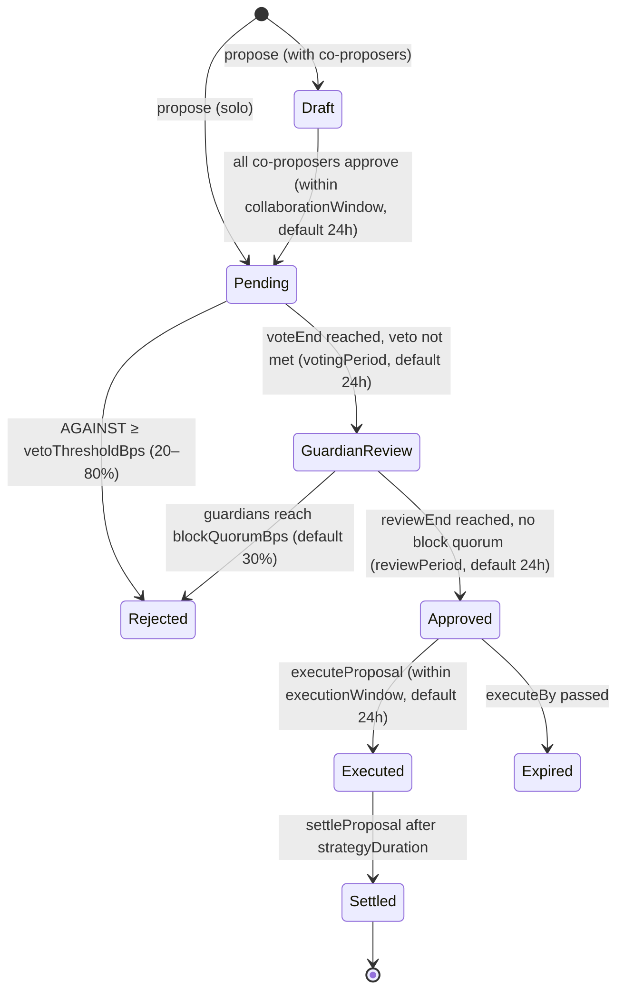

# Proposal Lifecycle

The full arc of a strategy proposal: **propose → vote → guardian review → execute →
settle**. One authoritative state per proposal, resolved by a single function
(`_computeState`, `src/ProposalLifecycle.sol:69`) and written by a single function
(`_transition`, `src/ProposalLifecycle.sol:185`). `stateOf(pid)` is a *true view* —
it reports Approved/Rejected/Expired as soon as they are determinable, never lagging
until a transaction pokes it. One strategy live per vault at a time.

## States

| State | Meaning |
|---|---|
| `Draft` | collaborative proposal awaiting co-proposer consent |
| `Pending` | LP voting active |
| `GuardianReview` | vote passed, guardian review window active |
| `Approved` | review ended without block quorum |
| `Rejected` | LP veto threshold reached, owner veto, or guardians blocked |
| `Expired` | a deadline passed without action (collab window, execution window, or unresolved review) |
| `Executed` | strategy live, capital deployed |
| `Settled` | P&L measured, fees charged, capital back in the vault |
| `Cancelled` | proposer or vault owner cancelled |

(Enum: `src/interfaces/ISyndicateGovernor.sol:41-51`.)

## Happy path with timing



Deadlines derived at proposal creation (`src/SyndicateGovernor.sol:1067-1093`):

```
snapshotTimestamp = now − 1            // closes same-block flash-delegate
voteEnd   = now + votingPeriod
reviewEnd = voteEnd + registry.reviewPeriod()
executeBy = reviewEnd + executionWindow
```

## Every step, with period min/max

All governor parameters are **per-vault**, set instantly by the vault owner but frozen
while any proposal is open (`whenNoActiveProposal`). Bounds are hardcoded in
`GovernorParameters.sol`.

| Step | Parameter | Default | Min | Max | Where enforced |
|---|---|---|---|---|---|
| 0. Collaboration (Draft) | `collaborationWindow` | 24 h | 1 h | 7 d | `GovernorParameters.sol:280` |
| 1. LP voting | `votingPeriod` | 24 h | 24 h (mainnet deploy floor; absolute floor 1 min) | 3 d | `GovernorParameters.sol:334` |
| 1a. LP veto threshold | `vetoThresholdBps` | 20% | 20% | 80% | `GovernorParameters.sol:342` |
| 2. Guardian review | `registry.reviewPeriod` | 24 h | 6 h (mainnet immutable floor; absolute floor 1 min) | 3 d | `GuardianRegistry.sol:1002` |
| 3. Execution window | `executionWindow` | 24 h | 1 h | 7 d | `GovernorParameters.sol:338` |
| 4. Strategy duration | `minStrategyDuration` / `maxStrategyDuration` | 1 h / 30 d | 1 h absolute | 30 d absolute, clamped by `ProtocolConfig.maxStrategyDuration` (≥ 1 d when set) | `GovernorParameters.sol:250-268` |
| 5. Cooldown before next strategy | `cooldownPeriod` | 1 h | 1 h (mainnet floor; absolute 1 min) | 30 d | `GovernorParameters.sol:350` |
| Post-settle challenge window | `ExposureLedger.challengeWindow` | 14 d | `reviewPeriod` + 7 d (when registry wired) | scan-bounded (16 buckets over 28-d epochs) | `ExposureLedger.sol:837-857` |

Cross-contract timing invariants (all enforced at the setters):

- `reviewPeriod ≤ StakedWood.coolDownPeriod` — a guardian cannot unstake faster than
  a review they might have to answer for (`GuardianRegistry.sol:1004`).
- `ledger.challengeWindow ≥ reviewPeriod + MAX_GOVERNOR_EXECUTION_WINDOW (7 d)` —
  coverage stays challengeable through the longest possible execution delay
  (`GuardianRegistry.sol:1018`).
- `ChallengeGame: autoSlashDelay + court.voteWindow + FINALIZE_BUFFER +
  MIN_REFERRAL_SLACK ≤ disputeTimeout` — a disputed challenge always has room for a
  full court vote before the timeout, plus 1 h of referral slack
  (`ChallengeGame.sol:117`). At deployed values: 7 d + 5 d + 1 d + 1 h ≈ 13 d ≤ 30 d.

## Step by step

### 0. Propose (`propose`, `src/SyndicateGovernor.sol:241`)

- **Caller:** registered agent of the vault (`vault.isAgent(msg.sender)`).
- Only one open proposal per vault (`_openProposalCount == 0`).
- Fee splits snapshotted from `ProtocolConfig`; performance fee clamped against the
  governor cap (see [fees.md](fees.md)).
- **Proposer bond** pulled into `ProposerBondEscrow`:
  `bondWood = coverageUsd × proposerBondBps (default 1%) / woodPrice`. Fail-closed —
  unpriceable WOOD blocks proposing (`src/ExposureLedger.sol:951`).

  This is **not** the 10k owner stake. The amount **scales** (tier-2 uncertified =
  full notional × ~1% in USD, converted at `woodPriceX8()`). Do not treat a fixed
  WOOD number as the requirement. Example only: ~230 WOOD for a 100 USDG book on
  the fork at a then-current price. The CLI quotes `proposerBondWood` and must
  refuse with `InsufficientProposerBondWood` if the wallet does not **hold** that
  WOOD (allowance alone is not enough). See [proposer-bond.md](proposer-bond.md).
- With co-proposers → `Draft`; each co-proposer must `approveCollaboration` within
  `collaborationWindow` or the draft expires. The lead can `rejectCollaboration`.
- Vault funds: **untouched**. Deposits and withdrawals stay open through propose,
  vote, review, and approval — only execution locks them.

### 1. Vote (`vote`, `src/SyndicateGovernor.sol:378`)

- **Caller:** any LP with past voting power at `snapshotTimestamp` (ERC20Votes
  checkpoints; snapshot is `now − 1` so same-block flash-delegation cannot vote).
- **Optimistic:** the proposal passes by default when `voteEnd` arrives; it is
  rejected only if AGAINST votes reach `vetoThresholdBps` (20–80%) of past total
  supply.
- Vault owner can hard-`vetoProposal` (Pending only) or `emergencyCancel`
  (Draft/Pending). Proposer can `cancelProposal` up to `voteEnd`.

### 2. Guardian review (`GuardianRegistry`)

- `openReview` — permissionless keeper call once `voteEnd` passes.
- **Voters:** active staked-WOOD guardians; weight is age-weighted stake at the
  open snapshot.
- Blocked if blocking stake reaches `blockQuorumBps` (default 30%, bounds 10–100%).
- Cohort below `MIN_COHORT_STAKE_AT_OPEN` (50 000 sWOOD) → review auto-clears
  (`cohortTooSmall`).
- Last 10% of the window is vote-locked (`LATE_VOTE_LOCKOUT_BPS`) — no last-second
  swings.
- `resolveReview` — permissionless once `reviewEnd` passes. A blocked review slashes
  approving guardians (the *economic commit*, idempotent) at a quadratic severity
  ramp between `minSlashBps` and `maxSlashBps`.
- Full detail: [guardian-network.md](guardian-network.md).

### 3. Execute (`executeProposal`, `src/SyndicateGovernor.sol:402`)

- **Caller:** anyone (permissionless), while `Approved` and before `executeBy`.
- Gates, in order: cooldown elapsed → `executedAt` stamped → tier/coverage
  regression re-check (`TierRegressed` / `CoverageRegressed` if a certification was
  demoted since propose) → guardian **approve-quorum** on the exposure ledger
  (`requireApproveQuorum` — returns `(coverageRaisedUsd, requiredCoverageUsd)`;
  a **shortfall scales** `effectiveMaxCapital` rather than blocking;
  empty / zero aggregate reverts `InsufficientApproveCoverage`) → the voted
  batch runs via `executeGovernorBatch` under that effective cap. See
  [coverage.md](coverage.md).
- Effects: capital snapshot taken, `_activeProposal = id` (**redemptions lock**),
  management-fee clock starts.
- Batch metering: per-call caps (`CallCapExceeded`), net outflow ≤ `maxCapital`
  (`MaxNetOutflowExceeded`), queue reserve untouchable (`QueueReserveBreached`),
  idle-float floor (`BufferBreached`), callee gate + adapter allowlist.

### 4. Live strategy (Executed)

- LP instant entries/exits closed: `deposit`/`mint` revert `DepositsLocked`;
  `maxWithdraw`/`maxRedeem` return 0.
- LPs use the async queue instead: `requestRedeem` (escrows shares) and
  `requestDeposit` (escrows assets off-vault). Both settle at one frozen post-fee
  price per proposal. See [deposit-withdraw-flow.md](deposit-withdraw-flow.md).

### 5. Settle (`settleProposal`, `src/SyndicateGovernor.sol:512`)

- **Caller:** the proposer after 1 h minimum
  (`MIN_STRATEGY_DURATION_BEFORE_SELF_SETTLE`); anyone after `strategyDuration`
  (permissionless backstop).
- Settlement batch unwinds the position (same caps + `maxCapital`), then
  `_finishSettlement`: `pnl = vault balance − capital snapshot`, management fee →
  performance fee → high-water-mark ratchet → queue settle price stamped →
  `Settled`. Redemptions unlock; the cooldown arms.
- Emergency paths (vault owner): `unstick` replays the voted settlement calls after
  `strategyDuration` (no review needed); `emergencySettleWithCalls` runs
  owner-supplied calls behind a fresh guardian review + owner bond
  (`src/GovernorEmergency.sol`).

### 6. After settlement — challenge window and bond reclaim

`reclaimProposerBond` (`src/SyndicateGovernor.sol:705`) is permissionless and always
pays the recorded proposer, but for executed proposals only after **three** gates:

1. `executedAt + ledger.challengeWindow` (default 14 d) has passed,
2. coverage is not frozen by a live challenge,
3. the challenge game's own deadline — including any inconclusive-verdict re-arm —
   is strictly past.

A guilty or silence conviction in the challenge game forfeits the whole bond:
prosecutor fee (default 5%, ≤ 20%) to the challenger, remainder burned.

## Who can call what (summary)

| Action | Caller |
|---|---|
| `propose`, `cancelProposal`, self-settle at 1 h | registered agent (proposer) |
| `vote` | LPs with snapshot voting power |
| `vetoProposal`, `emergencyCancel`, `unstick`, emergency settle | vault owner |
| guardian `voteOnProposal` | active staked guardians |
| `openReview`, `resolveReview`, `executeProposal`, `settleProposal` (post-duration), `resolveProposalState`, `reclaimProposerBond`, `settleCoverage` | **anyone** (permissionless keepers) |
| parameter setters | vault owner, frozen while a proposal is open |

## Failure modes

- **Draft expires** — co-proposers didn't all approve in time → `Expired`, bond
  reclaimable.
- **LP veto** — AGAINST ≥ threshold → `Rejected` at `voteEnd`.
- **Guardian block** — block quorum reached → `Rejected` + approvers slashed.
- **Execution missed** — nobody executed before `executeBy` → `Expired`.
- **No underwriter on the hook** — `requireApproveQuorum` reverts
  `InsufficientApproveCoverage` only when the approver set is empty or the raised
  aggregate is exactly zero. The proposal stays `Approved` and expires at
  `executeBy` unless a covering Approve arrives.
- **Coverage shortfall** — a nonzero-but-partial book does **not** revert. Execution
  scales: `effectiveMaxCapital = floor(maxCapital * coverageRaisedUsd / requiredCoverageUsd)`.
  Guardian daemons that treat a shortfall as disqualifying are wrong. See
  [coverage.md](coverage.md).
- **Registry paused mid-review** — proposal stays in `GuardianReview` until unpause
  (anyone can unpause after the 7-d dead-man delay).
- **Unresolvable review** — governor/registry disagreement → terminal `Expired`.
- Every non-executed terminal state leaves vault funds untouched; `_lastSettledAt`
  still stamps, so propose-cancel-propose spam is rate-limited by the cooldown.
