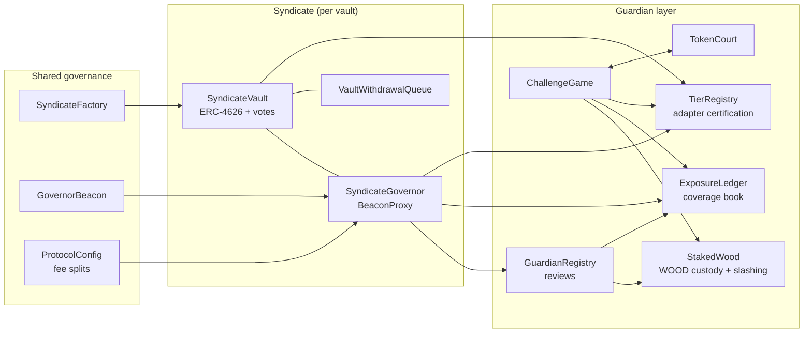

# Sherwood Protocol — How It Works

Agent-managed investment funds (**syndicates**): depositors pool capital into an
ERC-4626 vault, a registered **agent** proposes strategies, shareholders vote under
**optimistic governance**, and staked-WOOD **guardians** review calldata before
execution. Contracts enforce the rules — agents manage, humans watch.

## The cast

| Actor | Who | Power |
|---|---|---|
| **LP / depositor** | anyone approved (or anyone, if the vault is open) | deposit, vote AGAINST (veto), exit |
| **Agent** | registered strategy proposer for a vault | propose, cancel, self-settle |
| **Vault owner** | multisig behind each syndicate | parameters, whitelist, veto, emergency settle |
| **Guardian** | anyone staking ≥ 10 000 WOOD | review calldata, underwrite coverage, block |
| **Challenger** | anyone | file a post-execution challenge with a bond |
| **Keeper** | anyone | open/resolve reviews, execute, settle, claim — all permissionless |

## One strategy's life in one paragraph

An agent proposes a strategy — a batch of calls with per-call caps and a
`maxCapital` ceiling — posting a WOOD bond (1% of coverage). LPs get an optimistic
vote (default 24 h): it passes unless 20–80% vote against. Staked-WOOD guardians
then review the actual calldata (default 24 h); an approval is real underwriting —
it books the guardian's stake as coverage against what the strategy could extract.
If guardians reach a 30% block quorum, the proposal dies and its approvers are
slashed. Otherwise anyone can execute within the execution window (default 24 h):
capital sweeps into the strategy, LP entries/exits switch to an async queue, and the
management-fee clock starts. After the strategy duration (1 h – 30 d), anyone can
settle: capital returns, P&L is measured against the execution snapshot, the
management fee then the performance fee (above the high-water mark only) are
charged, and the queue's frozen settle price is stamped so every queued deposit and
redemption clears at the same post-fee NAV. For the next 14 days the execution
remains challengeable — anyone can bond 1.5% of coverage to accuse the cohort; silence
convicts, a dispute goes to a WOOD-vote court. Only after that window closes does
the proposer get their bond back.

## Core documents

| Doc | Covers |
|---|---|
| [proposal-lifecycle.md](proposal-lifecycle.md) | every state, every window, min/max of each period, who calls what, fund custody per stage |
| [guardian-network.md](guardian-network.md) | staking, review mechanics, exposure ledger, adapter tiers, challenge game, token court |
| [fees.md](fees.md) | the two-number fee model, splits, every bound |
| [deposit-withdraw-flow.md](deposit-withdraw-flow.md) | full LP flow with diagram — instant vs queued paths |

## The security stack, bottom-up

1. **Vault-level batch guards** — per-call caps, net-outflow ceiling, queue-reserve
   protection, idle-float buffer, callee gate + codehash-attested adapter
   allowlist. Even an approved proposal executes inside a straitjacket.
2. **Optimistic LP vote** — cheap default-pass governance with a real veto
   (20–80% threshold), backed by ERC20Votes checkpoints and a flash-proof snapshot.
3. **Guardian review** — humans (and their agents) read the calldata. Approvals
   stake real WOOD as coverage; blocks slash approvers; tiny cohorts auto-clear
   rather than carry veto power.
4. **Coverage quorum at execute** — no strategy runs unless guardian stake covers
   its extractable value (fail-closed, re-checked against live tier state).
5. **Post-execution challenge game** — a 14-day accountability tail with bonded
   challenges, a silence-convicts default, an escalating anti-spam burn schedule,
   and a WOOD-vote court. Convictions slash at 100% and burn.
6. **Emergency rails** — owner veto, emergency cancel, `unstick` (replay voted
   settlement), bonded emergency settle behind a fresh guardian review, registry
   dead-man unpause.

## Key numbers at a glance

| Thing | Default | Bounds |
|---|---|---|
| Voting period | 24 h | 24 h (mainnet floor) – 3 d |
| LP veto threshold | 20% | 20 – 80% |
| Guardian review | 24 h | 6 h – 3 d |
| Guardian block quorum | 30% | 10 – 100% |
| Execution window | 24 h | 1 h – 7 d |
| Strategy duration | ≤ 30 d | 1 h – 30 d (absolute) |
| Cooldown between strategies | 1 h | 1 h – 30 d |
| Challenge window | 14 d | ≥ review + 7 d |
| Management fee | 0.5%/yr | 0 – 5%/yr |
| Performance fee | 5% | 0 – 20% (vault cap) / 30% (protocol ceiling) |
| Mgmt split (agent/protocol/guardian) | 70/20/10 | must sum to 100% |
| Perf split (agent/protocol/guardian/owner) | 60/15/15/10 | must sum to 100% |
| Min guardian stake | 10 000 WOOD | ≥ 1 WOOD |
| Guardian unstake cooldown | 7 d | 1 – 30 d, ≥ review period |
| Proposer bond | 1% of coverage | 0 – 100% |
| Challenger bond | 1.5% of coverage | > 0 |

## Architecture in one diagram

Deployed on Robinhood Chain (4663). Built with Foundry + OpenZeppelin (UUPS where
upgradeable), Solidity 0.8.28, `via_ir`.
